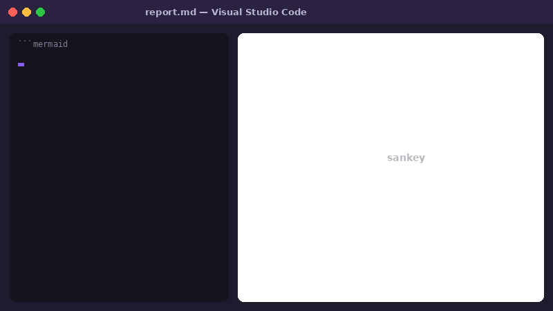
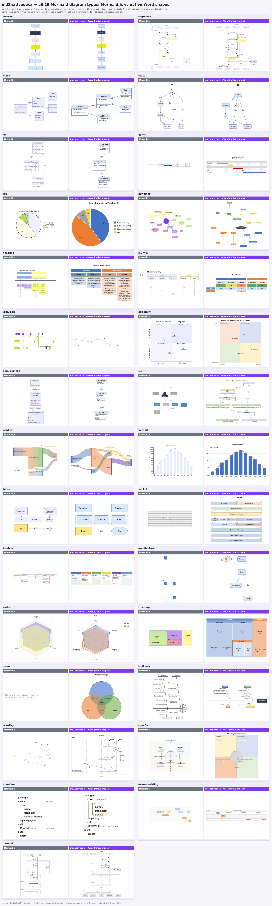
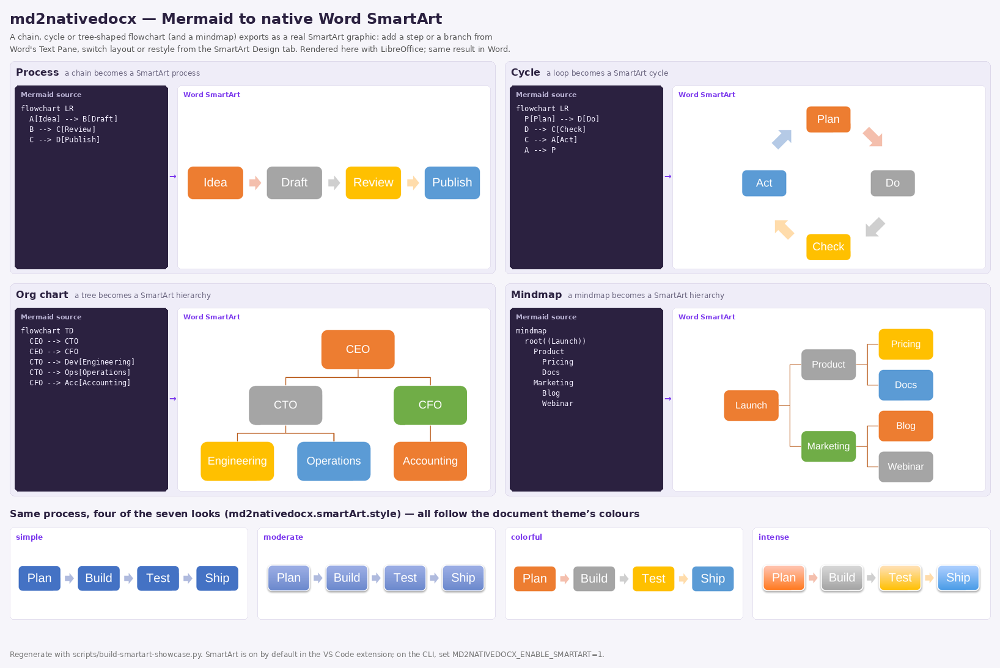

# md2nativedocx — complete Markdown to Word conversion, with diagrams your readers can edit

[](https://github.com/nicolasbridelance/md2nativedocx/actions/workflows/ci.yml)
[](https://github.com/nicolasbridelance/md2nativedocx/actions/workflows/codeql.yml)
[](https://marketplace.visualstudio.com/items?itemName=md2nativedocx.md2nativedocx)
[](LICENSE)

**A complete Markdown-to-Word converter. The whole document becomes a proper `.docx`, and its Mermaid diagrams
stay editable in Word.**

Headings, tables, lists, footnotes, code, LaTeX math (as Word equations), a table of contents, page size,
margins, fonts and your company's Word template: `md2nativedocx` does everything you expect from a Markdown to
Word converter, on top of Pandoc. What sets it apart is the diagrams.

You (or an AI assistant) write a report, a spec or a proposal in Markdown, with Mermaid diagrams in it. The
people who receive it work in Word. With today's converters, the text arrives fine but every diagram arrives
as a **picture**: to fix a typo in one box, someone has to find the Mermaid source, install the tooling,
re-export and paste the image again. In practice, nobody does, and the diagram goes stale.

`md2nativedocx` converts the whole document to `.docx` and turns every diagram into **real Word objects**,
so the people who own the document after you can change it in Word, without Markdown, Mermaid or you:

- **Fix a diagram in Word, like any drawing:** click a box, retype its label, drag it; the arrows stay attached.
- **Make it match the company look:** recolour any shape as in Word; flowcharts and SmartArt follow the
  document theme's colours, and SmartArt restyles from Word's own SmartArt Design tab.
- **Update a chart's numbers:** pie, bar/line and radar charts become real Word charts with *Edit Data*.
- **Grow an org chart or a process:** processes, cycles, org charts, mindmaps, timelines and kanban boards
  become SmartArt, so adding a step or a branch is one click in Word.
- **Send it with confidence:** every file is checked against Word's own file-format rules before you get it.

All 29 Mermaid diagram types are covered (flowchart, sequence, class, state, ER, Gantt, mindmap, C4, git
graph, …). A document without any diagram converts just as well. Use it from the
[VS Code extension](https://marketplace.visualstudio.com/items?itemName=md2nativedocx.md2nativedocx) (one
click), the CLI (`npx md2nativedocx report.md -o report.docx`), or as a Pandoc filter. It can also write a
`.pptx` deck. Public domain (CC0).



*Mermaid source → one click → Word shapes you can edit. Rendered here with LibreOffice; same result in Word.*

| What the person receiving the document can do in Word | Diagram pasted as an image (existing tools) | **md2nativedocx** |
|---|---|---|
| Change a label, move or delete a box | ❌ Re-export from the source | ✅ Directly, every node and edge is a shape |
| Arrows follow when a box moves | ❌ | ✅ Connectors are attached to the shapes |
| Recolour to the corporate theme | ❌ | ✅ Any shape; flowcharts/SmartArt follow the theme |
| Change a chart's figures | ❌ | ✅ *Edit Data* on native charts |
| Text stays sharp and searchable | ~ Depends on resolution | ✅ Real text, real vector shapes |
| Layout faithful to the Mermaid preview | ✅ | ✅ Same layout engine (Dagre) |
| File opens in real Word without a repair prompt | Not checked | ✅ Checked on every export with Microsoft's Open XML SDK |

> **What the name means.** `md2nativedocx` = **M**ark**d**own **to native docx**. `md` is Markdown, the input
> (not Mermaid, whose files are `.mmd`). *Native* describes the Word output: shapes, SmartArt, charts and
> equations that Word itself knows how to edit, instead of pictures of them.

> **Deploying this in a company?** License, dependencies, IT risk analysis, real cost, and a jargon-free
> guide for non-technical readers are in [`docs/compliance/`](docs/compliance/README.md).

SmartArt and Word charts are on by default in the VS Code extension; on the CLI, turn them on with
`MD2NATIVEDOCX_ENABLE_SMARTART=1` and `MD2NATIVEDOCX_NATIVE_CHARTS=1`. What each diagram type becomes, and
when: [`docs/coverage.md`](docs/coverage.md).

Named comparison against competing VS Code extensions (installs, rendering method verified from
their own docs): see `docs/specs/cahier_des_charges.md` §12.1 (French), or directly the
[extension's README](packages/vscode-extension/README.md).

## How it works

```
Markdown + ```mermaid  ──►  Pandoc (MD parsing, tables, styling, ZIP)
                              │
                              └─►  md2nativedocx Lua filter
                                      │
                                      └─►  core (per-type parser → layout → OOXML translator)
                                              │
                                              └─►  native shapes (or SmartArt) injected into the .docx
```

The architecture delegates everything that isn't a diagram (Markdown parsing, tables, styling, ZIP
manipulation) to Pandoc, and builds only the missing piece: layout + OOXML translation of a
diagram. See `docs/specs/cahier_des_charges.md` (French) for the full detail.

## Supported diagram types

**All 29 Mermaid types export as native Word objects** (SmartArt, Word charts or editable shapes): flowchart, sequenceDiagram, classDiagram,
stateDiagram, erDiagram, gantt, pie, mindmap, timeline, journey, gitGraph, quadrantChart, requirementDiagram,
C4, sankey, xychart, block, packet, kanban, architecture, radar, treemap, venn, ishikawa, wardley, cynefin,
treeView, eventmodeling and zenuml. Anything unrecognised gets a clear in-document note, never a silently wrong guess.
(Fidelity detail is deepest for flowcharts; see below.)



*Same Mermaid source, two outputs: **left = rendered by Mermaid.js** (a picture), **right = md2nativedocx** (native, editable
Word shapes, rendered here with LibreOffice). Regenerate with `scripts/build-showcase.py` (see its header; Mermaid is not a
repo dependency).*

**Flowchart** (`graph`/`flowchart`) is the most complete target — see
`docs/markdown-mermaid-compliance-table.md` for its full syntax coverage. A chain, cycle or tree-shaped
flowchart exports as a native, editable Word **SmartArt** graphic, each node keeping its Mermaid shape; so do
mindmaps, timelines, user journeys, kanban boards and simple state, class and git diagrams (toggle:
`md2nativedocx.smartArt.enabled`). Everything else gets individually selectable, editable Word shapes with
attached connectors.



*Mermaid source → native Word SmartArt: add a step or a branch from Word's Text Pane, switch layout or restyle from
the SmartArt Design tab. Rendered here with LibreOffice; same result in Word. Regenerate with
`scripts/build-smartart-showcase.py`.*

What each type becomes, under which conditions, and what was ruled out: [`docs/coverage.md`](docs/coverage.md).

## Word compatibility, verified — not assumed

A `.docx` can be well-formed XML, render correctly under LibreOffice, and still be a file that
real Word refuses to open outright — the two aren't the same guarantee. `md2nativedocx` validates
every export against the **exact schema Microsoft's own Word enforces**, using Microsoft's own
Open XML SDK (`DocumentFormat.OpenXml.Validation.OpenXmlValidator`) — not a guess, not a
third-party reimplementation. The result goes straight into the `.log` file written next to every
export: a clean "0 errors" when the file conforms, or the precise part/path/description of
whatever doesn't, so a real problem shows up as a readable line in a log file instead of Word's own
opaque "an error occurred while opening the file." See `docs/adr/0006-dsp-drawing-fallback-spike.md`
for the incident that motivated this (7 rounds of guessing, resolved in one pass once this
validator was used) and `docs/adr/0007-openxml-validator-adoption.md` for how it's wired in.

## Installation

Prerequisites: **Node.js ≥ 18** and **Pandoc ≥ 3.1.3** on `PATH` (Pandoc runs the Lua filter itself). The VS
Code extension downloads Pandoc for you; the CLI does not.

```bash
npm install
npm run build
```

## Usage (CLI)

```bash
npx md2nativedocx report.md -o report.docx
```

Every ```` ```mermaid ```` block in the document is converted into a native Word drawing
(individually selectable/editable vector shapes, dynamic connectors, native text — or a SmartArt
graphic or a Word chart when enabled) — see "Supported diagram types" above.

Want slides instead? `npx md2nativedocx deck.md -o deck.pptx` writes one 16:9 slide per Mermaid block, again
with editable shapes (see [`packages/pptx`](packages/pptx/README.md)).

## FAQ

**How do I convert a Mermaid diagram to an editable Word document?**
Put it in a ```` ```mermaid ```` block in a Markdown file and run `md2nativedocx file.md -o file.docx`, or click
*Export to Word* in the VS Code extension. Nothing is rasterised.

**Why not paste the Mermaid PNG/SVG into Word?**
A picture can't be edited: to change a label you must re-render and re-insert. Here the diagram is real Word
drawing objects, so you edit it in Word like one you drew by hand.

**Does it need Word, a browser or Mermaid CLI installed?**
No. It has its own parser and layout engine (Dagre); it needs Pandoc, which the VS Code extension downloads for you.

**Is the `.docx` valid for real Word?**
Every export is checked against Word's own schema with Microsoft's Open XML SDK (see above).

## Development

```bash
npm run build        # build all packages
npm run typecheck    # tsc --noEmit, strict
npm run lint         # ESLint + eslint-plugin-security
npm run test         # unit + golden tests
npm run test:fuzz    # property-based tests on the untrusted-input boundary
npm run test:visual  # headless LibreOffice render + pixel-diff (CI)
npm run test:oxml-validate  # schema validation via Microsoft's Open XML SDK (.NET, opt-in)
```

## Documentation

- `HANDOVER.md` — current state of the project: what shipped, what's verified, what's next.
- `TODO.md` (French) — the open backlog, nothing else.
- `docs/coverage.md` — what each Mermaid type becomes in Word, and why.
- `docs/manual/` (French) — the user manual, one page per diagram type.
- `docs/specs/cahier_des_charges.md` (French) — the **what** and **why** (spec, phases, scope).
- `AGENTS.md` — the **how** (conventions, non-negotiable security rules).
- `docs/adr/` — architecture decisions (layout engine, Pandoc integration, SmartArt, charts, pptx…).
- `TESTING.md` — the eight testing chapters, what each one guarantees, where it lives.
- `docs/compliance/` — license, dependencies, IT risk analysis, non-technical guide.
- `CONTRIBUTING.md` — how to contribute.

## License

**CC0 1.0 Universal** — public domain. See `LICENSE` for the full legal text.

> Note: Pandoc (GPL-2.0-or-later) is invoked as an external subprocess — never linked into this
> codebase. In the VS Code extension, it's downloaded automatically on first export if missing
> (official, unmodified binary, verified by SHA-256 checksum, never bundled inside the `.vsix`).
> See `AGENTS.md` → Licensing.
