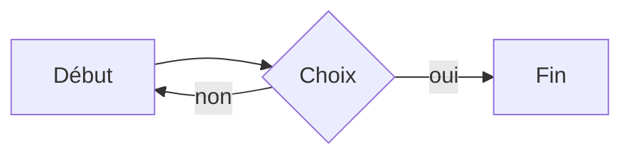
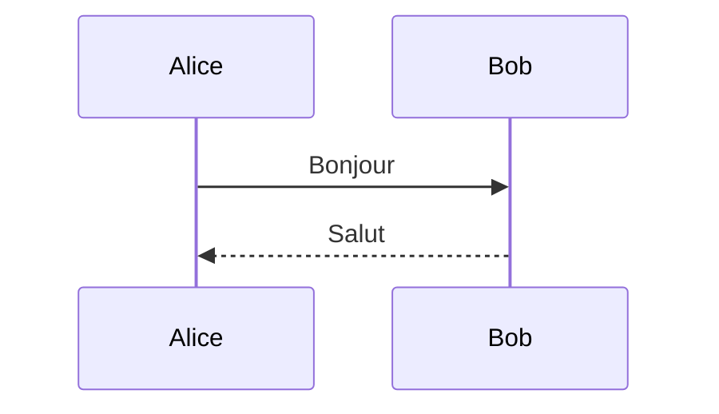
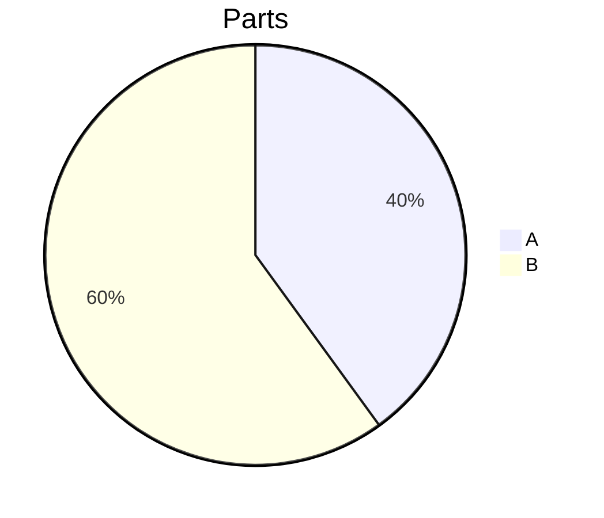
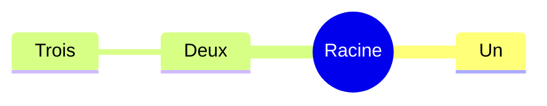

# Un rapport

Texte avec **gras**, une liste :

- un
- deux

| A | B |
|---|---|
| 1 | 2 |

```mermaid
flowchart LR
  A[Début] --> B{Choix}
  B -- oui --> C[Fin]
  B -- non --> A
```

```mermaid
sequenceDiagram
  Alice->>Bob: Bonjour
  Bob-->>Alice: Salut
```

```mermaid
pie title Parts
  "A" : 40
  "B" : 60
```

```mermaid
mindmap
  root((Racine))
    Un
    Deux
      Trois
```

```plantuml
class Animal
class Chien
Animal <|-- Chien
```

Fin, avec une formule $E = mc^2$.
