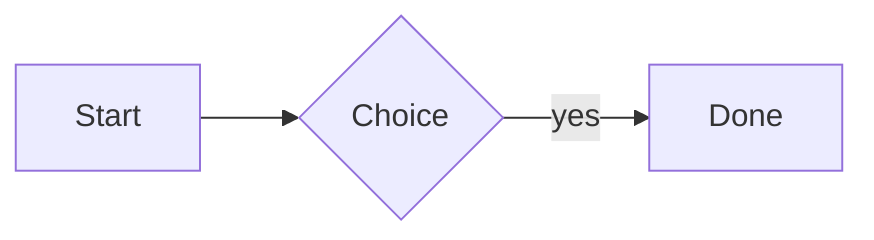

# S3 test

Paragraph with **bold**, *italic*, `code` and a [link](https://example.org).



| Name | Value |
|------|------:|
| a    | 1     |
| b    | 2     |

Inline math: $E = mc^2$

Display math:

$$
\int_0^1 x^2 \, dx = \frac{1}{3}
$$

```python
print("hello")
```

- item one
- item two
