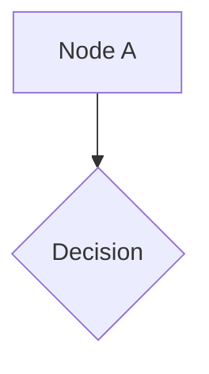

# Spike Pandoc — RawBlock('openxml') avec wpg:wgp

Ce document teste le passage d'un fragment DrawingML groupé complexe
(`wpg:wgp`) à travers Pandoc via `RawBlock('openxml', ...)`.

Le bloc ci-dessus doit être remplacé par un groupe de dessin natif Word
(2 formes + 1 connecteur), pas par une image.
