# Manuel d'utilisation de md2nativedocx

md2nativedocx transforme un document Markdown contenant des diagrammes Mermaid en document Word (`.docx`) ou en présentation (`.pptx`). Les diagrammes ne sont pas des images : ce sont des formes Word natives, que l'on peut sélectionner, recolorer et déplacer. Le reste du Markdown est converti par Pandoc.

Ce manuel décrit chaque type de diagramme (une page par type) : à quoi il sert, sa syntaxe essentielle, ce que l'implémentation prend en charge et ses limites actuelles.

## Utilisation en ligne de commande

- Word : `md2nativedocx document.md -o document.docx`
- Présentation : `md2nativedocx deck.md -o deck.pptx` (une diapositive par bloc Mermaid, titrée avec le titre précédent)
- Les diagrammes s'écrivent dans un bloc de code `mermaid`.

## Principes

- **Rien d'externe** : le fichier produit est autonome, sans aucune référence distante.
- **Pas d'échec silencieux** : une construction non gérée produit un avertissement (affiché et noté dans le journal d'export), jamais un diagramme faux sans prévenir.
- **Types reconnus** : tous les types du tableau ci-dessous.
- **Plafonds** : les entrées très grandes sont plafonnées (voir « Limites » de chaque type).

## Réglages de mise en forme

Les réglages se passent par variables d'environnement (ou par l'extension VS Code) : `MD2NATIVEDOCX_PAGE_SIZE`, `MD2NATIVEDOCX_ORIENTATION`, `MD2NATIVEDOCX_MARGINS`, `MD2NATIVEDOCX_HEADING_FONT`, `MD2NATIVEDOCX_BODY_FONT`, `MD2NATIVEDOCX_FONT_SIZE`, `MD2NATIVEDOCX_LINE_SPACING`, `MD2NATIVEDOCX_JUSTIFY`, `MD2NATIVEDOCX_ACCENT_COLOR`, `MD2NATIVEDOCX_TABLE_HEADER_COLOR`, `MD2NATIVEDOCX_TOC` (1 = sommaire), `MD2NATIVEDOCX_TOC_DEPTH`, `MD2NATIVEDOCX_FOOTER_PAGE_NUMBER` (1 = numéro de page), `MD2NATIVEDOCX_LANDSCAPE_TABLES` (1 = tableaux larges en paysage).

Le sommaire est un champ Word : à l'ouverture, cliquer « Activer la modification » puis accepter la mise à jour des champs.


## Tableau récapitulatif des types

| Type | Mot-clé | Couleurs personnalisables |
|:-----|:--------|:--------------------------|
| Flowchart (organigramme) | `flowchart` / `graph` | Oui : classDef, class, style, linkStyle |
| Swimlane (couloirs) | `swimlane-beta` | Oui : comme le flowchart |
| Diagramme de séquence | `sequenceDiagram` | Couleurs fixes |
| ZenUML | `zenuml` | Couleurs fixes |
| Diagramme de classes | `classDiagram` | Non (style ignoré) |
| Diagramme d’états | `stateDiagram` / `stateDiagram-v2` | Non (style ignoré) |
| Entité-relation | `erDiagram` | Non (style ignoré) |
| Diagramme d’exigences | `requirementDiagram` | Non (style ignoré) |
| C4 | `C4Context`, `C4Container`, `C4Component`, `C4Dynamic`, `C4Deployment` | Couleurs fixes |
| Architecture | `architecture-beta` | Couleurs fixes |
| Block | `block-beta` | Oui : style, classDef, class |
| Sankey | `sankey-beta` | Couleurs fixes |
| Diagramme de Gantt | `gantt` | Couleurs fixes |
| Chronologie | `timeline` | Couleurs fixes |
| Parcours utilisateur | `journey` | Couleurs fixes |
| Diagramme circulaire | `pie` | Couleurs fixes |
| Graphique XY | `xychart-beta` | Couleurs fixes |
| Radar | `radar-beta` | Couleurs fixes |
| Quadrant | `quadrantChart` | Points : color |
| Venn | `venn-beta` | Oui : style par ensemble |
| Carte mentale | `mindmap` | Non (classe ignorée) |
| Arbre de fichiers | `treeView-beta` | Surlignage (highlight) |
| Treemap | `treemap-beta` | Oui : classDef (fill, color, stroke) |
| Kanban | `kanban` | Couleurs fixes |
| Ishikawa (arêtes de poisson) | `ishikawa-beta` | Couleurs fixes |
| Paquet réseau | `packet` | Couleurs fixes |
| Cynefin | `cynefin-beta` | Couleurs fixes |
| Wardley | `wardley-beta` | Couleurs fixes |
| Event modeling | `eventmodeling` | Couleurs fixes |
| Git graph | `gitGraph` | Couleurs fixes |

```{=openxml}
<w:p><w:r><w:br w:type="page"/></w:r></w:p>
```

# Markdown standard

Cette partie vérifie le rendu de tout ce qui n'est pas un diagramme. Pour chaque section, comparer à ce qui
est décrit dans le texte.

## 1. Texte et emphase

Paragraphe avec **gras**, *italique*, ***gras italique***, ~~barré~~, `code en ligne`, H~2~O (indice),
x^2^ (exposant) et un [lien hypertexte](https://example.com) cliquable. Caractères spéciaux : & < > " ' é à ç ñ œ — « guillemets » … €.

Deuxième paragraphe, avec une ligne coupée\
par un saut de ligne forcé.

> Citation en bloc.
>
> > Citation imbriquée, doit être plus décalée.

---

La ligne ci-dessus est une règle horizontale.

### Titres de niveaux 3, 4, 5

#### Niveau 4

##### Niveau 5

## 2. Listes

- Puce niveau 1
  - Puce niveau 2
    - Puce niveau 3
- Autre puce

1. Premier
2. Deuxième
   1. Sous-élément a
   2. Sous-élément b
3. Troisième

- [x] Tâche faite
- [ ] Tâche à faire

Terme
:   Définition du terme (liste de définitions).

## 3. Tableaux

| Alignement gauche | Centré | Droite |
|:------------------|:------:|-------:|
| a                 |   b    |      1 |
| texte plus long   |   **c** |   22,5 |
| `code`            |   ✅   |    333 |

Tableau large (8 colonnes) :

| C1 | C2 | C3 | C4 | C5 | C6 | C7 | C8 |
|---|---|---|---|---|---|---|---|
| 1 | 2 | 3 | 4 | 5 | 6 | 7 | 8 |
| a | b | c | d | e | f | g | h |

## 4. Équations

Équation en ligne : $E = mc^2$ et $\alpha + \beta = \gamma$.

Équation en bloc :

$$\int_{0}^{\infty} e^{-x^2}\,dx = \frac{\sqrt{\pi}}{2}$$

$$\sum_{k=1}^{n} k = \frac{n(n+1)}{2} \qquad \begin{pmatrix} a & b \\ c & d \end{pmatrix}$$

Les équations doivent être éditables dans Word (objet équation natif), pas des images.

## 5. Code

Bloc de code avec langage :

```python
def fib(n: int) -> int:
    return n if n < 2 else fib(n - 1) + fib(n - 2)
```

Bloc sans langage :

```
texte brut   avec    espaces
et <balises> & entités
```

## 6. Images

Image locale avec légende :


Image redimensionnée à 50 % :

{width=50%}

## 7. Notes et divers

Une phrase avec une note de bas de page.[^1] Une autre avec une seconde note.[^2]

[^1]: Première note, doit apparaître en bas de page.
[^2]: Seconde note, avec du **gras**.

Ligne HTML brute : <span>texte dans un span</span> et un commentaire <!-- invisible --> après.

Texte avec emojis : ✅ ❌ ⚠️ 🚀 ⭐.


```{=openxml}
<w:p><w:r><w:br w:type="page"/></w:r></w:p>
```

# Types de diagrammes

Une page par type. Chaque page montre la source Mermaid puis le diagramme obtenu.

```{=openxml}
<w:p><w:r><w:br w:type="page"/></w:r></w:p>
```

## Flowchart (organigramme)

Le type historique du projet : nœuds et liens avec mise en page automatique (Dagre), rendus en formes Word natives et modifiables, connecteurs attachés aux formes.

| Rubrique | Détail |
|:---------|:-------|
| Mot-clé | `flowchart` / `graph` |
| Couleurs | Oui : classDef, class, style, linkStyle |


**Syntaxe**

- Directions `TD`, `TB`, `LR`, `RL`, `BT`
- Nœuds `A[texte]`, `A(arrondi)`, `A([stade])`, `A{losange}`, `A((cercle))`, `A[(base)]`, `A[/parallélogramme/]`, etc., et la forme générique `A@{ shape: nom, label: "…" }`
- Liens `-->`, `---`, `-.->`, `==>`, `<-->`, `~~~`, avec libellé `-- texte -->`, chaînage `A --> B --> C` et groupes `A & B --> C`
- `subgraph … end` (imbriqués), `<br/>` et `**gras**`/`_italique_` dans un libellé entre accents graves

**Pris en charge :** Couleurs : `classDef`, `class`, `:::nom`, `style`, `linkStyle` (couleur, épaisseur) ; Auto-boucles `A --> A`, diagrammes très grands (réduits pour tenir dans la page).

**Limites**

- `direction` à l’intérieur d’un `subgraph` : lue mais ignorée (Dagre n’a qu’une direction globale), avertissement émis
- Pas de `click`, d’animation d’arête, de formes icône/image, de sous-graphe repliable
- Les liens sont des segments droits ou des routes Dagre, pas des courbes Mermaid
- `classDef default` n’est pas appliqué
- SmartArt : option expérimentale, désactivée par défaut


*Source de l’exemple :*

```text
flowchart LR
    A([Début]) --> B{Valide ?}
    B -- oui --> C[Traiter]
    B -- non --> D[/Rejeter/]
    subgraph Équipe
        C --> E[(Archiver)]
    end
    classDef ok fill:#C8E6C9,stroke:#2E7D32
    classDef ko fill:#FFCDD2,stroke:#C62828
    class C,E ok
    class D ko
    style A fill:#BBDEFB,stroke:#1565C0
    linkStyle 0 stroke:#E65100,stroke-width:3px
```

*Rendu obtenu :*

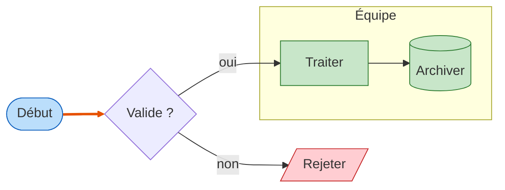
```mermaid
flowchart LR
    A([Début]) --> B{Valide ?}
    B -- oui --> C[Traiter]
    B -- non --> D[/Rejeter/]
    subgraph Équipe
        C --> E[(Archiver)]
    end
    classDef ok fill:#C8E6C9,stroke:#2E7D32
    classDef ko fill:#FFCDD2,stroke:#C62828
    class C,E ok
    class D ko
    style A fill:#BBDEFB,stroke:#1565C0
    linkStyle 0 stroke:#E65100,stroke-width:3px
```

```{=openxml}
<w:p><w:r><w:br w:type="page"/></w:r></w:p>
```

## Swimlane (couloirs)

Variante du flowchart : les `subgraph` de premier niveau deviennent des couloirs.

| Rubrique | Détail |
|:---------|:-------|
| Mot-clé | `swimlane-beta` |
| Couleurs | Oui : comme le flowchart |


**Syntaxe**

- Même syntaxe que le flowchart, avec l’en-tête `swimlane-beta [TD|LR…]`

**Pris en charge :** Tout ce que supporte le flowchart.

**Limites**

- Les couloirs sont de simples sous-graphes encadrés, sans en-tête de couloir spécifique

> **À savoir :** c’est un flowchart : toutes ses limites s’appliquent.


*Source de l’exemple :*

```text
swimlane-beta LR
  subgraph Customer[Customer]
    Order[Place order]
    Pay(Pay invoice)
  end
  subgraph Store[Store]
    Pack[Pack items]
    Decision{In stock?}
  end
  subgraph Carrier[Carrier]
    Ship([Ship package])
  end

  Order --> Decision
  Decision -->|Yes| Pack
  Decision -->|No| Order
  Pack --> Ship
  Ship --> Pay
```

*Rendu obtenu :*

```mermaid
swimlane-beta LR
  subgraph Customer[Customer]
    Order[Place order]
    Pay(Pay invoice)
  end
  subgraph Store[Store]
    Pack[Pack items]
    Decision{In stock?}
  end
  subgraph Carrier[Carrier]
    Ship([Ship package])
  end

  Order --> Decision
  Decision -->|Yes| Pack
  Decision -->|No| Order
  Pack --> Ship
  Ship --> Pay
```

```{=openxml}
<w:p><w:r><w:br w:type="page"/></w:r></w:p>
```

## Diagramme de séquence

Échanges entre participants le long de lignes de vie.

| Rubrique | Détail |
|:---------|:-------|
| Mot-clé | `sequenceDiagram` |
| Couleurs | Couleurs fixes |


**Syntaxe**

- `participant` / `actor` (avec `as`), `create` / `destroy`
- Dix flèches : `->`, `-->`, `->>`, `-->>`, `<<->>`, `<<-->>`, `-x`, `--x`, `-)`, `--)`, avec `+`/`-` pour l’activation
- `activate`/`deactivate`, `Note left of|right of|over`, `autonumber`, `title`
- Blocs `loop`, `alt`/`else`, `opt`, `par`/`and`, `critical`/`option`, `break`, `rect`

**Pris en charge :** Tous les éléments ci-dessus.

**Limites**

- Grammaire transcrite de la documentation, non vérifiée contre un analyseur Mermaid réel
- Demi-flèches, connexions centrales `()`, `link`/`links`, `properties` : reconnus, avertissement, non dessinés
- `box` : lu mais non dessiné
- Plafonds : 50 participants, 500 éléments, 20 blocs imbriqués
- Le cadre d’un bloc ne s’élargit pas pour un message d’un participant vers lui-même

> **À savoir :** grammaire transcrite de la documentation, jamais comparée à un analyseur Mermaid réel.


*Source de l’exemple :*

```text
sequenceDiagram
    title Checkout
    autonumber
    actor U as User
    participant W as Web App
    participant API
    participant DB as Database
    U->>+W: Place order
    W->>API: POST /orders
    activate API
    API->>DB: INSERT order
    DB-->>API: ok
    API-xW: Payment declined
    Note over API,DB: Retried 3 times
    loop Every minute
        W-)API: poll status
    end
    alt paid
        API-->>-W: 200 OK
    else failed
        API--)W: 402
        API->>API: log failure
    end
    Note right of W: done
    create participant M as Mailer
    W->>M: send receipt
    destroy M
    M-->>W: sent
    W-->>-U: Confirmation
```

*Rendu obtenu :*

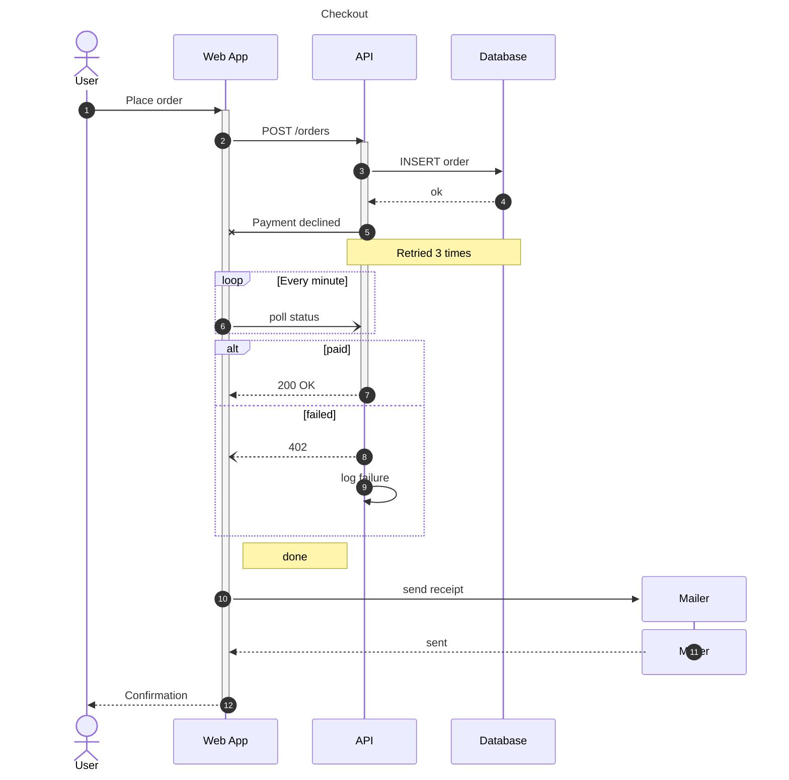
```mermaid
sequenceDiagram
    title Checkout
    autonumber
    actor U as User
    participant W as Web App
    participant API
    participant DB as Database
    U->>+W: Place order
    W->>API: POST /orders
    activate API
    API->>DB: INSERT order
    DB-->>API: ok
    API-xW: Payment declined
    Note over API,DB: Retried 3 times
    loop Every minute
        W-)API: poll status
    end
    alt paid
        API-->>-W: 200 OK
    else failed
        API--)W: 402
        API->>API: log failure
    end
    Note right of W: done
    create participant M as Mailer
    W->>M: send receipt
    destroy M
    M-->>W: sent
    W-->>-U: Confirmation
```

```{=openxml}
<w:p><w:r><w:br w:type="page"/></w:r></w:p>
```

## ZenUML

Syntaxe de séquence « façon code » (plugin Mermaid externe), rendue avec le même moteur que `sequenceDiagram`.

| Rubrique | Détail |
|:---------|:-------|
| Mot-clé | `zenuml` |
| Couleurs | Couleurs fixes |


**Syntaxe**

- `title`, participants (`A as Alias`, `@Actor`…)
- Messages `A->B: texte`, appels `A.methode(args)` avec `{ … }` imbriqué, `new A()`, réponses (`a = A.m()`, `return x`)
- Fragments `while`/`for`/`loop`, `if`/`else`, `opt`, `par`, `try`/`catch`/`finally`

**Pris en charge :** Les constructions ci-dessus.

**Limites**

- Grammaire transcrite de la documentation, non vérifiée contre le plugin
- Seul `@Actor` change le dessin, les autres annotations sont dessinées comme un participant simple
- Un appel de premier niveau part d’un participant implicite `Starter`

> **À savoir :** grammaire transcrite de la documentation, jamais comparée au plugin ZenUML.


*Source de l’exemple :*

```text
zenuml
    title Booking
    @Actor Client
    @Database DB
    Booking as Booking Service
    Client->Booking.book(id) {
      DB.find(id) {
        return row
      }
      if(available) {
        order = DB.save(id)
        new Mailer(id)
      } else {
        return sold_out
      }
      while(retry) {
        Booking->DB: poll
      }
      return ok
    }
    try {
      Client->Booking: confirm
    } catch {
      Client->Booking: cancel
    }
    opt {
      Booking.audit()
    }
```

*Rendu obtenu :*

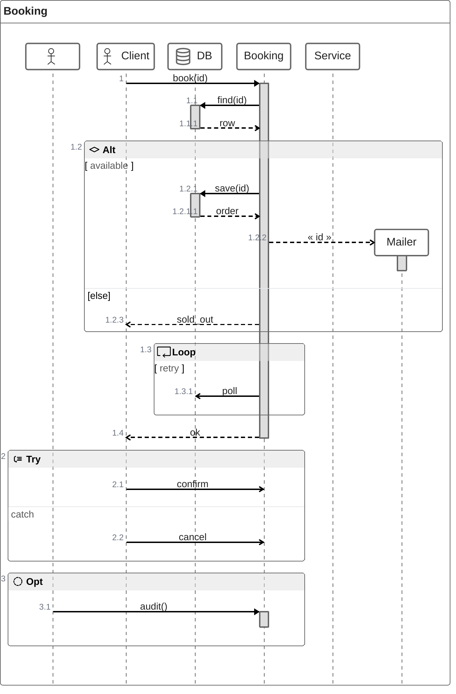
```mermaid
zenuml
    title Booking
    @Actor Client
    @Database DB
    Booking as Booking Service
    Client->Booking.book(id) {
      DB.find(id) {
        return row
      }
      if(available) {
        order = DB.save(id)
        new Mailer(id)
      } else {
        return sold_out
      }
      while(retry) {
        Booking->DB: poll
      }
      return ok
    }
    try {
      Client->Booking: confirm
    } catch {
      Client->Booking: cancel
    }
    opt {
      Booking.audit()
    }
```

```{=openxml}
<w:p><w:r><w:br w:type="page"/></w:r></w:p>
```

## Diagramme de classes

Classes UML avec attributs, méthodes et relations.

| Rubrique | Détail |
|:---------|:-------|
| Mot-clé | `classDiagram` |
| Couleurs | Non (style ignoré) |


**Syntaxe**

- `class Nom`, `class Nom["Libellé"]`, `class Nom { … }`, membres `+nom : type`
- 8 familles de relations : héritage, réalisation, composition, agrégation, association, dépendance, lien, lien pointillé, avec `: libellé`
- `direction TD|LR|BT|RL`

**Pris en charge :** Boîtes à 3 compartiments (nom, attributs, méthodes) ; Mise en page Dagre.

**Limites**

- Pas de style (`style`, `classDef`, `cssClass`) : avertissement
- Cardinalités (`"1"`, `"0..1"`) ignorées avec avertissement
- Génériques `~T~` : retirés du nom, non affichés
- Annotations `<<Interface>>`, `namespace`, `note` : avertissement, non rendus
- Les marqueurs creux UML (triangle, losange vides) sont remplacés par les marqueurs Word les plus proches
- Liens en lignes droites


*Source de l’exemple :*

```text
classDiagram
  direction LR
  class Animal {
    +String name
    +int age
    +makeSound() void
  }
  class Dog {
    +String breed
    +bark() void
  }
  class Cat {
    +bark() void
  }
  class Owner {
    +String name
    +feed(Animal a) void
  }
  Animal <|-- Dog
  Animal <|-- Cat
  Owner "1" --> "many" Animal : owns
  Owner *-- Address : has
  class Address {
    +String street
    +String city
  }
```

*Rendu obtenu :*

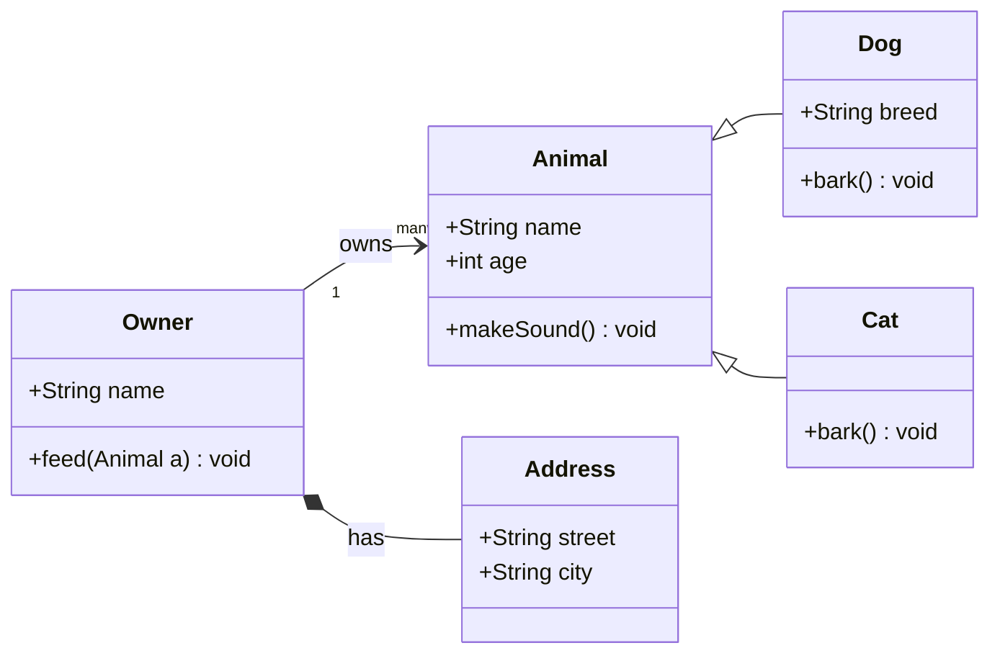
```mermaid
classDiagram
  direction LR
  class Animal {
    +String name
    +int age
    +makeSound() void
  }
  class Dog {
    +String breed
    +bark() void
  }
  class Cat {
    +bark() void
  }
  class Owner {
    +String name
    +feed(Animal a) void
  }
  Animal <|-- Dog
  Animal <|-- Cat
  Owner "1" --> "many" Animal : owns
  Owner *-- Address : has
  class Address {
    +String street
    +String city
  }
```

```{=openxml}
<w:p><w:r><w:br w:type="page"/></w:r></w:p>
```

## Diagramme d’états

États et transitions.

| Rubrique | Détail |
|:---------|:-------|
| Mot-clé | `stateDiagram` / `stateDiagram-v2` |
| Couleurs | Non (style ignoré) |


**Syntaxe**

- `A --> B`, `A --> B : libellé`, `[*]` début/fin
- `state "Libellé" as id`, `id : description`
- `state id <<choice|fork|join>>`
- `direction`

**Pris en charge :** Transitions plates, pseudo-états, choix/fork/join.

**Limites**

- États composites `state X { … }` : contenu mis à plat, sans cadre imbriqué
- Séparateur de concurrence `--`, notes, styles : ignorés avec avertissement


*Source de l’exemple :*

```text
stateDiagram-v2
  [*] --> Idle
  Idle --> Loading : fetch
  Loading --> choice1
  state choice1 <<choice>>
  choice1 --> Success : ok
  choice1 --> Error : fail
  Success --> Idle : reset
  Error --> Idle : retry
  Idle --> [*]
```

*Rendu obtenu :*

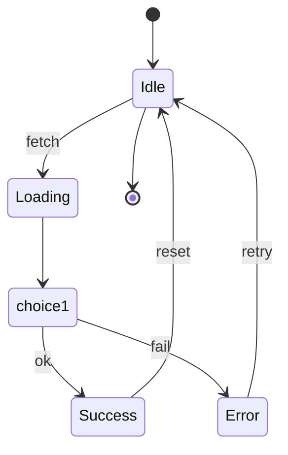
```mermaid
stateDiagram-v2
  [*] --> Idle
  Idle --> Loading : fetch
  Loading --> choice1
  state choice1 <<choice>>
  choice1 --> Success : ok
  choice1 --> Error : fail
  Success --> Idle : reset
  Error --> Idle : retry
  Idle --> [*]
```

```{=openxml}
<w:p><w:r><w:br w:type="page"/></w:r></w:p>
```

## Entité-relation

Entités avec attributs et cardinalités « patte de corbeau ».

| Rubrique | Détail |
|:---------|:-------|
| Mot-clé | `erDiagram` |
| Couleurs | Non (style ignoré) |


**Syntaxe**

- `ENTITE { type nom PK|FK|UK "commentaire" }`
- `A ||--o{ B : "libellé"` : 4 états de cardinalité par extrémité, `--` identifiante, `..` non identifiante

**Pris en charge :** Attributs avec clés, cardinalités complètes, traits pleins/pointillés.

**Limites**

- Styles (`classDef`, `class`, `style`) ignorés avec avertissement
- Alias d’entité non gérés
- Liens en lignes droites


*Source de l’exemple :*

```text
erDiagram
  CUSTOMER {
    int id PK
    string email UK
    string name
  }
  ORDER {
    int id PK
    int customer_id FK
    string status
  }
  LINE-ITEM {
    int id PK
    int order_id FK
    string product
  }
  CUSTOMER ||--o{ ORDER : places
  ORDER ||--|{ LINE-ITEM : contains
  CUSTOMER }|..|{ LINE-ITEM : "reviews"
```

*Rendu obtenu :*

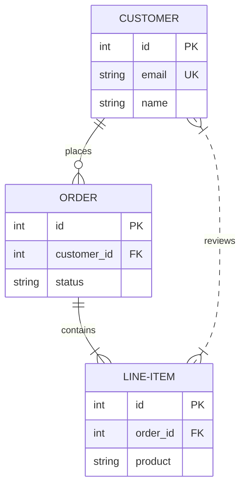
```mermaid
erDiagram
  CUSTOMER {
    int id PK
    string email UK
    string name
  }
  ORDER {
    int id PK
    int customer_id FK
    string status
  }
  LINE-ITEM {
    int id PK
    int order_id FK
    string product
  }
  CUSTOMER ||--o{ ORDER : places
  ORDER ||--|{ LINE-ITEM : contains
  CUSTOMER }|..|{ LINE-ITEM : "reviews"
```

```{=openxml}
<w:p><w:r><w:br w:type="page"/></w:r></w:p>
```

## Diagramme d’exigences

Exigences, éléments et leurs relations (SysML).

| Rubrique | Détail |
|:---------|:-------|
| Mot-clé | `requirementDiagram` |
| Couleurs | Non (style ignoré) |


**Syntaxe**

- Blocs `requirement`, `functionalRequirement`… avec `id`, `text`, `risk`, `verifymethod`, blocs `element`
- Relations `A - type -> B` ou `B <- type - A`, 7 types

**Pris en charge :** Blocs et les 7 types de relation, dans les deux sens.

**Limites**

- Les 7 relations sont dessinées de la même façon (comme Mermaid), le type est dans le libellé
- Styles ignorés avec avertissement


*Source de l’exemple :*

```text
requirementDiagram
  requirement test_req {
    id: 1
    text: the test text.
    risk: high
    verifymethod: test
  }
  functionalRequirement test_req2 {
    id: 1.1
    text: the second test text.
    risk: low
    verifymethod: inspection
  }
  element test_entity {
    type: simulation
  }
  test_entity - satisfies -> test_req
  test_req - traces -> test_req2
  test_req <- derives - test_req2
```

*Rendu obtenu :*

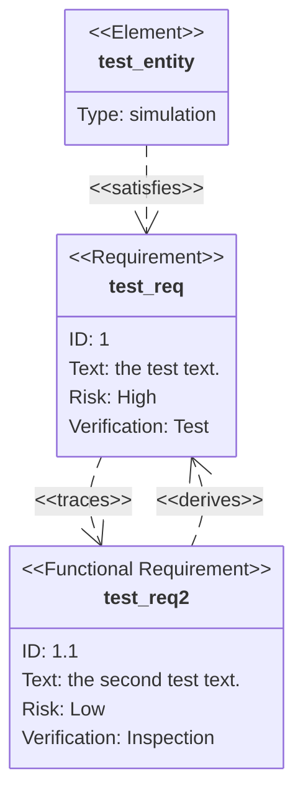
```mermaid
requirementDiagram
  requirement test_req {
    id: 1
    text: the test text.
    risk: high
    verifymethod: test
  }
  functionalRequirement test_req2 {
    id: 1.1
    text: the second test text.
    risk: low
    verifymethod: inspection
  }
  element test_entity {
    type: simulation
  }
  test_entity - satisfies -> test_req
  test_req - traces -> test_req2
  test_req <- derives - test_req2
```

```{=openxml}
<w:p><w:r><w:br w:type="page"/></w:r></w:p>
```

## C4

Modèle C4 en notation d’appels de fonction.

| Rubrique | Détail |
|:---------|:-------|
| Mot-clé | `C4Context`, `C4Container`, `C4Component`, `C4Dynamic`, `C4Deployment` |
| Couleurs | Couleurs fixes |


**Syntaxe**

- `Person(alias, "libellé", "description")`, `System`, `Container`, `Component`, variantes `_Ext`, `Db`, `Queue`
- `Rel(a, b, "libellé", "techno")`

**Pris en charge :** Boîtes à 2 compartiments, couleur par catégorie.

**Limites**

- Frontières (`Boundary`, `Deployment_Node`) : éléments dessinés à plat avec avertissement
- Externe / base de données / file : indiqués dans le texte, pas par une forme
- Un appel sur une seule ligne


*Source de l’exemple :*

```text
C4Container
    title Container diagram for Internet Banking System

    System_Ext(email_system, "E-Mail System", "The internal Microsoft Exchange system")
    Person(customer, "Customer", "A customer of the bank, with personal bank accounts")

    Container_Boundary(c1, "Internet Banking") {
        Container(spa, "Single-Page App", "JavaScript, Angular", "Provides all the Internet banking functionality to customers via their web browser")
        Container_Ext(mobile_app, "Mobile App", "C#, Xamarin", "Provides a limited subset of the Internet banking functionality to customers via their mobile device")
        Container(web_app, "Web Application", "Java, Spring MVC", "Delivers the static content and the Internet banking SPA")
        ContainerDb(database, "Database", "SQL Database", "Stores user registration information, hashed auth credentials, access logs, etc.")
        ContainerDb_Ext(backend_api, "API Application", "Java, Docker Container", "Provides Internet banking functionality via API")
    }

    System_Ext(banking_system, "Mainframe Banking System", "Stores all of the core banking information about customers, accounts, transactions, etc.")

    Rel(customer, web_app, "Uses", "HTTPS")
    Rel(customer, spa, "Uses", "HTTPS")
    Rel(customer, mobile_app, "Uses")

    Rel(web_app, spa, "Delivers")
    Rel(spa, backend_api, "Uses", "async, JSON/HTTPS")
    Rel(mobile_app, backend_api, "Uses", "async, JSON/HTTPS")
    Rel_Back(database, backend_api, "Reads from and writes to", "sync, JDBC")

    Rel(email_system, customer, "Sends e-mails to")
    Rel(backend_api, email_system, "Sends e-mails using", "sync, SMTP")
    Rel(backend_api, banking_system, "Uses", "sync/async, XML/HTTPS")
```

*Rendu obtenu :*

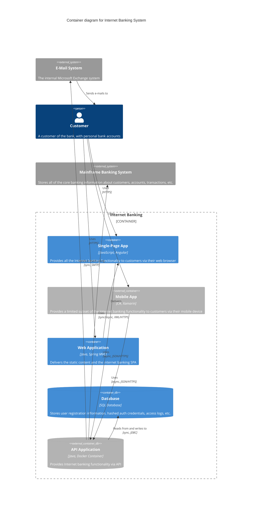
```mermaid
C4Container
    title Container diagram for Internet Banking System

    System_Ext(email_system, "E-Mail System", "The internal Microsoft Exchange system")
    Person(customer, "Customer", "A customer of the bank, with personal bank accounts")

    Container_Boundary(c1, "Internet Banking") {
        Container(spa, "Single-Page App", "JavaScript, Angular", "Provides all the Internet banking functionality to customers via their web browser")
        Container_Ext(mobile_app, "Mobile App", "C#, Xamarin", "Provides a limited subset of the Internet banking functionality to customers via their mobile device")
        Container(web_app, "Web Application", "Java, Spring MVC", "Delivers the static content and the Internet banking SPA")
        ContainerDb(database, "Database", "SQL Database", "Stores user registration information, hashed auth credentials, access logs, etc.")
        ContainerDb_Ext(backend_api, "API Application", "Java, Docker Container", "Provides Internet banking functionality via API")
    }

    System_Ext(banking_system, "Mainframe Banking System", "Stores all of the core banking information about customers, accounts, transactions, etc.")

    Rel(customer, web_app, "Uses", "HTTPS")
    Rel(customer, spa, "Uses", "HTTPS")
    Rel(customer, mobile_app, "Uses")

    Rel(web_app, spa, "Delivers")
    Rel(spa, backend_api, "Uses", "async, JSON/HTTPS")
    Rel(mobile_app, backend_api, "Uses", "async, JSON/HTTPS")
    Rel_Back(database, backend_api, "Reads from and writes to", "sync, JDBC")

    Rel(email_system, customer, "Sends e-mails to")
    Rel(backend_api, email_system, "Sends e-mails using", "sync, SMTP")
    Rel(backend_api, banking_system, "Uses", "sync/async, XML/HTTPS")
```

```{=openxml}
<w:p><w:r><w:br w:type="page"/></w:r></w:p>
```

## Architecture

Services, groupes et jonctions reliés par des ports.

| Rubrique | Détail |
|:---------|:-------|
| Mot-clé | `architecture-beta` |
| Couleurs | Couleurs fixes |


**Syntaxe**

- `group`, `service`, `junction` avec `(icône)`, `[titre]` et `in parent`
- Liens `a:R -- L:b`, avec flèche optionnelle

**Pris en charge :** Services, jonctions, liens.

**Limites**

- Groupes parsés mais aplatis (avertissement)
- Les ports ne servent pas à l’accrochage exact
- Icônes : `cloud`, `database`, `disk` mappées sur des formes, les autres en rectangle arrondi


*Source de l’exemple :*

```text
architecture-beta
  group public_api(cloud)[Public API]

  service database1(database)[My Database] in public_api
  service server(server)[Server] in public_api
  service disk1(disk)[Storage] in public_api
  service gateway(internet)[Gateway]
  junction j1

  gateway:B --> T:server
  server:R --> L:database1
  server:B -- T:j1
  j1:R -- L:disk1
```

*Rendu obtenu :*

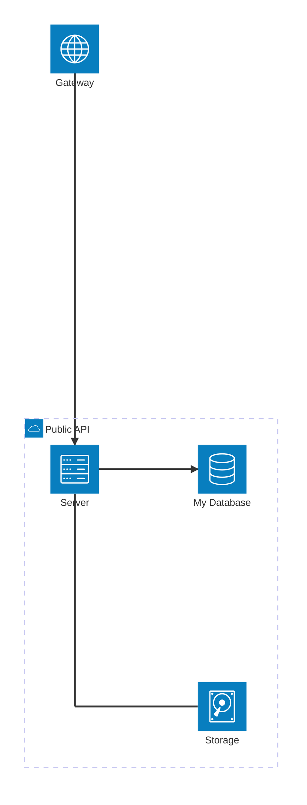
```mermaid
architecture-beta
  group public_api(cloud)[Public API]

  service database1(database)[My Database] in public_api
  service server(server)[Server] in public_api
  service disk1(disk)[Storage] in public_api
  service gateway(internet)[Gateway]
  junction j1

  gateway:B --> T:server
  server:R --> L:database1
  server:B -- T:j1
  j1:R -- L:disk1
```

```{=openxml}
<w:p><w:r><w:br w:type="page"/></w:r></w:p>
```

## Block

Grille de blocs sur N colonnes avec liens.

| Rubrique | Détail |
|:---------|:-------|
| Mot-clé | `block-beta` |
| Couleurs | Oui : style, classDef, class |


**Syntaxe**

- `columns N`, blocs `id["texte"]` avec formes, `:span`, `space`
- `block:id:span … end` imbriqués
- Liens `-->`, `---`, `-.->`, `==>`, avec libellé
- `style`, `classDef`, `class`, `:::nom`

**Pris en charge :** Couleurs de fond, de trait et de texte.

**Limites**

- Formes exotiques (cylindre, hexagone…) : rectangle avec le libellé
- Plafonds : 500 blocs, 200 liens, 8 niveaux, 24 colonnes


*Source de l’exemple :*

```text
block-beta
    columns 3
    doc["Document"] space:1 db[("Database")]
    block:pipeline:3
        columns 3
        parse["Parse"] layout("Layout") emit(["Emit"])
    end
    a["Input"] space b(("Out"))
    doc --> parse
    emit --> db
    a -- "text" --> b
    style a fill:#fde68a,stroke:#b45309
```

*Rendu obtenu :*

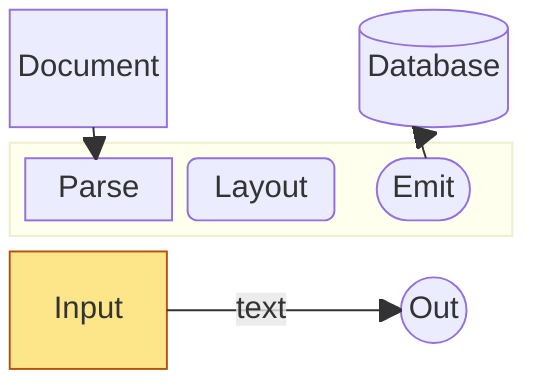
```mermaid
block-beta
    columns 3
    doc["Document"] space:1 db[("Database")]
    block:pipeline:3
        columns 3
        parse["Parse"] layout("Layout") emit(["Emit"])
    end
    a["Input"] space b(("Out"))
    doc --> parse
    emit --> db
    a -- "text" --> b
    style a fill:#fde68a,stroke:#b45309
```

```{=openxml}
<w:p><w:r><w:br w:type="page"/></w:r></w:p>
```

## Sankey

Flux entre nœuds, largeur proportionnelle à la valeur.

| Rubrique | Détail |
|:---------|:-------|
| Mot-clé | `sankey-beta` |
| Couleurs | Couleurs fixes |


**Syntaxe**

- Lignes CSV `source,cible,valeur`, guillemets `"…"` et `""`

**Pris en charge :** Flux et valeurs.

**Limites**

- Auto-liens et liens qui bouclent : supprimés
- Plafonds : 500 liens, 200 nœuds


*Source de l’exemple :*

```text
sankey-beta

Agricultural 'waste',Bio-conversion,124.729
Bio-conversion,Liquid,0.597
Bio-conversion,Solid,26.862
Bio-conversion,Gas,280.322
Bio-conversion,Losses,10
Coal imports,Coal,11.606
Coal,Solid,75.571
Gas,Heating,79.5
Solid,Heating,40.2
Liquid,Heating,2
```

*Rendu obtenu :*

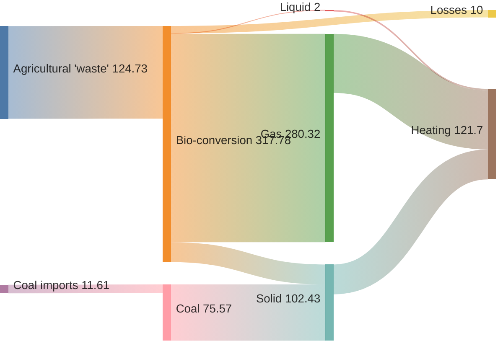
```mermaid
sankey-beta

Agricultural 'waste',Bio-conversion,124.729
Bio-conversion,Liquid,0.597
Bio-conversion,Solid,26.862
Bio-conversion,Gas,280.322
Bio-conversion,Losses,10
Coal imports,Coal,11.606
Coal,Solid,75.571
Gas,Heating,79.5
Solid,Heating,40.2
Liquid,Heating,2
```

```{=openxml}
<w:p><w:r><w:br w:type="page"/></w:r></w:p>
```

## Diagramme de Gantt

Planning de tâches sur un calendrier.

| Rubrique | Détail |
|:---------|:-------|
| Mot-clé | `gantt` |
| Couleurs | Couleurs fixes |


**Syntaxe**

- `title`, `dateFormat`, `excludes` (weekends, jours, dates), `section`
- Tâche : `nom :tags, id, début, fin|durée` (`active`, `done`, `crit`, `milestone`), `after id`, `until id`, durées `3d` `2w`…

**Pris en charge :** Positions et durées avec jours exclus.

**Limites**

- Non gérés (avertissement) : `axisFormat`, `tickInterval`, `todayMarker`, `includes`, `weekday`, `inclusiveEndDates`, `topAxis`, `click`
- Semaine fixe : week-end samedi/dimanche
- Un `after` introuvable retombe sur la fin de la tâche précédente (jamais sur « aujourd’hui »)


*Source de l’exemple :*

```text
gantt
    title Adoption d'un logiciel
    dateFormat YYYY-MM-DD
    excludes weekends
    section Cadrage
    Recueil besoins      :done,    des1, 2026-01-05, 5d
    Choix outil          :active,  des2, after des1, 3d
    section Deploiement
    Formation            :crit,    des3, after des2, 4d
    Go-live              :milestone, des4, after des3, 0d
    Suivi post go-live   :         des5, after des4, 10d
```

*Rendu obtenu :*

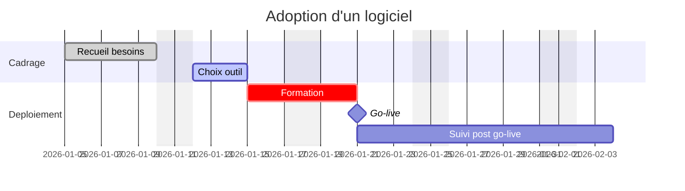
```mermaid
gantt
    title Adoption d'un logiciel
    dateFormat YYYY-MM-DD
    excludes weekends
    section Cadrage
    Recueil besoins      :done,    des1, 2026-01-05, 5d
    Choix outil          :active,  des2, after des1, 3d
    section Deploiement
    Formation            :crit,    des3, after des2, 4d
    Go-live              :milestone, des4, after des3, 0d
    Suivi post go-live   :         des5, after des4, 10d
```

```{=openxml}
<w:p><w:r><w:br w:type="page"/></w:r></w:p>
```

## Chronologie

Périodes et événements.

| Rubrique | Détail |
|:---------|:-------|
| Mot-clé | `timeline` |
| Couleurs | Couleurs fixes |


**Syntaxe**

- `title`, `section`, `période : événement : événement`, ligne `: événement` pour continuer
- `<br>` dans un texte = saut de ligne

**Pris en charge :** Périodes, sections, événements.

**Limites**

- Direction `TD` lue mais dessinée en horizontal
- Configuration/thème ignorés


*Source de l’exemple :*

```text
timeline
        title England's History Timeline
        section Stone Age
          7600 BC : Britain's oldest known house was built in Orkney, Scotland
          6000 BC : Sea levels rise and Britain becomes an island.<br> The people who live here are hunter-gatherers.
        section Bronze Age
          2300 BC : People arrive from Europe and settle in Britain. <br>They bring farming and metalworking.
                  : New styles of pottery and ways of burying the dead appear.
          2200 BC : The last major building works are completed at Stonehenge.<br> People now bury their dead in stone circles.
                  : The first metal objects are made in Britain.Some other nice things happen. it is a good time to be alive.
```

*Rendu obtenu :*

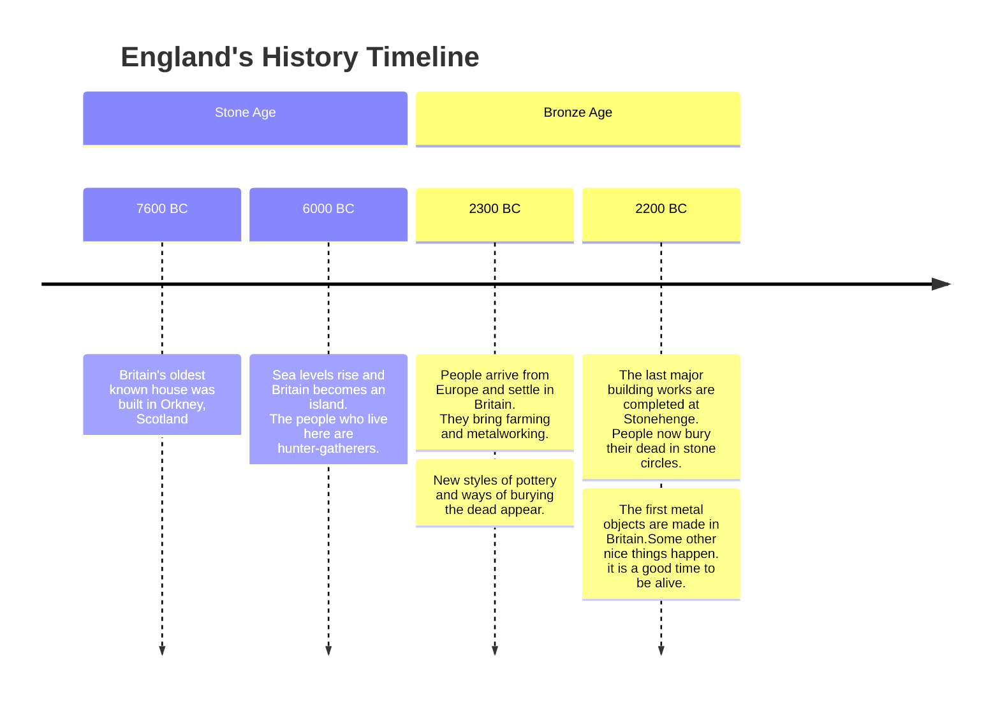
```mermaid
timeline
        title England's History Timeline
        section Stone Age
          7600 BC : Britain's oldest known house was built in Orkney, Scotland
          6000 BC : Sea levels rise and Britain becomes an island.<br> The people who live here are hunter-gatherers.
        section Bronze Age
          2300 BC : People arrive from Europe and settle in Britain. <br>They bring farming and metalworking.
                  : New styles of pottery and ways of burying the dead appear.
          2200 BC : The last major building works are completed at Stonehenge.<br> People now bury their dead in stone circles.
                  : The first metal objects are made in Britain.Some other nice things happen. it is a good time to be alive.
```

```{=openxml}
<w:p><w:r><w:br w:type="page"/></w:r></w:p>
```

## Parcours utilisateur

Étapes notées de 1 à 5 par acteur.

| Rubrique | Détail |
|:---------|:-------|
| Mot-clé | `journey` |
| Couleurs | Couleurs fixes |


**Syntaxe**

- `title`, `section`, `Tâche: score: Acteur1, Acteur2`

**Pris en charge :** Sections, scores, acteurs.

**Limites**

- Score hors 1–5 ramené dans la plage avec avertissement
- Ligne au score non numérique : supprimée
- Configuration ignorée


*Source de l’exemple :*

```text
journey
    title My working day
    section Go to work
      Make tea: 5: Me
      Go upstairs: 3: Me
      Do work: 1: Me, Cat
    section Go home
      Go downstairs: 5: Me
      Sit down: 5: Me
```

*Rendu obtenu :*

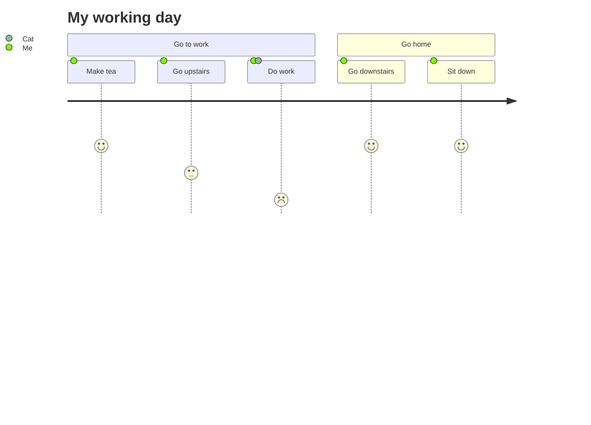
```mermaid
journey
    title My working day
    section Go to work
      Make tea: 5: Me
      Go upstairs: 3: Me
      Do work: 1: Me, Cat
    section Go home
      Go downstairs: 5: Me
      Sit down: 5: Me
```

```{=openxml}
<w:p><w:r><w:br w:type="page"/></w:r></w:p>
```

## Diagramme circulaire

Parts d’un tout.

| Rubrique | Détail |
|:---------|:-------|
| Mot-clé | `pie` |
| Couleurs | Couleurs fixes |


**Syntaxe**

- `pie [showData]`, `title`, `"libellé" : valeur`

**Pris en charge :** Parts, titre, `showData`.

**Limites**

- Configuration (`textPosition`, `donutHole`, `legendPosition`, `highlightSlice`) et thèmes : ignorés
- `accTitle`/`accDescr` : avertissement


*Source de l’exemple :*

```text
pie showData
    title Key elements in Product X
    "Calcium" : 42.96
    "Potassium" : 50.05
    "Magnesium" : 10.01
    "Iron" :  5
```

*Rendu obtenu :*

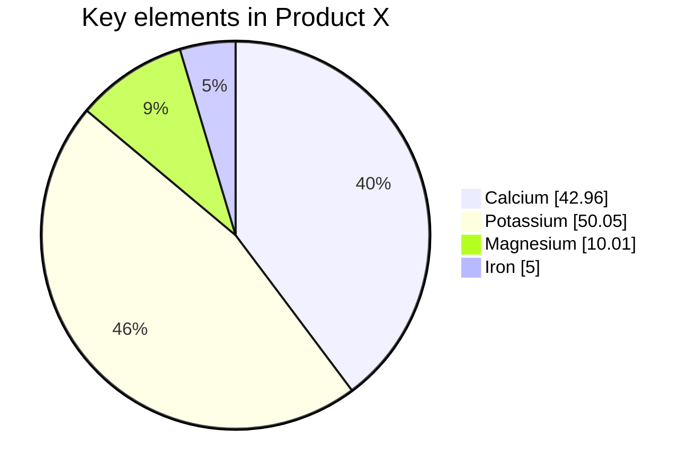
```mermaid
pie showData
    title Key elements in Product X
    "Calcium" : 42.96
    "Potassium" : 50.05
    "Magnesium" : 10.01
    "Iron" :  5
```

```{=openxml}
<w:p><w:r><w:br w:type="page"/></w:r></w:p>
```

## Graphique XY

Barres et lignes sur deux axes.

| Rubrique | Détail |
|:---------|:-------|
| Mot-clé | `xychart-beta` |
| Couleurs | Couleurs fixes |


**Syntaxe**

- `horizontal`, `title`, `x-axis` (catégories ou `"titre" min --> max`), `y-axis`
- `bar [..]` et `line [..]`

**Pris en charge :** Plusieurs séries barre et ligne, orientation horizontale.

**Limites**

- Valeur non numérique : 0 avec avertissement
- Plafonds : 12 séries, 200 points, 200 catégories


*Source de l’exemple :*

```text
xychart-beta
    title "Sales Revenue"
    x-axis [jan, feb, mar, apr, may, jun, jul, aug, sep, oct, nov, dec]
    y-axis "Revenue (in $)" 4000 --> 11000
    bar [5000, 6000, 7500, 8200, 9500, 10500, 11000, 10200, 9200, 8500, 7000, 6000]
    line [5000, 6000, 7500, 8200, 9500, 10500, 11000, 10200, 9200, 8500, 7000, 6000]
```

*Rendu obtenu :*

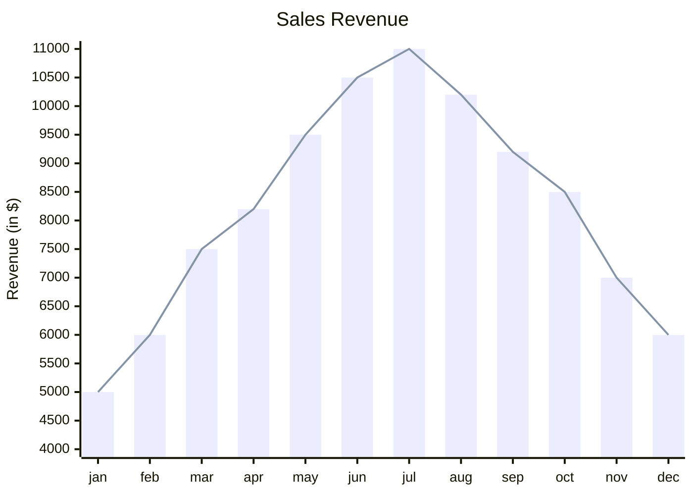
```mermaid
xychart-beta
    title "Sales Revenue"
    x-axis [jan, feb, mar, apr, may, jun, jul, aug, sep, oct, nov, dec]
    y-axis "Revenue (in $)" 4000 --> 11000
    bar [5000, 6000, 7500, 8200, 9500, 10500, 11000, 10200, 9200, 8500, 7000, 6000]
    line [5000, 6000, 7500, 8200, 9500, 10500, 11000, 10200, 9200, 8500, 7000, 6000]
```

```{=openxml}
<w:p><w:r><w:br w:type="page"/></w:r></w:p>
```

## Radar

Courbes sur plusieurs axes.

| Rubrique | Détail |
|:---------|:-------|
| Mot-clé | `radar-beta` |
| Couleurs | Couleurs fixes |


**Syntaxe**

- `title`, `axis id["Libellé"], …`, `curve id{1, 2, 3}` ou `curve id{ axe: 30 }`
- Options `showLegend`, `max`, `min`, `graticule circle|polygon`, `ticks`

**Pris en charge :** Axes, courbes, options ci-dessus.

**Limites**

- Plafond : 64 axes et 64 courbes
- Configuration ignorée


*Source de l’exemple :*

```text
radar-beta
  title Grades
  axis m["Math"], s["Science"], e["English"]
  axis h["History"], g["Geography"], a["Art"]
  curve a["Alice"]{85, 90, 80, 70, 75, 90}
  curve b["Bob"]{70, 75, 85, 80, 90, 85}
  max 100
  graticule polygon
  ticks 4
```

*Rendu obtenu :*

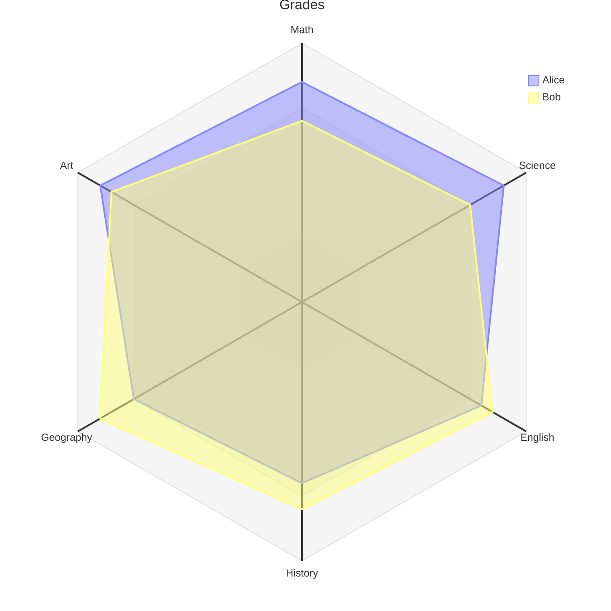
```mermaid
radar-beta
  title Grades
  axis m["Math"], s["Science"], e["English"]
  axis h["History"], g["Geography"], a["Art"]
  curve a["Alice"]{85, 90, 80, 70, 75, 90}
  curve b["Bob"]{70, 75, 85, 80, 90, 85}
  max 100
  graticule polygon
  ticks 4
```

```{=openxml}
<w:p><w:r><w:br w:type="page"/></w:r></w:p>
```

## Quadrant

Points placés sur une matrice 2×2.

| Rubrique | Détail |
|:---------|:-------|
| Mot-clé | `quadrantChart` |
| Couleurs | Points : color |


**Syntaxe**

- `title`, `x-axis`/`y-axis` (une ou deux extrémités), `quadrant-1..4`
- Points `nom: [x, y]` avec `color: #RRGGBB` optionnel

**Pris en charge :** Positions et couleur par point.

**Limites**

- `radius`, `stroke-color`, `stroke-width`, `classDef`/`:::` : ignorés avec avertissement (position intacte)


*Source de l’exemple :*

```text
quadrantChart
    title Reach and engagement of campaigns
    x-axis Low Reach --> High Reach
    y-axis Low Engagement --> High Engagement
    quadrant-1 We should expand
    quadrant-2 Need to promote
    quadrant-3 Re-evaluate
    quadrant-4 May be improved
    Campaign A: [0.3, 0.6] color: #1565C0
    Campaign B: [0.45, 0.23] color: #1565C0
    Campaign C: [0.57, 0.69] color: #ff3300
    Campaign D: [0.78, 0.34] color: #1565C0
```

*Rendu obtenu :*

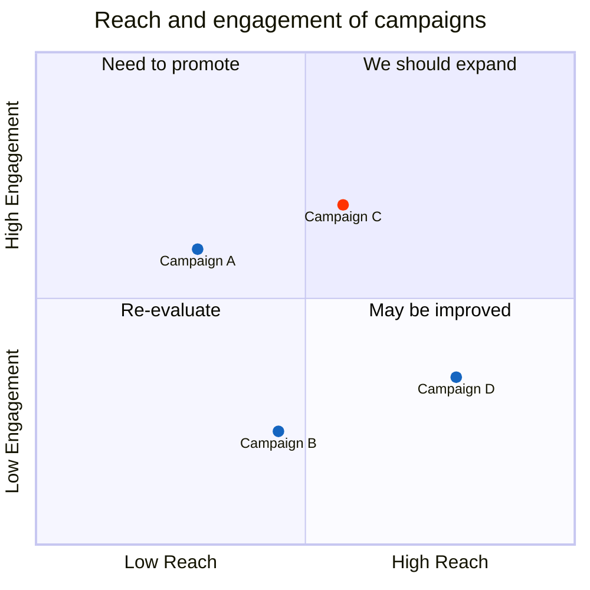
```mermaid
quadrantChart
    title Reach and engagement of campaigns
    x-axis Low Reach --> High Reach
    y-axis Low Engagement --> High Engagement
    quadrant-1 We should expand
    quadrant-2 Need to promote
    quadrant-3 Re-evaluate
    quadrant-4 May be improved
    Campaign A: [0.3, 0.6] color: #1565C0
    Campaign B: [0.45, 0.23] color: #1565C0
    Campaign C: [0.57, 0.69] color: #ff3300
    Campaign D: [0.78, 0.34] color: #1565C0
```

```{=openxml}
<w:p><w:r><w:br w:type="page"/></w:r></w:p>
```

## Venn

Ensembles et intersections.

| Rubrique | Détail |
|:---------|:-------|
| Mot-clé | `venn-beta` |
| Couleurs | Oui : style par ensemble |


**Syntaxe**

- `set A ["Libellé"]`, `union A,B`, `text ["…"]` rattaché à l’ensemble ou union précédent
- `style A fill:#RRGGBB`

**Pris en charge :** 2 ou 3 ensembles : vrais cercles qui se recouvrent ; Couleur par ensemble.

**Limites**

- 4 ensembles ou plus : rangée de cercles séparés avec une note
- Suffixe de taille `:N` et `style` sur une union : ignorés avec avertissement

> **À savoir :** à partir de 4 ensembles, le diagramme n’est plus un vrai Venn (cercles séparés).


*Source de l’exemple :*

```text
venn-beta
  title Skills coverage
  set A ["Design"]
  set B ["Code"]
  set C ["Writing"]
  union A,B
    text ["Design+Code"]
  union B,C
    text ["Code+Writing"]
  union A,C
    text ["Design+Writing"]
  union A,B,C
    text ["All three"]
  style A fill:#BBDEFB
  style B fill:#C8E6C9
  style C fill:#FFE0B2
```

*Rendu obtenu :*

```mermaid
venn-beta
  title Skills coverage
  set A ["Design"]
  set B ["Code"]
  set C ["Writing"]
  union A,B
    text ["Design+Code"]
  union B,C
    text ["Code+Writing"]
  union A,C
    text ["Design+Writing"]
  union A,B,C
    text ["All three"]
  style A fill:#BBDEFB
  style B fill:#C8E6C9
  style C fill:#FFE0B2
```

```{=openxml}
<w:p><w:r><w:br w:type="page"/></w:r></w:p>
```

## Carte mentale

Arbre radial à partir d’une racine.

| Rubrique | Détail |
|:---------|:-------|
| Mot-clé | `mindmap` |
| Couleurs | Non (classe ignorée) |


**Syntaxe**

- Hiérarchie par indentation, une seule racine
- 6 formes : `[ ]`, `( )`, `(( ))`, `)) ((`, `) (`, `{{ }}`

**Pris en charge :** Toutes les formes nommées, profondeur illimitée.

**Limites**

- `::icon(...)` et `:::classe` : retirés avec avertissement
- Racines multiples : la première est gardée


*Source de l’exemple :*

```text
mindmap
  root((Project Plan))
    Research
      Market analysis
      Competitor review
      User interviews
    Design
      [Wireframes]
      )Moodboard(
        Colors
        Typography
    {{Engineering}}
      (Backend)
        API
        Database
      Frontend
    Launch
      ))Marketing((
      Support
```

*Rendu obtenu :*

```mermaid
mindmap
  root((Project Plan))
    Research
      Market analysis
      Competitor review
      User interviews
    Design
      [Wireframes]
      )Moodboard(
        Colors
        Typography
    {{Engineering}}
      (Backend)
        API
        Database
      Frontend
    Launch
      ))Marketing((
      Support
```

```{=openxml}
<w:p><w:r><w:br w:type="page"/></w:r></w:p>
```

## Arbre de fichiers

Arborescence façon explorateur de fichiers.

| Rubrique | Détail |
|:---------|:-------|
| Mot-clé | `treeView-beta` |
| Couleurs | Surlignage (highlight) |


**Syntaxe**

- Hiérarchie par la colonne de départ (tabulation = 4), ou avec `├ └ │`
- Libellé `"avec espaces"`, `/` final pour un dossier, `## description`, `:::highlight`

**Pris en charge :** Dossiers, fichiers, descriptions, surlignage.

**Limites**

- `icon(nom)` ignoré avec avertissement
- Seule la classe `highlight` est prise en compte
- Plafonds : profondeur 32, 2000 nœuds


*Source de l’exemple :*

```text
treeView-beta
    "packages/"
        "core/" ## the moat
            "src/"
                parser/
                translator/
                index.ts:::highlight
            package.json
        cli/
        "README file.md" ## quick start
    docs/
        specs/
```

*Rendu obtenu :*

```mermaid
treeView-beta
    "packages/"
        "core/" ## the moat
            "src/"
                parser/
                translator/
                index.ts:::highlight
            package.json
        cli/
        "README file.md" ## quick start
    docs/
        specs/
```

```{=openxml}
<w:p><w:r><w:br w:type="page"/></w:r></w:p>
```

## Treemap

Rectangles imbriqués proportionnels aux valeurs.

| Rubrique | Détail |
|:---------|:-------|
| Mot-clé | `treemap-beta` |
| Couleurs | Oui : classDef (fill, color, stroke) |


**Syntaxe**

- `"Section"`, `"Feuille": valeur`, indentation
- `classDef nom fill:#…,color:#…,stroke:#…;` puis `:::nom`

**Pris en charge :** `fill`, `color`, `stroke` en hexadécimal et quelques noms CSS.

**Limites**

- Les autres propriétés sont ignorées silencieusement
- Frontmatter ignoré avec avertissement


*Source de l’exemple :*

```text
treemap-beta
"Products"
    "Electronics"
        "Phones": 50
        "Computers": 30
        "Accessories": 20
    "Clothing"
        "Men's": 40
        "Women's":::important
            "Dresses": 25
            "Tops": 15
"Services"
    "Support": 35
    "Consulting": 12
    "Training": 8

classDef important fill:#f96,stroke:#333,color:#000;
```

*Rendu obtenu :*

```mermaid
treemap-beta
"Products"
    "Electronics"
        "Phones": 50
        "Computers": 30
        "Accessories": 20
    "Clothing"
        "Men's": 40
        "Women's":::important
            "Dresses": 25
            "Tops": 15
"Services"
    "Support": 35
    "Consulting": 12
    "Training": 8

classDef important fill:#f96,stroke:#333,color:#000;
```

```{=openxml}
<w:p><w:r><w:br w:type="page"/></w:r></w:p>
```

## Kanban

Colonnes et cartes.

| Rubrique | Détail |
|:---------|:-------|
| Mot-clé | `kanban` |
| Couleurs | Couleurs fixes |


**Syntaxe**

- Colonnes = lignes les moins indentées, cartes = lignes plus indentées
- Carte `id[Titre]`, `[Titre]` ou `Titre`, avec `@{ ticket: X, assigned: 'y', priority: 'High' }`

**Pris en charge :** Colonnes, cartes, métadonnées.

**Limites**

- `ticketBaseUrl` volontairement non géré : le projet n’émet jamais de référence distante


*Source de l’exemple :*

```text
kanban
  Todo
    [Create Documentation]
    docs[Create Blog about the new diagram]
  [In progress]
    id6[Create renderer so that it works in all cases. We also add some extra text here for testing purposes. And some more just for the extra flare.]
  id9[Ready for deploy]
    id8[Design grammar]@{ assigned: 'knsv' }
  id10[Ready for test]
    id4[Create parsing tests]@{ ticket: MC-2038, assigned: 'K.Sveidqvist', priority: 'High' }
    id66[last item]@{ priority: 'Very Low', assigned: 'knsv' }
  id11[Done]
    id5[define getData]
    id2[Title of diagram is more than 100 chars when user duplicates diagram with 100 char]@{ ticket: MC-2036, priority: 'Very High'}
    id3[Update DB function]@{ ticket: MC-2037, assigned: knsv, priority: 'High' }

  id12[Can't reproduce]
    id3[Weird flickering in Firefox]
```

*Rendu obtenu :*

```mermaid
kanban
  Todo
    [Create Documentation]
    docs[Create Blog about the new diagram]
  [In progress]
    id6[Create renderer so that it works in all cases. We also add some extra text here for testing purposes. And some more just for the extra flare.]
  id9[Ready for deploy]
    id8[Design grammar]@{ assigned: 'knsv' }
  id10[Ready for test]
    id4[Create parsing tests]@{ ticket: MC-2038, assigned: 'K.Sveidqvist', priority: 'High' }
    id66[last item]@{ priority: 'Very Low', assigned: 'knsv' }
  id11[Done]
    id5[define getData]
    id2[Title of diagram is more than 100 chars when user duplicates diagram with 100 char]@{ ticket: MC-2036, priority: 'Very High'}
    id3[Update DB function]@{ ticket: MC-2037, assigned: knsv, priority: 'High' }

  id12[Can't reproduce]
    id3[Weird flickering in Firefox]
```

```{=openxml}
<w:p><w:r><w:br w:type="page"/></w:r></w:p>
```

## Ishikawa (arêtes de poisson)

Causes d’un effet, classées par catégorie.

| Rubrique | Détail |
|:---------|:-------|
| Mot-clé | `ishikawa-beta` |
| Couleurs | Couleurs fixes |


**Syntaxe**

- 1ʳᵉ ligne = l’effet, puis causes par indentation (tabulation = 4)

**Pris en charge :** Catégories et sous-causes.

**Limites**

- Plafonds : 8 niveaux, 500 lignes


*Source de l’exemple :*

```text
ishikawa-beta
    Blurry Photo
    Process
        Out of focus
        Shutter speed too slow
        Protective film not removed
        Beautification filter applied
    User
        Shaky hands
    Equipment
        LENS
            Inappropriate lens
            Damaged lens
            Dirty lens
        SENSOR
            Damaged sensor
            Dirty sensor
    Environment
        Subject moved too quickly
        Too dark
```

*Rendu obtenu :*

```mermaid
ishikawa-beta
    Blurry Photo
    Process
        Out of focus
        Shutter speed too slow
        Protective film not removed
        Beautification filter applied
    User
        Shaky hands
    Equipment
        LENS
            Inappropriate lens
            Damaged lens
            Dirty lens
        SENSOR
            Damaged sensor
            Dirty sensor
    Environment
        Subject moved too quickly
        Too dark
```

```{=openxml}
<w:p><w:r><w:br w:type="page"/></w:r></w:p>
```

## Paquet réseau

Champs d’un paquet, en rangées de bits.

| Rubrique | Détail |
|:---------|:-------|
| Mot-clé | `packet` |
| Couleurs | Couleurs fixes |


**Syntaxe**

- `début: "Nom"`, `début-fin: "Nom"`, `+nombre: "Nom"`, `title`

**Pris en charge :** Champs et titre.

**Limites**

- Options de frontmatter (`showBits`, `bitOrder`, `bitsPerRow`…) ignorées : 32 bits par rangée, bit de poids faible à gauche


*Source de l’exemple :*

```text
---
title: "TCP Packet"
---
packet
0-15: "Source Port"
16-31: "Destination Port"
32-63: "Sequence Number"
64-95: "Acknowledgment Number"
96-99: "Data Offset"
100-105: "Reserved"
106: "URG"
107: "ACK"
108: "PSH"
109: "RST"
110: "SYN"
111: "FIN"
112-127: "Window"
128-143: "Checksum"
144-159: "Urgent Pointer"
160-191: "(Options and Padding)"
192-255: "Data (variable length)"
```

*Rendu obtenu :*

```mermaid
---
title: "TCP Packet"
---
packet
0-15: "Source Port"
16-31: "Destination Port"
32-63: "Sequence Number"
64-95: "Acknowledgment Number"
96-99: "Data Offset"
100-105: "Reserved"
106: "URG"
107: "ACK"
108: "PSH"
109: "RST"
110: "SYN"
111: "FIN"
112-127: "Window"
128-143: "Checksum"
144-159: "Urgent Pointer"
160-191: "(Options and Padding)"
192-255: "Data (variable length)"
```

```{=openxml}
<w:p><w:r><w:br w:type="page"/></w:r></w:p>
```

## Cynefin

Cinq domaines de décision avec éléments et transitions.

| Rubrique | Détail |
|:---------|:-------|
| Mot-clé | `cynefin-beta` |
| Couleurs | Couleurs fixes |


**Syntaxe**

- `title`, domaines `complex`, `complicated`, `clear`, `chaotic`, `confusion` suivis d’éléments `"texte"`
- Transitions `complex --> complicated`

**Pris en charge :** Domaines, éléments, transitions.

**Limites**

- Auto-transitions supprimées, comme dans Mermaid


*Source de l’exemple :*

```text
cynefin-beta
  title Strategy Categorization

  complex
    "Market research"

  complicated
    "Competitive analysis"

  clear
    "Standard pricing"

  chaotic
    "Crisis management"

  complex --> complicated : "Pattern identified"
  complicated --> clear : "Best practice codified"
  clear --> chaotic : "Complacency"
  chaotic --> complex : "Stabilized"
```

*Rendu obtenu :*

```mermaid
cynefin-beta
  title Strategy Categorization

  complex
    "Market research"

  complicated
    "Competitive analysis"

  clear
    "Standard pricing"

  chaotic
    "Crisis management"

  complex --> complicated : "Pattern identified"
  complicated --> clear : "Best practice codified"
  clear --> chaotic : "Complacency"
  chaotic --> complex : "Stabilized"
```

```{=openxml}
<w:p><w:r><w:br w:type="page"/></w:r></w:p>
```

## Wardley

Cartographie de valeur en fonction de l’évolution.

| Rubrique | Détail |
|:---------|:-------|
| Mot-clé | `wardley-beta` |
| Couleurs | Couleurs fixes |


**Syntaxe**

- Entités avec coordonnées `[visibilité, évolution]` (0–1 ou 0–100), liens, pipelines, évolutions, notes, accélérateurs

**Pris en charge :** Entités, liens (avec sens et libellé), pipelines.

**Limites**

- Entité hors plage : ignorée avec avertissement (Mermaid lève une erreur)
- Plafonds : 200 nœuds, 500 liens


*Source de l’exemple :*

```text
wardley-beta
title Tea Shop
size [1000, 640]
anchor Business [0.95, 0.63]
anchor Public [0.95, 0.78]
component Cup of Tea [0.79, 0.61] label [-85, 10]
component Cup [0.73, 0.78]
component Tea [0.63, 0.81]
component Hot Water [0.52, 0.80]
component Water [0.38, 0.82] (buy)
component Kettle [0.43, 0.35] (inertia)
component Boiler [0.30, 0.20] (build)
component Power [0.1, 0.7] (outsource)
pipeline Kettle {
  component "Electric Kettle" [0.64]
  component "Gas Kettle" [0.46]
}
Business->Cup of Tea
Public->Cup of Tea
Cup of Tea->Cup
Cup of Tea->Tea
Cup of Tea->Hot Water
Hot Water->Water
Hot Water->Kettle; boils
Kettle -.-> Power
Boiler -> Power
Tea +<> Water
evolve Kettle 0.62
note "Standardising power allows Kettles to evolve faster" [0.07, 0.45]
annotations [0.12, 0.02]
annotation 1,[0.20,0.30] "Standardising power"
accelerator "Open Source" [0.62, 0.30]
```

*Rendu obtenu :*

```mermaid
wardley-beta
title Tea Shop
size [1000, 640]
anchor Business [0.95, 0.63]
anchor Public [0.95, 0.78]
component Cup of Tea [0.79, 0.61] label [-85, 10]
component Cup [0.73, 0.78]
component Tea [0.63, 0.81]
component Hot Water [0.52, 0.80]
component Water [0.38, 0.82] (buy)
component Kettle [0.43, 0.35] (inertia)
component Boiler [0.30, 0.20] (build)
component Power [0.1, 0.7] (outsource)
pipeline Kettle {
  component "Electric Kettle" [0.64]
  component "Gas Kettle" [0.46]
}
Business->Cup of Tea
Public->Cup of Tea
Cup of Tea->Cup
Cup of Tea->Tea
Cup of Tea->Hot Water
Hot Water->Water
Hot Water->Kettle; boils
Kettle -.-> Power
Boiler -> Power
Tea +<> Water
evolve Kettle 0.62
note "Standardising power allows Kettles to evolve faster" [0.07, 0.45]
annotations [0.12, 0.02]
annotation 1,[0.20,0.30] "Standardising power"
accelerator "Open Source" [0.62, 0.30]
```

```{=openxml}
<w:p><w:r><w:br w:type="page"/></w:r></w:p>
```

## Event modeling

Cadres de temps, événements, données et scénarios.

| Rubrique | Détail |
|:---------|:-------|
| Mot-clé | `eventmodeling` |
| Couleurs | Couleurs fixes |


**Syntaxe**

- `tf|timeframe|rf|resetframe 01 type Nom.Qualifié (->> id)*`
- `data Nom { }`, `note id { }`, `entity Nom`, `gwt id given … when … then …`

**Pris en charge :** Cadres, liens, blocs de données et notes, scénarios.

**Limites**

- `title`, `accTitle` et notes en ligne : refusés par Mermaid, ignorés ici avec avertissement
- Couloirs triés par groupe puis première apparition (écart volontaire avec la doc)
- Plafonds : 100 cadres, 300 liens, 50 scénarios


*Source de l’exemple :*

```text
eventmodeling
tf 01 ui CartScreen
tf 02 cmd AddItem [[AddItem01]]
tf 03 evt ItemAdded ->> 02 {"itemId": "42", "qty": 1}
tf 04 rmo CartItems ->> 03
tf 05 ui CartScreenUpdated ->> 04
tf 06 pcr PriceCalculator ->> 04
tf 07 cmd ApplyDiscount ->> 06
tf 08 evt Billing.DiscountApplied ->> 07
rf 09 ui Checkout ->> 04
tf 10 cmd Pay ->> 09
tf 11 evt Billing.Paid ->> 10
data AddItem01 {
  description: 'john'
  price: 20.4
}
note 03 {
  stock reserved elsewhere
}
gwt 03 given evt ItemAdded when cmd AddItem then evt ItemAdded
```

*Rendu obtenu :*

```mermaid
eventmodeling
tf 01 ui CartScreen
tf 02 cmd AddItem [[AddItem01]]
tf 03 evt ItemAdded ->> 02 {"itemId": "42", "qty": 1}
tf 04 rmo CartItems ->> 03
tf 05 ui CartScreenUpdated ->> 04
tf 06 pcr PriceCalculator ->> 04
tf 07 cmd ApplyDiscount ->> 06
tf 08 evt Billing.DiscountApplied ->> 07
rf 09 ui Checkout ->> 04
tf 10 cmd Pay ->> 09
tf 11 evt Billing.Paid ->> 10
data AddItem01 {
  description: 'john'
  price: 20.4
}
note 03 {
  stock reserved elsewhere
}
gwt 03 given evt ItemAdded when cmd AddItem then evt ItemAdded
```

```{=openxml}
<w:p><w:r><w:br w:type="page"/></w:r></w:p>
```

## Git graph

Historique de branches et de commits.

| Rubrique | Détail |
|:---------|:-------|
| Mot-clé | `gitGraph` |
| Couleurs | Couleurs fixes |


**Syntaxe**

- `commit`, `branch`, `checkout`/`switch`, `merge`, `cherry-pick`
- Attributs `id:`, `type:`, `tag:`, `order:`, `parent:`

**Pris en charge :** Branches, fusions, tags, cherry-pick.

**Limites**

- L’ordre des instructions compte, comme dans un vrai dépôt


*Source de l’exemple :*

```text
gitGraph
    commit id: "ZERO"
    branch develop
    branch release
    commit id:"A"
    checkout main
    commit id:"ONE"
    checkout develop
    commit id:"B"
    checkout main
    merge develop id:"MERGE"
    commit id:"TWO"
    checkout release
    cherry-pick id:"MERGE" parent:"B"
    commit id:"THREE"
    checkout develop
    commit id:"C"
```

*Rendu obtenu :*

```mermaid
gitGraph
    commit id: "ZERO"
    branch develop
    branch release
    commit id:"A"
    checkout main
    commit id:"ONE"
    checkout develop
    commit id:"B"
    checkout main
    merge develop id:"MERGE"
    commit id:"TWO"
    checkout release
    cherry-pick id:"MERGE" parent:"B"
    commit id:"THREE"
    checkout develop
    commit id:"C"
```
