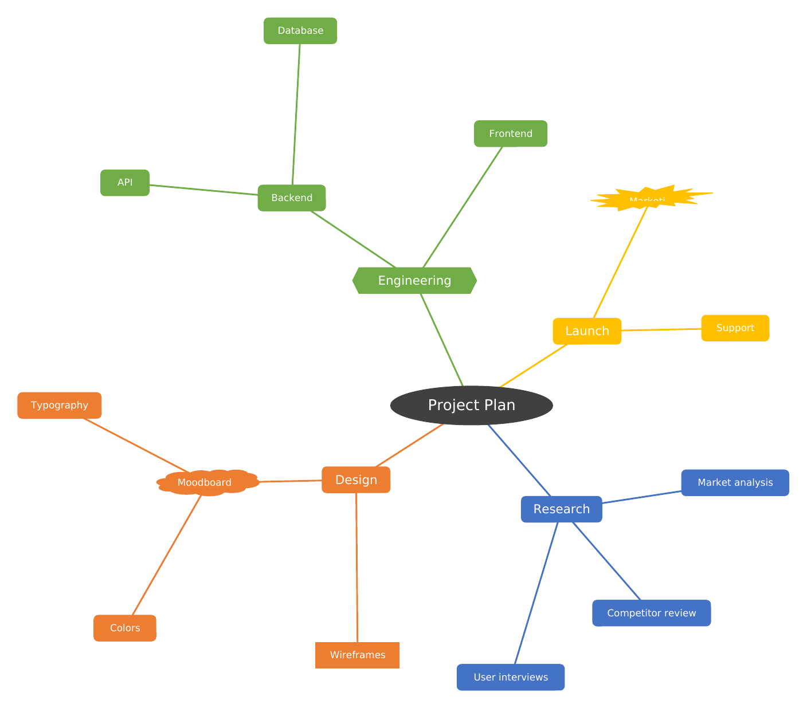
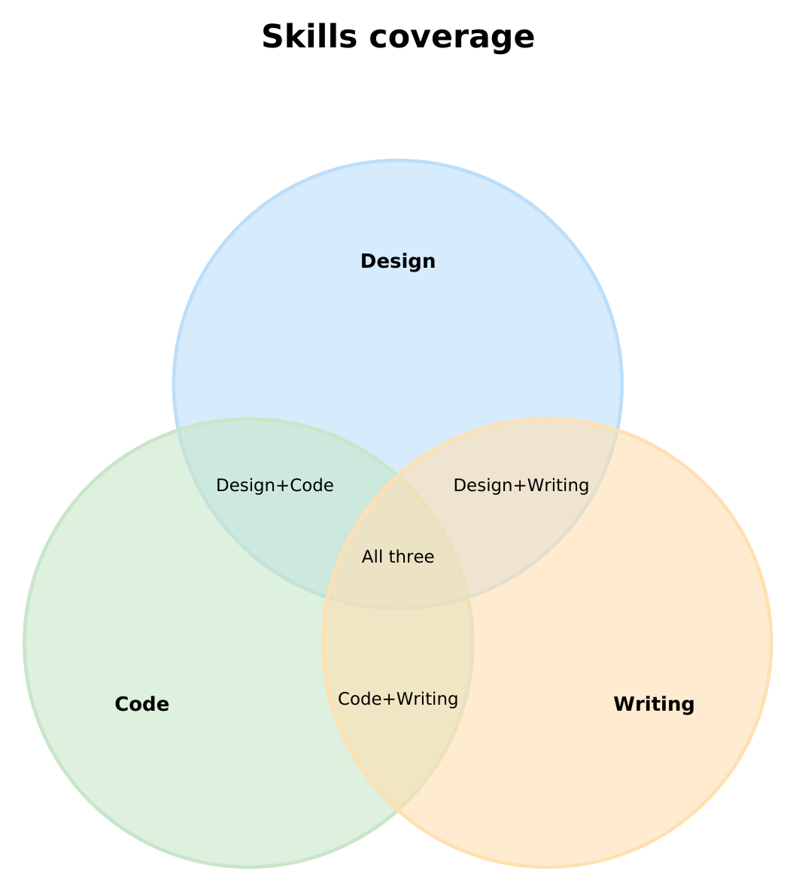

```{=openxml}
<w:p><w:pPr><w:spacing w:before="240" w:after="0"/><w:jc w:val="center"/></w:pPr><w:r><w:rPr><w:color w:val="262626"/><w:sz w:val="22"/></w:rPr><w:t xml:space="preserve"></w:t></w:r></w:p>
```

+:----------------------------------+
| {width=1.5in} |
+-----------------------------------+

```{=openxml}
<w:p><w:pPr><w:spacing w:before="240" w:after="40"/><w:jc w:val="center"/></w:pPr><w:r><w:rPr><w:b/><w:color w:val="2E7D32"/><w:sz w:val="64"/></w:rPr><w:t xml:space="preserve">md2nativedocx</w:t></w:r></w:p><w:p><w:pPr><w:spacing w:before="0" w:after="80"/><w:jc w:val="center"/></w:pPr><w:r><w:rPr><w:color w:val="404040"/><w:sz w:val="36"/></w:rPr><w:t xml:space="preserve">Manuel d’utilisation</w:t></w:r></w:p><w:p><w:pPr><w:spacing w:before="0" w:after="240"/><w:jc w:val="center"/></w:pPr><w:r><w:rPr><w:color w:val="666666"/><w:sz w:val="22"/></w:rPr><w:t xml:space="preserve">Convertir Markdown et Mermaid en Word natif, sans aplatir les diagrammes en images</w:t></w:r></w:p>
```

+:--------------------------------------+:--------------------------------------+
| {width=2.6in} | {width=2.2in} |
+---------------------------------------+---------------------------------------+

```{=openxml}
<w:p><w:pPr><w:spacing w:before="200" w:after="0"/><w:jc w:val="center"/></w:pPr><w:r><w:rPr><w:color w:val="262626"/><w:sz w:val="22"/></w:rPr><w:t xml:space="preserve"></w:t></w:r></w:p>
```

| Informations techniques | |
|:------------------------|:--------------------------------------------|
| Version | 0.5.6 |
| Date | 5 octobre 2026 |
| Licence | CC0 1.0 (domaine public) |
| Dépôt | github.com/nicolasbridelance/md2nativedocx |
| Sorties | `.docx` (via Pandoc) et `.pptx` |
| Diagrammes | 29 types Mermaid, formes natives modifiables |
| Exécution | 100 % locale, sans référence distante |

```{=openxml}
<w:p><w:pPr><w:sectPr><w:pgSz w:w="11906" w:h="16838"/><w:pgMar w:top="1440" w:right="1080" w:bottom="1440" w:left="1080" w:header="708" w:footer="708" w:gutter="0"/></w:sectPr></w:pPr></w:p>
```

```{=openxml}
<w:p><w:pPr><w:spacing w:before="0" w:after="240"/><w:jc w:val="left"/></w:pPr><w:r><w:rPr><w:b/><w:color w:val="2E7D32"/><w:sz w:val="44"/></w:rPr><w:t xml:space="preserve">Sommaire</w:t></w:r></w:p><w:p><w:pPr><w:tabs><w:tab w:val="right" w:leader="dot" w:pos="9746"/></w:tabs><w:spacing w:before="120" w:after="0"/></w:pPr><w:r><w:fldChar w:fldCharType="begin" w:dirty="true"/></w:r><w:r><w:instrText xml:space="preserve"> TOC \o "1-2" \h \z \u </w:instrText></w:r><w:r><w:fldChar w:fldCharType="separate"/></w:r><w:r><w:rPr><w:b/><w:sz w:val="22"/></w:rPr><w:t xml:space="preserve">Présentation</w:t></w:r><w:r><w:rPr><w:sz w:val="22"/></w:rPr><w:tab/></w:r><w:r><w:rPr><w:b/><w:sz w:val="22"/></w:rPr><w:t>3</w:t></w:r></w:p><w:p><w:pPr><w:tabs><w:tab w:val="right" w:leader="dot" w:pos="9746"/></w:tabs><w:spacing w:before="0" w:after="0"/><w:ind w:left="360"/></w:pPr><w:r><w:rPr><w:sz w:val="20"/></w:rPr><w:t xml:space="preserve">Utilisation en ligne de commande</w:t></w:r><w:r><w:rPr><w:sz w:val="20"/></w:rPr><w:tab/></w:r><w:r><w:rPr><w:sz w:val="20"/></w:rPr><w:t>3</w:t></w:r></w:p><w:p><w:pPr><w:tabs><w:tab w:val="right" w:leader="dot" w:pos="9746"/></w:tabs><w:spacing w:before="0" w:after="0"/><w:ind w:left="360"/></w:pPr><w:r><w:rPr><w:sz w:val="20"/></w:rPr><w:t xml:space="preserve">Principes</w:t></w:r><w:r><w:rPr><w:sz w:val="20"/></w:rPr><w:tab/></w:r><w:r><w:rPr><w:sz w:val="20"/></w:rPr><w:t>3</w:t></w:r></w:p><w:p><w:pPr><w:tabs><w:tab w:val="right" w:leader="dot" w:pos="9746"/></w:tabs><w:spacing w:before="0" w:after="0"/><w:ind w:left="360"/></w:pPr><w:r><w:rPr><w:sz w:val="20"/></w:rPr><w:t xml:space="preserve">Comment lire ce manuel</w:t></w:r><w:r><w:rPr><w:sz w:val="20"/></w:rPr><w:tab/></w:r><w:r><w:rPr><w:sz w:val="20"/></w:rPr><w:t>3</w:t></w:r></w:p><w:p><w:pPr><w:tabs><w:tab w:val="right" w:leader="dot" w:pos="9746"/></w:tabs><w:spacing w:before="120" w:after="0"/></w:pPr><w:r><w:rPr><w:b/><w:sz w:val="22"/></w:rPr><w:t xml:space="preserve">Réglages de mise en forme</w:t></w:r><w:r><w:rPr><w:sz w:val="22"/></w:rPr><w:tab/></w:r><w:r><w:rPr><w:b/><w:sz w:val="22"/></w:rPr><w:t>4</w:t></w:r></w:p><w:p><w:pPr><w:tabs><w:tab w:val="right" w:leader="dot" w:pos="9746"/></w:tabs><w:spacing w:before="120" w:after="0"/></w:pPr><w:r><w:rPr><w:b/><w:sz w:val="22"/></w:rPr><w:t xml:space="preserve">Markdown standard</w:t></w:r><w:r><w:rPr><w:sz w:val="22"/></w:rPr><w:tab/></w:r><w:r><w:rPr><w:b/><w:sz w:val="22"/></w:rPr><w:t>5</w:t></w:r></w:p><w:p><w:pPr><w:tabs><w:tab w:val="right" w:leader="dot" w:pos="9746"/></w:tabs><w:spacing w:before="0" w:after="0"/><w:ind w:left="360"/></w:pPr><w:r><w:rPr><w:sz w:val="20"/></w:rPr><w:t xml:space="preserve">1. Texte et emphase</w:t></w:r><w:r><w:rPr><w:sz w:val="20"/></w:rPr><w:tab/></w:r><w:r><w:rPr><w:sz w:val="20"/></w:rPr><w:t>5</w:t></w:r></w:p><w:p><w:pPr><w:tabs><w:tab w:val="right" w:leader="dot" w:pos="9746"/></w:tabs><w:spacing w:before="0" w:after="0"/><w:ind w:left="360"/></w:pPr><w:r><w:rPr><w:sz w:val="20"/></w:rPr><w:t xml:space="preserve">2. Listes</w:t></w:r><w:r><w:rPr><w:sz w:val="20"/></w:rPr><w:tab/></w:r><w:r><w:rPr><w:sz w:val="20"/></w:rPr><w:t>5</w:t></w:r></w:p><w:p><w:pPr><w:tabs><w:tab w:val="right" w:leader="dot" w:pos="9746"/></w:tabs><w:spacing w:before="0" w:after="0"/><w:ind w:left="360"/></w:pPr><w:r><w:rPr><w:sz w:val="20"/></w:rPr><w:t xml:space="preserve">3. Tableaux</w:t></w:r><w:r><w:rPr><w:sz w:val="20"/></w:rPr><w:tab/></w:r><w:r><w:rPr><w:sz w:val="20"/></w:rPr><w:t>5</w:t></w:r></w:p><w:p><w:pPr><w:tabs><w:tab w:val="right" w:leader="dot" w:pos="9746"/></w:tabs><w:spacing w:before="0" w:after="0"/><w:ind w:left="360"/></w:pPr><w:r><w:rPr><w:sz w:val="20"/></w:rPr><w:t xml:space="preserve">4. Équations</w:t></w:r><w:r><w:rPr><w:sz w:val="20"/></w:rPr><w:tab/></w:r><w:r><w:rPr><w:sz w:val="20"/></w:rPr><w:t>6</w:t></w:r></w:p><w:p><w:pPr><w:tabs><w:tab w:val="right" w:leader="dot" w:pos="9746"/></w:tabs><w:spacing w:before="0" w:after="0"/><w:ind w:left="360"/></w:pPr><w:r><w:rPr><w:sz w:val="20"/></w:rPr><w:t xml:space="preserve">5. Code</w:t></w:r><w:r><w:rPr><w:sz w:val="20"/></w:rPr><w:tab/></w:r><w:r><w:rPr><w:sz w:val="20"/></w:rPr><w:t>6</w:t></w:r></w:p><w:p><w:pPr><w:tabs><w:tab w:val="right" w:leader="dot" w:pos="9746"/></w:tabs><w:spacing w:before="0" w:after="0"/><w:ind w:left="360"/></w:pPr><w:r><w:rPr><w:sz w:val="20"/></w:rPr><w:t xml:space="preserve">6. Images</w:t></w:r><w:r><w:rPr><w:sz w:val="20"/></w:rPr><w:tab/></w:r><w:r><w:rPr><w:sz w:val="20"/></w:rPr><w:t>6</w:t></w:r></w:p><w:p><w:pPr><w:tabs><w:tab w:val="right" w:leader="dot" w:pos="9746"/></w:tabs><w:spacing w:before="0" w:after="0"/><w:ind w:left="360"/></w:pPr><w:r><w:rPr><w:sz w:val="20"/></w:rPr><w:t xml:space="preserve">7. Notes et divers</w:t></w:r><w:r><w:rPr><w:sz w:val="20"/></w:rPr><w:tab/></w:r><w:r><w:rPr><w:sz w:val="20"/></w:rPr><w:t>7</w:t></w:r></w:p><w:p><w:pPr><w:tabs><w:tab w:val="right" w:leader="dot" w:pos="9746"/></w:tabs><w:spacing w:before="120" w:after="0"/></w:pPr><w:r><w:rPr><w:b/><w:sz w:val="22"/></w:rPr><w:t xml:space="preserve">Types de diagrammes</w:t></w:r><w:r><w:rPr><w:sz w:val="22"/></w:rPr><w:tab/></w:r><w:r><w:rPr><w:b/><w:sz w:val="22"/></w:rPr><w:t>8</w:t></w:r></w:p><w:p><w:pPr><w:tabs><w:tab w:val="right" w:leader="dot" w:pos="9746"/></w:tabs><w:spacing w:before="0" w:after="0"/><w:ind w:left="360"/></w:pPr><w:r><w:rPr><w:sz w:val="20"/></w:rPr><w:t xml:space="preserve">Flowchart (organigramme)</w:t></w:r><w:r><w:rPr><w:sz w:val="20"/></w:rPr><w:tab/></w:r><w:r><w:rPr><w:sz w:val="20"/></w:rPr><w:t>9</w:t></w:r></w:p><w:p><w:pPr><w:tabs><w:tab w:val="right" w:leader="dot" w:pos="9746"/></w:tabs><w:spacing w:before="0" w:after="0"/><w:ind w:left="360"/></w:pPr><w:r><w:rPr><w:sz w:val="20"/></w:rPr><w:t xml:space="preserve">Swimlane (couloirs)</w:t></w:r><w:r><w:rPr><w:sz w:val="20"/></w:rPr><w:tab/></w:r><w:r><w:rPr><w:sz w:val="20"/></w:rPr><w:t>10</w:t></w:r></w:p><w:p><w:pPr><w:tabs><w:tab w:val="right" w:leader="dot" w:pos="9746"/></w:tabs><w:spacing w:before="0" w:after="0"/><w:ind w:left="360"/></w:pPr><w:r><w:rPr><w:sz w:val="20"/></w:rPr><w:t xml:space="preserve">Diagramme de séquence</w:t></w:r><w:r><w:rPr><w:sz w:val="20"/></w:rPr><w:tab/></w:r><w:r><w:rPr><w:sz w:val="20"/></w:rPr><w:t>11</w:t></w:r></w:p><w:p><w:pPr><w:tabs><w:tab w:val="right" w:leader="dot" w:pos="9746"/></w:tabs><w:spacing w:before="0" w:after="0"/><w:ind w:left="360"/></w:pPr><w:r><w:rPr><w:sz w:val="20"/></w:rPr><w:t xml:space="preserve">ZenUML</w:t></w:r><w:r><w:rPr><w:sz w:val="20"/></w:rPr><w:tab/></w:r><w:r><w:rPr><w:sz w:val="20"/></w:rPr><w:t>12</w:t></w:r></w:p><w:p><w:pPr><w:tabs><w:tab w:val="right" w:leader="dot" w:pos="9746"/></w:tabs><w:spacing w:before="0" w:after="0"/><w:ind w:left="360"/></w:pPr><w:r><w:rPr><w:sz w:val="20"/></w:rPr><w:t xml:space="preserve">Diagramme de classes</w:t></w:r><w:r><w:rPr><w:sz w:val="20"/></w:rPr><w:tab/></w:r><w:r><w:rPr><w:sz w:val="20"/></w:rPr><w:t>13</w:t></w:r></w:p><w:p><w:pPr><w:tabs><w:tab w:val="right" w:leader="dot" w:pos="9746"/></w:tabs><w:spacing w:before="0" w:after="0"/><w:ind w:left="360"/></w:pPr><w:r><w:rPr><w:sz w:val="20"/></w:rPr><w:t xml:space="preserve">Diagramme d’états</w:t></w:r><w:r><w:rPr><w:sz w:val="20"/></w:rPr><w:tab/></w:r><w:r><w:rPr><w:sz w:val="20"/></w:rPr><w:t>14</w:t></w:r></w:p><w:p><w:pPr><w:tabs><w:tab w:val="right" w:leader="dot" w:pos="9746"/></w:tabs><w:spacing w:before="0" w:after="0"/><w:ind w:left="360"/></w:pPr><w:r><w:rPr><w:sz w:val="20"/></w:rPr><w:t xml:space="preserve">Entité-relation</w:t></w:r><w:r><w:rPr><w:sz w:val="20"/></w:rPr><w:tab/></w:r><w:r><w:rPr><w:sz w:val="20"/></w:rPr><w:t>15</w:t></w:r></w:p><w:p><w:pPr><w:tabs><w:tab w:val="right" w:leader="dot" w:pos="9746"/></w:tabs><w:spacing w:before="0" w:after="0"/><w:ind w:left="360"/></w:pPr><w:r><w:rPr><w:sz w:val="20"/></w:rPr><w:t xml:space="preserve">Diagramme d’exigences</w:t></w:r><w:r><w:rPr><w:sz w:val="20"/></w:rPr><w:tab/></w:r><w:r><w:rPr><w:sz w:val="20"/></w:rPr><w:t>16</w:t></w:r></w:p><w:p><w:pPr><w:tabs><w:tab w:val="right" w:leader="dot" w:pos="9746"/></w:tabs><w:spacing w:before="0" w:after="0"/><w:ind w:left="360"/></w:pPr><w:r><w:rPr><w:sz w:val="20"/></w:rPr><w:t xml:space="preserve">C4</w:t></w:r><w:r><w:rPr><w:sz w:val="20"/></w:rPr><w:tab/></w:r><w:r><w:rPr><w:sz w:val="20"/></w:rPr><w:t>17</w:t></w:r></w:p><w:p><w:pPr><w:tabs><w:tab w:val="right" w:leader="dot" w:pos="9746"/></w:tabs><w:spacing w:before="0" w:after="0"/><w:ind w:left="360"/></w:pPr><w:r><w:rPr><w:sz w:val="20"/></w:rPr><w:t xml:space="preserve">Architecture</w:t></w:r><w:r><w:rPr><w:sz w:val="20"/></w:rPr><w:tab/></w:r><w:r><w:rPr><w:sz w:val="20"/></w:rPr><w:t>18</w:t></w:r></w:p><w:p><w:pPr><w:tabs><w:tab w:val="right" w:leader="dot" w:pos="9746"/></w:tabs><w:spacing w:before="0" w:after="0"/><w:ind w:left="360"/></w:pPr><w:r><w:rPr><w:sz w:val="20"/></w:rPr><w:t xml:space="preserve">Block</w:t></w:r><w:r><w:rPr><w:sz w:val="20"/></w:rPr><w:tab/></w:r><w:r><w:rPr><w:sz w:val="20"/></w:rPr><w:t>19</w:t></w:r></w:p><w:p><w:pPr><w:tabs><w:tab w:val="right" w:leader="dot" w:pos="9746"/></w:tabs><w:spacing w:before="0" w:after="0"/><w:ind w:left="360"/></w:pPr><w:r><w:rPr><w:sz w:val="20"/></w:rPr><w:t xml:space="preserve">Sankey</w:t></w:r><w:r><w:rPr><w:sz w:val="20"/></w:rPr><w:tab/></w:r><w:r><w:rPr><w:sz w:val="20"/></w:rPr><w:t>20</w:t></w:r></w:p><w:p><w:pPr><w:tabs><w:tab w:val="right" w:leader="dot" w:pos="9746"/></w:tabs><w:spacing w:before="0" w:after="0"/><w:ind w:left="360"/></w:pPr><w:r><w:rPr><w:sz w:val="20"/></w:rPr><w:t xml:space="preserve">Diagramme de Gantt</w:t></w:r><w:r><w:rPr><w:sz w:val="20"/></w:rPr><w:tab/></w:r><w:r><w:rPr><w:sz w:val="20"/></w:rPr><w:t>21</w:t></w:r></w:p><w:p><w:pPr><w:tabs><w:tab w:val="right" w:leader="dot" w:pos="9746"/></w:tabs><w:spacing w:before="0" w:after="0"/><w:ind w:left="360"/></w:pPr><w:r><w:rPr><w:sz w:val="20"/></w:rPr><w:t xml:space="preserve">Chronologie</w:t></w:r><w:r><w:rPr><w:sz w:val="20"/></w:rPr><w:tab/></w:r><w:r><w:rPr><w:sz w:val="20"/></w:rPr><w:t>22</w:t></w:r></w:p><w:p><w:pPr><w:tabs><w:tab w:val="right" w:leader="dot" w:pos="9746"/></w:tabs><w:spacing w:before="0" w:after="0"/><w:ind w:left="360"/></w:pPr><w:r><w:rPr><w:sz w:val="20"/></w:rPr><w:t xml:space="preserve">Parcours utilisateur</w:t></w:r><w:r><w:rPr><w:sz w:val="20"/></w:rPr><w:tab/></w:r><w:r><w:rPr><w:sz w:val="20"/></w:rPr><w:t>23</w:t></w:r></w:p><w:p><w:pPr><w:tabs><w:tab w:val="right" w:leader="dot" w:pos="9746"/></w:tabs><w:spacing w:before="0" w:after="0"/><w:ind w:left="360"/></w:pPr><w:r><w:rPr><w:sz w:val="20"/></w:rPr><w:t xml:space="preserve">Diagramme circulaire</w:t></w:r><w:r><w:rPr><w:sz w:val="20"/></w:rPr><w:tab/></w:r><w:r><w:rPr><w:sz w:val="20"/></w:rPr><w:t>24</w:t></w:r></w:p><w:p><w:pPr><w:tabs><w:tab w:val="right" w:leader="dot" w:pos="9746"/></w:tabs><w:spacing w:before="0" w:after="0"/><w:ind w:left="360"/></w:pPr><w:r><w:rPr><w:sz w:val="20"/></w:rPr><w:t xml:space="preserve">Graphique XY</w:t></w:r><w:r><w:rPr><w:sz w:val="20"/></w:rPr><w:tab/></w:r><w:r><w:rPr><w:sz w:val="20"/></w:rPr><w:t>25</w:t></w:r></w:p><w:p><w:pPr><w:tabs><w:tab w:val="right" w:leader="dot" w:pos="9746"/></w:tabs><w:spacing w:before="0" w:after="0"/><w:ind w:left="360"/></w:pPr><w:r><w:rPr><w:sz w:val="20"/></w:rPr><w:t xml:space="preserve">Radar</w:t></w:r><w:r><w:rPr><w:sz w:val="20"/></w:rPr><w:tab/></w:r><w:r><w:rPr><w:sz w:val="20"/></w:rPr><w:t>26</w:t></w:r></w:p><w:p><w:pPr><w:tabs><w:tab w:val="right" w:leader="dot" w:pos="9746"/></w:tabs><w:spacing w:before="0" w:after="0"/><w:ind w:left="360"/></w:pPr><w:r><w:rPr><w:sz w:val="20"/></w:rPr><w:t xml:space="preserve">Quadrant</w:t></w:r><w:r><w:rPr><w:sz w:val="20"/></w:rPr><w:tab/></w:r><w:r><w:rPr><w:sz w:val="20"/></w:rPr><w:t>27</w:t></w:r></w:p><w:p><w:pPr><w:tabs><w:tab w:val="right" w:leader="dot" w:pos="9746"/></w:tabs><w:spacing w:before="0" w:after="0"/><w:ind w:left="360"/></w:pPr><w:r><w:rPr><w:sz w:val="20"/></w:rPr><w:t xml:space="preserve">Venn</w:t></w:r><w:r><w:rPr><w:sz w:val="20"/></w:rPr><w:tab/></w:r><w:r><w:rPr><w:sz w:val="20"/></w:rPr><w:t>28</w:t></w:r></w:p><w:p><w:pPr><w:tabs><w:tab w:val="right" w:leader="dot" w:pos="9746"/></w:tabs><w:spacing w:before="0" w:after="0"/><w:ind w:left="360"/></w:pPr><w:r><w:rPr><w:sz w:val="20"/></w:rPr><w:t xml:space="preserve">Carte mentale</w:t></w:r><w:r><w:rPr><w:sz w:val="20"/></w:rPr><w:tab/></w:r><w:r><w:rPr><w:sz w:val="20"/></w:rPr><w:t>29</w:t></w:r></w:p><w:p><w:pPr><w:tabs><w:tab w:val="right" w:leader="dot" w:pos="9746"/></w:tabs><w:spacing w:before="0" w:after="0"/><w:ind w:left="360"/></w:pPr><w:r><w:rPr><w:sz w:val="20"/></w:rPr><w:t xml:space="preserve">Arbre de fichiers</w:t></w:r><w:r><w:rPr><w:sz w:val="20"/></w:rPr><w:tab/></w:r><w:r><w:rPr><w:sz w:val="20"/></w:rPr><w:t>30</w:t></w:r></w:p><w:p><w:pPr><w:tabs><w:tab w:val="right" w:leader="dot" w:pos="9746"/></w:tabs><w:spacing w:before="0" w:after="0"/><w:ind w:left="360"/></w:pPr><w:r><w:rPr><w:sz w:val="20"/></w:rPr><w:t xml:space="preserve">Treemap</w:t></w:r><w:r><w:rPr><w:sz w:val="20"/></w:rPr><w:tab/></w:r><w:r><w:rPr><w:sz w:val="20"/></w:rPr><w:t>31</w:t></w:r></w:p><w:p><w:pPr><w:tabs><w:tab w:val="right" w:leader="dot" w:pos="9746"/></w:tabs><w:spacing w:before="0" w:after="0"/><w:ind w:left="360"/></w:pPr><w:r><w:rPr><w:sz w:val="20"/></w:rPr><w:t xml:space="preserve">Kanban</w:t></w:r><w:r><w:rPr><w:sz w:val="20"/></w:rPr><w:tab/></w:r><w:r><w:rPr><w:sz w:val="20"/></w:rPr><w:t>32</w:t></w:r></w:p><w:p><w:pPr><w:tabs><w:tab w:val="right" w:leader="dot" w:pos="9746"/></w:tabs><w:spacing w:before="0" w:after="0"/><w:ind w:left="360"/></w:pPr><w:r><w:rPr><w:sz w:val="20"/></w:rPr><w:t xml:space="preserve">Ishikawa (arêtes de poisson)</w:t></w:r><w:r><w:rPr><w:sz w:val="20"/></w:rPr><w:tab/></w:r><w:r><w:rPr><w:sz w:val="20"/></w:rPr><w:t>33</w:t></w:r></w:p><w:p><w:pPr><w:tabs><w:tab w:val="right" w:leader="dot" w:pos="9746"/></w:tabs><w:spacing w:before="0" w:after="0"/><w:ind w:left="360"/></w:pPr><w:r><w:rPr><w:sz w:val="20"/></w:rPr><w:t xml:space="preserve">Paquet réseau</w:t></w:r><w:r><w:rPr><w:sz w:val="20"/></w:rPr><w:tab/></w:r><w:r><w:rPr><w:sz w:val="20"/></w:rPr><w:t>34</w:t></w:r></w:p><w:p><w:pPr><w:tabs><w:tab w:val="right" w:leader="dot" w:pos="9746"/></w:tabs><w:spacing w:before="0" w:after="0"/><w:ind w:left="360"/></w:pPr><w:r><w:rPr><w:sz w:val="20"/></w:rPr><w:t xml:space="preserve">Cynefin</w:t></w:r><w:r><w:rPr><w:sz w:val="20"/></w:rPr><w:tab/></w:r><w:r><w:rPr><w:sz w:val="20"/></w:rPr><w:t>35</w:t></w:r></w:p><w:p><w:pPr><w:tabs><w:tab w:val="right" w:leader="dot" w:pos="9746"/></w:tabs><w:spacing w:before="0" w:after="0"/><w:ind w:left="360"/></w:pPr><w:r><w:rPr><w:sz w:val="20"/></w:rPr><w:t xml:space="preserve">Wardley</w:t></w:r><w:r><w:rPr><w:sz w:val="20"/></w:rPr><w:tab/></w:r><w:r><w:rPr><w:sz w:val="20"/></w:rPr><w:t>36</w:t></w:r></w:p><w:p><w:pPr><w:tabs><w:tab w:val="right" w:leader="dot" w:pos="9746"/></w:tabs><w:spacing w:before="0" w:after="0"/><w:ind w:left="360"/></w:pPr><w:r><w:rPr><w:sz w:val="20"/></w:rPr><w:t xml:space="preserve">Event modeling</w:t></w:r><w:r><w:rPr><w:sz w:val="20"/></w:rPr><w:tab/></w:r><w:r><w:rPr><w:sz w:val="20"/></w:rPr><w:t>37</w:t></w:r></w:p><w:p><w:pPr><w:tabs><w:tab w:val="right" w:leader="dot" w:pos="9746"/></w:tabs><w:spacing w:before="0" w:after="0"/><w:ind w:left="360"/></w:pPr><w:r><w:rPr><w:sz w:val="20"/></w:rPr><w:t xml:space="preserve">Git graph</w:t></w:r><w:r><w:rPr><w:sz w:val="20"/></w:rPr><w:tab/></w:r><w:r><w:rPr><w:sz w:val="20"/></w:rPr><w:t>38</w:t></w:r><w:r><w:fldChar w:fldCharType="end"/></w:r></w:p>
```

```{=openxml}
<w:p><w:r><w:br w:type="page"/></w:r></w:p>
```

# Présentation

md2nativedocx transforme un document Markdown contenant des diagrammes Mermaid en document Word (`.docx`) ou en présentation (`.pptx`). Les diagrammes ne sont pas des images : ce sont des formes Word natives, que l'on peut sélectionner, recolorer et déplacer. Le reste du Markdown est converti par Pandoc.

## Utilisation en ligne de commande

- Word : `md2nativedocx document.md -o document.docx`
- Présentation : `md2nativedocx deck.md -o deck.pptx` (une diapositive par bloc Mermaid, titrée avec le titre précédent). L'option `--show-source` affiche le code Mermaid à côté de chaque diagramme.
- Les diagrammes s'écrivent dans un bloc de code `mermaid`.

## Principes

- **Rien d'externe** : le fichier produit est autonome, sans aucune référence distante.
- **Pas d'échec silencieux** : une construction non gérée produit un avertissement (affiché et noté dans le journal d'export), jamais un diagramme faux sans prévenir.
- **Éditable, à sens unique** : les formes se modifient dans Word, mais ce qui est modifié dans Word n'est pas reporté dans le Markdown, qui reste la source de vérité.
- **Plafonds** : les entrées très grandes sont plafonnées (voir les limites de chaque type). Un diagramme mis en page automatiquement (flowchart, classes, états, entité-relation, C4, architecture, exigences) est refusé au-delà de 500 nœuds, conteneurs de sous-graphes compris, ou de 800 arêtes ; une source Mermaid est refusée au-delà de 1 000 000 de caractères.
- **Un diagramme trop grand ne bloque pas le document** : il est remplacé par une note grise qui dit pourquoi, le reste du document (ou, pour une présentation, les autres diapositives) est converti normalement, et l'avertissement figure dans le journal d'export.
- **Utilisation par un assistant** : le paquet `@md2nativedocx/mcp` expose la conversion à un assistant compatible MCP (outils `render_diagram` et `convert_document`). Chaque appel a un délai maximal, après quoi le travail est interrompu ; le fichier produit reste dans un dossier racine choisi par l'administrateur et ne remplace jamais un fichier existant.

## Comment lire ce manuel

Les pages « Markdown standard » décrivent ce qui entoure les diagrammes. Chaque type de diagramme a ensuite sa page : une description, un petit tableau récapitulatif, la syntaxe essentielle, ce qui est pris en charge, les limites connues, puis la source Mermaid à gauche et le rendu obtenu dans Word à droite.

```{=openxml}
<w:p><w:r><w:br w:type="page"/></w:r></w:p>
```

# Réglages de mise en forme

Les réglages se passent par variables d'environnement (ou par le panneau de configuration de l'extension VS Code).

| Variable | Effet | Exemple |
|:---------|:------|:--------|
| `MD2NATIVEDOCX_PAGE_SIZE` | Format de page | `A4` |
| `MD2NATIVEDOCX_ORIENTATION` | Orientation | `landscape` |
| `MD2NATIVEDOCX_MARGINS` | Marges prédéfinies | `moderate` |
| `MD2NATIVEDOCX_HEADING_FONT` | Police des titres | `Georgia` |
| `MD2NATIVEDOCX_BODY_FONT` | Police du corps | `Calibri` |
| `MD2NATIVEDOCX_FONT_SIZE` | Taille du corps (pt) | `11` |
| `MD2NATIVEDOCX_LINE_SPACING` | Interligne | `1.15` |
| `MD2NATIVEDOCX_JUSTIFY` | Justification | `justify` |
| `MD2NATIVEDOCX_ACCENT_COLOR` | Couleur d'accent des titres | `#2E7D32` |
| `MD2NATIVEDOCX_TABLE_HEADER_COLOR` | Fond d'en-tête des tableaux | `#C8E6C9` |
| `MD2NATIVEDOCX_TOC` | Sommaire (1 = oui) | `1` |
| `MD2NATIVEDOCX_TOC_DEPTH` | Profondeur du sommaire | `2` |
| `MD2NATIVEDOCX_FOOTER_PAGE_NUMBER` | Numéro de page en pied (1 = oui) | `1` |
| `MD2NATIVEDOCX_LANDSCAPE_TABLES` | Tableaux larges en paysage (1 = oui) | `1` |

Le sommaire est un champ Word : à l'ouverture, cliquer « Activer la modification » puis accepter la mise à jour des champs.

```{=openxml}
<w:p><w:r><w:br w:type="page"/></w:r></w:p>
```

# Markdown standard

Cette partie vérifie le rendu de tout ce qui n'est pas un diagramme. Pour chaque section, comparer à ce qui
est décrit dans le texte.

## 1. Texte et emphase

Paragraphe avec **gras**, *italique*, ***gras italique***, ~~barré~~, `code en ligne`, H~2~O (indice),
x^2^ (exposant) et un [lien hypertexte](https://example.com) cliquable. Caractères spéciaux : & < > " ' é à ç ñ œ — « guillemets » … €.

Deuxième paragraphe, avec une ligne coupée\
par un saut de ligne forcé.

> Citation en bloc.
>
> > Citation imbriquée, doit être plus décalée.

---

La ligne ci-dessus est une règle horizontale.

### Titres de niveaux 3, 4, 5

#### Niveau 4

##### Niveau 5

## 2. Listes

- Puce niveau 1
  - Puce niveau 2
    - Puce niveau 3
- Autre puce

1. Premier
2. Deuxième
   1. Sous-élément a
   2. Sous-élément b
3. Troisième

- [x] Tâche faite
- [ ] Tâche à faire

Terme
:   Définition du terme (liste de définitions).

## 3. Tableaux

| Alignement gauche | Centré | Droite |
|:------------------|:------:|-------:|
| a                 |   b    |      1 |
| texte plus long   |   **c** |   22,5 |
| `code`            |   ✅   |    333 |

Tableau large (8 colonnes) :

| C1 | C2 | C3 | C4 | C5 | C6 | C7 | C8 |
|---|---|---|---|---|---|---|---|
| 1 | 2 | 3 | 4 | 5 | 6 | 7 | 8 |
| a | b | c | d | e | f | g | h |

## 4. Équations

Équation en ligne : $E = mc^2$ et $\alpha + \beta = \gamma$.

Équation en bloc :

$$\int_{0}^{\infty} e^{-x^2}\,dx = \frac{\sqrt{\pi}}{2}$$

$$\sum_{k=1}^{n} k = \frac{n(n+1)}{2} \qquad \begin{pmatrix} a & b \\ c & d \end{pmatrix}$$

Les équations doivent être éditables dans Word (objet équation natif), pas des images.

## 5. Code

Bloc de code avec langage :

```python
def fib(n: int) -> int:
    return n if n < 2 else fib(n - 1) + fib(n - 2)
```

Bloc sans langage :

```
texte brut   avec    espaces
et <balises> & entités
```

## 6. Images

Image locale avec légende :

{width=60%}

Image redimensionnée à 30 % :

{width=30%}

## 7. Notes et divers

Une phrase avec une note de bas de page.[^1] Une autre avec une seconde note.[^2]

[^1]: Première note, doit apparaître en bas de page.
[^2]: Seconde note, avec du **gras**.

Ligne HTML brute : <span>texte dans un span</span> et un commentaire <!-- invisible --> après.

Texte avec emojis : ✅ ❌ ⚠️ 🚀 ⭐.


```{=openxml}
<w:p><w:r><w:br w:type="page"/></w:r></w:p>
```

# Types de diagrammes

Le tableau ci-dessous récapitule tous les types reconnus, leur mot-clé Mermaid et la possibilité de personnaliser leurs couleurs. Chaque type est détaillé sur sa propre page.

| Type | Mot-clé | Couleurs personnalisables |
|:----------------------------|:----------------------------------|:------------------------------------|
| Flowchart (organigramme) | `flowchart` / `graph` | Oui : classDef, class, style, linkStyle |
| Swimlane (couloirs) | `swimlane-beta` | Oui : comme le flowchart |
| Diagramme de séquence | `sequenceDiagram` | Couleurs fixes |
| ZenUML | `zenuml` | Couleurs fixes |
| Diagramme de classes | `classDiagram` | Non (style ignoré) |
| Diagramme d’états | `stateDiagram` / `stateDiagram-v2` | Non (style ignoré) |
| Entité-relation | `erDiagram` | Non (style ignoré) |
| Diagramme d’exigences | `requirementDiagram` | Non (style ignoré) |
| C4 | `C4Context`, `C4Container`, `C4Component`, `C4Dynamic`, `C4Deployment` | Couleurs fixes |
| Architecture | `architecture-beta` | Couleurs fixes |
| Block | `block-beta` | Oui : style, classDef, class |
| Sankey | `sankey-beta` | Couleurs fixes |
| Diagramme de Gantt | `gantt` | Couleurs fixes |
| Chronologie | `timeline` | Couleurs fixes |
| Parcours utilisateur | `journey` | Couleurs fixes |
| Diagramme circulaire | `pie` | Couleurs fixes |
| Graphique XY | `xychart-beta` | Couleurs fixes |
| Radar | `radar-beta` | Couleurs fixes |
| Quadrant | `quadrantChart` | Points : color |
| Venn | `venn-beta` | Oui : style par ensemble |
| Carte mentale | `mindmap` | Non (classe ignorée) |
| Arbre de fichiers | `treeView-beta` | Surlignage (highlight) |
| Treemap | `treemap-beta` | Oui : classDef (fill, color, stroke) |
| Kanban | `kanban` | Couleurs fixes |
| Ishikawa (arêtes de poisson) | `ishikawa-beta` | Couleurs fixes |
| Paquet réseau | `packet` | Couleurs fixes |
| Cynefin | `cynefin-beta` | Couleurs fixes |
| Wardley | `wardley-beta` | Couleurs fixes |
| Event modeling | `eventmodeling` | Couleurs fixes |
| Git graph | `gitGraph` | Couleurs fixes |

```{=openxml}
<w:p><w:r><w:br w:type="page"/></w:r></w:p>
```

## Flowchart (organigramme)

Le type historique du projet : nœuds et liens avec mise en page automatique (Dagre), rendus en formes Word natives et modifiables, connecteurs attachés aux formes.

| Rubrique | Détail |
|:---------|:-------|
| Mot-clé | `flowchart` / `graph` |
| Couleurs | Oui : classDef, class, style, linkStyle |


**Syntaxe**

- Directions `TD`, `TB`, `LR`, `RL`, `BT`
- Nœuds `A[texte]`, `A(arrondi)`, `A([stade])`, `A{losange}`, `A((cercle))`, `A[(base)]`, `A[/parallélogramme/]`, etc., et la forme générique `A@{ shape: nom, label: "…" }`
- Liens `-->`, `---`, `-.->`, `==>`, `<-->`, `~~~`, avec libellé `-- texte -->`, chaînage `A --> B --> C` et groupes `A & B --> C`
- `subgraph … end` (imbriqués), `<br/>` et `**gras**`/`_italique_` dans un libellé entre accents graves

**Pris en charge :** Couleurs : `classDef`, `class`, `:::nom`, `style`, `linkStyle` (couleur, épaisseur) ; Auto-boucles `A --> A`, diagrammes très grands (réduits pour tenir dans la page).

**Limites**

- `direction` à l’intérieur d’un `subgraph` : lue mais ignorée (Dagre n’a qu’une direction globale), avertissement émis
- Pas de `click`, d’animation d’arête, de formes icône/image ni de sous-graphe repliable
- `classDef default` n’est pas appliqué ; SmartArt : option expérimentale, désactivée par défaut


+------------------------------------+-------------------------------------------------------------+
| Source Mermaid                     | Rendu dans Word                                             |
+====================================+=============================================================+
| ```text                            | ```mermaid                                                  |
| flowchart LR                       | flowchart LR                                                |
|     A([Début]) --> B{Valide ?}     |     A([Début]) --> B{Valide ?}                              |
|     B -- oui --> C[Traiter]        |     B -- oui --> C[Traiter]                                 |
|     B -- non --> D[/Rejeter/]      |     B -- non --> D[/Rejeter/]                               |
|     subgraph Équipe                |     subgraph Équipe                                         |
|         C --> E[(Archiver)]        |         C --> E[(Archiver)]                                 |
|     end                            |     end                                                     |
|     classDef ok fill:#C8E6C9       |     classDef ok fill:#C8E6C9                                |
|     class C,E ok                   |     class C,E ok                                            |
|     style D fill:#FFCDD2           |     style D fill:#FFCDD2                                    |
|     style A fill:#BBDEFB           |     style A fill:#BBDEFB                                    |
| ```                                | ```                                                         |
+------------------------------------+-------------------------------------------------------------+

```{=openxml}
<w:p><w:r><w:br w:type="page"/></w:r></w:p>
```

## Swimlane (couloirs)

Variante du flowchart : les `subgraph` de premier niveau deviennent des couloirs.

| Rubrique | Détail |
|:---------|:-------|
| Mot-clé | `swimlane-beta` |
| Couleurs | Oui : comme le flowchart |


**Syntaxe**

- Même syntaxe que le flowchart, avec l’en-tête `swimlane-beta [TD|LR…]`

**Pris en charge :** Tout ce que supporte le flowchart.

**Limites**

- Les couloirs sont de simples sous-graphes encadrés, sans en-tête de couloir spécifique

> **À savoir :** c’est un flowchart : toutes ses limites s’appliquent.


+------------------------------------+-------------------------------------------------------------+
| Source Mermaid                     | Rendu dans Word                                             |
+====================================+=============================================================+
| ```text                            | ```mermaid                                                  |
| swimlane-beta LR                   | swimlane-beta LR                                            |
|   subgraph Customer[Customer]      |   subgraph Customer[Customer]                               |
|     Order[Place order]             |     Order[Place order]                                      |
|     Pay(Pay invoice)               |     Pay(Pay invoice)                                        |
|   end                              |   end                                                       |
|   subgraph Store[Store]            |   subgraph Store[Store]                                     |
|     Pack[Pack items]               |     Pack[Pack items]                                        |
|     Decision{In stock?}            |     Decision{In stock?}                                     |
|   end                              |   end                                                       |
|   subgraph Carrier[Carrier]        |   subgraph Carrier[Carrier]                                 |
|     Ship([Ship package])           |     Ship([Ship package])                                    |
|   end                              |   end                                                       |
|                                    |                                                             |
|   Order --> Decision               |   Order --> Decision                                        |
|   Decision -->|Yes| Pack           |   Decision -->|Yes| Pack                                    |
|   Decision -->|No| Order           |   Decision -->|No| Order                                    |
|   Pack --> Ship                    |   Pack --> Ship                                             |
|   Ship --> Pay                     |   Ship --> Pay                                              |
| ```                                | ```                                                         |
+------------------------------------+-------------------------------------------------------------+

```{=openxml}
<w:p><w:r><w:br w:type="page"/></w:r></w:p>
```

## Diagramme de séquence

Échanges entre participants le long de lignes de vie.

| Rubrique | Détail |
|:---------|:-------|
| Mot-clé | `sequenceDiagram` |
| Couleurs | Couleurs fixes |


**Syntaxe**

- `participant` / `actor` (avec `as`), `create` / `destroy`
- Dix flèches : `->`, `-->`, `->>`, `-->>`, `<<->>`, `<<-->>`, `-x`, `--x`, `-)`, `--)`, avec `+`/`-` pour l’activation
- `activate`/`deactivate`, `Note left of|right of|over`, `autonumber`, `title`
- Blocs `loop`, `alt`/`else`, `opt`, `par`/`and`, `critical`/`option`, `break`, `rect`

**Pris en charge :** Tous les éléments ci-dessus.

**Limites**

- Grammaire transcrite de la documentation, non vérifiée contre un analyseur Mermaid réel
- Demi-flèches, connexions centrales `()`, `link`/`links`, `properties` : reconnus, avertissement, non dessinés
- `box` : lu mais non dessiné
- Plafonds : 50 participants, 500 éléments, 20 blocs imbriqués
- Le cadre d’un bloc ne s’élargit pas pour un message d’un participant vers lui-même

> **À savoir :** grammaire transcrite de la documentation, jamais comparée à un analyseur Mermaid réel.


+------------------------------------+-------------------------------------------------------------+
| Source Mermaid                     | Rendu dans Word                                             |
+====================================+=============================================================+
| ```text                            | ```mermaid                                                  |
| sequenceDiagram                    | sequenceDiagram                                             |
|     autonumber                     |     autonumber                                              |
|     actor U as User                |     actor U as User                                         |
|     participant W as Web           |     participant W as Web                                    |
|     participant A as API           |     participant A as API                                    |
|     U->>W: Place order             |     U->>W: Place order                                      |
|     W->>+A: POST /orders           |     W->>+A: POST /orders                                    |
|     alt in stock                   |     alt in stock                                            |
|         A-->>-W: 200 OK            |         A-->>-W: 200 OK                                     |
|     else sold out                  |     else sold out                                           |
|         A--xW: 409                 |         A--xW: 409                                          |
|     end                            |     end                                                     |
|     Note right of A: Logged        |     Note right of A: Logged                                 |
|     W-->>U: Confirmation           |     W-->>U: Confirmation                                    |
| ```                                | ```                                                         |
+------------------------------------+-------------------------------------------------------------+

```{=openxml}
<w:p><w:r><w:br w:type="page"/></w:r></w:p>
```

## ZenUML

Syntaxe de séquence « façon code » (plugin Mermaid externe), rendue avec le même moteur que `sequenceDiagram`.

| Rubrique | Détail |
|:---------|:-------|
| Mot-clé | `zenuml` |
| Couleurs | Couleurs fixes |


**Syntaxe**

- `title`, participants (`A as Alias`, `@Actor`…)
- Messages `A->B: texte`, appels `A.methode(args)` avec `{ … }` imbriqué, `new A()`, réponses (`a = A.m()`, `return x`)
- Fragments `while`/`for`/`loop`, `if`/`else`, `opt`, `par`, `try`/`catch`/`finally`

**Pris en charge :** Les constructions ci-dessus.

**Limites**

- Grammaire transcrite de la documentation, non vérifiée contre le plugin
- Seul `@Actor` change le dessin, les autres annotations sont dessinées comme un participant simple
- Un appel de premier niveau part d’un participant implicite `Starter`

> **À savoir :** grammaire transcrite de la documentation, jamais comparée au plugin ZenUML.


+------------------------------------+-------------------------------------------------------------+
| Source Mermaid                     | Rendu dans Word                                             |
+====================================+=============================================================+
| ```text                            | ```mermaid                                                  |
| zenuml                             | zenuml                                                      |
|     title Booking                  |     title Booking                                           |
|     @Actor Client                  |     @Actor Client                                           |
|     Client->Booking: book(id)      |     Client->Booking: book(id)                               |
|     Booking.find(id) {             |     Booking.find(id) {                                      |
|       return row                   |       return row                                            |
|     }                              |     }                                                       |
|     if(available) {                |     if(available) {                                         |
|       Booking->DB: save            |       Booking->DB: save                                     |
|     } else {                       |     } else {                                                |
|       Booking->Client: sold_out    |       Booking->Client: sold_out                             |
|     }                              |     }                                                       |
| ```                                | ```                                                         |
+------------------------------------+-------------------------------------------------------------+

```{=openxml}
<w:p><w:r><w:br w:type="page"/></w:r></w:p>
```

## Diagramme de classes

Classes UML avec attributs, méthodes et relations.

| Rubrique | Détail |
|:---------|:-------|
| Mot-clé | `classDiagram` |
| Couleurs | Non (style ignoré) |


**Syntaxe**

- `class Nom`, `class Nom["Libellé"]`, `class Nom { … }`, membres `+nom : type`
- 8 familles de relations : héritage, réalisation, composition, agrégation, association, dépendance, lien, lien pointillé, avec `: libellé`
- `direction TD|LR|BT|RL`

**Pris en charge :** Boîtes à 3 compartiments (nom, attributs, méthodes) ; Mise en page Dagre.

**Limites**

- Pas de style (`style`, `classDef`, `cssClass`) : avertissement
- Cardinalités (`"1"`, `"0..1"`) ignorées avec avertissement
- Génériques `~T~` : retirés du nom, non affichés
- Annotations `<<Interface>>`, `namespace`, `note` : avertissement, non rendus
- Les marqueurs creux UML (triangle, losange vides) sont remplacés par les marqueurs Word les plus proches
- Liens en lignes droites


+------------------------------------+-------------------------------------------------------------+
| Source Mermaid                     | Rendu dans Word                                             |
+====================================+=============================================================+
| ```text                            | ```mermaid                                                  |
| classDiagram                       | classDiagram                                                |
|   direction LR                     |   direction LR                                              |
|   class Animal {                   |   class Animal {                                            |
|     +String name                   |     +String name                                            |
|     +makeSound() void              |     +makeSound() void                                       |
|   }                                |   }                                                         |
|   class Dog {                      |   class Dog {                                               |
|     +bark() void                   |     +bark() void                                            |
|   }                                |   }                                                         |
|   class Owner {                    |   class Owner {                                             |
|     +feed(Animal a) void           |     +feed(Animal a) void                                    |
|   }                                |   }                                                         |
|   Animal <|-- Dog                  |   Animal <|-- Dog                                           |
|   Owner --> Animal : owns          |   Owner --> Animal : owns                                   |
| ```                                | ```                                                         |
+------------------------------------+-------------------------------------------------------------+

```{=openxml}
<w:p><w:r><w:br w:type="page"/></w:r></w:p>
```

## Diagramme d’états

États et transitions.

| Rubrique | Détail |
|:---------|:-------|
| Mot-clé | `stateDiagram` / `stateDiagram-v2` |
| Couleurs | Non (style ignoré) |


**Syntaxe**

- `A --> B`, `A --> B : libellé`, `[*]` début/fin
- `state "Libellé" as id`, `id : description`
- `state id <<choice|fork|join>>`
- `direction`

**Pris en charge :** Transitions plates, pseudo-états, choix/fork/join.

**Limites**

- États composites `state X { … }` : contenu mis à plat, sans cadre imbriqué
- Séparateur de concurrence `--`, notes, styles : ignorés avec avertissement


+------------------------------------+-------------------------------------------------------------+
| Source Mermaid                     | Rendu dans Word                                             |
+====================================+=============================================================+
| ```text                            | ```mermaid                                                  |
| stateDiagram-v2                    | stateDiagram-v2                                             |
|   [*] --> Idle                     |   [*] --> Idle                                              |
|   Idle --> Loading : fetch         |   Idle --> Loading : fetch                                  |
|   Loading --> choice1              |   Loading --> choice1                                       |
|   state choice1 <<choice>>         |   state choice1 <<choice>>                                  |
|   choice1 --> Success : ok         |   choice1 --> Success : ok                                  |
|   choice1 --> Error : fail         |   choice1 --> Error : fail                                  |
|   Success --> Idle : reset         |   Success --> Idle : reset                                  |
|   Error --> Idle : retry           |   Error --> Idle : retry                                    |
|   Idle --> [*]                     |   Idle --> [*]                                              |
| ```                                | ```                                                         |
+------------------------------------+-------------------------------------------------------------+

```{=openxml}
<w:p><w:r><w:br w:type="page"/></w:r></w:p>
```

## Entité-relation

Entités avec attributs et cardinalités « patte de corbeau ».

| Rubrique | Détail |
|:---------|:-------|
| Mot-clé | `erDiagram` |
| Couleurs | Non (style ignoré) |


**Syntaxe**

- `ENTITE { type nom PK|FK|UK "commentaire" }`
- `A ||--o{ B : "libellé"` : 4 états de cardinalité par extrémité, `--` identifiante, `..` non identifiante

**Pris en charge :** Attributs avec clés, cardinalités complètes, traits pleins/pointillés.

**Limites**

- Styles (`classDef`, `class`, `style`) ignorés avec avertissement
- Alias d’entité non gérés
- Liens en lignes droites


+-----------------------------------------+----------------------------------------------------------------------+
| Source Mermaid                          | Rendu dans Word                                                      |
+=========================================+======================================================================+
| ```text                                 | ```mermaid                                                           |
| erDiagram                               | erDiagram                                                            |
|   CUSTOMER {                            |   CUSTOMER {                                                         |
|     int id PK                           |     int id PK                                                        |
|     string email UK                     |     string email UK                                                  |
|     string name                         |     string name                                                      |
|   }                                     |   }                                                                  |
|   ORDER {                               |   ORDER {                                                            |
|     int id PK                           |     int id PK                                                        |
|     int customer_id FK                  |     int customer_id FK                                               |
|     string status                       |     string status                                                    |
|   }                                     |   }                                                                  |
|   LINE-ITEM {                           |   LINE-ITEM {                                                        |
|     int id PK                           |     int id PK                                                        |
|     int order_id FK                     |     int order_id FK                                                  |
|     string product                      |     string product                                                   |
|   }                                     |   }                                                                  |
|   CUSTOMER ||--o{ ORDER : places        |   CUSTOMER ||--o{ ORDER : places                                     |
|   ORDER ||--|{ LINE-ITEM : contains     |   ORDER ||--|{ LINE-ITEM : contains                                  |
|   CUSTOMER }|..|{ LINE-ITEM : "reviews" |   CUSTOMER }|..|{ LINE-ITEM : "reviews"                              |
| ```                                     | ```                                                                  |
+-----------------------------------------+----------------------------------------------------------------------+

```{=openxml}
<w:p><w:r><w:br w:type="page"/></w:r></w:p>
```

## Diagramme d’exigences

Exigences, éléments et leurs relations (SysML).

| Rubrique | Détail |
|:---------|:-------|
| Mot-clé | `requirementDiagram` |
| Couleurs | Non (style ignoré) |


**Syntaxe**

- Blocs `requirement`, `functionalRequirement`… avec `id`, `text`, `risk`, `verifymethod`, blocs `element`
- Relations `A - type -> B` ou `B <- type - A`, 7 types

**Pris en charge :** Blocs et les 7 types de relation, dans les deux sens.

**Limites**

- Les 7 relations sont dessinées de la même façon (comme Mermaid), le type est dans le libellé
- Styles ignorés avec avertissement


+---------------------------------------+------------------------------------------------------------------+
| Source Mermaid                        | Rendu dans Word                                                  |
+=======================================+==================================================================+
| ```text                               | ```mermaid                                                       |
| requirementDiagram                    | requirementDiagram                                               |
|   requirement test_req {              |   requirement test_req {                                         |
|     id: 1                             |     id: 1                                                        |
|     text: the test text.              |     text: the test text.                                         |
|     risk: high                        |     risk: high                                                   |
|     verifymethod: test                |     verifymethod: test                                           |
|   }                                   |   }                                                              |
|   functionalRequirement test_req2 {   |   functionalRequirement test_req2 {                              |
|     id: 1.1                           |     id: 1.1                                                      |
|     text: the second test text.       |     text: the second test text.                                  |
|     risk: low                         |     risk: low                                                    |
|     verifymethod: inspection          |     verifymethod: inspection                                     |
|   }                                   |   }                                                              |
|   element test_entity {               |   element test_entity {                                          |
|     type: simulation                  |     type: simulation                                             |
|   }                                   |   }                                                              |
|   test_entity - satisfies -> test_req |   test_entity - satisfies -> test_req                            |
|   test_req - traces -> test_req2      |   test_req - traces -> test_req2                                 |
|   test_req <- derives - test_req2     |   test_req <- derives - test_req2                                |
| ```                                   | ```                                                              |
+---------------------------------------+------------------------------------------------------------------+

```{=openxml}
<w:p><w:r><w:br w:type="page"/></w:r></w:p>
```

## C4

Modèle C4 en notation d’appels de fonction.

| Rubrique | Détail |
|:---------|:-------|
| Mot-clé | `C4Context`, `C4Container`, `C4Component`, `C4Dynamic`, `C4Deployment` |
| Couleurs | Couleurs fixes |


**Syntaxe**

- `Person(alias, "libellé", "description")`, `System`, `Container`, `Component`, variantes `_Ext`, `Db`, `Queue`
- `Rel(a, b, "libellé", "techno")`

**Pris en charge :** Boîtes à 2 compartiments, couleur par catégorie.

**Limites**

- Frontières (`Boundary`, `Deployment_Node`) : éléments dessinés à plat avec avertissement
- Externe / base de données / file : indiqués dans le texte, pas par une forme
- Un appel sur une seule ligne


+--------------------------------------------+---------------------------------------------------------------------------+
| Source Mermaid                             | Rendu dans Word                                                           |
+============================================+===========================================================================+
| ```text                                    | ```mermaid                                                                |
| C4Container                                | C4Container                                                               |
|     title Internet Banking                 |     title Internet Banking                                                |
|     Person(customer, "Customer")           |     Person(customer, "Customer")                                          |
|     Container_Boundary(c1, "Bank") {       |     Container_Boundary(c1, "Bank") {                                      |
|         Container(spa, "SPA", "Angular")   |         Container(spa, "SPA", "Angular")                                  |
|         Container(api, "API", "Java")      |         Container(api, "API", "Java")                                     |
|         ContainerDb(db, "Database", "SQL") |         ContainerDb(db, "Database", "SQL")                                |
|     }                                      |     }                                                                     |
|     System_Ext(mail, "E-Mail System")      |     System_Ext(mail, "E-Mail System")                                     |
|     Rel(customer, spa, "Uses", "HTTPS")    |     Rel(customer, spa, "Uses", "HTTPS")                                   |
|     Rel(spa, api, "Calls", "JSON")         |     Rel(spa, api, "Calls", "JSON")                                        |
|     Rel(api, db, "Reads/writes", "JDBC")   |     Rel(api, db, "Reads/writes", "JDBC")                                  |
|     Rel(api, mail, "Sends e-mails")        |     Rel(api, mail, "Sends e-mails")                                       |
| ```                                        | ```                                                                       |
+--------------------------------------------+---------------------------------------------------------------------------+

```{=openxml}
<w:p><w:r><w:br w:type="page"/></w:r></w:p>
```

## Architecture

Services, groupes et jonctions reliés par des ports.

| Rubrique | Détail |
|:---------|:-------|
| Mot-clé | `architecture-beta` |
| Couleurs | Couleurs fixes |


**Syntaxe**

- `group`, `service`, `junction` avec `(icône)`, `[titre]` et `in parent`
- Liens `a:R -- L:b`, avec flèche optionnelle

**Pris en charge :** Services, jonctions, liens.

**Limites**

- Groupes parsés mais aplatis (avertissement)
- Les ports ne servent pas à l’accrochage exact
- Icônes : `cloud`, `database`, `disk` mappées sur des formes, les autres en rectangle arrondi


+----------------------------------------------------------+---------------------------------------------------------------------------------------------------+
| Source Mermaid                                           | Rendu dans Word                                                                                   |
+==========================================================+===================================================================================================+
| ```text                                                  | ```mermaid                                                                                        |
| architecture-beta                                        | architecture-beta                                                                                 |
|   group public_api(cloud)[Public API]                    |   group public_api(cloud)[Public API]                                                             |
|                                                          |                                                                                                   |
|   service database1(database)[My Database] in public_api |   service database1(database)[My Database] in public_api                                          |
|   service server(server)[Server] in public_api           |   service server(server)[Server] in public_api                                                    |
|   service disk1(disk)[Storage] in public_api             |   service disk1(disk)[Storage] in public_api                                                      |
|   service gateway(internet)[Gateway]                     |   service gateway(internet)[Gateway]                                                              |
|   junction j1                                            |   junction j1                                                                                     |
|                                                          |                                                                                                   |
|   gateway:B --> T:server                                 |   gateway:B --> T:server                                                                          |
|   server:R --> L:database1                               |   server:R --> L:database1                                                                        |
|   server:B -- T:j1                                       |   server:B -- T:j1                                                                                |
|   j1:R -- L:disk1                                        |   j1:R -- L:disk1                                                                                 |
| ```                                                      | ```                                                                                               |
+----------------------------------------------------------+---------------------------------------------------------------------------------------------------+

```{=openxml}
<w:p><w:r><w:br w:type="page"/></w:r></w:p>
```

## Block

Grille de blocs sur N colonnes avec liens.

| Rubrique | Détail |
|:---------|:-------|
| Mot-clé | `block-beta` |
| Couleurs | Oui : style, classDef, class |


**Syntaxe**

- `columns N`, blocs `id["texte"]` avec formes, `:span`, `space`
- `block:id:span … end` imbriqués
- Liens `-->`, `---`, `-.->`, `==>`, avec libellé
- `style`, `classDef`, `class`, `:::nom`

**Pris en charge :** Couleurs de fond, de trait et de texte.

**Limites**

- Formes exotiques (cylindre, hexagone…) : rectangle avec le libellé
- Plafonds : 500 blocs, 200 liens, 8 niveaux, 24 colonnes


+--------------------------------------------------------+-----------------------------------------------------------------------------------------------+
| Source Mermaid                                         | Rendu dans Word                                                                               |
+========================================================+===============================================================================================+
| ```text                                                | ```mermaid                                                                                    |
| block-beta                                             | block-beta                                                                                    |
|     columns 3                                          |     columns 3                                                                                 |
|     doc["Document"] space:1 db[("Database")]           |     doc["Document"] space:1 db[("Database")]                                                  |
|     block:pipeline:3                                   |     block:pipeline:3                                                                          |
|         columns 3                                      |         columns 3                                                                             |
|         parse["Parse"] layout("Layout") emit(["Emit"]) |         parse["Parse"] layout("Layout") emit(["Emit"])                                        |
|     end                                                |     end                                                                                       |
|     a["Input"] space b(("Out"))                        |     a["Input"] space b(("Out"))                                                               |
|     doc --> parse                                      |     doc --> parse                                                                             |
|     emit --> db                                        |     emit --> db                                                                               |
|     a -- "text" --> b                                  |     a -- "text" --> b                                                                         |
|     style a fill:#fde68a,stroke:#b45309                |     style a fill:#fde68a,stroke:#b45309                                                       |
| ```                                                    | ```                                                                                           |
+--------------------------------------------------------+-----------------------------------------------------------------------------------------------+

```{=openxml}
<w:p><w:r><w:br w:type="page"/></w:r></w:p>
```

## Sankey

Flux entre nœuds, largeur proportionnelle à la valeur.

| Rubrique | Détail |
|:---------|:-------|
| Mot-clé | `sankey-beta` |
| Couleurs | Couleurs fixes |


**Syntaxe**

- Lignes CSV `source,cible,valeur`, guillemets `"…"` et `""`

**Pris en charge :** Flux et valeurs.

**Limites**

- Auto-liens et liens qui bouclent : supprimés
- Plafonds : 500 liens, 200 nœuds


+---------------------------------------------+-----------------------------------------------------------------------------+
| Source Mermaid                              | Rendu dans Word                                                             |
+=============================================+=============================================================================+
| ```text                                     | ```mermaid                                                                  |
| sankey-beta                                 | sankey-beta                                                                 |
|                                             |                                                                             |
| Agricultural 'waste',Bio-conversion,124.729 | Agricultural 'waste',Bio-conversion,124.729                                 |
| Bio-conversion,Liquid,0.597                 | Bio-conversion,Liquid,0.597                                                 |
| Bio-conversion,Solid,26.862                 | Bio-conversion,Solid,26.862                                                 |
| Bio-conversion,Gas,280.322                  | Bio-conversion,Gas,280.322                                                  |
| Bio-conversion,Losses,10                    | Bio-conversion,Losses,10                                                    |
| Coal imports,Coal,11.606                    | Coal imports,Coal,11.606                                                    |
| Coal,Solid,75.571                           | Coal,Solid,75.571                                                           |
| Gas,Heating,79.5                            | Gas,Heating,79.5                                                            |
| Solid,Heating,40.2                          | Solid,Heating,40.2                                                          |
| Liquid,Heating,2                            | Liquid,Heating,2                                                            |
| ```                                         | ```                                                                         |
+---------------------------------------------+-----------------------------------------------------------------------------+

```{=openxml}
<w:p><w:r><w:br w:type="page"/></w:r></w:p>
```

## Diagramme de Gantt

Planning de tâches sur un calendrier.

| Rubrique | Détail |
|:---------|:-------|
| Mot-clé | `gantt` |
| Couleurs | Couleurs fixes |


**Syntaxe**

- `title`, `dateFormat`, `excludes` (weekends, jours, dates), `section`
- Tâche : `nom :tags, id, début, fin|durée` (`active`, `done`, `crit`, `milestone`), `after id`, `until id`, durées `3d` `2w`…

**Pris en charge :** Positions et durées avec jours exclus.

**Limites**

- Non gérés (avertissement) : `axisFormat`, `tickInterval`, `todayMarker`, `includes`, `weekday`, `inclusiveEndDates`, `topAxis`, `click`
- Semaine fixe : week-end samedi/dimanche
- Un `after` introuvable retombe sur la fin de la tâche précédente (jamais sur « aujourd’hui »)


+-----------------------------------------------------------+----------------------------------------------------------------------------------------------------+
| Source Mermaid                                            | Rendu dans Word                                                                                    |
+===========================================================+====================================================================================================+
| ```text                                                   | ```mermaid                                                                                         |
| gantt                                                     | gantt                                                                                              |
|     title Adoption d'un logiciel                          |     title Adoption d'un logiciel                                                                   |
|     dateFormat YYYY-MM-DD                                 |     dateFormat YYYY-MM-DD                                                                          |
|     excludes weekends                                     |     excludes weekends                                                                              |
|     section Cadrage                                       |     section Cadrage                                                                                |
|     Recueil besoins      :done,    des1, 2026-01-05, 5d   |     Recueil besoins      :done,    des1, 2026-01-05, 5d                                            |
|     Choix outil          :active,  des2, after des1, 3d   |     Choix outil          :active,  des2, after des1, 3d                                            |
|     section Deploiement                                   |     section Deploiement                                                                            |
|     Formation            :crit,    des3, after des2, 4d   |     Formation            :crit,    des3, after des2, 4d                                            |
|     Go-live              :milestone, des4, after des3, 0d |     Go-live              :milestone, des4, after des3, 0d                                          |
|     Suivi post go-live   :         des5, after des4, 10d  |     Suivi post go-live   :         des5, after des4, 10d                                           |
| ```                                                       | ```                                                                                                |
+-----------------------------------------------------------+----------------------------------------------------------------------------------------------------+

```{=openxml}
<w:p><w:r><w:br w:type="page"/></w:r></w:p>
```

## Chronologie

Périodes et événements.

| Rubrique | Détail |
|:---------|:-------|
| Mot-clé | `timeline` |
| Couleurs | Couleurs fixes |


**Syntaxe**

- `title`, `section`, `période : événement : événement`, ligne `: événement` pour continuer
- `<br>` dans un texte = saut de ligne

**Pris en charge :** Périodes, sections, événements.

**Limites**

- Direction `TD` lue mais dessinée en horizontal
- Configuration/thème ignorés


+-------------------------------------------+-------------------------------------------------------------------------+
| Source Mermaid                            | Rendu dans Word                                                         |
+===========================================+=========================================================================+
| ```text                                   | ```mermaid                                                              |
| timeline                                  | timeline                                                                |
|     title History                         |     title History                                                       |
|     section Stone Age                     |     section Stone Age                                                   |
|       7600 BC : Oldest known house        |       7600 BC : Oldest known house                                      |
|       6000 BC : Britain becomes an island |       6000 BC : Britain becomes an island                               |
|     section Bronze Age                    |     section Bronze Age                                                  |
|       2300 BC : Farming and metalworking  |       2300 BC : Farming and metalworking                                |
|               : New pottery styles        |               : New pottery styles                                      |
|       2200 BC : Stonehenge completed      |       2200 BC : Stonehenge completed                                    |
| ```                                       | ```                                                                     |
+-------------------------------------------+-------------------------------------------------------------------------+

```{=openxml}
<w:p><w:r><w:br w:type="page"/></w:r></w:p>
```

## Parcours utilisateur

Étapes notées de 1 à 5 par acteur.

| Rubrique | Détail |
|:---------|:-------|
| Mot-clé | `journey` |
| Couleurs | Couleurs fixes |


**Syntaxe**

- `title`, `section`, `Tâche: score: Acteur1, Acteur2`

**Pris en charge :** Sections, scores, acteurs.

**Limites**

- Score hors 1–5 ramené dans la plage avec avertissement
- Ligne au score non numérique : supprimée
- Configuration ignorée


+------------------------------------+-------------------------------------------------------------+
| Source Mermaid                     | Rendu dans Word                                             |
+====================================+=============================================================+
| ```text                            | ```mermaid                                                  |
| journey                            | journey                                                     |
|     title My working day           |     title My working day                                    |
|     section Go to work             |     section Go to work                                      |
|       Make tea: 5: Me              |       Make tea: 5: Me                                       |
|       Go upstairs: 3: Me           |       Go upstairs: 3: Me                                    |
|       Do work: 1: Me, Cat          |       Do work: 1: Me, Cat                                   |
|     section Go home                |     section Go home                                         |
|       Go downstairs: 5: Me         |       Go downstairs: 5: Me                                  |
|       Sit down: 5: Me              |       Sit down: 5: Me                                       |
| ```                                | ```                                                         |
+------------------------------------+-------------------------------------------------------------+

```{=openxml}
<w:p><w:r><w:br w:type="page"/></w:r></w:p>
```

## Diagramme circulaire

Parts d’un tout.

| Rubrique | Détail |
|:---------|:-------|
| Mot-clé | `pie` |
| Couleurs | Couleurs fixes |


**Syntaxe**

- `pie [showData]`, `title`, `"libellé" : valeur`

**Pris en charge :** Parts, titre, `showData`.

**Limites**

- Configuration (`textPosition`, `donutHole`, `legendPosition`, `highlightSlice`) et thèmes : ignorés
- `accTitle`/`accDescr` : avertissement


+-------------------------------------+---------------------------------------------------------------+
| Source Mermaid                      | Rendu dans Word                                               |
+=====================================+===============================================================+
| ```text                             | ```mermaid                                                    |
| pie showData                        | pie showData                                                  |
|     title Key elements in Product X |     title Key elements in Product X                           |
|     "Calcium" : 42.96               |     "Calcium" : 42.96                                         |
|     "Potassium" : 50.05             |     "Potassium" : 50.05                                       |
|     "Magnesium" : 10.01             |     "Magnesium" : 10.01                                       |
|     "Iron" :  5                     |     "Iron" :  5                                               |
| ```                                 | ```                                                           |
+-------------------------------------+---------------------------------------------------------------+

```{=openxml}
<w:p><w:r><w:br w:type="page"/></w:r></w:p>
```

## Graphique XY

Barres et lignes sur deux axes.

| Rubrique | Détail |
|:---------|:-------|
| Mot-clé | `xychart-beta` |
| Couleurs | Couleurs fixes |


**Syntaxe**

- `horizontal`, `title`, `x-axis` (catégories ou `"titre" min --> max`), `y-axis`
- `bar [..]` et `line [..]`

**Pris en charge :** Plusieurs séries barre et ligne, orientation horizontale.

**Limites**

- Valeur non numérique : 0 avec avertissement
- Plafonds : 12 séries, 200 points, 200 catégories


+--------------------------------------------------------------------------------------+--------------------------------------------------------------------------------------------------------------------------------------------------+
| Source Mermaid                                                                       | Rendu dans Word                                                                                                                                  |
+======================================================================================+==================================================================================================================================================+
| ```text                                                                              | ```mermaid                                                                                                                                       |
| xychart-beta                                                                         | xychart-beta                                                                                                                                     |
|     title "Sales Revenue"                                                            |     title "Sales Revenue"                                                                                                                        |
|     x-axis [jan, feb, mar, apr, may, jun, jul, aug, sep, oct, nov, dec]              |     x-axis [jan, feb, mar, apr, may, jun, jul, aug, sep, oct, nov, dec]                                                                          |
|     y-axis "Revenue (in $)" 4000 --> 11000                                           |     y-axis "Revenue (in $)" 4000 --> 11000                                                                                                       |
|     bar [5000, 6000, 7500, 8200, 9500, 10500, 11000, 10200, 9200, 8500, 7000, 6000]  |     bar [5000, 6000, 7500, 8200, 9500, 10500, 11000, 10200, 9200, 8500, 7000, 6000]                                                              |
|     line [5000, 6000, 7500, 8200, 9500, 10500, 11000, 10200, 9200, 8500, 7000, 6000] |     line [5000, 6000, 7500, 8200, 9500, 10500, 11000, 10200, 9200, 8500, 7000, 6000]                                                             |
| ```                                                                                  | ```                                                                                                                                              |
+--------------------------------------------------------------------------------------+--------------------------------------------------------------------------------------------------------------------------------------------------+

```{=openxml}
<w:p><w:r><w:br w:type="page"/></w:r></w:p>
```

## Radar

Courbes sur plusieurs axes.

| Rubrique | Détail |
|:---------|:-------|
| Mot-clé | `radar-beta` |
| Couleurs | Couleurs fixes |


**Syntaxe**

- `title`, `axis id["Libellé"], …`, `curve id{1, 2, 3}` ou `curve id{ axe: 30 }`
- Options `showLegend`, `max`, `min`, `graticule circle|polygon`, `ticks`

**Pris en charge :** Axes, courbes, options ci-dessus.

**Limites**

- Plafond : 64 axes et 64 courbes
- Configuration ignorée


+-----------------------------------------------+--------------------------------------------------------------------------------+
| Source Mermaid                                | Rendu dans Word                                                                |
+===============================================+================================================================================+
| ```text                                       | ```mermaid                                                                     |
| radar-beta                                    | radar-beta                                                                     |
|   title Grades                                |   title Grades                                                                 |
|   axis m["Math"], s["Science"], e["English"]  |   axis m["Math"], s["Science"], e["English"]                                   |
|   axis h["History"], g["Geography"], a["Art"] |   axis h["History"], g["Geography"], a["Art"]                                  |
|   curve a["Alice"]{85, 90, 80, 70, 75, 90}    |   curve a["Alice"]{85, 90, 80, 70, 75, 90}                                     |
|   curve b["Bob"]{70, 75, 85, 80, 90, 85}      |   curve b["Bob"]{70, 75, 85, 80, 90, 85}                                       |
|   max 100                                     |   max 100                                                                      |
|   graticule polygon                           |   graticule polygon                                                            |
|   ticks 4                                     |   ticks 4                                                                      |
| ```                                           | ```                                                                            |
+-----------------------------------------------+--------------------------------------------------------------------------------+

```{=openxml}
<w:p><w:r><w:br w:type="page"/></w:r></w:p>
```

## Quadrant

Points placés sur une matrice 2×2.

| Rubrique | Détail |
|:---------|:-------|
| Mot-clé | `quadrantChart` |
| Couleurs | Points : color |


**Syntaxe**

- `title`, `x-axis`/`y-axis` (une ou deux extrémités), `quadrant-1..4`
- Points `nom: [x, y]` avec `color: #RRGGBB` optionnel

**Pris en charge :** Positions et couleur par point.

**Limites**

- `radius`, `stroke-color`, `stroke-width`, `classDef`/`:::` : ignorés avec avertissement (position intacte)


+-----------------------------------------------+--------------------------------------------------------------------------------+
| Source Mermaid                                | Rendu dans Word                                                                |
+===============================================+================================================================================+
| ```text                                       | ```mermaid                                                                     |
| quadrantChart                                 | quadrantChart                                                                  |
|     title Reach and engagement of campaigns   |     title Reach and engagement of campaigns                                    |
|     x-axis Low Reach --> High Reach           |     x-axis Low Reach --> High Reach                                            |
|     y-axis Low Engagement --> High Engagement |     y-axis Low Engagement --> High Engagement                                  |
|     quadrant-1 We should expand               |     quadrant-1 We should expand                                                |
|     quadrant-2 Need to promote                |     quadrant-2 Need to promote                                                 |
|     quadrant-3 Re-evaluate                    |     quadrant-3 Re-evaluate                                                     |
|     quadrant-4 May be improved                |     quadrant-4 May be improved                                                 |
|     Campaign A: [0.3, 0.6] color: #1565C0     |     Campaign A: [0.3, 0.6] color: #1565C0                                      |
|     Campaign B: [0.45, 0.23] color: #1565C0   |     Campaign B: [0.45, 0.23] color: #1565C0                                    |
|     Campaign C: [0.57, 0.69] color: #ff3300   |     Campaign C: [0.57, 0.69] color: #ff3300                                    |
|     Campaign D: [0.78, 0.34] color: #1565C0   |     Campaign D: [0.78, 0.34] color: #1565C0                                    |
| ```                                           | ```                                                                            |
+-----------------------------------------------+--------------------------------------------------------------------------------+

```{=openxml}
<w:p><w:r><w:br w:type="page"/></w:r></w:p>
```

## Venn

Ensembles et intersections.

| Rubrique | Détail |
|:---------|:-------|
| Mot-clé | `venn-beta` |
| Couleurs | Oui : style par ensemble |


**Syntaxe**

- `set A ["Libellé"]`, `union A,B`, `text ["…"]` rattaché à l’ensemble ou union précédent
- `style A fill:#RRGGBB`

**Pris en charge :** 2 ou 3 ensembles : vrais cercles qui se recouvrent ; Couleur par ensemble.

**Limites**

- 4 ensembles ou plus : rangée de cercles séparés avec une note
- Suffixe de taille `:N` et `style` sur une union : ignorés avec avertissement

> **À savoir :** à partir de 4 ensembles, le diagramme n’est plus un vrai Venn (cercles séparés).


+------------------------------------+-------------------------------------------------------------+
| Source Mermaid                     | Rendu dans Word                                             |
+====================================+=============================================================+
| ```text                            | ```mermaid                                                  |
| venn-beta                          | venn-beta                                                   |
|   title Skills coverage            |   title Skills coverage                                     |
|   set A ["Design"]                 |   set A ["Design"]                                          |
|   set B ["Code"]                   |   set B ["Code"]                                            |
|   set C ["Writing"]                |   set C ["Writing"]                                         |
|   union A,B                        |   union A,B                                                 |
|     text ["Design+Code"]           |     text ["Design+Code"]                                    |
|   union B,C                        |   union B,C                                                 |
|     text ["Code+Writing"]          |     text ["Code+Writing"]                                   |
|   union A,C                        |   union A,C                                                 |
|     text ["Design+Writing"]        |     text ["Design+Writing"]                                 |
|   union A,B,C                      |   union A,B,C                                               |
|     text ["All three"]             |     text ["All three"]                                      |
|   style A fill:#BBDEFB             |   style A fill:#BBDEFB                                      |
|   style B fill:#C8E6C9             |   style B fill:#C8E6C9                                      |
|   style C fill:#FFE0B2             |   style C fill:#FFE0B2                                      |
| ```                                | ```                                                         |
+------------------------------------+-------------------------------------------------------------+

```{=openxml}
<w:p><w:r><w:br w:type="page"/></w:r></w:p>
```

## Carte mentale

Arbre radial à partir d’une racine.

| Rubrique | Détail |
|:---------|:-------|
| Mot-clé | `mindmap` |
| Couleurs | Non (classe ignorée) |


**Syntaxe**

- Hiérarchie par indentation, une seule racine
- 6 formes : `[ ]`, `( )`, `(( ))`, `)) ((`, `) (`, `{{ }}`

**Pris en charge :** Toutes les formes nommées, profondeur illimitée.

**Limites**

- `::icon(...)` et `:::classe` : retirés avec avertissement
- Racines multiples : la première est gardée


+------------------------------------+-------------------------------------------------------------+
| Source Mermaid                     | Rendu dans Word                                             |
+====================================+=============================================================+
| ```text                            | ```mermaid                                                  |
| mindmap                            | mindmap                                                     |
|   root((Project Plan))             |   root((Project Plan))                                      |
|     Research                       |     Research                                                |
|       Market analysis              |       Market analysis                                       |
|       Competitor review            |       Competitor review                                     |
|       User interviews              |       User interviews                                       |
|     Design                         |     Design                                                  |
|       [Wireframes]                 |       [Wireframes]                                          |
|       )Moodboard(                  |       )Moodboard(                                           |
|         Colors                     |         Colors                                              |
|         Typography                 |         Typography                                          |
|     {{Engineering}}                |     {{Engineering}}                                         |
|       (Backend)                    |       (Backend)                                             |
|         API                        |         API                                                 |
|         Database                   |         Database                                            |
|       Frontend                     |       Frontend                                              |
|     Launch                         |     Launch                                                  |
|       ))Marketing((                |       ))Marketing((                                         |
|       Support                      |       Support                                               |
| ```                                | ```                                                         |
+------------------------------------+-------------------------------------------------------------+

```{=openxml}
<w:p><w:r><w:br w:type="page"/></w:r></w:p>
```

## Arbre de fichiers

Arborescence façon explorateur de fichiers.

| Rubrique | Détail |
|:---------|:-------|
| Mot-clé | `treeView-beta` |
| Couleurs | Surlignage (highlight) |


**Syntaxe**

- Hiérarchie par la colonne de départ (tabulation = 4), ou avec `├ └ │`
- Libellé `"avec espaces"`, `/` final pour un dossier, `## description`, `:::highlight`

**Pris en charge :** Dossiers, fichiers, descriptions, surlignage.

**Limites**

- `icon(nom)` ignoré avec avertissement
- Seule la classe `highlight` est prise en compte
- Plafonds : profondeur 32, 2000 nœuds


+-----------------------------------------+----------------------------------------------------------------------+
| Source Mermaid                          | Rendu dans Word                                                      |
+=========================================+======================================================================+
| ```text                                 | ```mermaid                                                           |
| treeView-beta                           | treeView-beta                                                        |
|     "packages/"                         |     "packages/"                                                      |
|         "core/" ## the moat             |         "core/" ## the moat                                          |
|             "src/"                      |             "src/"                                                   |
|                 parser/                 |                 parser/                                              |
|                 translator/             |                 translator/                                          |
|                 index.ts:::highlight    |                 index.ts:::highlight                                 |
|             package.json                |             package.json                                             |
|         cli/                            |         cli/                                                         |
|         "README file.md" ## quick start |         "README file.md" ## quick start                              |
|     docs/                               |     docs/                                                            |
|         specs/                          |         specs/                                                       |
| ```                                     | ```                                                                  |
+-----------------------------------------+----------------------------------------------------------------------+

```{=openxml}
<w:p><w:r><w:br w:type="page"/></w:r></w:p>
```

## Treemap

Rectangles imbriqués proportionnels aux valeurs.

| Rubrique | Détail |
|:---------|:-------|
| Mot-clé | `treemap-beta` |
| Couleurs | Oui : classDef (fill, color, stroke) |


**Syntaxe**

- `"Section"`, `"Feuille": valeur`, indentation
- `classDef nom fill:#…,color:#…,stroke:#…;` puis `:::nom`

**Pris en charge :** `fill`, `color`, `stroke` en hexadécimal et quelques noms CSS.

**Limites**

- Les autres propriétés sont ignorées silencieusement
- Frontmatter ignoré avec avertissement


+------------------------------------------------------+--------------------------------------------------------------------------------------------+
| Source Mermaid                                       | Rendu dans Word                                                                            |
+======================================================+============================================================================================+
| ```text                                              | ```mermaid                                                                                 |
| treemap-beta                                         | treemap-beta                                                                               |
| "Products"                                           | "Products"                                                                                 |
|     "Electronics"                                    |     "Electronics"                                                                          |
|         "Phones": 50                                 |         "Phones": 50                                                                       |
|         "Computers": 30                              |         "Computers": 30                                                                    |
|         "Accessories": 20                            |         "Accessories": 20                                                                  |
|     "Clothing"                                       |     "Clothing"                                                                             |
|         "Men's": 40                                  |         "Men's": 40                                                                        |
|         "Women's":::important                        |         "Women's":::important                                                              |
|             "Dresses": 25                            |             "Dresses": 25                                                                  |
|             "Tops": 15                               |             "Tops": 15                                                                     |
| "Services"                                           | "Services"                                                                                 |
|     "Support": 35                                    |     "Support": 35                                                                          |
|     "Consulting": 12                                 |     "Consulting": 12                                                                       |
|     "Training": 8                                    |     "Training": 8                                                                          |
|                                                      |                                                                                            |
| classDef important fill:#f96,stroke:#333,color:#000; | classDef important fill:#f96,stroke:#333,color:#000;                                       |
| ```                                                  | ```                                                                                        |
+------------------------------------------------------+--------------------------------------------------------------------------------------------+

```{=openxml}
<w:p><w:r><w:br w:type="page"/></w:r></w:p>
```

## Kanban

Colonnes et cartes.

| Rubrique | Détail |
|:---------|:-------|
| Mot-clé | `kanban` |
| Couleurs | Couleurs fixes |


**Syntaxe**

- Colonnes = lignes les moins indentées, cartes = lignes plus indentées
- Carte `id[Titre]`, `[Titre]` ou `Titre`, avec `@{ ticket: X, assigned: 'y', priority: 'High' }`

**Pris en charge :** Colonnes, cartes, métadonnées.

**Limites**

- `ticketBaseUrl` volontairement non géré : le projet n’émet jamais de référence distante


+---------------------------------------------------------+-------------------------------------------------------------------------------------------------+
| Source Mermaid                                          | Rendu dans Word                                                                                 |
+=========================================================+=================================================================================================+
| ```text                                                 | ```mermaid                                                                                      |
| kanban                                                  | kanban                                                                                          |
|   Todo                                                  |   Todo                                                                                          |
|     [Write docs]                                        |     [Write docs]                                                                                |
|     docs[Write blog]@{ ticket: MC-1, priority: 'High' } |     docs[Write blog]@{ ticket: MC-1, priority: 'High' }                                         |
|   [In progress]                                         |   [In progress]                                                                                 |
|     id6[Build renderer]@{ assigned: 'knsv' }            |     id6[Build renderer]@{ assigned: 'knsv' }                                                    |
|   Done                                                  |   Done                                                                                          |
|     id11[Ship it]                                       |     id11[Ship it]                                                                               |
| ```                                                     | ```                                                                                             |
+---------------------------------------------------------+-------------------------------------------------------------------------------------------------+

```{=openxml}
<w:p><w:r><w:br w:type="page"/></w:r></w:p>
```

## Ishikawa (arêtes de poisson)

Causes d’un effet, classées par catégorie.

| Rubrique | Détail |
|:---------|:-------|
| Mot-clé | `ishikawa-beta` |
| Couleurs | Couleurs fixes |


**Syntaxe**

- 1ʳᵉ ligne = l’effet, puis causes par indentation (tabulation = 4)

**Pris en charge :** Catégories et sous-causes.

**Limites**

- Plafonds : 8 niveaux, 500 lignes


+---------------------------------------+------------------------------------------------------------------+
| Source Mermaid                        | Rendu dans Word                                                  |
+=======================================+==================================================================+
| ```text                               | ```mermaid                                                       |
| ishikawa-beta                         | ishikawa-beta                                                    |
|     Blurry Photo                      |     Blurry Photo                                                 |
|     Process                           |     Process                                                      |
|         Out of focus                  |         Out of focus                                             |
|         Shutter speed too slow        |         Shutter speed too slow                                   |
|         Protective film not removed   |         Protective film not removed                              |
|         Beautification filter applied |         Beautification filter applied                            |
|     User                              |     User                                                         |
|         Shaky hands                   |         Shaky hands                                              |
|     Equipment                         |     Equipment                                                    |
|         LENS                          |         LENS                                                     |
|             Inappropriate lens        |             Inappropriate lens                                   |
|             Damaged lens              |             Damaged lens                                         |
|             Dirty lens                |             Dirty lens                                           |
|         SENSOR                        |         SENSOR                                                   |
|             Damaged sensor            |             Damaged sensor                                       |
|             Dirty sensor              |             Dirty sensor                                         |
|     Environment                       |     Environment                                                  |
|         Subject moved too quickly     |         Subject moved too quickly                                |
|         Too dark                      |         Too dark                                                 |
| ```                                   | ```                                                              |
+---------------------------------------+------------------------------------------------------------------+

```{=openxml}
<w:p><w:r><w:br w:type="page"/></w:r></w:p>
```

## Paquet réseau

Champs d’un paquet, en rangées de bits.

| Rubrique | Détail |
|:---------|:-------|
| Mot-clé | `packet` |
| Couleurs | Couleurs fixes |


**Syntaxe**

- `début: "Nom"`, `début-fin: "Nom"`, `+nombre: "Nom"`, `title`

**Pris en charge :** Champs et titre.

**Limites**

- Options de frontmatter (`showBits`, `bitOrder`, `bitsPerRow`…) ignorées : 32 bits par rangée, bit de poids faible à gauche


+------------------------------------+-------------------------------------------------------------+
| Source Mermaid                     | Rendu dans Word                                             |
+====================================+=============================================================+
| ```text                            | ```mermaid                                                  |
| ---                                | ---                                                         |
| title: "TCP Packet"                | title: "TCP Packet"                                         |
| ---                                | ---                                                         |
| packet                             | packet                                                      |
| 0-15: "Source Port"                | 0-15: "Source Port"                                         |
| 16-31: "Destination Port"          | 16-31: "Destination Port"                                   |
| 32-63: "Sequence Number"           | 32-63: "Sequence Number"                                    |
| 64-95: "Acknowledgment Number"     | 64-95: "Acknowledgment Number"                              |
| 96-99: "Data Offset"               | 96-99: "Data Offset"                                        |
| 100-105: "Reserved"                | 100-105: "Reserved"                                         |
| 106: "URG"                         | 106: "URG"                                                  |
| 107: "ACK"                         | 107: "ACK"                                                  |
| 108: "PSH"                         | 108: "PSH"                                                  |
| 109: "RST"                         | 109: "RST"                                                  |
| 110: "SYN"                         | 110: "SYN"                                                  |
| 111: "FIN"                         | 111: "FIN"                                                  |
| 112-127: "Window"                  | 112-127: "Window"                                           |
| 128-143: "Checksum"                | 128-143: "Checksum"                                         |
| 144-159: "Urgent Pointer"          | 144-159: "Urgent Pointer"                                   |
| 160-191: "(Options and Padding)"   | 160-191: "(Options and Padding)"                            |
| 192-255: "Data (variable length)"  | 192-255: "Data (variable length)"                           |
| ```                                | ```                                                         |
+------------------------------------+-------------------------------------------------------------+

```{=openxml}
<w:p><w:r><w:br w:type="page"/></w:r></w:p>
```

## Cynefin

Cinq domaines de décision avec éléments et transitions.

| Rubrique | Détail |
|:---------|:-------|
| Mot-clé | `cynefin-beta` |
| Couleurs | Couleurs fixes |


**Syntaxe**

- `title`, domaines `complex`, `complicated`, `clear`, `chaotic`, `confusion` suivis d’éléments `"texte"`
- Transitions `complex --> complicated`

**Pris en charge :** Domaines, éléments, transitions.

**Limites**

- Auto-transitions supprimées, comme dans Mermaid


+----------------------------------------------------+----------------------------------------------------------------------------------------+
| Source Mermaid                                     | Rendu dans Word                                                                        |
+====================================================+========================================================================================+
| ```text                                            | ```mermaid                                                                             |
| cynefin-beta                                       | cynefin-beta                                                                           |
|   title Strategy Categorization                    |   title Strategy Categorization                                                        |
|                                                    |                                                                                        |
|   complex                                          |   complex                                                                              |
|     "Market research"                              |     "Market research"                                                                  |
|                                                    |                                                                                        |
|   complicated                                      |   complicated                                                                          |
|     "Competitive analysis"                         |     "Competitive analysis"                                                             |
|                                                    |                                                                                        |
|   clear                                            |   clear                                                                                |
|     "Standard pricing"                             |     "Standard pricing"                                                                 |
|                                                    |                                                                                        |
|   chaotic                                          |   chaotic                                                                              |
|     "Crisis management"                            |     "Crisis management"                                                                |
|                                                    |                                                                                        |
|   complex --> complicated : "Pattern identified"   |   complex --> complicated : "Pattern identified"                                       |
|   complicated --> clear : "Best practice codified" |   complicated --> clear : "Best practice codified"                                     |
|   clear --> chaotic : "Complacency"                |   clear --> chaotic : "Complacency"                                                    |
|   chaotic --> complex : "Stabilized"               |   chaotic --> complex : "Stabilized"                                                   |
| ```                                                | ```                                                                                    |
+----------------------------------------------------+----------------------------------------------------------------------------------------+

```{=openxml}
<w:p><w:r><w:br w:type="page"/></w:r></w:p>
```

## Wardley

Cartographie de valeur en fonction de l’évolution.

| Rubrique | Détail |
|:---------|:-------|
| Mot-clé | `wardley-beta` |
| Couleurs | Couleurs fixes |


**Syntaxe**

- Entités avec coordonnées `[visibilité, évolution]` (0–1 ou 0–100), liens, pipelines, évolutions, notes, accélérateurs

**Pris en charge :** Entités, liens (avec sens et libellé), pipelines.

**Limites**

- Entité hors plage : ignorée avec avertissement (Mermaid lève une erreur)
- Plafonds : 200 nœuds, 500 liens


+-----------------------------------------+----------------------------------------------------------------------+
| Source Mermaid                          | Rendu dans Word                                                      |
+=========================================+======================================================================+
| ```text                                 | ```mermaid                                                           |
| wardley-beta                            | wardley-beta                                                         |
| title Tea Shop                          | title Tea Shop                                                       |
| anchor Business [0.95, 0.63]            | anchor Business [0.95, 0.63]                                         |
| component Cup of Tea [0.79, 0.61]       | component Cup of Tea [0.79, 0.61]                                    |
| component Tea [0.63, 0.81]              | component Tea [0.63, 0.81]                                           |
| component Hot Water [0.52, 0.80]        | component Hot Water [0.52, 0.80]                                     |
| component Kettle [0.43, 0.35] (inertia) | component Kettle [0.43, 0.35] (inertia)                              |
| component Power [0.1, 0.7] (outsource)  | component Power [0.1, 0.7] (outsource)                               |
| Business->Cup of Tea                    | Business->Cup of Tea                                                 |
| Cup of Tea->Tea                         | Cup of Tea->Tea                                                      |
| Cup of Tea->Hot Water                   | Cup of Tea->Hot Water                                                |
| Hot Water->Kettle                       | Hot Water->Kettle                                                    |
| Kettle -.-> Power                       | Kettle -.-> Power                                                    |
| evolve Kettle 0.62                      | evolve Kettle 0.62                                                   |
| note "Standardise power" [0.07, 0.45]   | note "Standardise power" [0.07, 0.45]                                |
| ```                                     | ```                                                                  |
+-----------------------------------------+----------------------------------------------------------------------+

```{=openxml}
<w:p><w:r><w:br w:type="page"/></w:r></w:p>
```

## Event modeling

Cadres de temps, événements, données et scénarios.

| Rubrique | Détail |
|:---------|:-------|
| Mot-clé | `eventmodeling` |
| Couleurs | Couleurs fixes |


**Syntaxe**

- `tf|timeframe|rf|resetframe 01 type Nom.Qualifié (->> id)*`
- `data Nom { }`, `note id { }`, `entity Nom`, `gwt id given … when … then …`

**Pris en charge :** Cadres, liens, blocs de données et notes, scénarios.

**Limites**

- `title`, `accTitle` et notes en ligne : refusés par Mermaid, ignorés ici avec avertissement
- Couloirs triés par groupe puis première apparition (écart volontaire avec la doc)
- Plafonds : 100 cadres, 300 liens, 50 scénarios


+----------------------------------------------------------------+-------------------------------------------------------------------------------------------------------------+
| Source Mermaid                                                 | Rendu dans Word                                                                                             |
+================================================================+=============================================================================================================+
| ```text                                                        | ```mermaid                                                                                                  |
| eventmodeling                                                  | eventmodeling                                                                                               |
| tf 01 ui CartScreen                                            | tf 01 ui CartScreen                                                                                         |
| tf 02 cmd AddItem                                              | tf 02 cmd AddItem                                                                                           |
| tf 03 evt ItemAdded ->> 02                                     | tf 03 evt ItemAdded ->> 02                                                                                  |
| tf 04 rmo CartItems ->> 03                                     | tf 04 rmo CartItems ->> 03                                                                                  |
| tf 05 cmd Pay ->> 04                                           | tf 05 cmd Pay ->> 04                                                                                        |
| tf 06 evt Paid ->> 05                                          | tf 06 evt Paid ->> 05                                                                                       |
| data AddItem {                                                 | data AddItem {                                                                                              |
|   price: 20.4                                                  |   price: 20.4                                                                                               |
| }                                                              | }                                                                                                           |
| note 03 {                                                      | note 03 {                                                                                                   |
|   stock reserved                                               |   stock reserved                                                                                            |
| }                                                              | }                                                                                                           |
| gwt 03 given evt ItemAdded when cmd AddItem then evt ItemAdded | gwt 03 given evt ItemAdded when cmd AddItem then evt ItemAdded                                              |
| ```                                                            | ```                                                                                                         |
+----------------------------------------------------------------+-------------------------------------------------------------------------------------------------------------+

```{=openxml}
<w:p><w:r><w:br w:type="page"/></w:r></w:p>
```

## Git graph

Historique de branches et de commits.

| Rubrique | Détail |
|:---------|:-------|
| Mot-clé | `gitGraph` |
| Couleurs | Couleurs fixes |


**Syntaxe**

- `commit`, `branch`, `checkout`/`switch`, `merge`, `cherry-pick`
- Attributs `id:`, `type:`, `tag:`, `order:`, `parent:`

**Pris en charge :** Branches, fusions, tags, cherry-pick.

**Limites**

- L’ordre des instructions compte, comme dans un vrai dépôt


+---------------------------------------+------------------------------------------------------------------+
| Source Mermaid                        | Rendu dans Word                                                  |
+=======================================+==================================================================+
| ```text                               | ```mermaid                                                       |
| gitGraph                              | gitGraph                                                         |
|     commit id: "ZERO"                 |     commit id: "ZERO"                                            |
|     branch develop                    |     branch develop                                               |
|     branch release                    |     branch release                                               |
|     commit id:"A"                     |     commit id:"A"                                                |
|     checkout main                     |     checkout main                                                |
|     commit id:"ONE"                   |     commit id:"ONE"                                              |
|     checkout develop                  |     checkout develop                                             |
|     commit id:"B"                     |     commit id:"B"                                                |
|     checkout main                     |     checkout main                                                |
|     merge develop id:"MERGE"          |     merge develop id:"MERGE"                                     |
|     commit id:"TWO"                   |     commit id:"TWO"                                              |
|     checkout release                  |     checkout release                                             |
|     cherry-pick id:"MERGE" parent:"B" |     cherry-pick id:"MERGE" parent:"B"                            |
|     commit id:"THREE"                 |     commit id:"THREE"                                            |
|     checkout develop                  |     checkout develop                                             |
|     commit id:"C"                     |     commit id:"C"                                                |
| ```                                   | ```                                                              |
+---------------------------------------+------------------------------------------------------------------+
