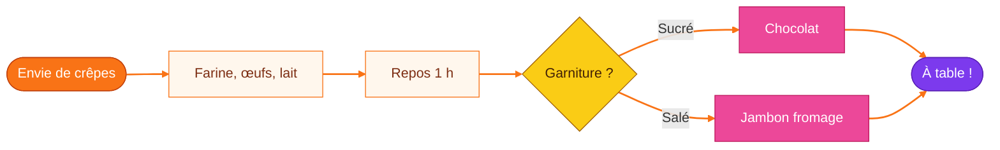

```mermaid
flowchart LR
  a([Envie de crêpes]) --> b[Farine, œufs, lait]
  b --> c[Repos 1 h]
  c --> d{Garniture ?}
  d -->|Sucré| e[Chocolat]
  d -->|Salé| f[Jambon fromage]
  e --> g([À table !])
  f --> g
  classDef go fill:#F97316,stroke:#C2410C,color:#FFFFFF
  classDef st fill:#FFF7ED,stroke:#F97316,color:#7C2D12
  classDef q fill:#FACC15,stroke:#A16207,color:#422006
  classDef t fill:#EC4899,stroke:#BE185D,color:#FFFFFF
  classDef en fill:#7C3AED,stroke:#5B21B6,color:#FFFFFF
  class a go
  class b,c st
  class d q
  class e,f t
  class g en
  linkStyle default stroke:#F97316,stroke-width:2px
```
