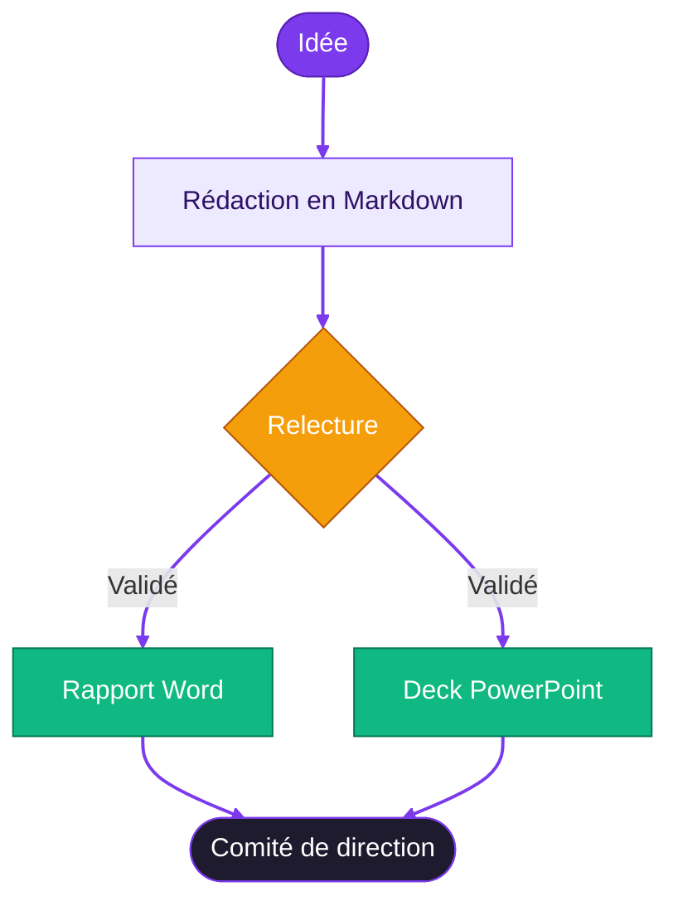

# Du brouillon au comité

```mermaid
flowchart TB
  idee([Idée]) --> md[Rédaction en Markdown]
  md --> revue{Relecture}
  revue -->|Validé| word[Rapport Word]
  revue -->|Validé| deck[Deck PowerPoint]
  word --> comite([Comité de direction])
  deck --> comite
  classDef start fill:#7C3AED,stroke:#5B21B6,color:#FFFFFF
  classDef step fill:#EDE9FE,stroke:#7C3AED,color:#2E1065
  classDef decision fill:#F59E0B,stroke:#B45309,color:#FFFFFF
  classDef out fill:#10B981,stroke:#047857,color:#FFFFFF
  classDef goal fill:#1E1B2E,stroke:#7C3AED,color:#FFFFFF
  class idee start
  class md step
  class revue decision
  class word,deck out
  class comite goal
  linkStyle default stroke:#7C3AED,stroke-width:2px
```
