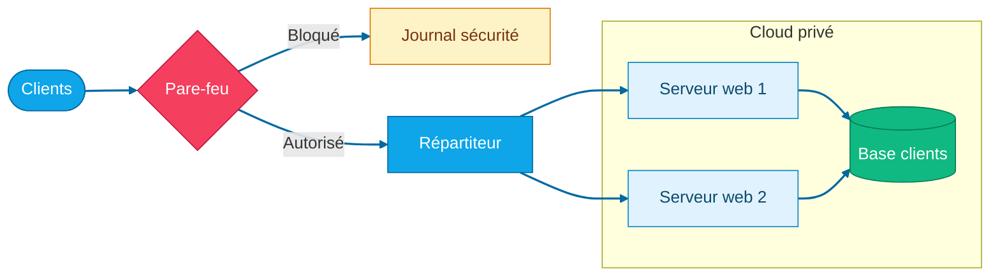

# Boutique en ligne

```mermaid
flowchart LR
  user([Clients]) --> fw{Pare-feu}
  fw -->|Bloqué| log[Journal sécurité]
  fw -->|Autorisé| lb[Répartiteur]
  subgraph cloud [Cloud privé]
    app1[Serveur web 1]
    app2[Serveur web 2]
    db[(Base clients)]
  end
  lb --> app1
  lb --> app2
  app1 --> db
  app2 --> db
  classDef edge fill:#0EA5E9,stroke:#0369A1,color:#FFFFFF
  classDef guard fill:#F43F5E,stroke:#BE123C,color:#FFFFFF
  classDef srv fill:#E0F2FE,stroke:#0284C7,color:#0C4A6E
  classDef data fill:#10B981,stroke:#047857,color:#FFFFFF
  classDef warn fill:#FEF3C7,stroke:#D97706,color:#78350F
  class user,lb edge
  class fw guard
  class app1,app2 srv
  class db data
  class log warn
  linkStyle default stroke:#0369A1,stroke-width:2px
```
