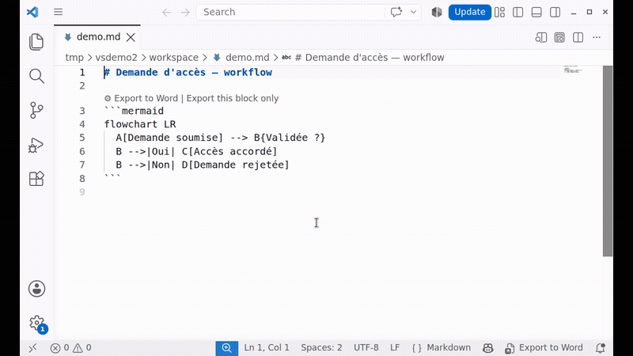
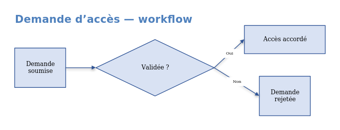

# md2nativedocx — Mermaid → Word, as real editable shapes

Exports the Mermaid diagrams in a Markdown document into a **complete** `.docx` (text, tables,
formatting, diagrams) — but unlike everything else on the market, the diagrams aren't flattened
into an image. They become real vector Word shapes (OOXML/DrawingML): every box and every arrow
stays individually selectable, movable, and editable once the file is open in Word.





*The second image is the generated `.docx` itself (rendered here for the screenshot; open
`docs/demo.docx` directly to see it, including moving a shape and watching its connectors follow).*

## The problem nobody else solves

Checked against the VS Code Marketplace (September 2026) — the most-installed Markdown-to-Word
extensions say so themselves, in their own documentation:

| Extension | Installs | Mermaid diagrams in the `.docx` |
|---|---|---|
| docu.md | 6,672 | High-resolution image |
| Doculate | 5,585 | Image |
| FusionSol Markdown Mermaid & DOCX | 892 | Image |
| CX Markdown to Word | 561 | PNG |
| Markdown Export Pro | 499 | SVG image |
| **md2nativedocx** | — | **Native Word shapes, individually editable** |

A sign the market already validated native editability as worth building: docu.md already turns
LaTeX formulas into editable Word equations — just never applied that idea to diagrams. That's
exactly the gap `md2nativedocx` fills.

## Usage

1. Open a `.md` file containing a ` ```mermaid ` block.
2. Click **⚙️ Export to Word** (whole document) or **Export this block only**
   (a single diagram), above the block — or the status bar item.
3. A notification offers to open the generated `.docx` or reveal it in the file explorer.

No configuration required before first use. The one optional setting,
`md2nativedocx.outputDirectory`, chooses where `.docx` files are written (default: the same
folder as the source).

A guided Getting Started walkthrough (Command Palette → *Get Started with md2nativedocx*) shows
the three steps in practice right after install.

## How it works

```
Markdown + ```mermaid  ──►  Pandoc (text, tables, style, .docx ZIP)
                              │
                              └─►  md2nativedocx Lua filter
                                      │
                                      └─►  parser → layout (Dagre) → OOXML translator
                                              │
                                              └─►  native Word shapes injected into the .docx
```

Everything that isn't a diagram (text, tables, lists, code, footnotes) is delegated to
[Pandoc](https://pandoc.org) — a proven, 20-year-old solution, not reinvented here. The diagram
itself is translated by a purpose-built engine: Mermaid parser → layout (Dagre, the same
principle as Mermaid's own official renderer) → OOXML/DrawingML generation, with magnetic
connectors (`stCxn`/`endCxn` — they follow the box when you move it in Word).

**100% local processing**: no network calls, no content sent to any third-party service —
Pandoc and the translation engine run entirely on your machine.

**Bonus already included, no code written for it**: your LaTeX formulas (`$E=mc^2$`,
`$$\int_0^1 x^2\,dx$$`) also become native, editable Word equations — Pandoc already does this on
its own. Same philosophy as the diagrams, one level above a flattened image.

## Prerequisites

[Pandoc](https://pandoc.org/installing.html) must be installed on the machine. An explicit error
message offers the install link if Pandoc can't be found — no silent crash.

## What this extension doesn't do (yet)

- No shape editing inside VS Code — editing happens in Word once the `.docx` is open.
- No Word-rendering preview before export (VS Code already shows a native Mermaid preview in its
  built-in Markdown panel since 1.121).
- No batch conversion (whole folder) — one file at a time for now.

Roadmap and full positioning details: see the
[monorepo README](https://github.com/nicolasbridelance/md2nativedocx#readme).

## License

CC0 1.0 — public domain.
