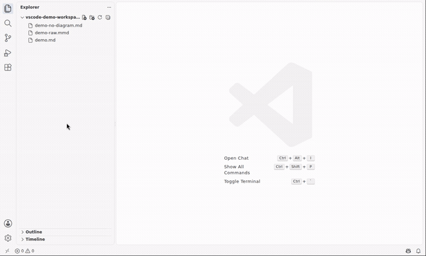
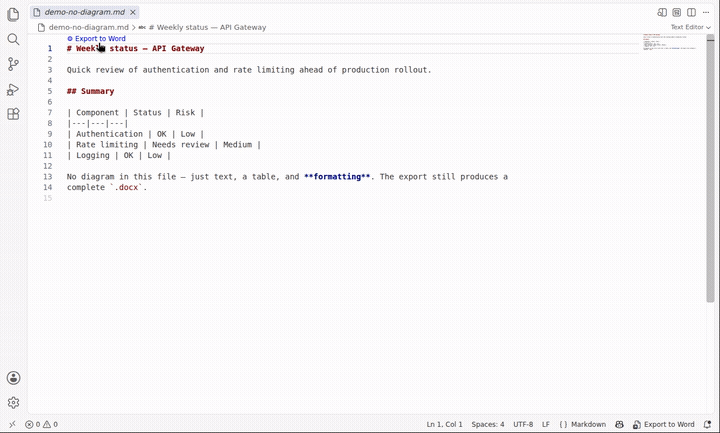
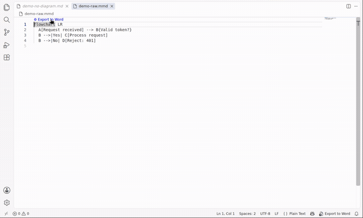

# md2nativedocx — Markdown → Word, done right

[](https://marketplace.visualstudio.com/items?itemName=md2nativedocx.md2nativedocx)
[](https://github.com/nicolasbridelance/md2nativedocx/blob/main/packages/vscode-extension/LICENSE)

Exports any Markdown document into a **complete** `.docx` — text, tables, formatting, footnotes,
LaTeX math — with one standout difference: if the document contains Mermaid diagrams, those don't
get flattened into an image like everywhere else. They become real vector Word shapes
(OOXML/DrawingML): every box and every arrow stays individually selectable, movable, and editable
once the file is open in Word.

> **Deploying this in a corporate environment?** License, third-party dependency audit, IT risk
> analysis, and a no-jargon guide for non-technical users each live in
> [`docs/compliance/`](https://github.com/nicolasbridelance/md2nativedocx/tree/main/docs/compliance)
> in the main repository.

## See it in action

There's more than one way to trigger the same export — pick whichever fits how you work. Each
clip below is short and loops.

**1. From an open file, one click**


Open a Markdown file that contains a Mermaid diagram. A small **⚙ Export to Word** link appears
right above the diagram — click it, and a few seconds later a notification appears with the
finished `.docx`, plus buttons to open it or reveal it in the file browser.

**2. Straight from the file list — no need to open anything first**



Don't want to open the file at all? Right-click it in the file list on the left (the same kind of
right-click menu you'd use in Windows Explorer or macOS Finder) and choose
**md2nativedocx: Export document to Word**. Same result, without ever looking at the file's
contents.

**3. Works even when there's no diagram in the file**



This extension isn't only for diagrams — any Markdown file (plain text, tables, **bold**/*italic*
formatting) exports to a complete `.docx` the same way. If the file has no Mermaid diagram, the
**Export to Word** link still shows up, just once at the very top of the file instead of above
each diagram.

**4. A Mermaid diagram by itself, with no surrounding document**



Sometimes all you have is the diagram itself — a `.mmd` file, with no title, no surrounding text.
It exports exactly the same way, producing a `.docx` with that one diagram as a native, editable
shape.

**The result, opened**


*Rendered here for the screenshot — open `docs/demo.docx` directly to try it yourself, including
moving a shape and watching its connectors follow.*

## Where it stands out

Full Markdown → `.docx` conversion (text, tables, formatting) is table stakes — several extensions
do it well. Where `md2nativedocx` differs is what happens to a Mermaid diagram along the way: most
tools flatten it into an image (PNG/SVG) dropped into the page. `md2nativedocx` instead turns it
into real vector Word shapes (OOXML/DrawingML) — every box and arrow stays individually selectable,
movable, and editable once the file is open in Word, the same as if you'd drawn it by hand with
Word's own shape tools.

We don't claim to be the most complete Markdown-to-Word converter out there — every tool in this
space makes its own tradeoffs. This one's bet is specifically on treating the diagram as a first-
class, editable citizen of the document rather than a picture of one.

Every export is also validated against **the exact schema Word itself enforces**, using
Microsoft's own Open XML SDK — not a guess, not a reimplementation. A `.docx` can be well-formed
XML and still be a file real Word refuses to open; this check catches that class of problem before
you do, and the result (a clean "0 errors", or exactly what and where otherwise) lands in the
export's own `.log` file.

## Usage

Works on any `.md` or `.qmd` (Quarto Markdown) file — with or without a Mermaid diagram, text/
tables/formatting export either way — and on a raw `.mmd` Mermaid file too.

1. Open a `.md`, `.qmd` or `.mmd` file, **or** just right-click one in the Explorer — no need to
   open it first.
2. Click **⚙️ Export to Word** (or **Export this block only** for a single diagram, above that
   block) — from the CodeLens, the status bar item, the right-click menu (Explorer, editor, or the
   editor tab itself), or the Command Palette.
3. A notification offers to open the generated `.docx` or reveal it in the file explorer.

No configuration required before first use. Optional settings: `md2nativedocx.outputDirectory`
chooses where `.docx` files are written (default: the same folder as the source);
`md2nativedocx.referenceDocument` points at a company Word template to match its fonts/colors/
styles; `md2nativedocx.smartArt.enabled` (default: off, experimental) turns an eligible diagram
into a native SmartArt graphic instead of the default OOXML canvas shapes;
`md2nativedocx.wordCompatibilityCheck.enabled` (default: on) validates every export against Word's
own schema and reports the result in its `.log` file.

A guided Getting Started walkthrough (Command Palette → *Get Started with md2nativedocx*) shows
the three steps in practice right after install.

## How it works

```
Markdown (text, tables, style, ```mermaid blocks, LaTeX math, ...)
   │
   └─►  Pandoc — builds the .docx (everything except diagrams)
           │
           └─►  md2nativedocx Lua filter — only for ```mermaid blocks
                   │
                   └─►  parser → layout (Dagre) → OOXML translator
                           │
                           └─►  native Word shapes injected into the .docx
```

Everything in the document (text, tables, lists, code, footnotes, LaTeX math) is delegated to
[Pandoc](https://pandoc.org) — a proven, 20-year-old solution, not reinvented here. Only Mermaid
diagrams get special handling, by a purpose-built engine: Mermaid parser → layout (Dagre, the same
principle as Mermaid's own official renderer) → OOXML/DrawingML generation, with magnetic
connectors (`stCxn`/`endCxn` — they follow the box when you move it in Word). A document with no
diagram at all still exports fully — the Lua filter simply has nothing to do.

**100% local processing**: no network calls, no content sent to any third-party service —
Pandoc and the translation engine run entirely on your machine.

**Bonus already included, no code written for it**: your LaTeX formulas (`$E=mc^2$`,
`$$\int_0^1 x^2\,dx$$`) also become native, editable Word equations — Pandoc already does this on
its own. Same philosophy as the diagrams, one level above a flattened image.

## Prerequisites

None — nothing to install first. The first time you export, if [Pandoc](https://pandoc.org) isn't
already on your machine, it's downloaded automatically (one-time, official unmodified binary,
checksum-verified) and cached for every export after that. Already have Pandoc installed? It's used
as-is and nothing is downloaded. If automatic setup ever fails (offline, unsupported platform), an
explicit error message with a manual install link is shown — no silent crash.

The Word compatibility check (see above) works the same way with the official Microsoft `.NET`
runtime: downloaded once if not already present, checksum-verified, cached — or used as-is if
you already have `.NET`. Turn off `md2nativedocx.wordCompatibilityCheck.enabled` to skip that
entirely and export exactly as before.

## Deploying in a corporate environment

This extension runs entirely without administrator rights — Pandoc and the `.NET` runtime are
downloaded into your user profile (VS Code's `globalStorage`), never into `Program Files`, so a
managed, no-admin-end-user workstation works out of the box. On a corporate network, three things
may still need IT help:

**Proxies.** Node's built-in downloader tries `fetch` first, then automatically falls back to
`curl`, which reads your OS-level proxy configuration (WinINet on Windows) and your system
certificate store — so a plain corporate proxy is handled with no configuration. If even `curl`
fails, the error message tells you the network likely needs a proxy and points you at the mirror
settings below.

**Firewall allowlists (fully locked-down networks).** If `github.com` and
`builds.dotnet.microsoft.com` aren't reachable at all, an IT administrator can point the
extension at internal mirrors via two pairs of settings in a managed `settings.json` (deployed by
GPO/Intune, so every machine is pre-configured):

```jsonc
{
  // Pandoc: point at an internal copy of a release archive + its SHA-256.
  "md2nativedocx.pandoc.downloadUrl": "https://artifactory.corp/nexus/pandoc-3.1.3-linux-amd64.tar.gz",
  "md2nativedocx.pandoc.sha256": "74bc434908e4d858b3edbfd6271d2e9e499477837e5df1d630df4e62f113803d",
  // .NET runtime: same idea, mirror + SHA-512.
  "md2nativedocx.dotnet.downloadUrl": "https://artifactory.corp/nexus/dotnet-runtime-10.0.4-linux-x64.tar.gz",
  "md2nativedocx.dotnet.sha512": "2e2730ca465838f3655c8d0576a2477531a9c764329d9e3c88c8c8b87b2708f981819e939def8bec204b90e98654b3a0f6e47b816f44ebab95b30c5028060d6c"
}
```

The `downloadUrl` and `sha256`/`sha512` fields of each pair must be set **together** (a half-set
override is ignored and the official source is used). The hash is still mandatory — these settings
only relocate *where* the archive is fetched from, they never turn off the integrity check.

**Security-policy blocking on the machine.** On a restriced workstation (AppLocker / Windows
Defender Application Control / strict SmartScreen), a downloaded binary may exist but be blocked
from running. The extension detects this case and shows a distinct message telling the user to
contact IT for an exception — rather than the generic "Pandoc could not be found" error — with a
"Copy technical details" action to paste into a support ticket.

## What this extension doesn't do (yet)

- No shape editing inside VS Code — editing happens in Word once the `.docx` is open.
- No Word-rendering preview before export (VS Code already shows a native Mermaid preview in its
  built-in Markdown panel since 1.121).
- No batch conversion (whole folder) — one file at a time for now.

Roadmap and full positioning details: see the
[monorepo README](https://github.com/nicolasbridelance/md2nativedocx#readme).

## License

CC0 1.0 — public domain. Pandoc, downloaded automatically on first export (see Prerequisites), is
GPL-2.0-or-later and not covered by this project's license — see
[`THIRD_PARTY_NOTICES.md`](THIRD_PARTY_NOTICES.md).
