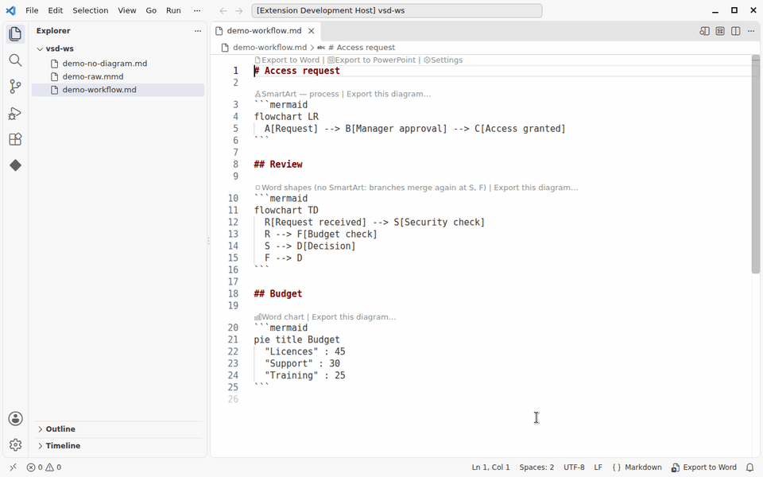
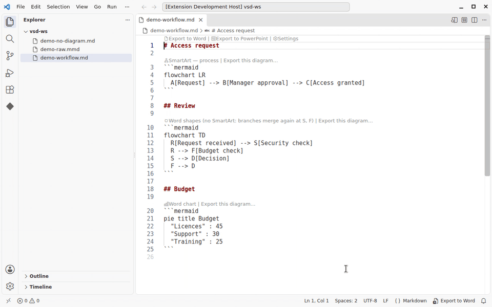
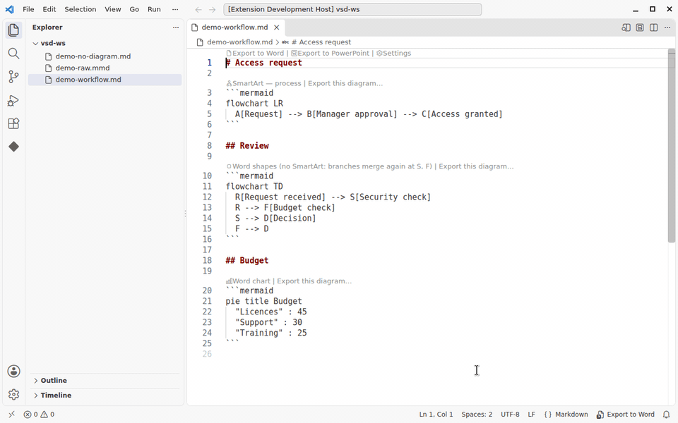
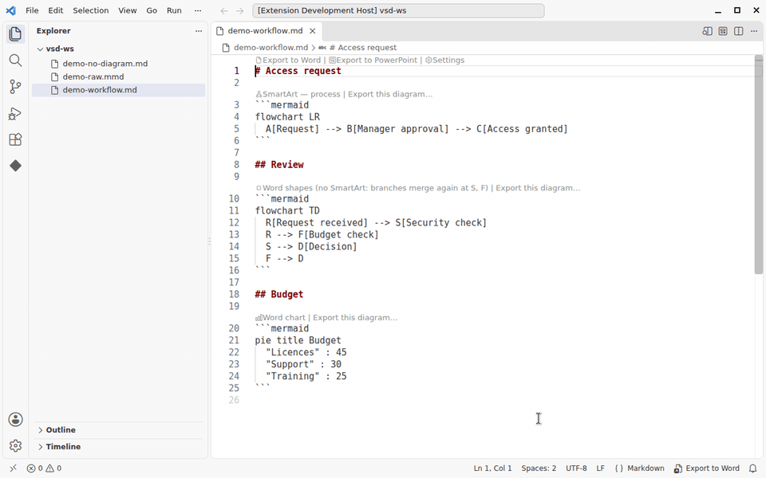
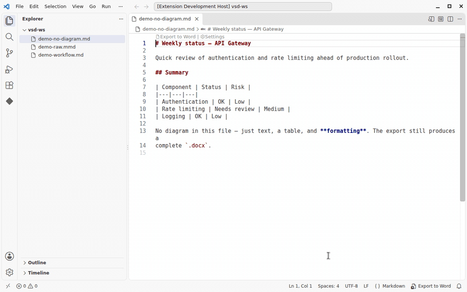
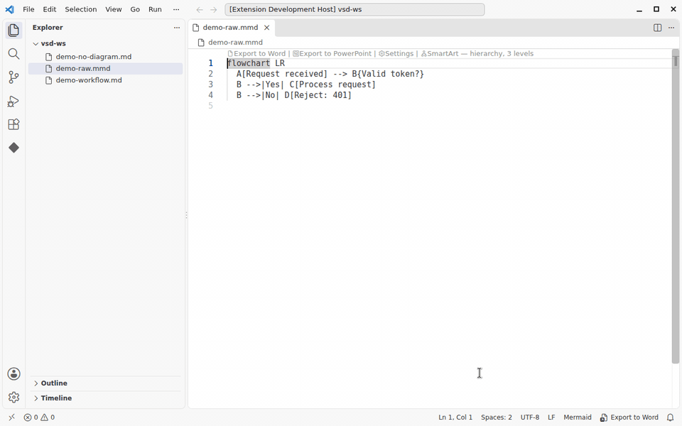
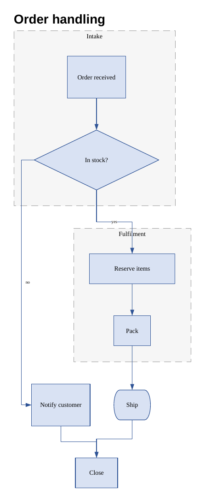
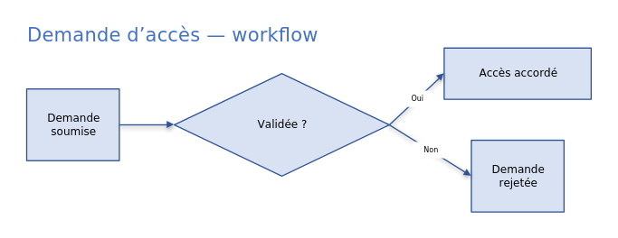

# md2nativedocx — complete Markdown to Word conversion, with diagrams your readers can edit

[](https://marketplace.visualstudio.com/items?itemName=md2nativedocx.md2nativedocx)
[](https://github.com/nicolasbridelance/md2nativedocx/blob/main/packages/vscode-extension/LICENSE)

**Write in Markdown. Hand over a Word document anyone can keep editing — diagrams included.**

One click exports your Markdown to a complete `.docx`: headings, tables, lists, footnotes, code, LaTeX math, a
table of contents, your page layout, fonts and company template, with or without diagrams. The difference is
what happens to the Mermaid diagrams. Elsewhere they become pictures, and fixing a typo in one box means
finding the source and re-exporting. Here they become **real Word objects** that the people you send the
document to can edit in Word, without Markdown, Mermaid or you:

- **Fix a diagram like any Word drawing:** retype a label, drag a box; the arrows stay attached.
- **Match the company look:** recolour any shape; flowcharts and SmartArt follow the theme colours, and SmartArt restyles from Word's SmartArt Design tab.
- **Update a chart's figures:** pie, bar/line and radar charts become native Word charts with *Edit Data*.
- **Grow an org chart or a process:** processes, cycles, org charts, mindmaps, timelines and kanban boards become
  SmartArt; add a step in one click.
- **Send it with confidence:** every export is checked against Word's own file-format rules.

All 29 Mermaid diagram types are supported. (`md2nativedocx` = **M**ark**d**own **to native docx**: *native*
means Word's own editable objects, not pictures.)


*Mermaid source → one click → native shapes (rendered here with LibreOffice; every shape is editable in Word).*

> **Deploying this in a corporate environment?** License, third-party dependency audit, IT risk
> analysis, and a no-jargon guide for non-technical users each live in
> [`docs/compliance/`](https://github.com/nicolasbridelance/md2nativedocx/tree/main/docs/compliance)
> in the main repository.

## See it in action

Each clip below is short and loops. They are recorded in a real VS Code window by
`scripts/record-demos.py`, so they always show the current version.

**1. Know what each diagram becomes, then export**



At the top of the file: **Export to Word**, **Export to PowerPoint** and **Settings**. Above each diagram,
one line says what it will be in Word — a **SmartArt** graphic, a **Word chart**, or **editable Word
shapes**, and why not SmartArt when it can't be. A few seconds after the click, a notification offers to
open the file or reveal it in the file browser.

**2. Hover a diagram for the details**



Hover the ```` ```mermaid ```` line: what the diagram becomes, what you will be able to do with it in Word,
what is not kept, and a link to turn on a setting when one would change the result.

**3. PowerPoint: one slide per diagram**



**Export to PowerPoint** makes a deck with one slide per diagram, titled with the heading above it, every
shape editable. Text outside the diagrams is not exported.

**4. Just one diagram**



**Export this diagram…** exports that diagram alone, into its own Word document or a one-slide deck —
handy to paste it into an existing document or presentation.

**5. Straight from the file list**


No need to open the file: right-click it in the file list, **md2nativedocx → Export to Word** (or
**Export to PowerPoint**). Select several files first to export them all at once. In the editor,
right-click inside a diagram to export just that diagram.

**6. With no diagram at all, or a diagram on its own**



Any Markdown file (text, tables, **bold**/*italic*) exports to a complete `.docx` the same way, diagram
or not.



A bare `.mmd` file (only the diagram, no surrounding text) works too.

**7. LibreOffice: flowcharts as native shapes**



**md2nativedocx → Export to LibreOffice (.odt)** (right-click, or the command palette) writes an
OpenDocument text: headings, tables and the rest as for Word, and each flowchart as one group of
LibreOffice shapes whose connectors stay attached when you move a box (*F3* enters the group). Other
diagram types are not drawn in `.odt` yet: a note says so in their place. Page and typography settings,
SmartArt and charts apply to Word only.

**The result, opened**



*Rendered here for the screenshot — open `docs/demo.docx` directly to try it yourself, including
moving a shape and watching its connectors follow.*

## Where it stands out

Full Markdown → `.docx` conversion (text, tables, formatting) is table stakes — several extensions
do it well. Where `md2nativedocx` differs is what happens to a Mermaid diagram along the way: most
tools flatten it into an image (PNG/SVG) dropped into the page. `md2nativedocx` instead turns it
into real vector Word shapes (OOXML/DrawingML) — every box and arrow stays individually selectable,
movable, and editable once the file is open in Word, the same as if you'd drawn it by hand with
Word's own shape tools.

We don't claim to be the most complete Markdown-to-Word converter out there — every tool in this
space makes its own tradeoffs. This one's bet is specifically on treating the diagram as a first-
class, editable citizen of the document rather than a picture of one.

Every export is also validated against **the exact schema Word itself enforces**, using
Microsoft's own Open XML SDK — not a guess, not a reimplementation. A `.docx` can be well-formed
XML and still be a file real Word refuses to open; this check catches that class of problem before
you do, and the result (a clean "0 errors", or exactly what and where otherwise) lands in the
export's own `.log` file.

## All 29 Mermaid diagram types


*Same Mermaid source, two outputs: **left = rendered by Mermaid.js**, **right = md2nativedocx** (native, editable Word shapes,
rendered here with LibreOffice).*

## SmartArt for processes, cycles, org charts, mindmaps, timelines and boards


*A chain, cycle or tree-shaped flowchart, a mindmap, a timeline or a kanban board becomes a real
SmartArt graphic (each node keeps its Mermaid shape): add a step or a branch from Word's Text Pane, switch layout or restyle from the SmartArt Design tab.
`md2nativedocx.smartArt.style` picks the starting look; `md2nativedocx.smartArt.enabled` turns it off.*

## Frequently asked

**How do I convert a Mermaid diagram to an editable Word diagram?** Open the `.md` (or `.mmd`) file, click
**Export to Word** above the diagram. The result is native Word shapes, not a PNG.

**Which Mermaid diagrams are supported?** All 29 types: flowchart, sequence, class, state, ER, Gantt, pie, mindmap,
timeline, journey, git graph, C4, and more.

**Do I need Pandoc, Word or Mermaid CLI?** No Word and no Mermaid CLI. Pandoc is downloaded automatically on first
export if missing (see *Prerequisites*).

## Usage

Works on any `.md` or `.qmd` (Quarto Markdown) file — with or without a Mermaid diagram, text/
tables/formatting export either way — and on a raw `.mmd` Mermaid file too.

1. Open a `.md`, `.qmd` or `.mmd` file, **or** just right-click one in the Explorer — no need to
   open it first.
2. Click **Export to Word** or **Export to PowerPoint** (or **Export this diagram…** above a single
   diagram) — from the links in the file, the status bar item, the right-click **md2nativedocx**
   menu (Explorer, editor, or the editor tab itself), or the Command Palette.
3. A notification offers to open the generated file or reveal it in the file explorer.

No configuration required before first use. Optional settings: `md2nativedocx.outputDirectory`
chooses where `.docx` files are written (default: the same folder as the source);
`md2nativedocx.referenceDocument` points at a company Word template to match its fonts/colors/
styles; `md2nativedocx.smartArt.enabled` (default: on) turns an eligible diagram into a native
SmartArt graphic instead of OOXML canvas shapes;
`md2nativedocx.wordCompatibilityCheck.enabled` (default: on) validates every export against Word's
own schema and reports the result in its `.log` file.

A guided Getting Started walkthrough (Command Palette → *Get Started with md2nativedocx*) shows
the three steps in practice right after install.

## How it works

```
Markdown (text, tables, style, ```mermaid blocks, LaTeX math, ...)
   │
   └─►  Pandoc — builds the .docx (everything except diagrams)
           │
           └─►  md2nativedocx Lua filter — only for ```mermaid blocks
                   │
                   └─►  parser → layout (Dagre) → OOXML translator
                           │
                           └─►  native Word shapes injected into the .docx
```

Everything in the document (text, tables, lists, code, footnotes, LaTeX math) is delegated to
[Pandoc](https://pandoc.org) — a proven, 20-year-old solution, not reinvented here. Only Mermaid
diagrams get special handling, by a purpose-built engine: Mermaid parser → layout (Dagre, the same
principle as Mermaid's own official renderer) → OOXML/DrawingML generation, with magnetic
connectors (`stCxn`/`endCxn` — they follow the box when you move it in Word). A document with no
diagram at all still exports fully — the Lua filter simply has nothing to do.

**100% local processing**: no network calls, no content sent to any third-party service —
Pandoc and the translation engine run entirely on your machine.

**Bonus already included, no code written for it**: your LaTeX formulas (`$E=mc^2$`,
`$$\int_0^1 x^2\,dx$$`) also become native, editable Word equations — Pandoc already does this on
its own. Same philosophy as the diagrams, one level above a flattened image.

## Prerequisites

None — nothing to install first. The first time you export, if [Pandoc](https://pandoc.org) isn't
already on your machine, it's downloaded automatically (one-time, official unmodified binary,
checksum-verified) and cached for every export after that. Already have Pandoc installed? It's used
as-is and nothing is downloaded. If automatic setup ever fails (offline, unsupported platform), an
explicit error message with a manual install link is shown — no silent crash.

The Word compatibility check (see above) works the same way with the official Microsoft `.NET`
runtime: downloaded once if not already present, checksum-verified, cached — or used as-is if
you already have `.NET`. Turn off `md2nativedocx.wordCompatibilityCheck.enabled` to skip that
entirely and export exactly as before.

## Deploying in a corporate environment

This extension runs entirely without administrator rights — Pandoc and the `.NET` runtime are
downloaded into your user profile (VS Code's `globalStorage`), never into `Program Files`, so a
managed, no-admin-end-user workstation works out of the box. On a corporate network, three things
may still need IT help:

**Proxies.** Node's built-in downloader tries `fetch` first, then automatically falls back to
`curl`, which reads your OS-level proxy configuration (WinINet on Windows) and your system
certificate store — so a plain corporate proxy is handled with no configuration. If even `curl`
fails, the error message tells you the network likely needs a proxy and points you at the mirror
settings below.

**Firewall allowlists (fully locked-down networks).** If `github.com` and
`builds.dotnet.microsoft.com` aren't reachable at all, an IT administrator can point the
extension at internal mirrors via two pairs of settings in a managed `settings.json` (deployed by
GPO/Intune, so every machine is pre-configured):

```jsonc
{
  // Pandoc: point at an internal copy of a release archive + its SHA-256.
  "md2nativedocx.pandoc.downloadUrl": "https://artifactory.corp/nexus/pandoc-3.1.3-linux-amd64.tar.gz",
  "md2nativedocx.pandoc.sha256": "74bc434908e4d858b3edbfd6271d2e9e499477837e5df1d630df4e62f113803d",
  // .NET runtime: same idea, mirror + SHA-512.
  "md2nativedocx.dotnet.downloadUrl": "https://artifactory.corp/nexus/dotnet-runtime-10.0.4-linux-x64.tar.gz",
  "md2nativedocx.dotnet.sha512": "2e2730ca465838f3655c8d0576a2477531a9c764329d9e3c88c8c8b87b2708f981819e939def8bec204b90e98654b3a0f6e47b816f44ebab95b30c5028060d6c"
}
```

The `downloadUrl` and `sha256`/`sha512` fields of each pair must be set **together** (a half-set
override is ignored and the official source is used). The hash is still mandatory — these settings
only relocate *where* the archive is fetched from, they never turn off the integrity check.

**Security-policy blocking on the machine.** On a restriced workstation (AppLocker / Windows
Defender Application Control / strict SmartScreen), a downloaded binary may exist but be blocked
from running. The extension detects this case and shows a distinct message telling the user to
contact IT for an exception — rather than the generic "Pandoc could not be found" error — with a
"Copy technical details" action to paste into a support ticket.

## What this extension doesn't do (yet)

- No shape editing inside VS Code — editing happens in Word once the `.docx` is open.
- No Word-rendering preview before export (VS Code already shows a native Mermaid preview in its
  built-in Markdown panel since 1.121).
- No batch conversion (whole folder) — one file at a time for now.
- In `.odt` (LibreOffice), only flowcharts are drawn so far; the 28 other types become a note.

Roadmap and full positioning details: see the
[monorepo README](https://github.com/nicolasbridelance/md2nativedocx#readme).

## License

CC0 1.0 — public domain. Pandoc, downloaded automatically on first export (see Prerequisites), is
GPL-2.0-or-later and not covered by this project's license — see
[`THIRD_PARTY_NOTICES.md`](THIRD_PARTY_NOTICES.md).
