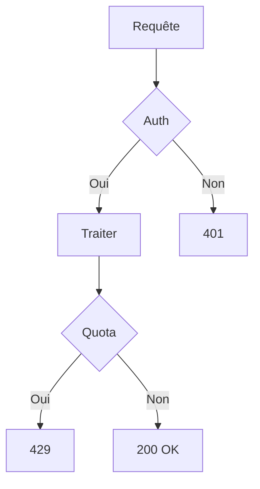

# Rapport de sécurité — API Gateway

Revue rapide de l'**authentification** et du *rate limiting* avant mise en production.

## Synthèse

| Composant | Statut | Risque |
|---|---|---|
| Authentification | OK | Faible |
| Rate limiting | À revoir | Moyen |
| Journalisation | OK | Faible |

## Budget de latence

Latence p95 attendue sous charge nominale :

$$L_{p95} = \mu + 1.645\sigma$$

## Flux de la requête



## Extrait de code

```python
def is_valid(token: str) -> bool:
    # Un jeton invalide ou expiré est rejeté avant tout traitement.
    return verify_signature(token) and not is_expired(token)
```
