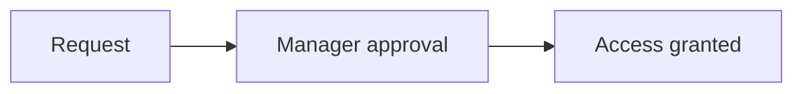
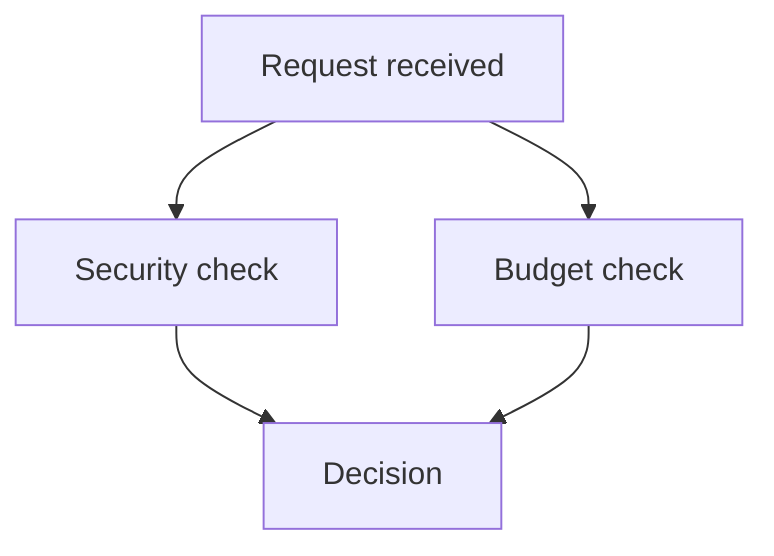
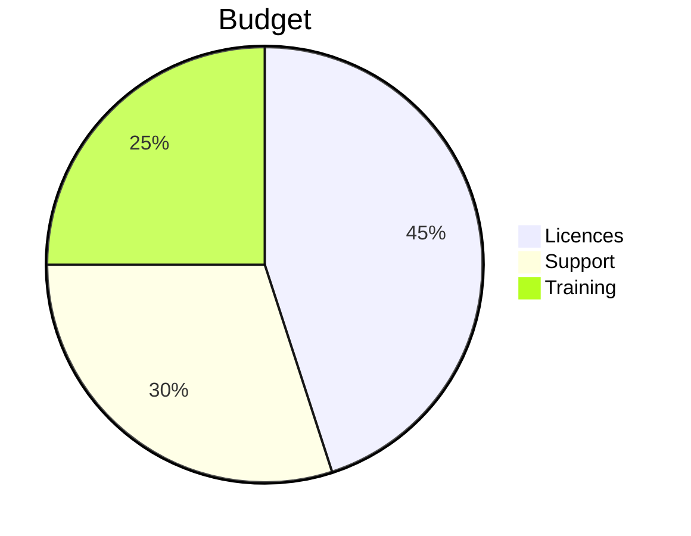

# Access request

```mermaid
flowchart LR
  A[Request] --> B[Manager approval] --> C[Access granted]
```

## Review

```mermaid
flowchart TD
  R[Request received] --> S[Security check]
  R --> F[Budget check]
  S --> D[Decision]
  F --> D
```

## Budget

```mermaid
pie title Budget
  "Licences" : 45
  "Support" : 30
  "Training" : 25
```
