# Revue technique — moteur de rendu flowchart

Second cas du même chantier (voir aussi `large-report.md`) : un diagramme **officiel** de la
documentation interne de Mermaid (`mermaid-official-code-flow.mmd`, ~115 nœuds, formes variées,
labels multi-lignes `<br/>`) combiné à un texte riche, plutôt qu'un diagramme de performance
synthétique.

## Pourquoi ce document

* Le premier cas (`large-report.md`) exerce la **taille brute**.
* Celui-ci exerce la **variété des formes et des labels** dans un contexte de document réel — le
  diagramme officiel documente l'architecture interne du parseur/renderer flowchart de Mermaid
  lui-même, avec des formes variées et des labels multi-lignes plutôt qu'un flux linéaire simple.

## Constats

- Les labels multi-lignes (`<br>`) doivent rester lisibles dans leur forme, pas tronqués.
- Un lien vers la [documentation Mermaid officielle](https://mermaid.js.org) est inclus pour
  vérifier qu'un lien hypertexte survit dans un document par ailleurs dense.
- Une limite déjà connue et volontairement re-testée ici à plus grande échelle : le HTML brut
  glissé dans le texte (pas dans un label de nœud) est <strong>silencieusement supprimé</strong>
  par l'écrivain docx de Pandoc — comportement documenté dans
  `test-corpus/corpus/README.md`, pas une régression si l'assertion correspondante échoue ici.

### Définitions utiles

Parseur
: Transforme le texte Mermaid en un modèle de graphe interne (nœuds, arêtes, sous-graphes).

Renderer
: Calcule la position finale de chaque forme à partir du modèle de graphe.

## Diagramme officiel

```mermaid
flowchart TD
    %% Entry Points and Detection
    Input["User Input Text"] --> Detection{Detection Phase}
    
    Detection --> flowDetector["flowDetector.ts<br/>detector(txt, config)"]
    Detection --> flowDetectorV2["flowDetector-v2.ts<br/>detector(txt, config)"]
    Detection --> elkDetector["elk/detector.ts<br/>detector(txt, config)"]
    
    flowDetector --> |"Checks /^\s*graph/"| DetectLegacy{Legacy Flowchart?}
    flowDetectorV2 --> |"Checks /^\s*flowchart/"| DetectNew{New Flowchart?}
    elkDetector --> |"Checks /^\s*flowchart-elk/"| DetectElk{ELK Layout?}
    
    DetectLegacy --> |Yes| LoadDiagram
    DetectNew --> |Yes| LoadDiagram
    DetectElk --> |Yes| LoadDiagram
    
    %% Loading Phase
    LoadDiagram["loader() function"] --> flowDiagram["flowDiagram.ts<br/>diagram object"]
    
    flowDiagram --> DiagramStructure{Diagram Components}
    DiagramStructure --> Parser["parser: flowParser"]
    DiagramStructure --> Database["db: new FlowDB()"]
    DiagramStructure --> Renderer["renderer: flowRenderer-v3-unified"]
    DiagramStructure --> Styles["styles: flowStyles"]
    DiagramStructure --> Init["init: (cnf: MermaidConfig)"]
    
    %% Parser Phase
    Parser --> flowParser["parser/flowParser.ts<br/>newParser.parse(src)"]
    flowParser --> |"Preprocesses src"| RemoveWhitespace["Remove trailing whitespace<br/>src.replace(/}\s*\n/g, '}\n')"]
    RemoveWhitespace --> flowJison["parser/flow.jison<br/>flowJisonParser.parse(newSrc)"]
    
    flowJison --> ParseGraph["Parse Graph Structure"]
    ParseGraph --> ParseVertices["Parse Vertices"]
    ParseGraph --> ParseEdges["Parse Edges"]
    ParseGraph --> ParseSubgraphs["Parse Subgraphs"]
    ParseGraph --> ParseClasses["Parse Classes"]
    ParseGraph --> ParseStyles["Parse Styles"]
    
    %% Database Phase - FlowDB Class
    Database --> FlowDBClass["flowDb.ts<br/>FlowDB class"]
    
    FlowDBClass --> DBInit["constructor()<br/>- Initialize counters<br/>- Bind methods<br/>- Setup toolTips<br/>- Call clear()"]
    
    DBInit --> DBMethods{FlowDB Methods}
    
    DBMethods --> addVertex["addVertex(id, textObj, type, style,<br/>classes, dir, props, metadata)"]
    DBMethods --> addLink["addLink(_start[], _end[], linkData)"]
    DBMethods --> addSingleLink["addSingleLink(_start, _end, type, id)"]
    DBMethods --> setDirection["setDirection(dir)"]
    DBMethods --> addSubGraph["addSubGraph(nodes[], id, title)"]
    DBMethods --> addClass["addClass(id, style)"]
    DBMethods --> setClass["setClass(ids, className)"]
    DBMethods --> setTooltip["setTooltip(ids, tooltip)"]
    DBMethods --> setClickEvent["setClickEvent(id, functionName, args)"]
    DBMethods --> setClickFun["setClickFun(id, functionName, args)"]
    
    %% Vertex Processing
    addVertex --> VertexProcess{Vertex Processing}
    VertexProcess --> CreateVertex["Create FlowVertex object<br/>- id, labelType, domId<br/>- styles[], classes[]"]
    VertexProcess --> SanitizeText["sanitizeText(textObj.text)"]
    VertexProcess --> ParseMetadata["Parse YAML metadata<br/>yaml.load(yamlData)"]
    VertexProcess --> SetVertexProps["Set vertex properties<br/>- shape, label, icon, form<br/>- pos, img, constraint, w, h"]
    
    %% Edge Processing  
    addSingleLink --> EdgeProcess{Edge Processing}
    EdgeProcess --> CreateEdge["Create FlowEdge object<br/>- start, end, type, text<br/>- labelType, classes[]"]
    EdgeProcess --> ProcessLinkText["Process link text<br/>- sanitizeText()<br/>- strip quotes"]
    EdgeProcess --> SetEdgeProps["Set edge properties<br/>- type, stroke, length"]
    EdgeProcess --> GenerateEdgeId["Generate edge ID<br/>getEdgeId(start, end, counter)"]
    EdgeProcess --> ValidateEdgeLimit["Validate edge limit<br/>maxEdges check"]
    
    %% Data Collection
    DBMethods --> GetData["getData()"]
    GetData --> CollectNodes["Collect nodes[] from vertices"]
    GetData --> CollectEdges["Collect edges[] from edges"]
    GetData --> ProcessSubGraphs["Process subgraphs<br/>- parentDB Map<br/>- subGraphDB Map"]
    GetData --> AddNodeFromVertex["addNodeFromVertex()<br/>for each vertex"]
    GetData --> ProcessEdgeTypes["destructEdgeType()<br/>arrowTypeStart, arrowTypeEnd"]
    
    %% Node Creation
    AddNodeFromVertex --> NodeCreation{Node Creation}
    NodeCreation --> FindExistingNode["findNode(nodes, vertex.id)"]
    NodeCreation --> CreateBaseNode["Create base node<br/>- id, label, parentId<br/>- cssStyles, cssClasses<br/>- shape, domId, tooltip"]
    NodeCreation --> GetCompiledStyles["getCompiledStyles(classDefs)"]
    NodeCreation --> GetTypeFromVertex["getTypeFromVertex(vertex)"]
    
    %% Rendering Phase
    Renderer --> flowRendererV3["flowRenderer-v3-unified.ts<br/>draw(text, id, version, diag)"]
    
    flowRendererV3 --> RenderInit["Initialize rendering<br/>- getConfig()<br/>- handle securityLevel<br/>- getDiagramElement()"]
    
    RenderInit --> GetLayoutData["diag.db.getData()<br/>as LayoutData"]
    GetLayoutData --> SetupLayoutData["Setup layout data<br/>- type, layoutAlgorithm<br/>- direction, spacing<br/>- markers, diagramId"]
    
    SetupLayoutData --> CallRender["render(data4Layout, svg)"]
    CallRender --> SetupViewPort["setupViewPortForSVG(svg, padding)"]
    SetupViewPort --> ProcessLinks["Process vertex links<br/>- create anchor elements<br/>- handle click events"]
    
    %% Shape Rendering
    CallRender --> ShapeSystem["flowChartShapes.js<br/>Shape Functions"]
    
    ShapeSystem --> ShapeFunctions{Shape Functions}
    ShapeFunctions --> question["question(parent, bbox, node)"]
    ShapeFunctions --> hexagon["hexagon(parent, bbox, node)"]
    ShapeFunctions --> rect_left_inv_arrow["rect_left_inv_arrow(parent, bbox, node)"]
    ShapeFunctions --> lean_right["lean_right(parent, bbox, node)"]
    ShapeFunctions --> lean_left["lean_left(parent, bbox, node)"]
    
    ShapeFunctions --> insertPolygonShape["insertPolygonShape(parent, w, h, points)"]
    ShapeFunctions --> intersectPolygon["intersectPolygon(node, points, point)"]
    ShapeFunctions --> intersectRect["intersectRect(node, point)"]
    
    %% Styling System
    Styles --> stylesTS["styles.ts<br/>getStyles(options)"]
    stylesTS --> StyleOptions["FlowChartStyleOptions<br/>- arrowheadColor, border2<br/>- clusterBkg, mainBkg<br/>- fontFamily, textColor"]
    
    StyleOptions --> GenerateCSS["Generate CSS styles<br/>- .label, .cluster-label<br/>- .node, .edgePath<br/>- .flowchart-link, .edgeLabel"]
    GenerateCSS --> GetIconStyles["getIconStyles()"]
    
    %% Type System
    Parser --> TypeSystem["types.ts<br/>Type Definitions"]
    TypeSystem --> FlowVertex["FlowVertex interface"]
    TypeSystem --> FlowEdge["FlowEdge interface"]
    TypeSystem --> FlowClass["FlowClass interface"]
    TypeSystem --> FlowSubGraph["FlowSubGraph interface"]
    TypeSystem --> FlowVertexTypeParam["FlowVertexTypeParam<br/>Shape types"]
    
    %% Utility Functions
    DBMethods --> UtilityFunctions{Utility Functions}
    UtilityFunctions --> lookUpDomId["lookUpDomId(id)"]
    UtilityFunctions --> getClasses["getClasses()"]
    UtilityFunctions --> getDirection["getDirection()"]
    UtilityFunctions --> getVertices["getVertices()"]
    UtilityFunctions --> getEdges["getEdges()"]
    UtilityFunctions --> getSubGraphs["getSubGraphs()"]
    UtilityFunctions --> clear["clear()"]
    UtilityFunctions --> defaultConfig["defaultConfig()"]
    
    %% Event Handling
    ProcessLinks --> EventHandling{Event Handling}
    EventHandling --> setupToolTips["setupToolTips(element)"]
    EventHandling --> bindFunctions["bindFunctions(element)"]
    EventHandling --> runFunc["utils.runFunc(functionName, args)"]
    
    %% Common Database Functions
    DBMethods --> CommonDB["commonDb.js functions"]
    CommonDB --> setAccTitle["setAccTitle()"]
    CommonDB --> getAccTitle["getAccTitle()"]
    CommonDB --> setAccDescription["setAccDescription()"]
    CommonDB --> getAccDescription["getAccDescription()"]
    CommonDB --> setDiagramTitle["setDiagramTitle()"]
    CommonDB --> getDiagramTitle["getDiagramTitle()"]
    CommonDB --> commonClear["clear()"]
    
    %% Final Output
    ProcessLinks --> FinalSVG["Final SVG Output"]
    
    %% Layout Algorithm Selection
    SetupLayoutData --> LayoutAlgorithm{Layout Algorithm}
    LayoutAlgorithm --> Dagre["dagre<br/>(default)"]
    LayoutAlgorithm --> DagreWrapper["dagre-wrapper<br/>(v2 renderer)"]
    LayoutAlgorithm --> ELK["elk<br/>(external package)"]
    
    %% Testing Components
    FlowDBClass --> TestFiles["Test Files"]
    TestFiles --> flowDbSpec["flowDb.spec.ts"]
    TestFiles --> flowChartShapesSpec["flowChartShapes.spec.js"]
    TestFiles --> ParserTests["parser/*.spec.js files<br/>- flow-text.spec.js<br/>- flow-edges.spec.js<br/>- flow-style.spec.js<br/>- subgraph.spec.js"]
    
    %% Configuration
    Init --> ConfigSetup["Configuration Setup"]
    ConfigSetup --> FlowchartConfig["cnf.flowchart config"]
    ConfigSetup --> ArrowMarkers["arrowMarkerAbsolute"]
    ConfigSetup --> LayoutConfig["layout config"]
    ConfigSetup --> SetConfig["setConfig() calls"]
```



## Vérification de non-régression

```typescript
// Vérifie qu'aucun label multi-ligne n'est tronqué après mise à l'échelle.
function assertNoTruncatedLabel(nodes: LayoutNode[]): void {
  for (const node of nodes) {
    if (node.label.includes('<br') && node.height < MIN_HEIGHT_FOR_MULTILINE) {
      throw new Error(`Label multi-ligne potentiellement tronqué: ${node.id}`);
    }
  }
}
```

## À faire

1. Ouvrir `medium-report.docx` dans un vrai Word.
2. Vérifier qu'aucun label multi-ligne n'est visuellement tronqué.
3. Confirmer que le paragraphe HTML brut ci-dessus est bien absent du rendu (limite connue), pas
   silencieusement transformé en autre chose.
