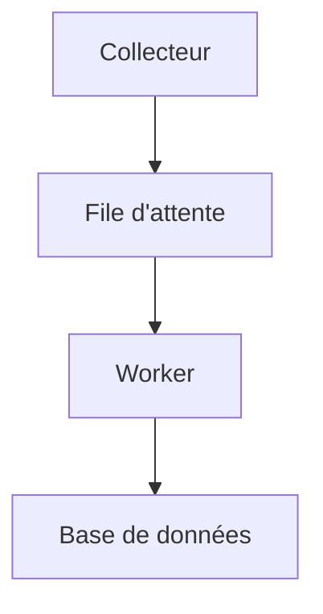
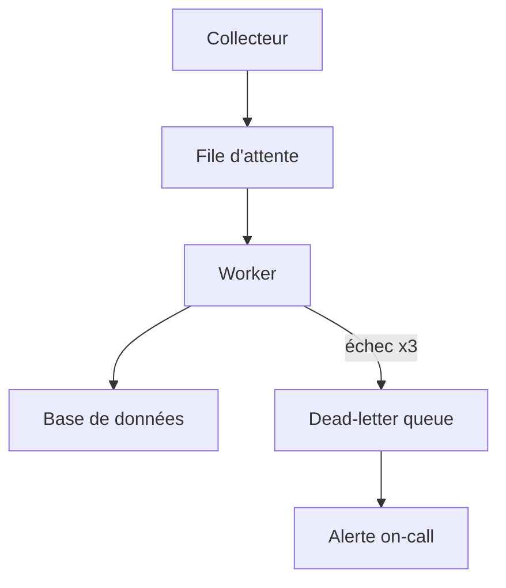

# Revue de conception — pipeline d'ingestion

Ce document exerce la promesse produit complète (cahier des charges §1) : pas seulement la
traduction d'un diagramme, mais un rapport **Markdown réel** — titres, listes, tableau, citation,
code, lien, note de bas de page — avec des diagrammes Mermaid insérés au milieu du texte, comme le
ferait l'ingénieur "docs-as-code" (persona primaire, §3).

## Contexte

Le pipeline actuel repose sur trois composants : un collecteur, une file d'attente et un
worker. Le schéma ci-dessous montre le flux *nominal*[^1].



## Constat

Les points suivants ont été relevés lors de l'audit :

1. Le collecteur ne applique **aucun** backpressure.
2. La file d'attente n'a pas de politique de purge.
3. Le worker retente indéfiniment en cas d'échec (`retry: -1` dans `worker.yaml`).

> Le troisième point est le plus critique : un message empoisonné bloque tout le pipeline sans
> jamais être mis de côté.

### Comparatif des options

| Option | Complexité | Risque de régression |
|---|---|---|
| Dead-letter queue | Faible | Faible |
| Backpressure au collecteur | Moyenne | Moyenne |
| Réécriture complète | Élevée | Élevée |

## Architecture cible

La cible ajoute une file de lettres mortes (*dead-letter queue*) et un circuit breaker autour du
worker :



## Correctif proposé

Le patch minimal pour le point 3 (`worker.yaml`) :

```python
def process(message, attempts=0):
    if attempts >= MAX_RETRIES:
        # ne plus retenter indéfiniment
        return dead_letter_queue.push(message)
    return worker.handle(message)
```

## Prochaines étapes

- [ ] Implémenter la dead-letter queue
- [ ] Ajouter un circuit breaker (voir la [doc interne](https://example.internal/runbooks/circuit-breaker))
- [ ] Documenter le runbook

---

[^1]: Le flux d'erreur est traité dans la section suivante.
