# Vérification initiale — Markdown standard

Cette partie vérifie le rendu de tout ce qui n'est pas un diagramme. Pour chaque section, comparer à ce qui
est décrit dans le texte.

## 1. Texte et emphase

Paragraphe avec **gras**, *italique*, ***gras italique***, ~~barré~~, `code en ligne`, H~2~O (indice),
x^2^ (exposant) et un [lien hypertexte](https://example.com) cliquable. Caractères spéciaux : & < > " ' é à ç ñ œ — « guillemets » … €.

Deuxième paragraphe, avec une ligne coupée\
par un saut de ligne forcé.

> Citation en bloc.
>
> > Citation imbriquée, doit être plus décalée.

---

La ligne ci-dessus est une règle horizontale.

### Titres de niveaux 3, 4, 5

#### Niveau 4

##### Niveau 5

## 2. Listes

- Puce niveau 1
  - Puce niveau 2
    - Puce niveau 3
- Autre puce

1. Premier
2. Deuxième
   1. Sous-élément a
   2. Sous-élément b
3. Troisième

- [x] Tâche faite
- [ ] Tâche à faire

Terme
:   Définition du terme (liste de définitions).

## 3. Tableaux

| Alignement gauche | Centré | Droite |
|:------------------|:------:|-------:|
| a                 |   b    |      1 |
| texte plus long   |   **c** |   22,5 |
| `code`            |   ✅   |    333 |

Tableau large (8 colonnes), pour tester le passage en paysage si l'option est active :

| C1 | C2 | C3 | C4 | C5 | C6 | C7 | C8 |
|---|---|---|---|---|---|---|---|
| 1 | 2 | 3 | 4 | 5 | 6 | 7 | 8 |
| a | b | c | d | e | f | g | h |

## 4. Équations

Équation en ligne : $E = mc^2$ et $\alpha + \beta = \gamma$.

Équation en bloc :

$$\int_{0}^{\infty} e^{-x^2}\,dx = \frac{\sqrt{\pi}}{2}$$

$$\sum_{k=1}^{n} k = \frac{n(n+1)}{2} \qquad \begin{pmatrix} a & b \\ c & d \end{pmatrix}$$

Les équations doivent être éditables dans Word (objet équation natif), pas des images.

## 5. Code

Bloc de code avec langage :

```python
def fib(n: int) -> int:
    return n if n < 2 else fib(n - 1) + fib(n - 2)
```

Bloc sans langage :

```
texte brut   avec    espaces
et <balises> & entités
```

## 6. Images

Image locale avec légende :

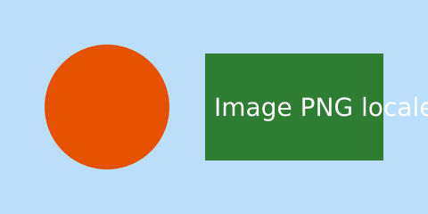

Image redimensionnée à 50 % :

{width=50%}

## 7. Notes et divers

Une phrase avec une note de bas de page.[^1] Une autre avec une seconde note.[^2]

[^1]: Première note, doit apparaître en bas de page.
[^2]: Seconde note, avec du **gras**.

Ligne HTML brute : <span>texte dans un span</span> et un commentaire <!-- invisible --> après.

Texte avec emojis : ✅ ❌ ⚠️ 🚀 ⭐.

# Diagrammes Mermaid


## architecture-diagram

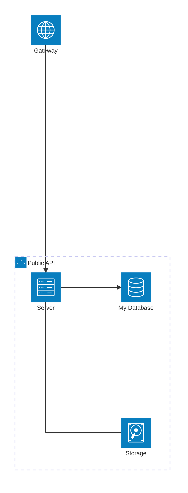

## bidirectional

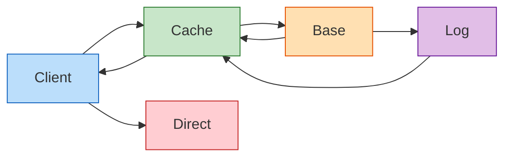

## block

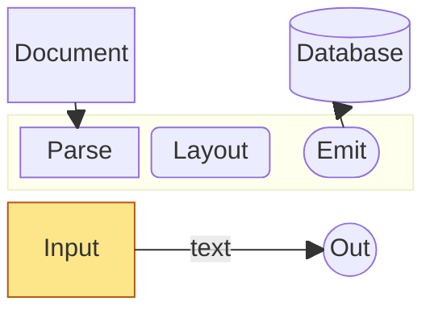

## bt-direction

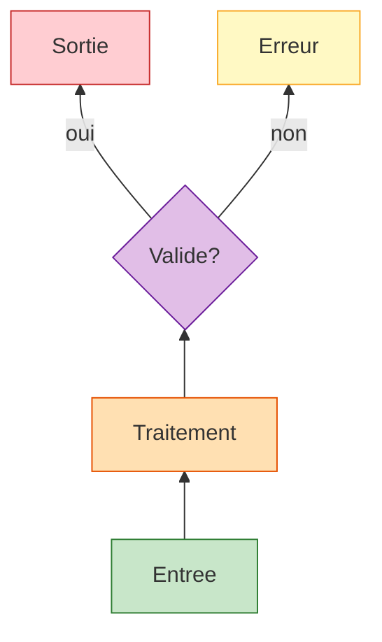

## c4

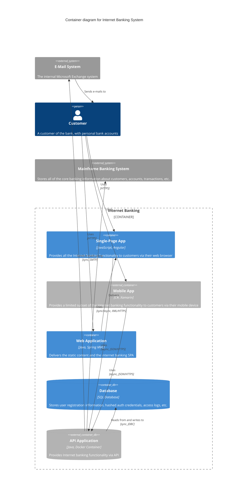

## class-diagram

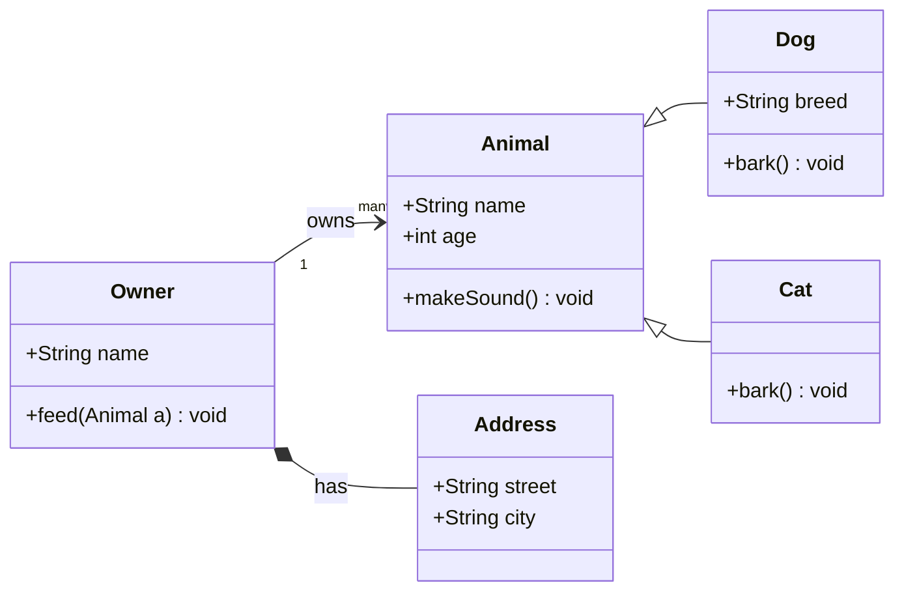

## colors

```mermaid
flowchart TD
    classDef clair fill:#D9E2F3
    classDef sombre fill:#1F3864
    A[Fond clair]:::clair --> B[Fond sombre]:::sombre
    classDef alerte stroke:#CC0000,fill:#FFD9D9
    B --> C[Alerte]:::alerte
    C --> D[Style direct]
    style D fill:#FFDD00,stroke:#333333
    D --> E[Lien vert]
    classDef partagee1,partagee2 stroke:#0000CC,fill:#CCE5FF
    E --> F[Classe partagee]:::partagee1
    F --> G[Autre classe partagee]:::partagee2
    linkStyle 3 stroke:#00AA00,stroke-width:3px
```

## crossing-stress-15node

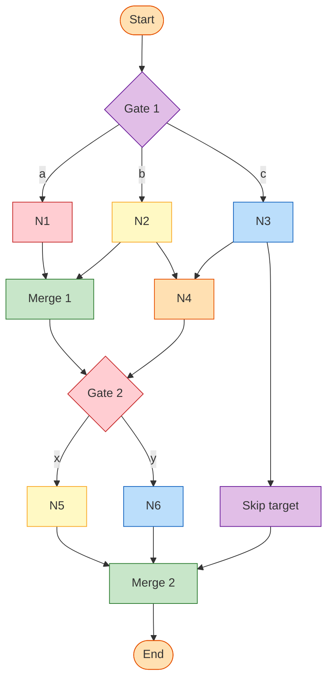

## crossing-stress-bipartite

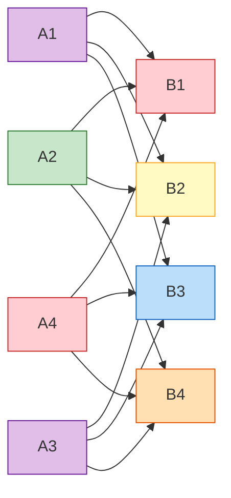

## cycle

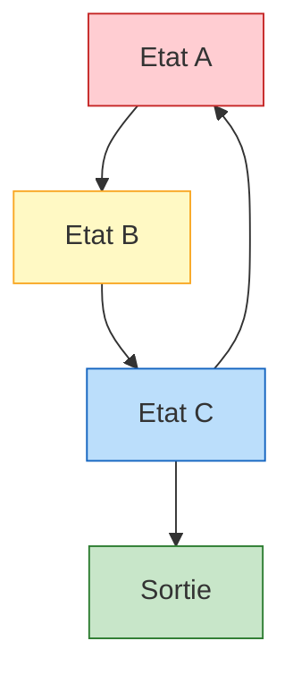

## cynefin

```mermaid
cynefin-beta
  title Strategy Categorization

  complex
    "Market research"

  complicated
    "Competitive analysis"

  clear
    "Standard pricing"

  chaotic
    "Crisis management"

  complex --> complicated : "Pattern identified"
  complicated --> clear : "Best practice codified"
  clear --> chaotic : "Complacency"
  chaotic --> complex : "Stabilized"
```

## decision

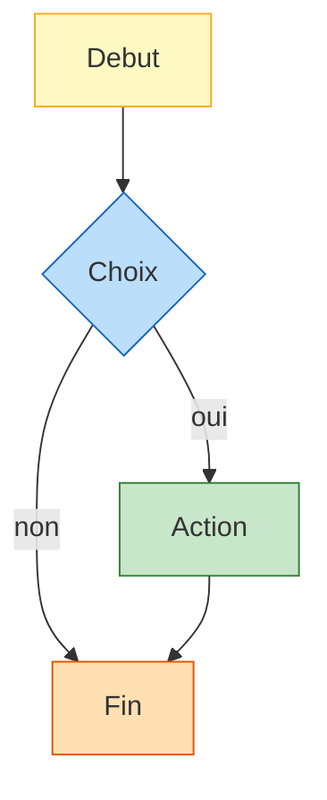

## dense

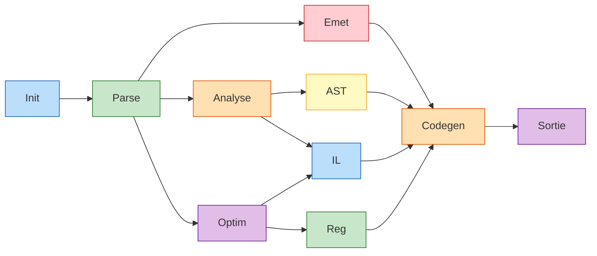

## direction-and-asymmetric-shape

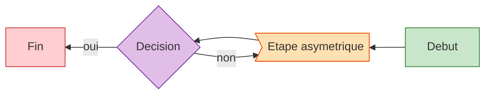

## edge-chaining

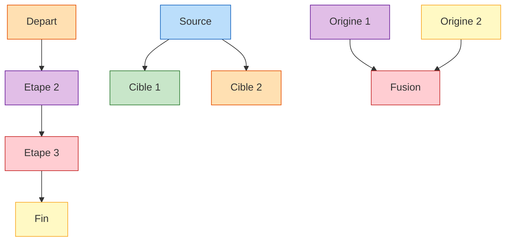

## edge-labels

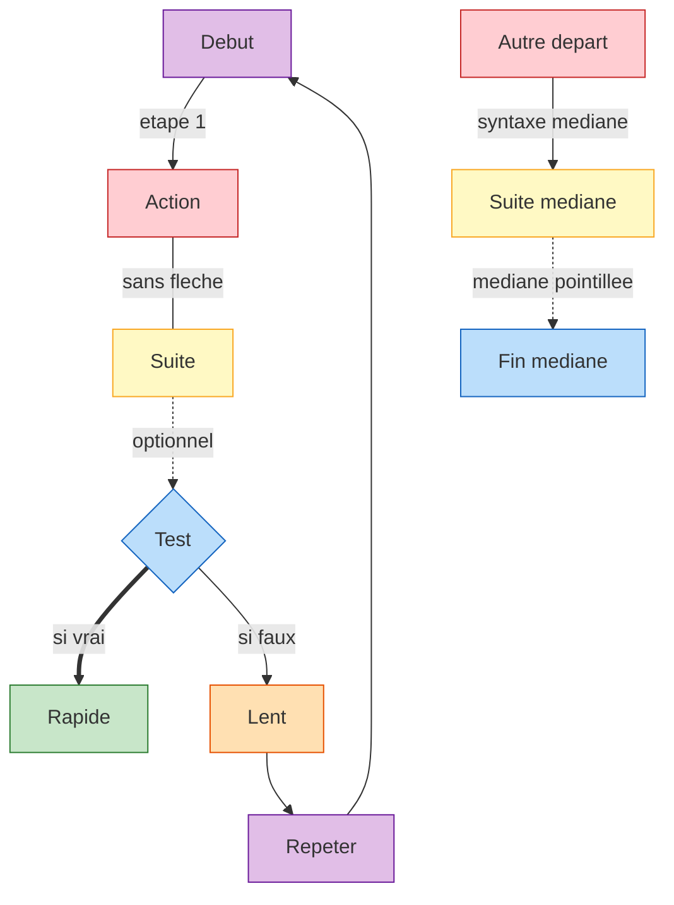

## edge-types-extended

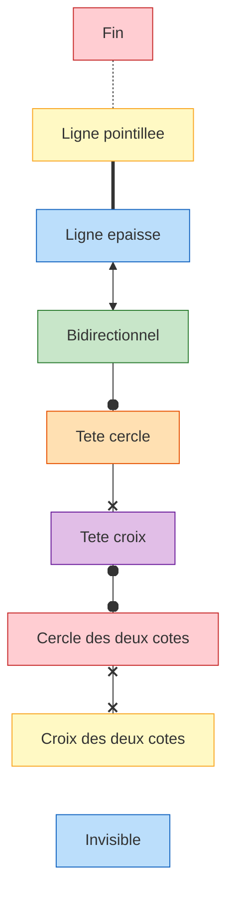

## edge-types

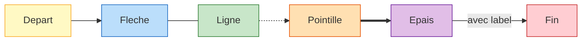

## er-diagram

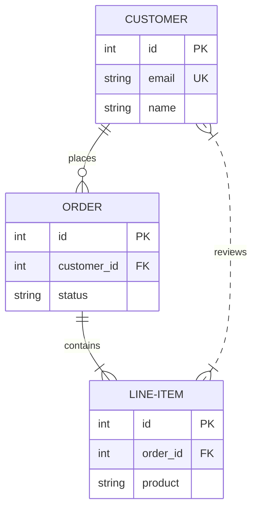

## escape-xml

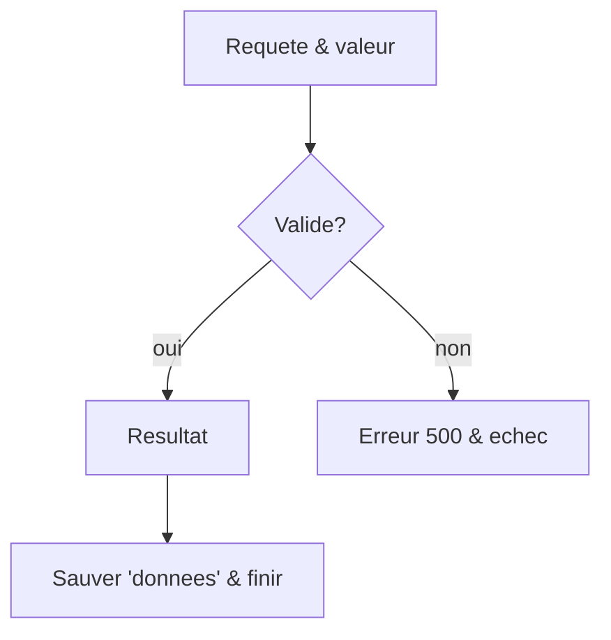

## eventmodeling

```mermaid
eventmodeling
tf 01 ui CartScreen
tf 02 cmd AddItem [[AddItem01]]
tf 03 evt ItemAdded ->> 02 {"itemId": "42", "qty": 1}
tf 04 rmo CartItems ->> 03
tf 05 ui CartScreenUpdated ->> 04
tf 06 pcr PriceCalculator ->> 04
tf 07 cmd ApplyDiscount ->> 06
tf 08 evt Billing.DiscountApplied ->> 07
rf 09 ui Checkout ->> 04
tf 10 cmd Pay ->> 09
tf 11 evt Billing.Paid ->> 10
data AddItem01 {
  description: 'john'
  price: 20.4
}
note 03 {
  stock reserved elsewhere
}
gwt 03 given evt ItemAdded when cmd AddItem then evt ItemAdded
```

## fan-out

```mermaid
flowchart TD
    A[Repartiteur] --> B[Branche 1]
    A --> C[Branche 2]
    A --> D[Branche 3]
    B --> E[Fin]
    C --> E
    D --> E
    style A fill:#BBDEFB,stroke:#1565C0
    style B fill:#C8E6C9,stroke:#2E7D32
    style C fill:#FFE0B2,stroke:#E65100
    style D fill:#E1BEE7,stroke:#6A1B9A
    style E fill:#FFCDD2,stroke:#C62828
```

## gantt

```mermaid
gantt
    title Adoption d'un logiciel
    dateFormat YYYY-MM-DD
    excludes weekends
    section Cadrage
    Recueil besoins      :done,    des1, 2026-01-05, 5d
    Choix outil          :active,  des2, after des1, 3d
    section Deploiement
    Formation            :crit,    des3, after des2, 4d
    Go-live              :milestone, des4, after des3, 0d
    Suivi post go-live   :         des5, after des4, 10d
```

## git-graph

```mermaid
gitGraph
    commit id: "ZERO"
    branch develop
    branch release
    commit id:"A"
    checkout main
    commit id:"ONE"
    checkout develop
    commit id:"B"
    checkout main
    merge develop id:"MERGE"
    commit id:"TWO"
    checkout release
    cherry-pick id:"MERGE" parent:"B"
    commit id:"THREE"
    checkout develop
    commit id:"C"
```

## ishikawa

```mermaid
ishikawa-beta
    Blurry Photo
    Process
        Out of focus
        Shutter speed too slow
        Protective film not removed
        Beautification filter applied
    User
        Shaky hands
    Equipment
        LENS
            Inappropriate lens
            Damaged lens
            Dirty lens
        SENSOR
            Damaged sensor
            Dirty sensor
    Environment
        Subject moved too quickly
        Too dark
```

## isolated

```mermaid
flowchart TD
    A[Entree]
    B[Noeud isole 2]
    C --> D
    A --> E[Rejoint le graphe]
    F[Noeud isole] --> G[Lien seul]
    style A fill:#C8E6C9,stroke:#2E7D32
    style B fill:#FFE0B2,stroke:#E65100
    style C fill:#E1BEE7,stroke:#6A1B9A
    style D fill:#FFCDD2,stroke:#C62828
    style E fill:#FFF9C4,stroke:#F9A825
    style F fill:#BBDEFB,stroke:#1565C0
    style G fill:#C8E6C9,stroke:#2E7D32
```

## journey

```mermaid
journey
    title My working day
    section Go to work
      Make tea: 5: Me
      Go upstairs: 3: Me
      Do work: 1: Me, Cat
    section Go home
      Go downstairs: 5: Me
      Sit down: 5: Me
```

## kanban

```mermaid
kanban
  Todo
    [Create Documentation]
    docs[Create Blog about the new diagram]
  [In progress]
    id6[Create renderer so that it works in all cases. We also add some extra text here for testing purposes. And some more just for the extra flare.]
  id9[Ready for deploy]
    id8[Design grammar]@{ assigned: 'knsv' }
  id10[Ready for test]
    id4[Create parsing tests]@{ ticket: MC-2038, assigned: 'K.Sveidqvist', priority: 'High' }
    id66[last item]@{ priority: 'Very Low', assigned: 'knsv' }
  id11[Done]
    id5[define getData]
    id2[Title of diagram is more than 100 chars when user duplicates diagram with 100 char]@{ ticket: MC-2036, priority: 'Very High'}
    id3[Update DB function]@{ ticket: MC-2037, assigned: knsv, priority: 'High' }

  id12[Can't reproduce]
    id3[Weird flickering in Firefox]
```

## long-labels

```mermaid
flowchart TD
    A[Ceci est un label assez long pour deborder] --> B[Court]
    B --> C[Un autre label qui depasse la largeur du noeud]
    style A fill:#FFE0B2,stroke:#E65100
    style B fill:#E1BEE7,stroke:#6A1B9A
    style C fill:#FFCDD2,stroke:#C62828
```

## lr-direction

```mermaid
flowchart LR
    A[Entree] --> B[Traitement]
    B --> C{Valide?}
    C -->|oui| D[Sortie]
    C -->|non| E[Erreur]
    style A fill:#E1BEE7,stroke:#6A1B9A
    style B fill:#FFCDD2,stroke:#C62828
    style C fill:#FFF9C4,stroke:#F9A825
    style D fill:#BBDEFB,stroke:#1565C0
    style E fill:#C8E6C9,stroke:#2E7D32
```

## lr-subgraphs

```mermaid
flowchart LR
    subgraph Nord[Nord]
        A[Paris] --> B[Rouen]
        B --> C[Le Havre]
    end
    subgraph Sud[Sud]
        D[Marseille] --> E[Toulon]
        D --> F[Nice]
    end
    subgraph Ouest[Ouest]
        G[Nantes] --> H[Brest]
    end
    C --> G
    E --> G
    style A fill:#FFCDD2,stroke:#C62828
    style B fill:#FFF9C4,stroke:#F9A825
    style C fill:#BBDEFB,stroke:#1565C0
    style D fill:#C8E6C9,stroke:#2E7D32
    style E fill:#FFE0B2,stroke:#E65100
    style F fill:#E1BEE7,stroke:#6A1B9A
    style G fill:#FFCDD2,stroke:#C62828
    style H fill:#FFF9C4,stroke:#F9A825
```

## medium-realistic

```mermaid
flowchart TD
    classDef process fill:#BDD7EE
    classDef gate fill:#FFE699
    classDef terminal fill:#C6E0B4
    Start([Demarrer]):::terminal --> Lire[Lire config]:::process
    Lire --> Valider{Config
 valide?}:::gate
    Valider -->|non| Erreur[Log erreur]:::terminal
    Erreur --> Stop([Arreter]):::terminal
    Valider -->|oui| Connect[Connecter API]:::process
    Connect --> Fetch[Recuperer donnees]:::process
    Fetch --> Clean[Nettoyer]:::process
    Clean --> Check{Donnees ok?}:::gate
    Check -->|non| Retry[Retenter]:::process
    Retry --> Check
    Check -->|oui| Save[Sauvegarder]:::process
    Save --> Notify[Notifier user]:::process
    Notify --> Stop
```

## mindmap

```mermaid
mindmap
  root((Project Plan))
    Research
      Market analysis
      Competitor review
      User interviews
    Design
      [Wireframes]
      )Moodboard(
        Colors
        Typography
    {{Engineering}}
      (Backend)
        API
        Database
      Frontend
    Launch
      ))Marketing((
      Support
```

## minimal

```mermaid
graph LR
    A --> B
    B --> C
    C --> A
    style A fill:#FFF9C4,stroke:#F9A825
    style B fill:#BBDEFB,stroke:#1565C0
    style C fill:#C8E6C9,stroke:#2E7D32
```

## mixed

```mermaid
flowchart TD
    classDef warn fill:#F4B183
    classDef ok fill:#A9D18E
    subgraph Validation[Validation]
        A[Requete] --> B{OK?}
        B -->|oui| C[Traiter]:::ok
        B -->|non| D[Rejeter]:::warn
    end
    C --> E([Reponse])
    D --> E
```

## multiple-subgraphs

```mermaid
flowchart LR
    subgraph Collecte[Collecte des donnees]
        A[API] --> B[Base]
        A --> C[Logs]
    end
    subgraph Traitement[Traitement]
        D[Propre] --> E[Aggrege]
        E --> F[Stocke]
    end
    subgraph Livraison[Livraison]
        G[Rapport] --> H[Email]
    end
    B --> D
    C --> D
    F --> G
    style A fill:#BBDEFB,stroke:#1565C0
    style B fill:#C8E6C9,stroke:#2E7D32
    style C fill:#FFE0B2,stroke:#E65100
    style D fill:#E1BEE7,stroke:#6A1B9A
    style E fill:#FFCDD2,stroke:#C62828
    style F fill:#FFF9C4,stroke:#F9A825
    style G fill:#BBDEFB,stroke:#1565C0
    style H fill:#C8E6C9,stroke:#2E7D32
```

## nested-3-levels

```mermaid
flowchart TD
    subgraph L1[Niveau 1]
        A[Un] --> B[Deux]
        subgraph L2[Niveau 2]
            C[Trois] --> D[Quatre]
            subgraph L3[Niveau 3]
                E[Cinq] --> F[Six]
            end
            D --> E
        end
        B --> C
    end
    F --> G[Sept]
    style A fill:#C8E6C9,stroke:#2E7D32
    style B fill:#FFE0B2,stroke:#E65100
    style C fill:#E1BEE7,stroke:#6A1B9A
    style D fill:#FFCDD2,stroke:#C62828
    style E fill:#FFF9C4,stroke:#F9A825
    style F fill:#BBDEFB,stroke:#1565C0
    style G fill:#C8E6C9,stroke:#2E7D32
```

## order-flow

```mermaid
flowchart TD
    A[Commande recue] --> B{Stock disponible?}
    B -->|oui| C[Reserver stock]
    B -->|non| D[Notifier rupture]
    C --> E[Preparer colis]
    E --> F{Adresse valide?}
    F -->|oui| G[Expedier]
    F -->|non| H[Corriger adresse]
    H --> F
    G --> I[Notifier client]
    D --> J[Fin]
    I --> J
    style A fill:#FFE0B2,stroke:#E65100
    style B fill:#E1BEE7,stroke:#6A1B9A
    style C fill:#FFCDD2,stroke:#C62828
    style D fill:#FFF9C4,stroke:#F9A825
    style E fill:#BBDEFB,stroke:#1565C0
    style F fill:#C8E6C9,stroke:#2E7D32
    style G fill:#FFE0B2,stroke:#E65100
    style H fill:#E1BEE7,stroke:#6A1B9A
    style I fill:#FFCDD2,stroke:#C62828
    style J fill:#FFF9C4,stroke:#F9A825
```

## packet

```mermaid
---
title: "TCP Packet"
---
packet
0-15: "Source Port"
16-31: "Destination Port"
32-63: "Sequence Number"
64-95: "Acknowledgment Number"
96-99: "Data Offset"
100-105: "Reserved"
106: "URG"
107: "ACK"
108: "PSH"
109: "RST"
110: "SYN"
111: "FIN"
112-127: "Window"
128-143: "Checksum"
144-159: "Urgent Pointer"
160-191: "(Options and Padding)"
192-255: "Data (variable length)"
```

## pie

```mermaid
pie showData
    title Key elements in Product X
    "Calcium" : 42.96
    "Potassium" : 50.05
    "Magnesium" : 10.01
    "Iron" :  5
```

## quadrant

```mermaid
quadrantChart
    title Reach and engagement of campaigns
    x-axis Low Reach --> High Reach
    y-axis Low Engagement --> High Engagement
    quadrant-1 We should expand
    quadrant-2 Need to promote
    quadrant-3 Re-evaluate
    quadrant-4 May be improved
    Campaign A: [0.3, 0.6] color: #1565C0
    Campaign B: [0.45, 0.23] color: #1565C0
    Campaign C: [0.57, 0.69] color: #ff3300
    Campaign D: [0.78, 0.34] color: #1565C0
```

## radar

```mermaid
radar-beta
  title Grades
  axis m["Math"], s["Science"], e["English"]
  axis h["History"], g["Geography"], a["Art"]
  curve a["Alice"]{85, 90, 80, 70, 75, 90}
  curve b["Bob"]{70, 75, 85, 80, 90, 85}
  max 100
  graticule polygon
  ticks 4
```

## requirement-diagram

```mermaid
requirementDiagram
  requirement test_req {
    id: 1
    text: the test text.
    risk: high
    verifymethod: test
  }
  functionalRequirement test_req2 {
    id: 1.1
    text: the second test text.
    risk: low
    verifymethod: inspection
  }
  element test_entity {
    type: simulation
  }
  test_entity - satisfies -> test_req
  test_req - traces -> test_req2
  test_req <- derives - test_req2
```

## rich-text

```mermaid
flowchart TD
    A["Ligne1<br/>Ligne2"] -->|"`**Oui**`"| B["`**gras** et _italique_ et normal`"]
    B --> C[Pas de **markup** ici, texte classique]
    style A fill:#E1BEE7,stroke:#6A1B9A
    style B fill:#FFCDD2,stroke:#C62828
    style C fill:#FFF9C4,stroke:#F9A825
```

## rl-direction

```mermaid
flowchart RL
    A[Entree] --> B[Traitement]
    B --> C{Valide?}
    C -->|oui| D[Sortie]
    C -->|non| E[Erreur]
    style A fill:#FFCDD2,stroke:#C62828
    style B fill:#FFF9C4,stroke:#F9A825
    style C fill:#BBDEFB,stroke:#1565C0
    style D fill:#C8E6C9,stroke:#2E7D32
    style E fill:#FFE0B2,stroke:#E65100
```

## sankey

```mermaid
sankey-beta

Agricultural 'waste',Bio-conversion,124.729
Bio-conversion,Liquid,0.597
Bio-conversion,Solid,26.862
Bio-conversion,Gas,280.322
Bio-conversion,Losses,10
Coal imports,Coal,11.606
Coal,Solid,75.571
Gas,Heating,79.5
Solid,Heating,40.2
Liquid,Heating,2
```

## self-loop

```mermaid
flowchart TD
    A[Depart] --> B[En cours]
    B -->|retry| B
    B --> C[Fin]
    style A fill:#FFF9C4,stroke:#F9A825
    style B fill:#BBDEFB,stroke:#1565C0
    style C fill:#C8E6C9,stroke:#2E7D32
```

## sequence

```mermaid
sequenceDiagram
    title Checkout
    autonumber
    actor U as User
    participant W as Web App
    participant API
    participant DB as Database
    U->>+W: Place order
    W->>API: POST /orders
    activate API
    API->>DB: INSERT order
    DB-->>API: ok
    API-xW: Payment declined
    Note over API,DB: Retried 3 times
    loop Every minute
        W-)API: poll status
    end
    alt paid
        API-->>-W: 200 OK
    else failed
        API--)W: 402
        API->>API: log failure
    end
    Note right of W: done
    create participant M as Mailer
    W->>M: send receipt
    destroy M
    M-->>W: sent
    W-->>-U: Confirmation
```

## shapes-generic

```mermaid
flowchart TD
    A1@{ shape: doc, label: "Document" } --> A2@{ shape: card, label: "Carte" }
    A2 --> A3@{ shape: delay, label: "Delai" }
    A3 --> A4@{ shape: triangle, label: "Extraction" }
    A4 --> A5@{ shape: flipped-triangle, label: "Fichier manuel" }
    A5 --> A6@{ shape: win-pane, label: "Stockage interne" }
    A6 --> A7@{ shape: hourglass, label: "Collationnement" }
    A7 --> A8@{ shape: curv-trap, label: "Affichage" }
    A8 --> A9@{ shape: com-link, label: "Liaison" }
    A9 --> A10@{ shape: brace, label: "Commentaire" }
    A10 --> A11@{ shape: braces, label: "Double accolade" }
    A11 --> A12@{ shape: crossed-circle, label: "Resume" }
    A12 --> A13@{ shape: junction, label: "Jonction" }
    A13 --> A14@{ shape: paper-tape, label: "Bande papier" }
    A14 --> A15@{ shape: das, label: "Acces direct" }
    A15 --> A16@{ shape: disk, label: "Disque" }
    A16 --> A17@{ shape: manual-input, label: "Saisie manuelle" }
    A17 --> A18@{ shape: rounded, label: "Evenement" }
    style A1 fill:#BBDEFB,stroke:#1565C0
    style A2 fill:#C8E6C9,stroke:#2E7D32
    style A3 fill:#FFE0B2,stroke:#E65100
    style A4 fill:#E1BEE7,stroke:#6A1B9A
    style A5 fill:#FFCDD2,stroke:#C62828
    style A6 fill:#FFF9C4,stroke:#F9A825
    style A7 fill:#BBDEFB,stroke:#1565C0
    style A8 fill:#C8E6C9,stroke:#2E7D32
    style A9 fill:#FFE0B2,stroke:#E65100
    style A10 fill:#E1BEE7,stroke:#6A1B9A
    style A11 fill:#FFCDD2,stroke:#C62828
    style A12 fill:#FFF9C4,stroke:#F9A825
    style A13 fill:#BBDEFB,stroke:#1565C0
    style A14 fill:#C8E6C9,stroke:#2E7D32
    style A15 fill:#FFE0B2,stroke:#E65100
    style A16 fill:#E1BEE7,stroke:#6A1B9A
    style A17 fill:#FFCDD2,stroke:#C62828
    style A18 fill:#FFF9C4,stroke:#F9A825
```

## shapes

```mermaid
flowchart TD
    R[Rectangle]
    RR(Arrondi)
    ST([Stade])
    DI{Losange}
    CY[(Cylindre)]
    EL((Ellipse))
    R --> RR --> ST --> DI --> CY --> EL
    HX{{Hexagone}}
    PA[/Parallelogramme/]
    PB[\Parallelogramme miroir\]
    TA[/Trapeze\]
    TB[\Trapeze miroir/]
    SR[[Sous-routine]]
    DC(((Double cercle)))
    AS>Asymetrique]
    EL --> HX --> PA --> PB --> TA --> TB --> SR --> DC --> AS
    style R fill:#C8E6C9,stroke:#2E7D32
    style RR fill:#FFE0B2,stroke:#E65100
    style ST fill:#E1BEE7,stroke:#6A1B9A
    style DI fill:#FFCDD2,stroke:#C62828
    style CY fill:#FFF9C4,stroke:#F9A825
    style EL fill:#BBDEFB,stroke:#1565C0
    style HX fill:#C8E6C9,stroke:#2E7D32
    style PA fill:#FFE0B2,stroke:#E65100
    style PB fill:#E1BEE7,stroke:#6A1B9A
    style TA fill:#FFCDD2,stroke:#C62828
    style TB fill:#FFF9C4,stroke:#F9A825
    style SR fill:#BBDEFB,stroke:#1565C0
    style DC fill:#C8E6C9,stroke:#2E7D32
    style AS fill:#FFE0B2,stroke:#E65100
```

## state-diagram

```mermaid
stateDiagram-v2
  [*] --> Idle
  Idle --> Loading : fetch
  Loading --> choice1
  state choice1 <<choice>>
  choice1 --> Success : ok
  choice1 --> Error : fail
  Success --> Idle : reset
  Error --> Idle : retry
  Idle --> [*]
```

## subgraph

```mermaid
flowchart TD
    subgraph Externe[Groupe externe]
        A[Un] --> B[Deux]
        subgraph Interne[Groupe interne]
            C[Trois] --> D[Quatre]
        end
        B --> C
    end
    D --> E[Cinq]
    style A fill:#FFE0B2,stroke:#E65100
    style B fill:#E1BEE7,stroke:#6A1B9A
    style C fill:#FFCDD2,stroke:#C62828
    style D fill:#FFF9C4,stroke:#F9A825
    style E fill:#BBDEFB,stroke:#1565C0
```

## swimlane

```mermaid
swimlane-beta LR
  subgraph Customer[Customer]
    Order[Place order]
    Pay(Pay invoice)
  end
  subgraph Store[Store]
    Pack[Pack items]
    Decision{In stock?}
  end
  subgraph Carrier[Carrier]
    Ship([Ship package])
  end

  Order --> Decision
  Decision -->|Yes| Pack
  Decision -->|No| Order
  Pack --> Ship
  Ship --> Pay
    style Order fill:#E1BEE7,stroke:#6A1B9A
    style Pay fill:#FFCDD2,stroke:#C62828
    style Pack fill:#FFF9C4,stroke:#F9A825
    style Decision fill:#BBDEFB,stroke:#1565C0
    style Ship fill:#C8E6C9,stroke:#2E7D32
```

## timeline

```mermaid
timeline
        title England's History Timeline
        section Stone Age
          7600 BC : Britain's oldest known house was built in Orkney, Scotland
          6000 BC : Sea levels rise and Britain becomes an island.<br> The people who live here are hunter-gatherers.
        section Bronze Age
          2300 BC : People arrive from Europe and settle in Britain. <br>They bring farming and metalworking.
                  : New styles of pottery and ways of burying the dead appear.
          2200 BC : The last major building works are completed at Stonehenge.<br> People now bury their dead in stone circles.
                  : The first metal objects are made in Britain.Some other nice things happen. it is a good time to be alive.
```

## tree-view

```mermaid
treeView-beta
    "packages/"
        "core/" ## the moat
            "src/"
                parser/
                translator/
                index.ts:::highlight
            package.json
        cli/
        "README file.md" ## quick start
    docs/
        specs/
```

## tree

```mermaid
flowchart TD
    Racine[Racine] --> N1[Noeud L1] --> N1a[Feuille]
    N1 --> N1b[Feuille]
    Racine --> N2[Noeud L1 bis]
    N2 --> N2a[Feuille]
    N2 --> N2b[Feuille]
    N2 --> N2c[Feuille]
    style Racine fill:#FFCDD2,stroke:#C62828
    style N1 fill:#FFF9C4,stroke:#F9A825
    style N1a fill:#BBDEFB,stroke:#1565C0
    style N1b fill:#C8E6C9,stroke:#2E7D32
    style N2 fill:#FFE0B2,stroke:#E65100
    style N2a fill:#E1BEE7,stroke:#6A1B9A
    style N2b fill:#FFCDD2,stroke:#C62828
    style N2c fill:#FFF9C4,stroke:#F9A825
```

## treemap

```mermaid
treemap-beta
"Products"
    "Electronics"
        "Phones": 50
        "Computers": 30
        "Accessories": 20
    "Clothing"
        "Men's": 40
        "Women's":::important
            "Dresses": 25
            "Tops": 15
"Services"
    "Support": 35
    "Consulting": 12
    "Training": 8

classDef important fill:#f96,stroke:#333,color:#000;
```

## venn

```mermaid
venn-beta
  title Skills coverage
  set A ["Design"]
  set B ["Code"]
  set C ["Writing"]
  union A,B
    text ["Design+Code"]
  union B,C
    text ["Code+Writing"]
  union A,C
    text ["Design+Writing"]
  union A,B,C
    text ["All three"]
  style A fill:#BBDEFB
  style B fill:#C8E6C9
  style C fill:#FFE0B2
```

## wardley

```mermaid
wardley-beta
title Tea Shop
size [1000, 640]
anchor Business [0.95, 0.63]
anchor Public [0.95, 0.78]
component Cup of Tea [0.79, 0.61] label [-85, 10]
component Cup [0.73, 0.78]
component Tea [0.63, 0.81]
component Hot Water [0.52, 0.80]
component Water [0.38, 0.82] (buy)
component Kettle [0.43, 0.35] (inertia)
component Boiler [0.30, 0.20] (build)
component Power [0.1, 0.7] (outsource)
pipeline Kettle {
  component "Electric Kettle" [0.64]
  component "Gas Kettle" [0.46]
}
Business->Cup of Tea
Public->Cup of Tea
Cup of Tea->Cup
Cup of Tea->Tea
Cup of Tea->Hot Water
Hot Water->Water
Hot Water->Kettle; boils
Kettle -.-> Power
Boiler -> Power
Tea +<> Water
evolve Kettle 0.62
note "Standardising power allows Kettles to evolve faster" [0.07, 0.45]
annotations [0.12, 0.02]
annotation 1,[0.20,0.30] "Standardising power"
accelerator "Open Source" [0.62, 0.30]
```

## xychart-horizontal

```mermaid
xychart horizontal
    title "Team velocity"
    x-axis "Sprint" ["S1", "S2", "S3", "S4"]
    y-axis "Points" 0 --> 40
    bar "Planned" [30, 32, 28, 35]
    line "Done" [25 "late", 31, 27, 36]
```

## xychart

```mermaid
xychart-beta
    title "Sales Revenue"
    x-axis [jan, feb, mar, apr, may, jun, jul, aug, sep, oct, nov, dec]
    y-axis "Revenue (in $)" 4000 --> 11000
    bar [5000, 6000, 7500, 8200, 9500, 10500, 11000, 10200, 9200, 8500, 7000, 6000]
    line [5000, 6000, 7500, 8200, 9500, 10500, 11000, 10200, 9200, 8500, 7000, 6000]
```

## zenuml

```mermaid
zenuml
    title Booking
    @Actor Client
    @Database DB
    Booking as Booking Service
    Client->Booking.book(id) {
      DB.find(id) {
        return row
      }
      if(available) {
        order = DB.save(id)
        new Mailer(id)
      } else {
        return sold_out
      }
      while(retry) {
        Booking->DB: poll
      }
      return ok
    }
    try {
      Client->Booking: confirm
    } catch {
      Client->Booking: cancel
    }
    opt {
      Booking.audit()
    }
```
