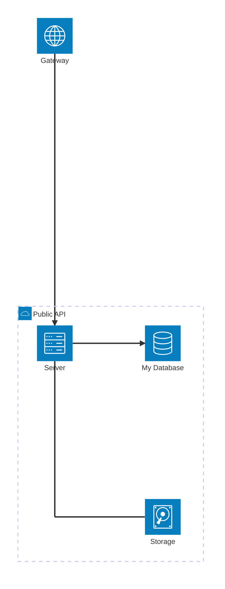

# architecture-diagram

```mermaid
architecture-beta
  group public_api(cloud)[Public API]

  service database1(database)[My Database] in public_api
  service server(server)[Server] in public_api
  service disk1(disk)[Storage] in public_api
  service gateway(internet)[Gateway]
  junction j1

  gateway:B --> T:server
  server:R --> L:database1
  server:B -- T:j1
  j1:R -- L:disk1
```
