# Bisect A

## architecture-diagram

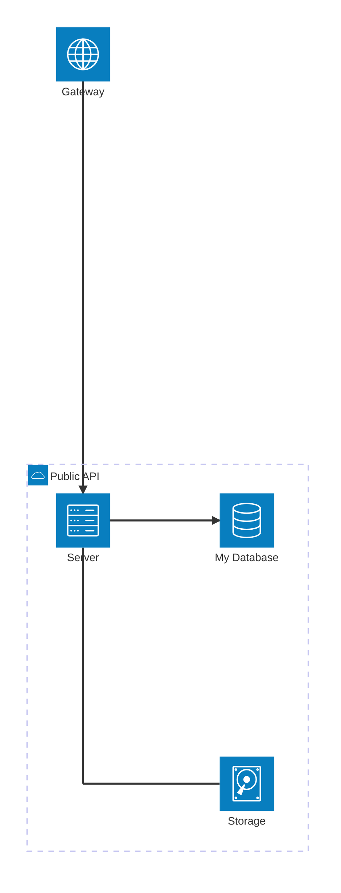


## bidirectional

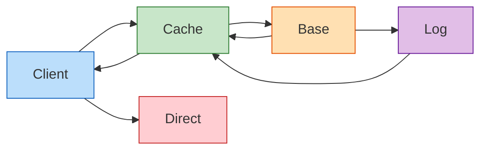


## block

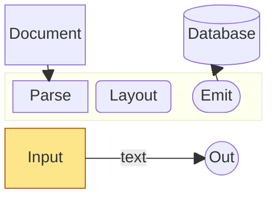


## bt-direction

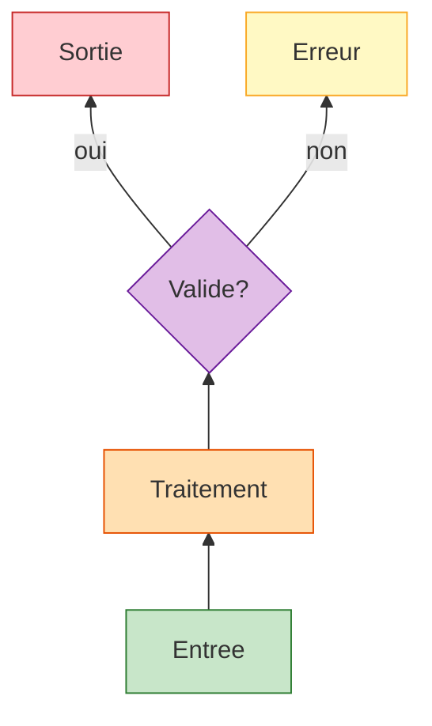


## c4

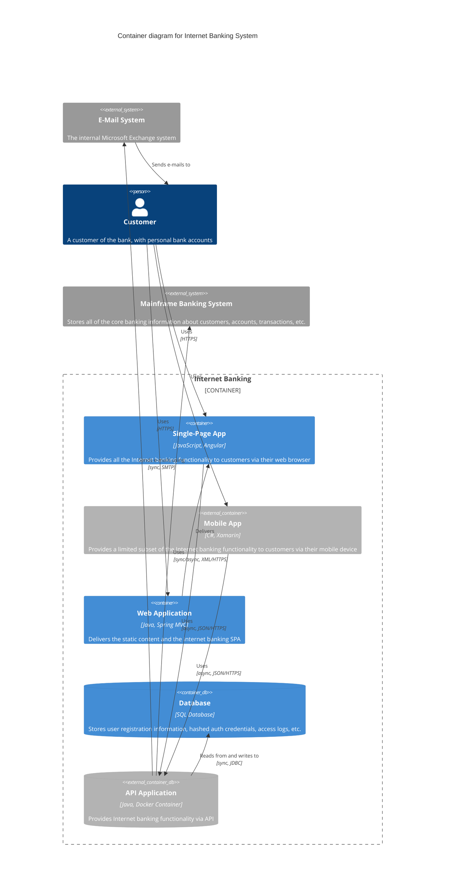


## class-diagram

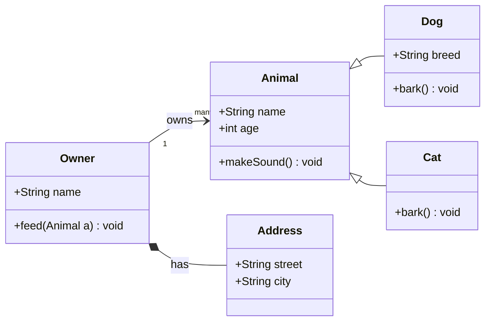


## colors

```mermaid
flowchart TD
    classDef clair fill:#D9E2F3
    classDef sombre fill:#1F3864
    A[Fond clair]:::clair --> B[Fond sombre]:::sombre
    classDef alerte stroke:#CC0000,fill:#FFD9D9
    B --> C[Alerte]:::alerte
    C --> D[Style direct]
    style D fill:#FFDD00,stroke:#333333
    D --> E[Lien vert]
    classDef partagee1,partagee2 stroke:#0000CC,fill:#CCE5FF
    E --> F[Classe partagee]:::partagee1
    F --> G[Autre classe partagee]:::partagee2
    linkStyle 3 stroke:#00AA00,stroke-width:3px
```


## crossing-stress-15node

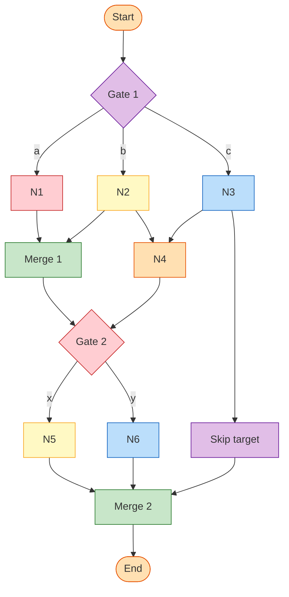


## crossing-stress-bipartite

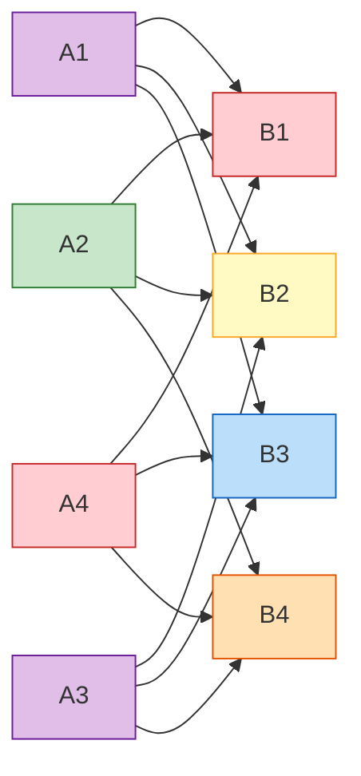


## cycle

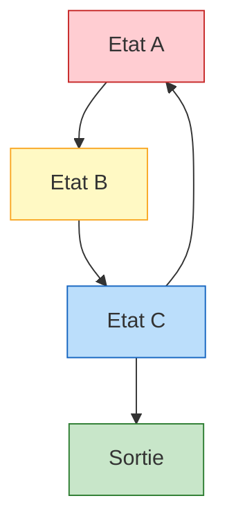


## cynefin

```mermaid
cynefin-beta
  title Strategy Categorization

  complex
    "Market research"

  complicated
    "Competitive analysis"

  clear
    "Standard pricing"

  chaotic
    "Crisis management"

  complex --> complicated : "Pattern identified"
  complicated --> clear : "Best practice codified"
  clear --> chaotic : "Complacency"
  chaotic --> complex : "Stabilized"
```


## decision

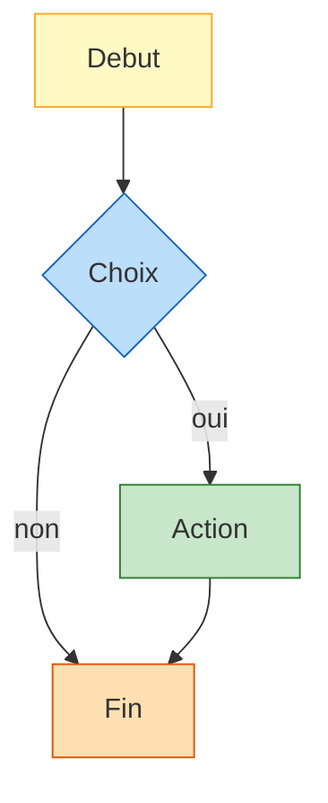


## dense

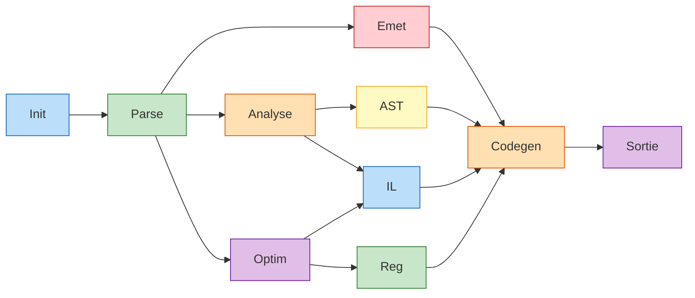


## direction-and-asymmetric-shape

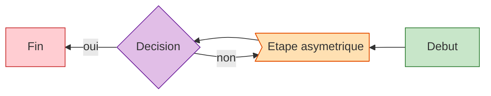


## edge-chaining

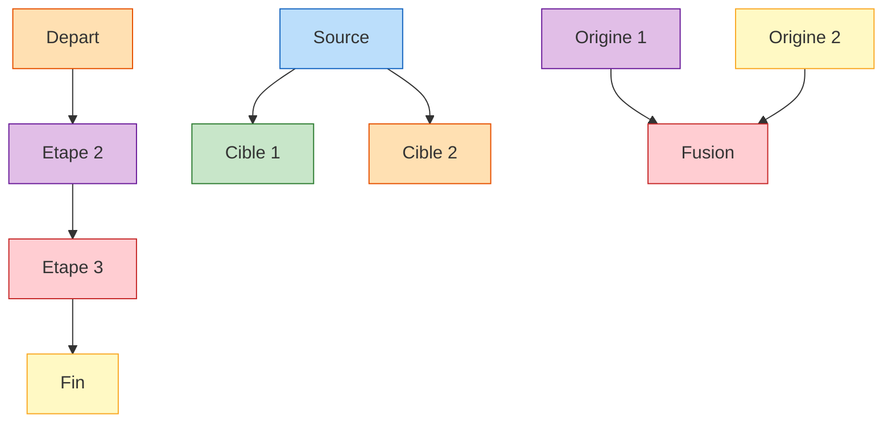


## edge-labels

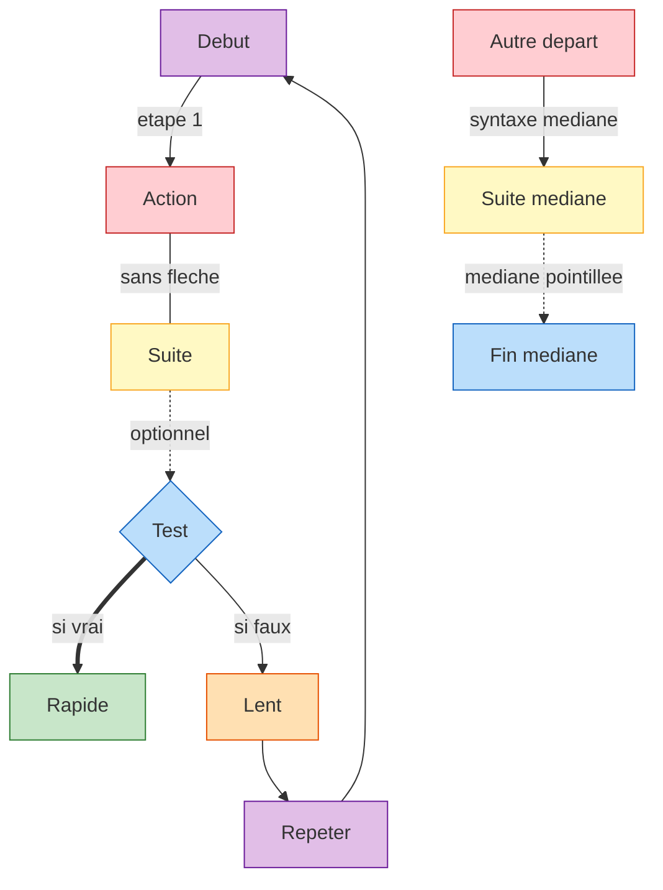

