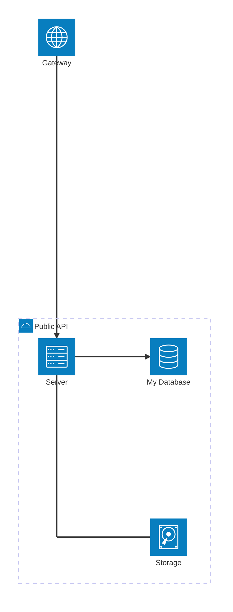
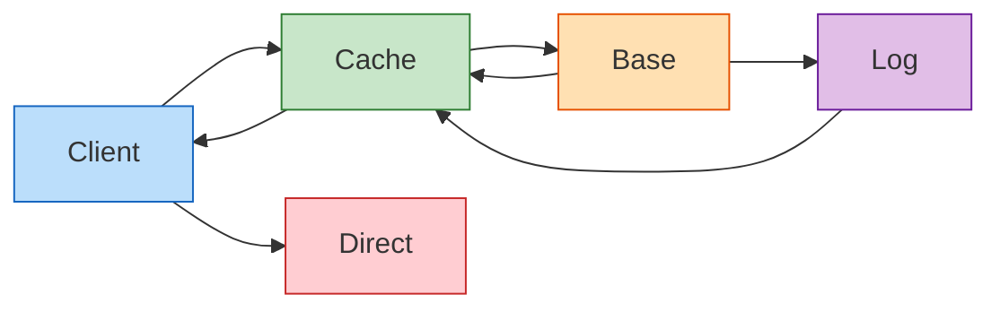
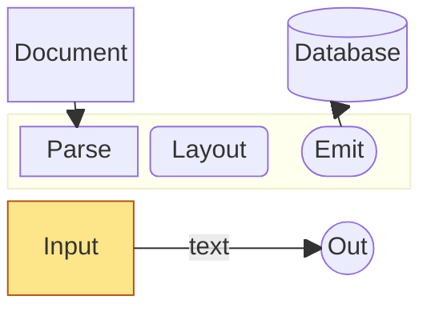
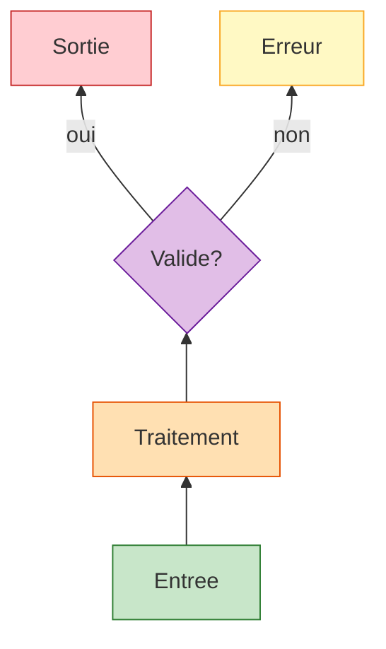

# Bisect A1

## architecture-diagram

```mermaid
architecture-beta
  group public_api(cloud)[Public API]

  service database1(database)[My Database] in public_api
  service server(server)[Server] in public_api
  service disk1(disk)[Storage] in public_api
  service gateway(internet)[Gateway]
  junction j1

  gateway:B --> T:server
  server:R --> L:database1
  server:B -- T:j1
  j1:R -- L:disk1
```

## bidirectional

```mermaid
flowchart LR
    A[Client] --> B[Cache]
    B --> A
    B --> C[Base]
    C --> B
    C --> D[Log]
    D --> B
    A --> E[Direct]
    style A fill:#BBDEFB,stroke:#1565C0
    style B fill:#C8E6C9,stroke:#2E7D32
    style C fill:#FFE0B2,stroke:#E65100
    style D fill:#E1BEE7,stroke:#6A1B9A
    style E fill:#FFCDD2,stroke:#C62828
```

## block

```mermaid
block-beta
    columns 3
    doc["Document"] space:1 db[("Database")]
    block:pipeline:3
        columns 3
        parse["Parse"] layout("Layout") emit(["Emit"])
    end
    a["Input"] space b(("Out"))
    doc --> parse
    emit --> db
    a -- "text" --> b
    style a fill:#fde68a,stroke:#b45309
```

## bt-direction

```mermaid
flowchart BT
    A[Entree] --> B[Traitement]
    B --> C{Valide?}
    C -->|oui| D[Sortie]
    C -->|non| E[Erreur]
    style A fill:#C8E6C9,stroke:#2E7D32
    style B fill:#FFE0B2,stroke:#E65100
    style C fill:#E1BEE7,stroke:#6A1B9A
    style D fill:#FFCDD2,stroke:#C62828
    style E fill:#FFF9C4,stroke:#F9A825
```

