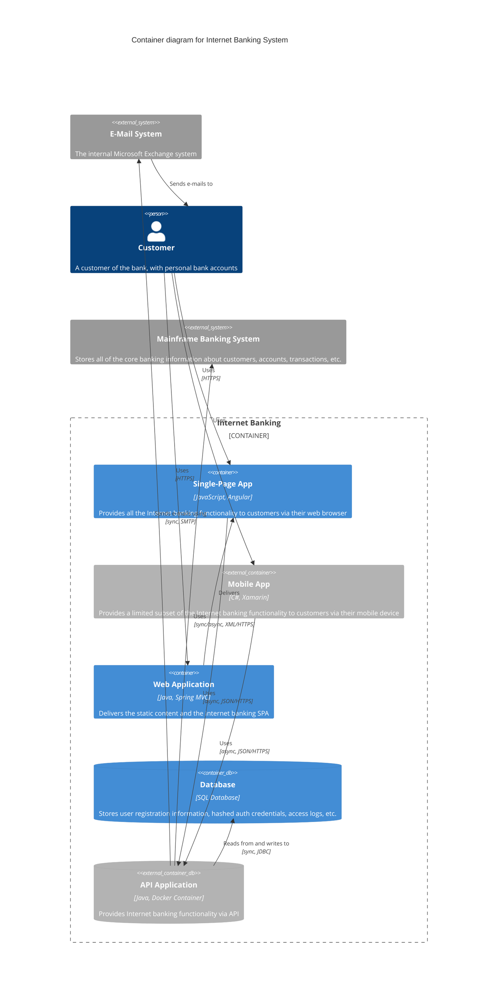
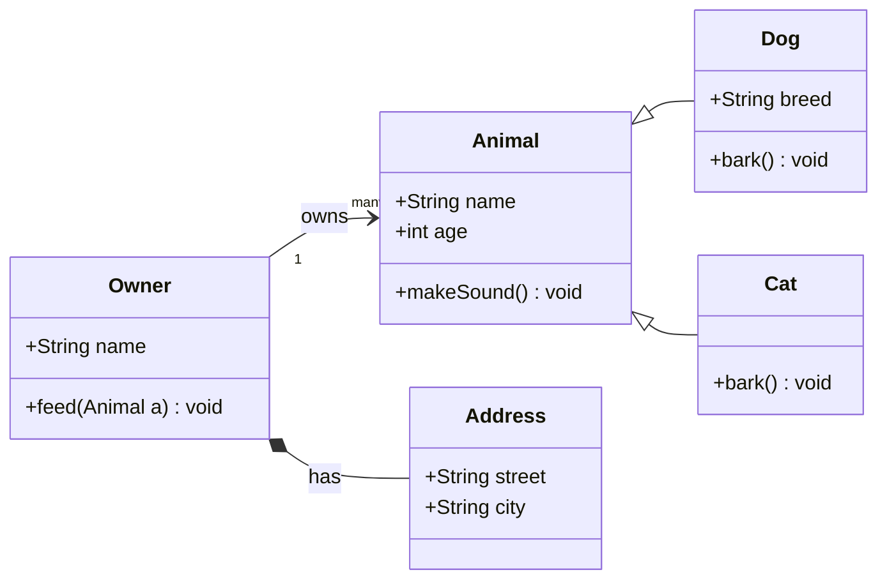
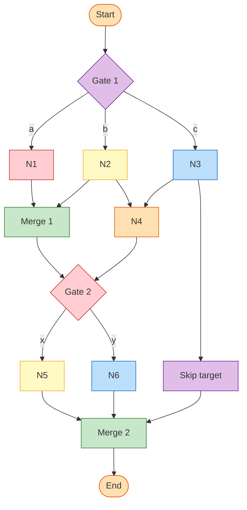

# Bisect A2

## c4

```mermaid
C4Container
    title Container diagram for Internet Banking System

    System_Ext(email_system, "E-Mail System", "The internal Microsoft Exchange system")
    Person(customer, "Customer", "A customer of the bank, with personal bank accounts")

    Container_Boundary(c1, "Internet Banking") {
        Container(spa, "Single-Page App", "JavaScript, Angular", "Provides all the Internet banking functionality to customers via their web browser")
        Container_Ext(mobile_app, "Mobile App", "C#, Xamarin", "Provides a limited subset of the Internet banking functionality to customers via their mobile device")
        Container(web_app, "Web Application", "Java, Spring MVC", "Delivers the static content and the Internet banking SPA")
        ContainerDb(database, "Database", "SQL Database", "Stores user registration information, hashed auth credentials, access logs, etc.")
        ContainerDb_Ext(backend_api, "API Application", "Java, Docker Container", "Provides Internet banking functionality via API")
    }

    System_Ext(banking_system, "Mainframe Banking System", "Stores all of the core banking information about customers, accounts, transactions, etc.")

    Rel(customer, web_app, "Uses", "HTTPS")
    Rel(customer, spa, "Uses", "HTTPS")
    Rel(customer, mobile_app, "Uses")

    Rel(web_app, spa, "Delivers")
    Rel(spa, backend_api, "Uses", "async, JSON/HTTPS")
    Rel(mobile_app, backend_api, "Uses", "async, JSON/HTTPS")
    Rel_Back(database, backend_api, "Reads from and writes to", "sync, JDBC")

    Rel(email_system, customer, "Sends e-mails to")
    Rel(backend_api, email_system, "Sends e-mails using", "sync, SMTP")
    Rel(backend_api, banking_system, "Uses", "sync/async, XML/HTTPS")
```

## class-diagram

```mermaid
classDiagram
  direction LR
  class Animal {
    +String name
    +int age
    +makeSound() void
  }
  class Dog {
    +String breed
    +bark() void
  }
  class Cat {
    +bark() void
  }
  class Owner {
    +String name
    +feed(Animal a) void
  }
  Animal <|-- Dog
  Animal <|-- Cat
  Owner "1" --> "many" Animal : owns
  Owner *-- Address : has
  class Address {
    +String street
    +String city
  }
```

## colors

```mermaid
flowchart TD
    classDef clair fill:#D9E2F3
    classDef sombre fill:#1F3864
    A[Fond clair]:::clair --> B[Fond sombre]:::sombre
    classDef alerte stroke:#CC0000,fill:#FFD9D9
    B --> C[Alerte]:::alerte
    C --> D[Style direct]
    style D fill:#FFDD00,stroke:#333333
    D --> E[Lien vert]
    classDef partagee1,partagee2 stroke:#0000CC,fill:#CCE5FF
    E --> F[Classe partagee]:::partagee1
    F --> G[Autre classe partagee]:::partagee2
    linkStyle 3 stroke:#00AA00,stroke-width:3px
```

## crossing-stress-15node

```mermaid
flowchart TD
    Start([Start]) --> Gate1{Gate 1}
    Gate1 -->|a| N1[N1]
    Gate1 -->|b| N2[N2]
    Gate1 -->|c| N3[N3]
    N1 --> Merge1[Merge 1]
    N2 --> Merge1
    N2 --> N4[N4]
    N3 --> N4
    N3 --> Skip[Skip target]
    Merge1 --> Gate2{Gate 2}
    N4 --> Gate2
    Gate2 -->|x| N5[N5]
    Gate2 -->|y| N6[N6]
    N5 --> Merge2[Merge 2]
    N6 --> Merge2
    Skip --> Merge2
    Merge2 --> End([End])
    style Start fill:#FFE0B2,stroke:#E65100
    style Gate1 fill:#E1BEE7,stroke:#6A1B9A
    style N1 fill:#FFCDD2,stroke:#C62828
    style N2 fill:#FFF9C4,stroke:#F9A825
    style N3 fill:#BBDEFB,stroke:#1565C0
    style Merge1 fill:#C8E6C9,stroke:#2E7D32
    style N4 fill:#FFE0B2,stroke:#E65100
    style Skip fill:#E1BEE7,stroke:#6A1B9A
    style Gate2 fill:#FFCDD2,stroke:#C62828
    style N5 fill:#FFF9C4,stroke:#F9A825
    style N6 fill:#BBDEFB,stroke:#1565C0
    style Merge2 fill:#C8E6C9,stroke:#2E7D32
    style End fill:#FFE0B2,stroke:#E65100
```

