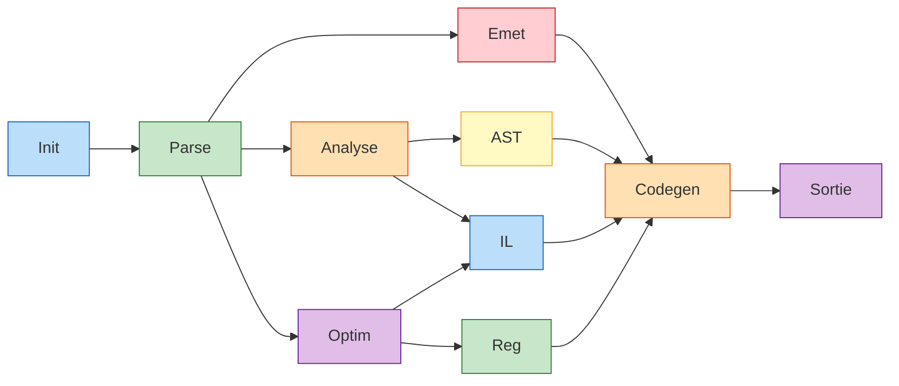
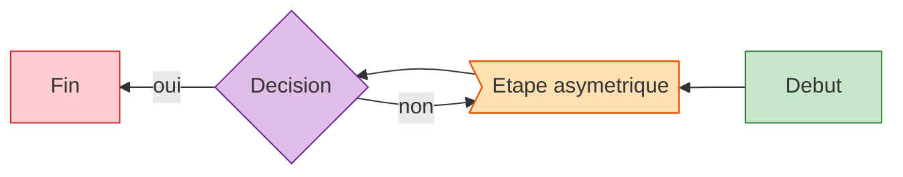
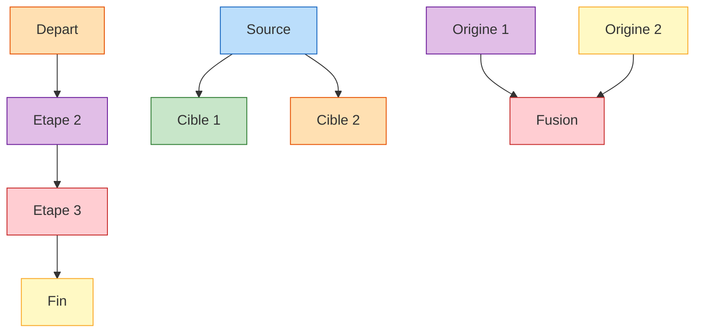
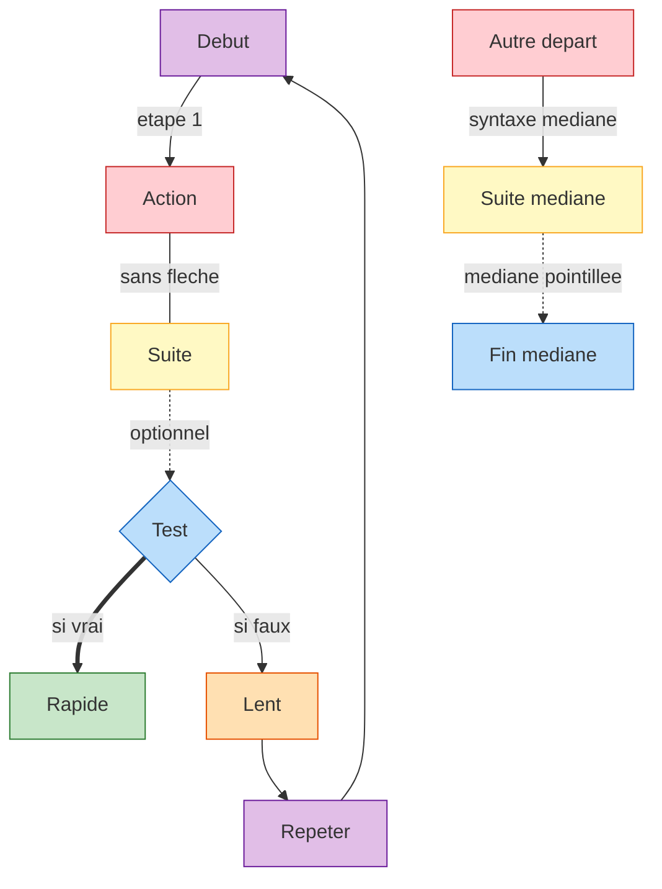

# Bisect A4

## dense

```mermaid
flowchart LR
    A[Init] --> B[Parse]
    B --> C[Analyse]
    B --> D[Optim]
    B --> E[Emet]
    C --> F[AST]
    C --> G[IL]
    D --> G
    D --> H[Reg]
    E --> I[Codegen]
    F --> I
    G --> I
    H --> I
    I --> J[Sortie]
    style A fill:#BBDEFB,stroke:#1565C0
    style B fill:#C8E6C9,stroke:#2E7D32
    style C fill:#FFE0B2,stroke:#E65100
    style D fill:#E1BEE7,stroke:#6A1B9A
    style E fill:#FFCDD2,stroke:#C62828
    style F fill:#FFF9C4,stroke:#F9A825
    style G fill:#BBDEFB,stroke:#1565C0
    style H fill:#C8E6C9,stroke:#2E7D32
    style I fill:#FFE0B2,stroke:#E65100
    style J fill:#E1BEE7,stroke:#6A1B9A
```

## direction-and-asymmetric-shape

```mermaid
flowchart RL
    Start[Debut] --> Flag>Etape asymetrique]
    Flag --> Check{Decision}
    Check -->|oui| End[Fin]
    Check -->|non| Flag
    style Start fill:#C8E6C9,stroke:#2E7D32
    style Flag fill:#FFE0B2,stroke:#E65100
    style Check fill:#E1BEE7,stroke:#6A1B9A
    style End fill:#FFCDD2,stroke:#C62828
```

## edge-chaining

```mermaid
flowchart TD
    A[Depart] --> B[Etape 2] --> C[Etape 3] --> D[Fin]
    E[Source] --> F[Cible 1] & G[Cible 2]
    H[Origine 1] & I[Origine 2] --> J[Fusion]
    style A fill:#FFE0B2,stroke:#E65100
    style B fill:#E1BEE7,stroke:#6A1B9A
    style C fill:#FFCDD2,stroke:#C62828
    style D fill:#FFF9C4,stroke:#F9A825
    style E fill:#BBDEFB,stroke:#1565C0
    style F fill:#C8E6C9,stroke:#2E7D32
    style G fill:#FFE0B2,stroke:#E65100
    style H fill:#E1BEE7,stroke:#6A1B9A
    style J fill:#FFCDD2,stroke:#C62828
    style I fill:#FFF9C4,stroke:#F9A825
```

## edge-labels

```mermaid
flowchart TD
    A[Debut] -->|etape 1| B[Action]
    B ---|sans fleche| C[Suite]
    C -.->|optionnel| D{Test}
    D ==>|si vrai| E[Rapide]
    D -->|si faux| F[Lent]
    F --> G[Repeter] --> A
    H[Autre depart]-- syntaxe mediane -->I[Suite mediane]
    I-. mediane pointillee .->J[Fin mediane]
    style A fill:#E1BEE7,stroke:#6A1B9A
    style B fill:#FFCDD2,stroke:#C62828
    style C fill:#FFF9C4,stroke:#F9A825
    style D fill:#BBDEFB,stroke:#1565C0
    style E fill:#C8E6C9,stroke:#2E7D32
    style F fill:#FFE0B2,stroke:#E65100
    style G fill:#E1BEE7,stroke:#6A1B9A
    style H fill:#FFCDD2,stroke:#C62828
    style I fill:#FFF9C4,stroke:#F9A825
    style J fill:#BBDEFB,stroke:#1565C0
```

