# Bisect B

## edge-types-extended

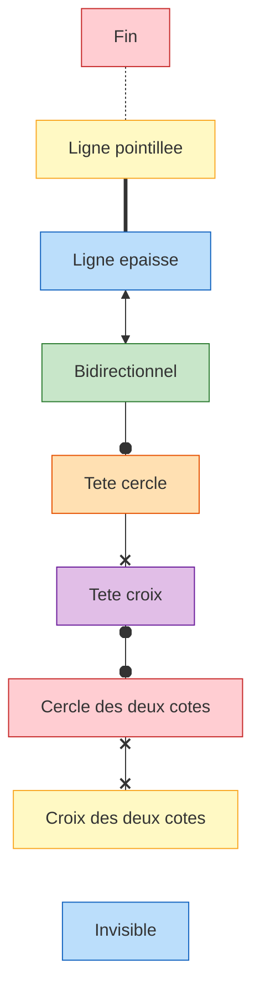

## edge-types

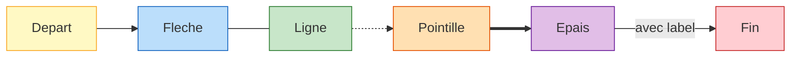

## er-diagram

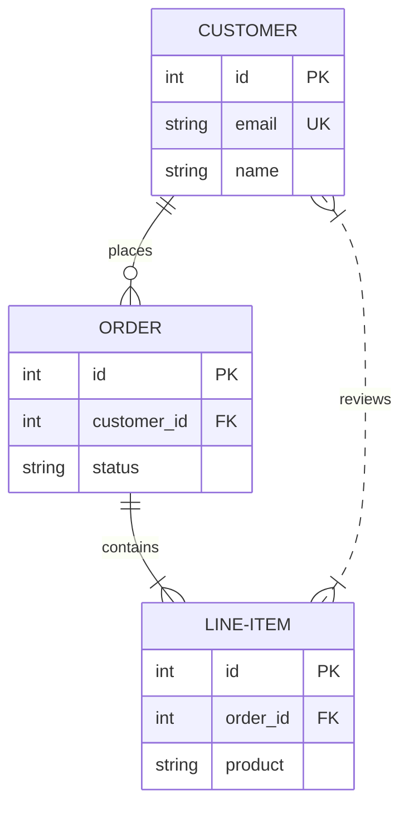

## escape-xml

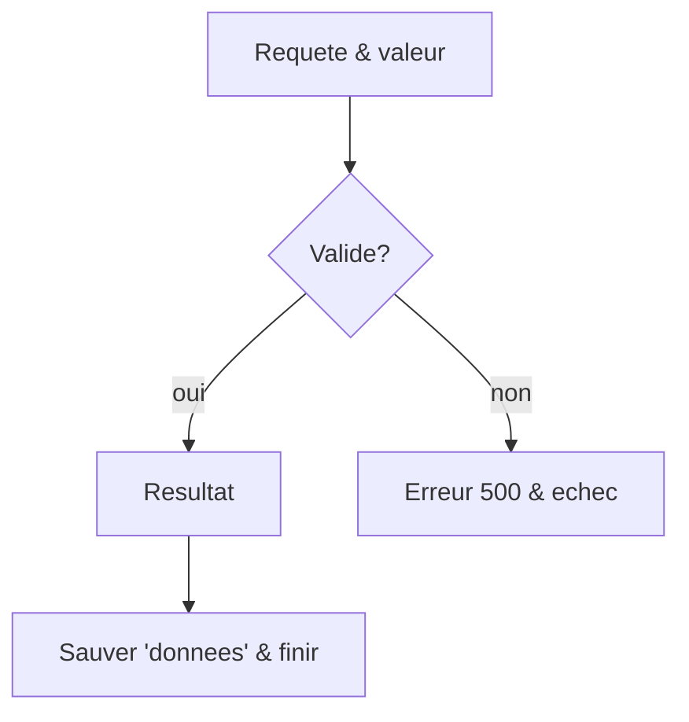

## eventmodeling

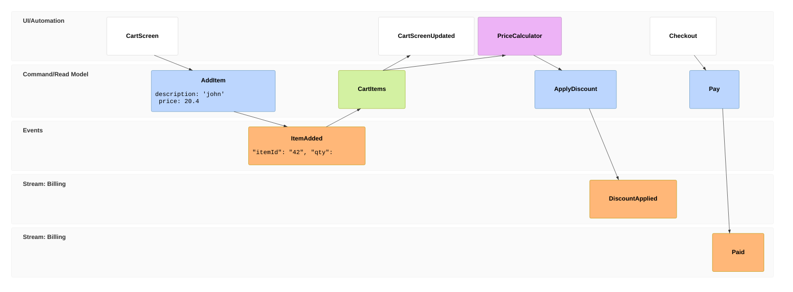

## fan-out

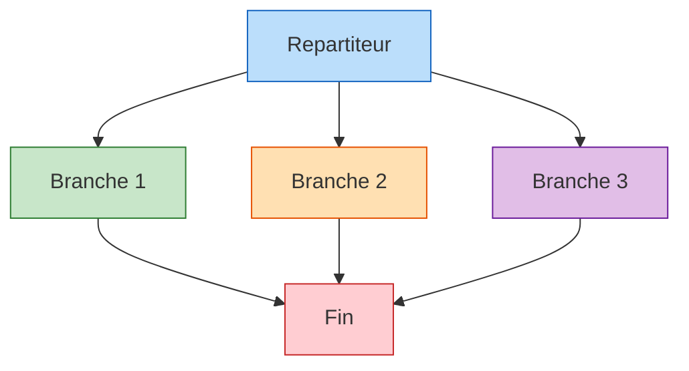

## gantt

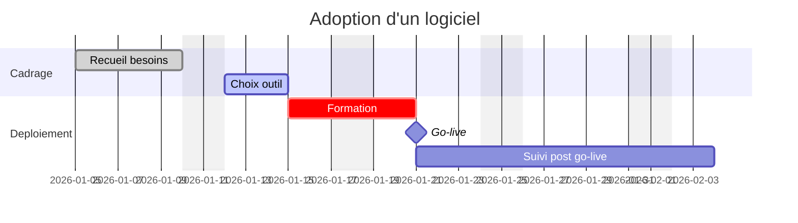

## git-graph

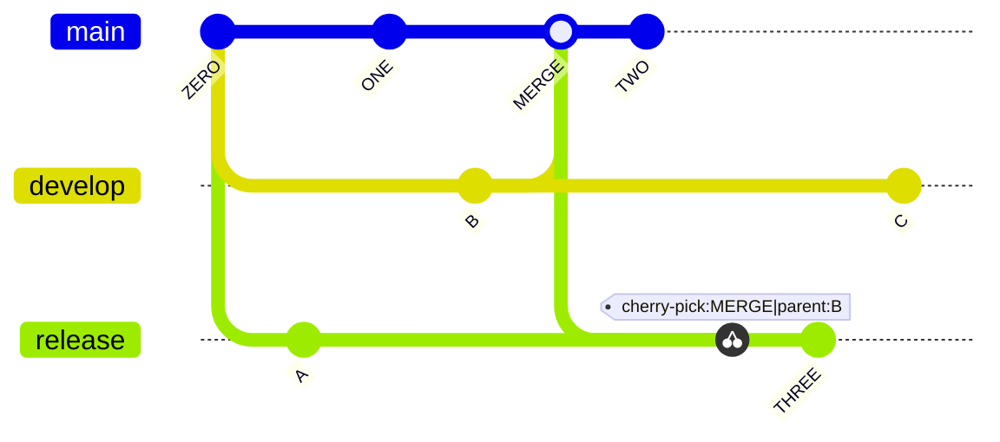

## ishikawa

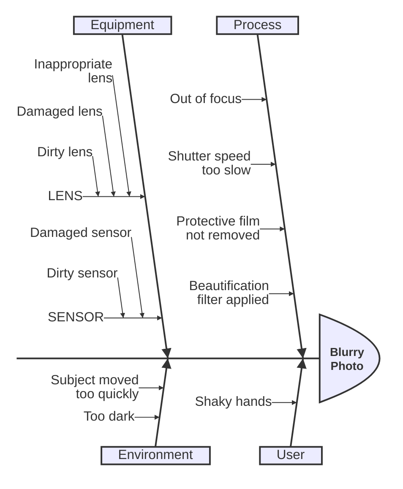

## isolated

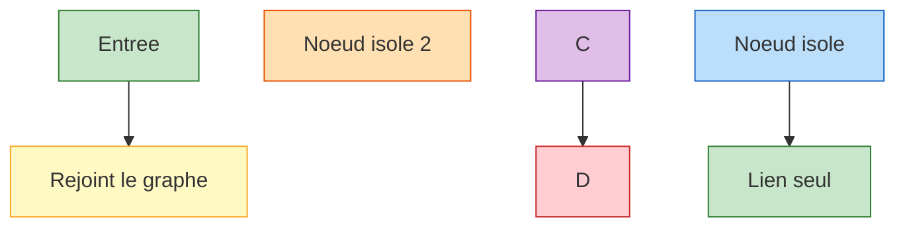

## journey

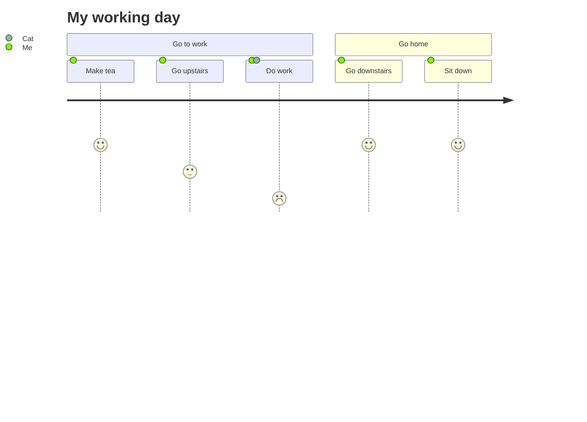

## kanban

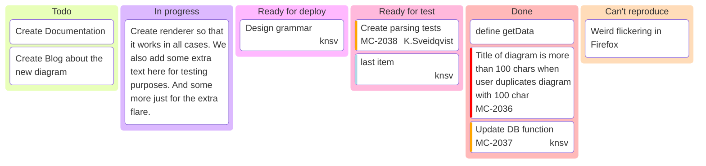

## long-labels

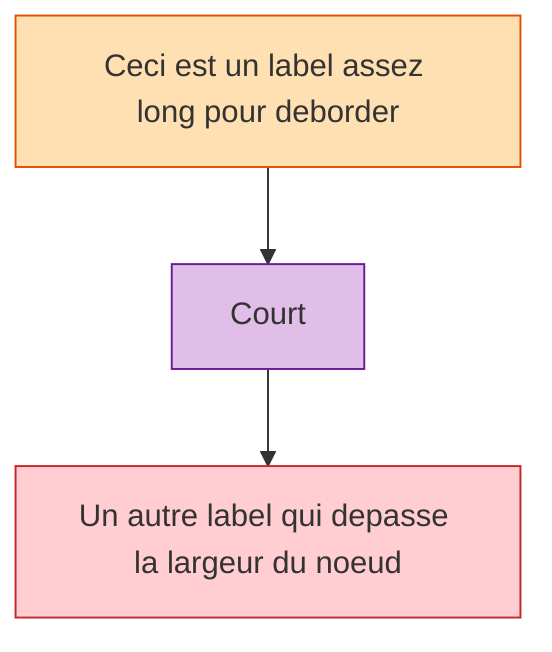

## lr-direction

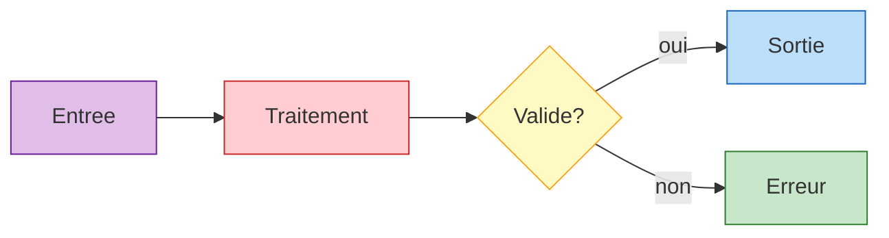

## lr-subgraphs

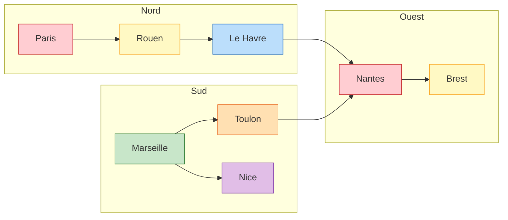

