# Bisect C

## medium-realistic

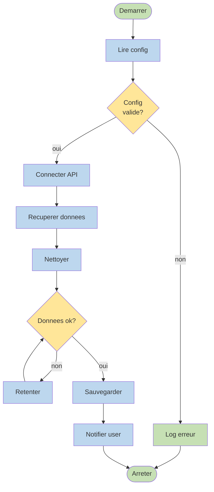

## mindmap

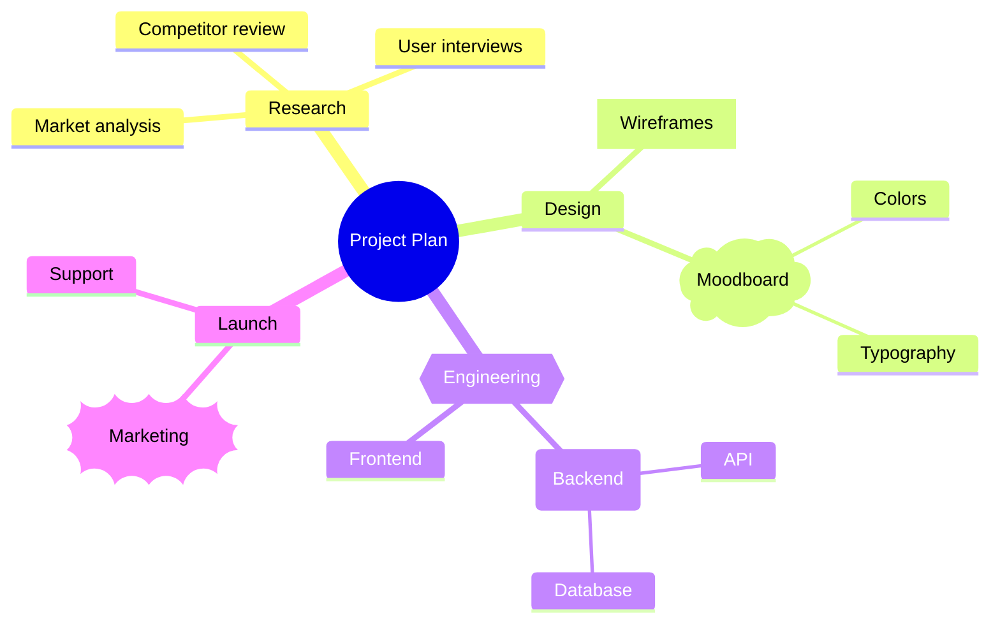

## minimal

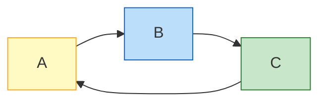

## mixed

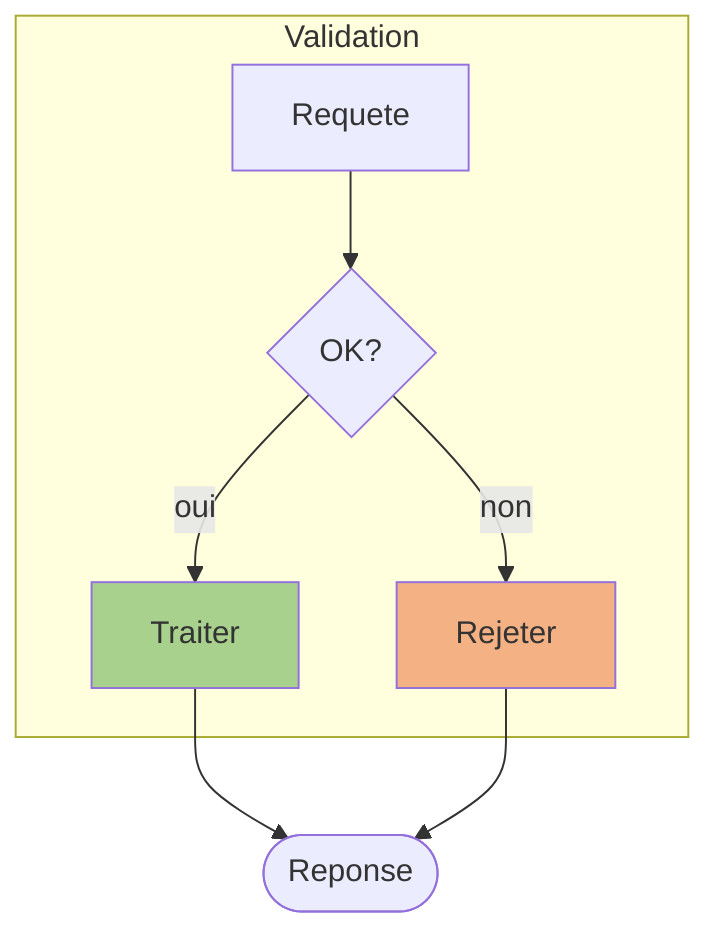

## multiple-subgraphs

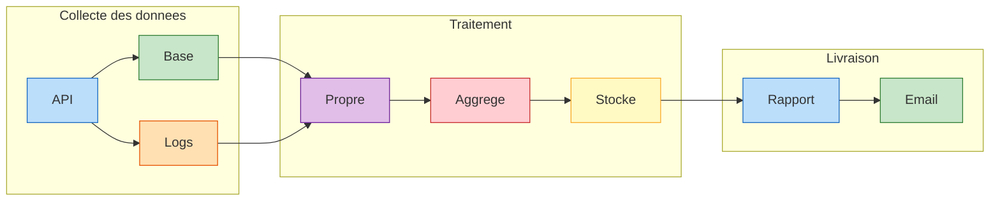

## nested-3-levels

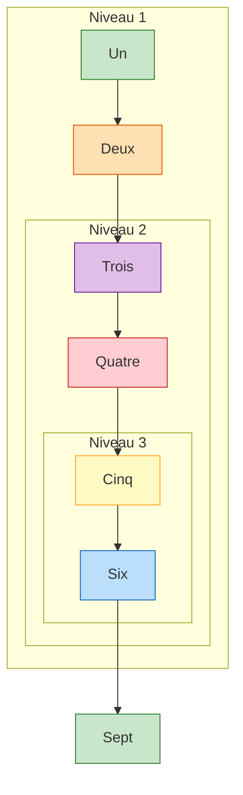

## order-flow

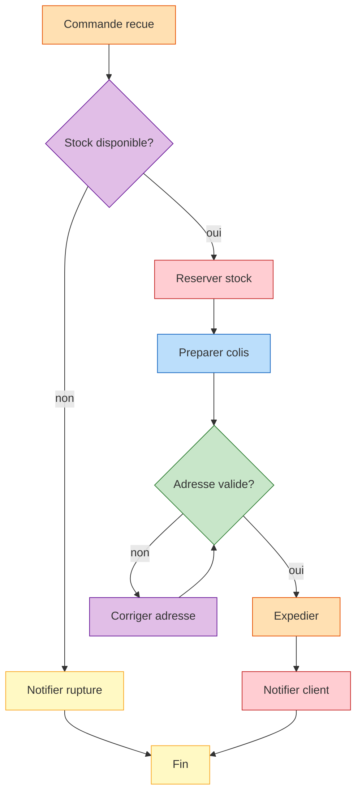

## packet

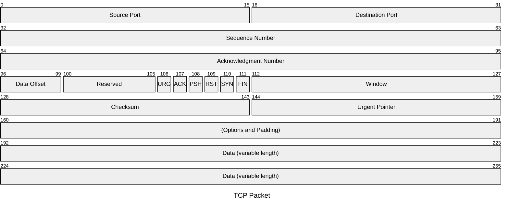

## pie

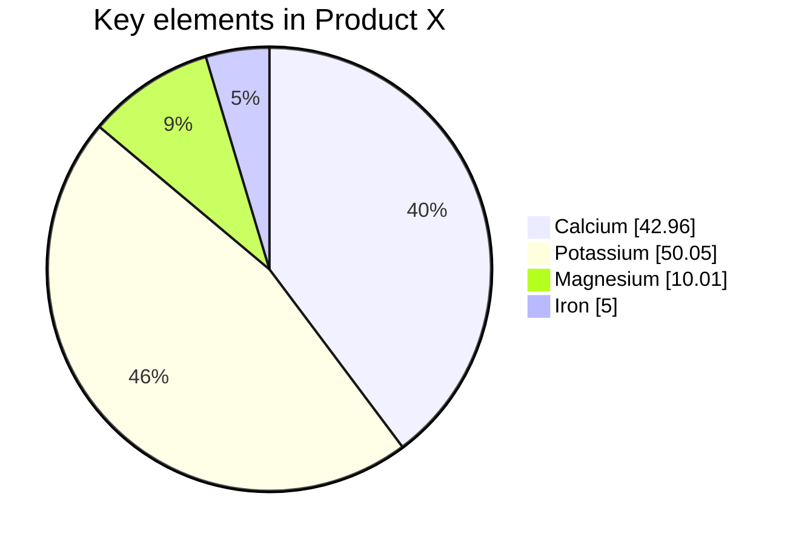

## quadrant

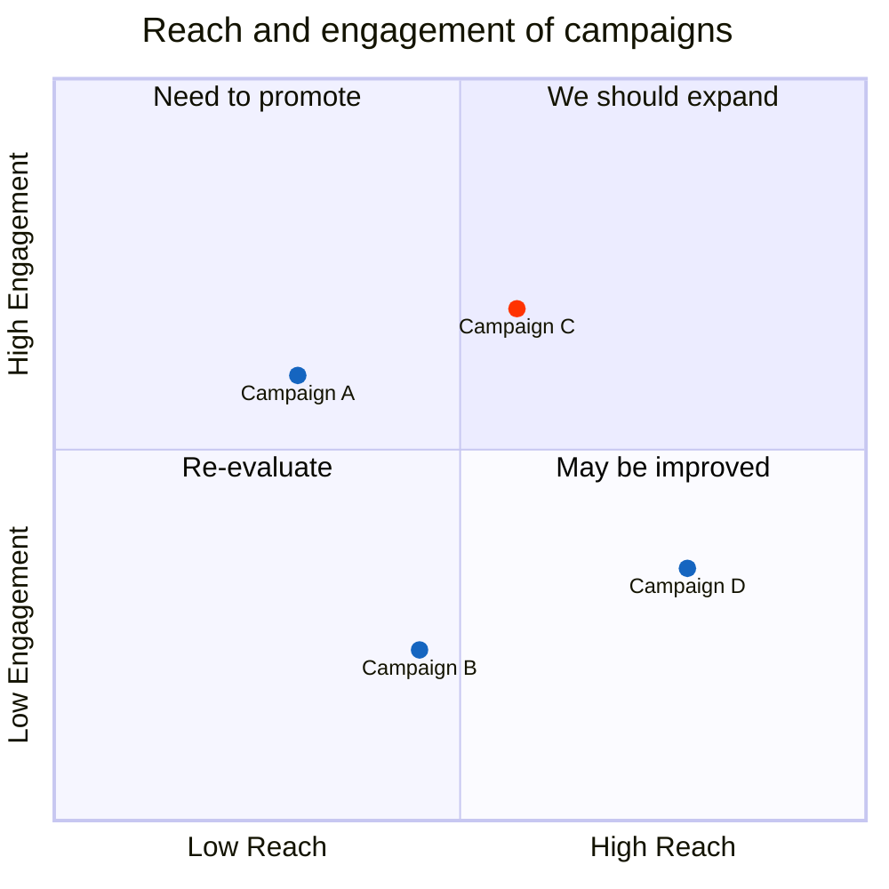

## radar

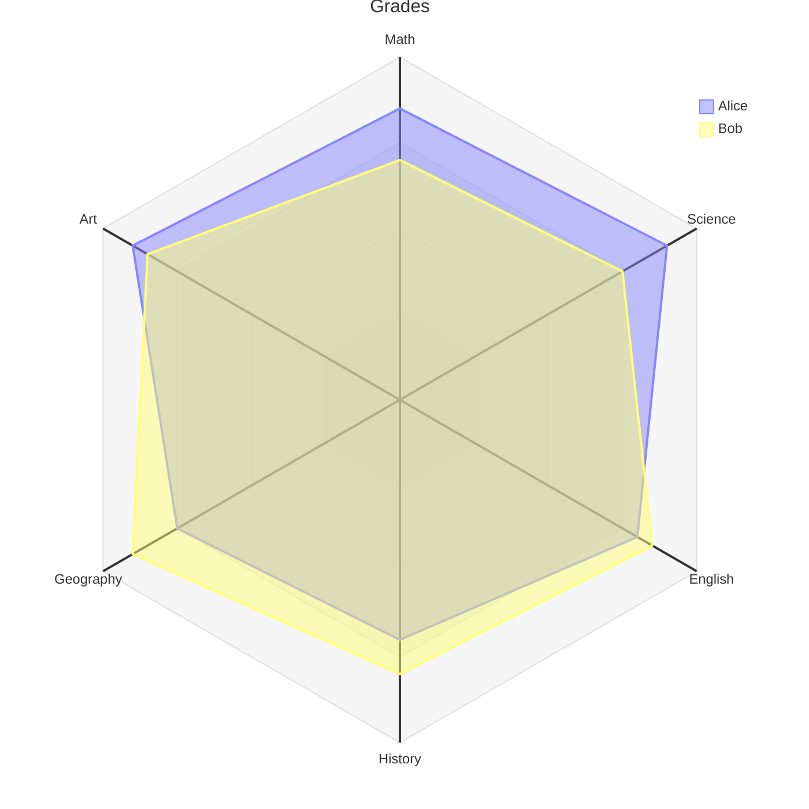

## requirement-diagram

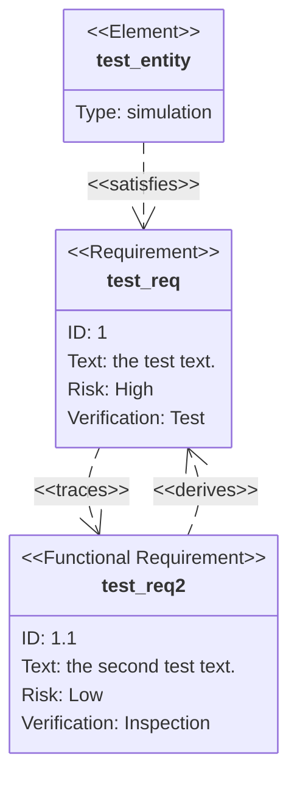

## rich-text

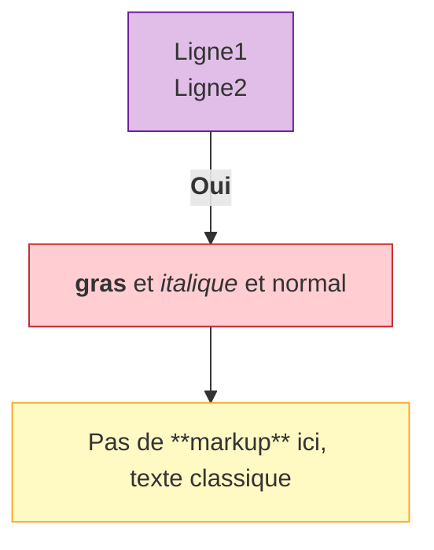

## rl-direction

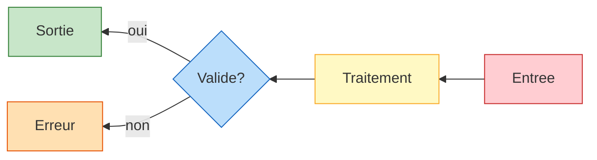

## sankey

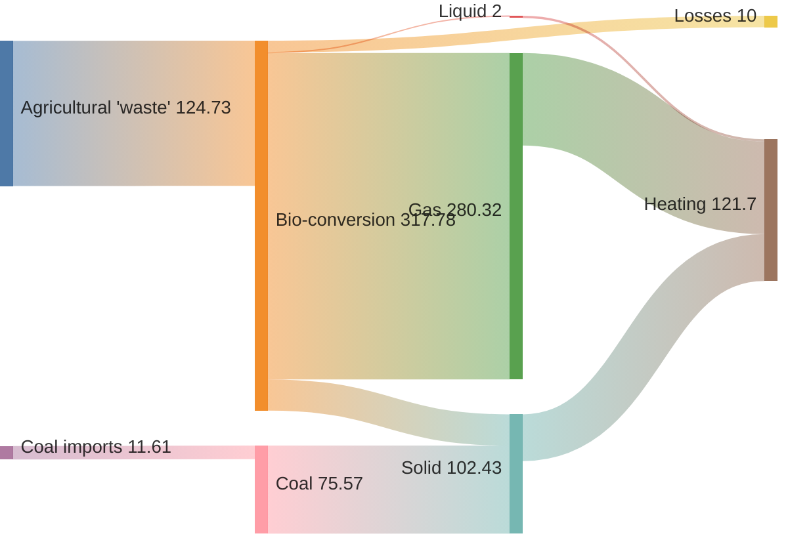

## self-loop

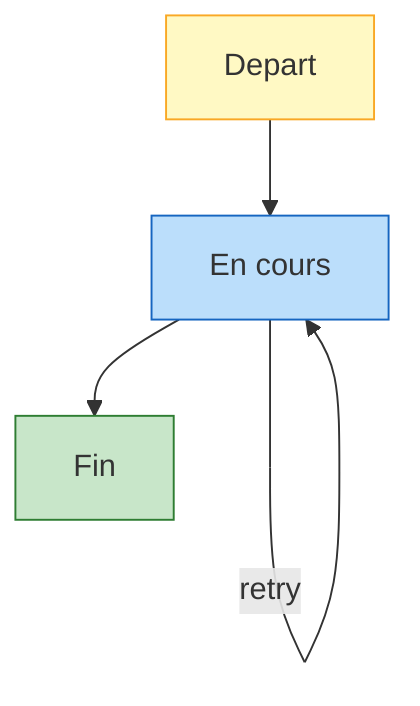

