# Bisect D

## sequence

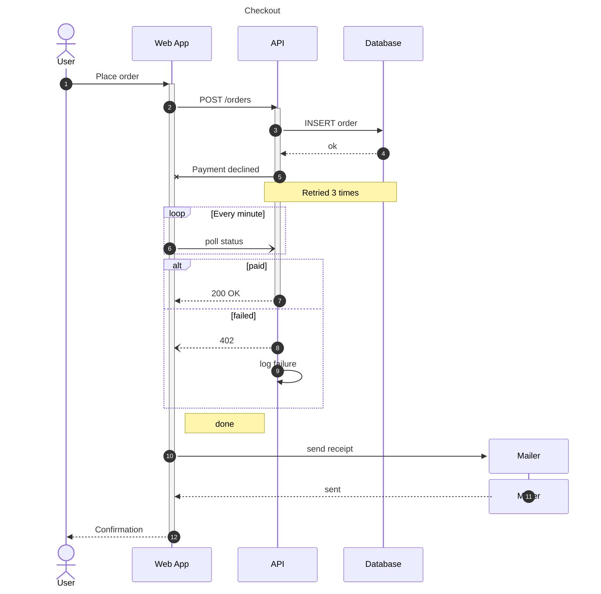


## shapes-generic

```mermaid
flowchart TD
    A1@{ shape: doc, label: "Document" } --> A2@{ shape: card, label: "Carte" }
    A2 --> A3@{ shape: delay, label: "Delai" }
    A3 --> A4@{ shape: triangle, label: "Extraction" }
    A4 --> A5@{ shape: flipped-triangle, label: "Fichier manuel" }
    A5 --> A6@{ shape: win-pane, label: "Stockage interne" }
    A6 --> A7@{ shape: hourglass, label: "Collationnement" }
    A7 --> A8@{ shape: curv-trap, label: "Affichage" }
    A8 --> A9@{ shape: com-link, label: "Liaison" }
    A9 --> A10@{ shape: brace, label: "Commentaire" }
    A10 --> A11@{ shape: braces, label: "Double accolade" }
    A11 --> A12@{ shape: crossed-circle, label: "Resume" }
    A12 --> A13@{ shape: junction, label: "Jonction" }
    A13 --> A14@{ shape: paper-tape, label: "Bande papier" }
    A14 --> A15@{ shape: das, label: "Acces direct" }
    A15 --> A16@{ shape: disk, label: "Disque" }
    A16 --> A17@{ shape: manual-input, label: "Saisie manuelle" }
    A17 --> A18@{ shape: rounded, label: "Evenement" }
    style A1 fill:#BBDEFB,stroke:#1565C0
    style A2 fill:#C8E6C9,stroke:#2E7D32
    style A3 fill:#FFE0B2,stroke:#E65100
    style A4 fill:#E1BEE7,stroke:#6A1B9A
    style A5 fill:#FFCDD2,stroke:#C62828
    style A6 fill:#FFF9C4,stroke:#F9A825
    style A7 fill:#BBDEFB,stroke:#1565C0
    style A8 fill:#C8E6C9,stroke:#2E7D32
    style A9 fill:#FFE0B2,stroke:#E65100
    style A10 fill:#E1BEE7,stroke:#6A1B9A
    style A11 fill:#FFCDD2,stroke:#C62828
    style A12 fill:#FFF9C4,stroke:#F9A825
    style A13 fill:#BBDEFB,stroke:#1565C0
    style A14 fill:#C8E6C9,stroke:#2E7D32
    style A15 fill:#FFE0B2,stroke:#E65100
    style A16 fill:#E1BEE7,stroke:#6A1B9A
    style A17 fill:#FFCDD2,stroke:#C62828
    style A18 fill:#FFF9C4,stroke:#F9A825
```


## shapes

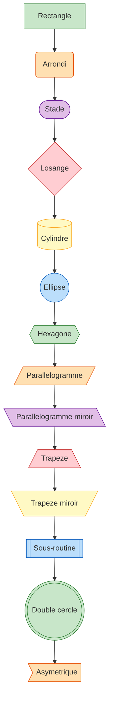


## state-diagram

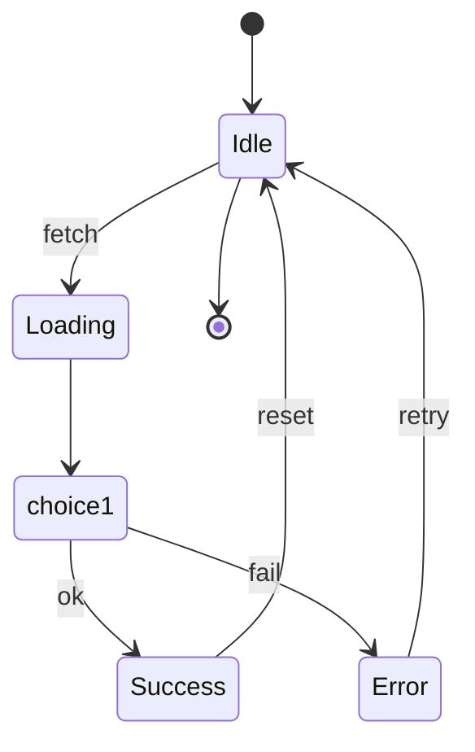


## subgraph

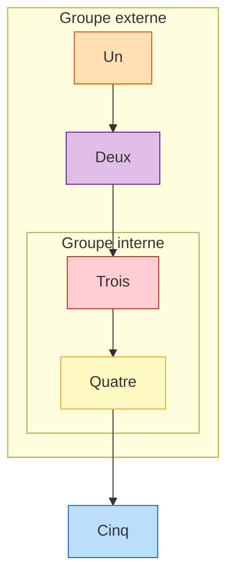


## swimlane

```mermaid
swimlane-beta LR
  subgraph Customer[Customer]
    Order[Place order]
    Pay(Pay invoice)
  end
  subgraph Store[Store]
    Pack[Pack items]
    Decision{In stock?}
  end
  subgraph Carrier[Carrier]
    Ship([Ship package])
  end

  Order --> Decision
  Decision -->|Yes| Pack
  Decision -->|No| Order
  Pack --> Ship
  Ship --> Pay
    style Order fill:#E1BEE7,stroke:#6A1B9A
    style Pay fill:#FFCDD2,stroke:#C62828
    style Pack fill:#FFF9C4,stroke:#F9A825
    style Decision fill:#BBDEFB,stroke:#1565C0
    style Ship fill:#C8E6C9,stroke:#2E7D32
```


## timeline

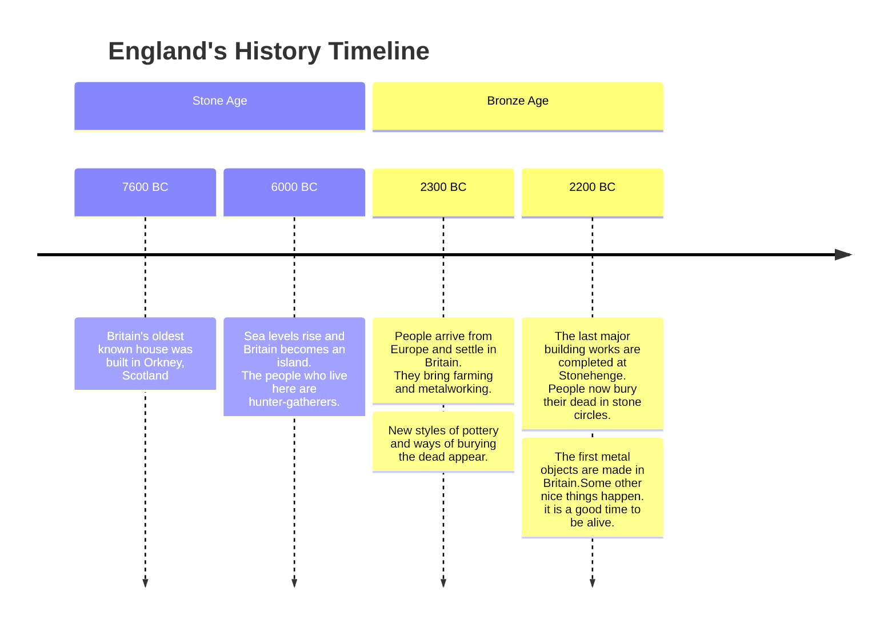


## tree-view


## tree

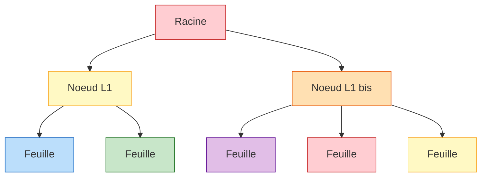


## treemap

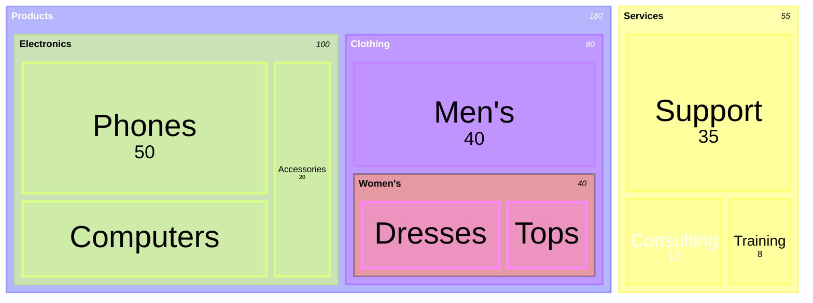


## venn

```mermaid
venn-beta
  title Skills coverage
  set A ["Design"]
  set B ["Code"]
  set C ["Writing"]
  union A,B
    text ["Design+Code"]
  union B,C
    text ["Code+Writing"]
  union A,C
    text ["Design+Writing"]
  union A,B,C
    text ["All three"]
  style A fill:#BBDEFB
  style B fill:#C8E6C9
  style C fill:#FFE0B2
```


## wardley

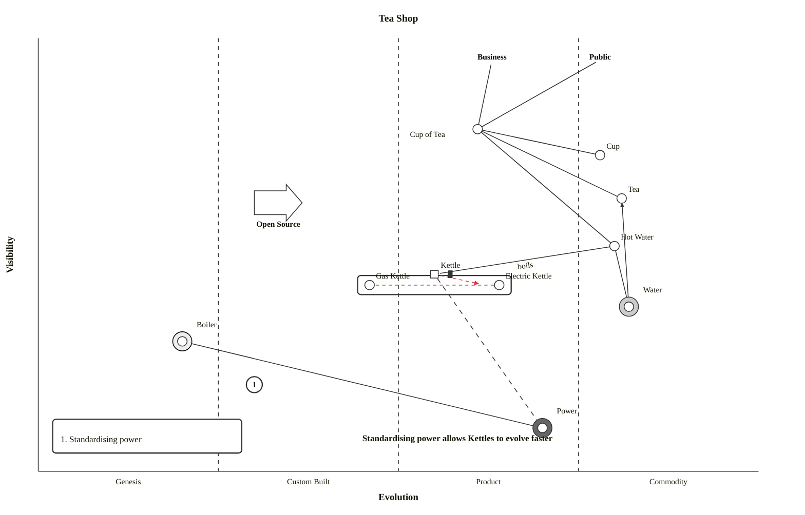


## xychart-horizontal

```mermaid
xychart horizontal
    title "Team velocity"
    x-axis "Sprint" ["S1", "S2", "S3", "S4"]
    y-axis "Points" 0 --> 40
    bar "Planned" [30, 32, 28, 35]
    line "Done" [25 "late", 31, 27, 36]
```


## xychart

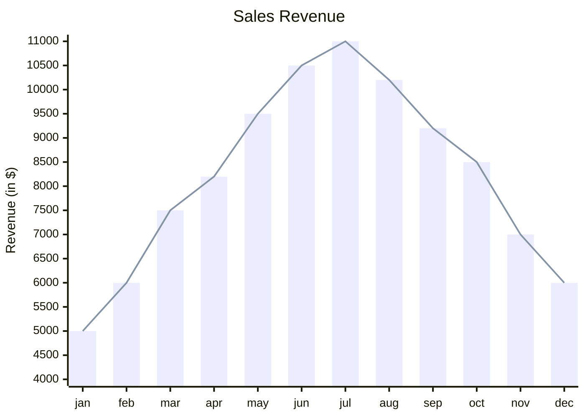


## zenuml

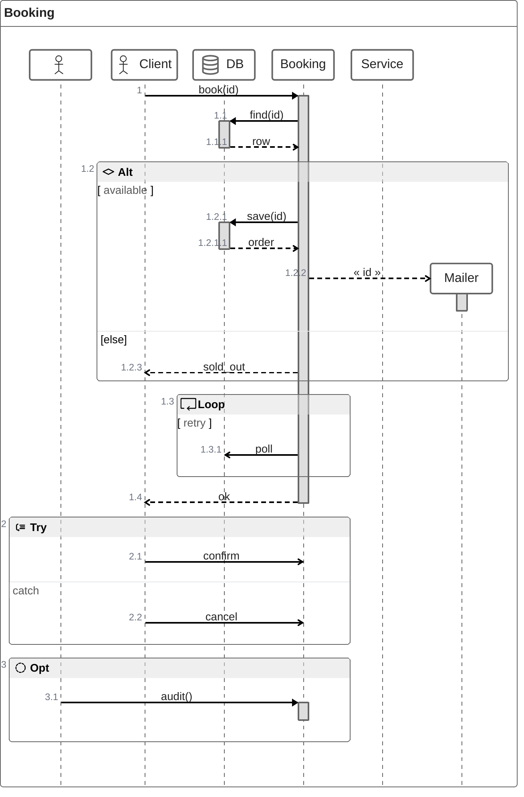
