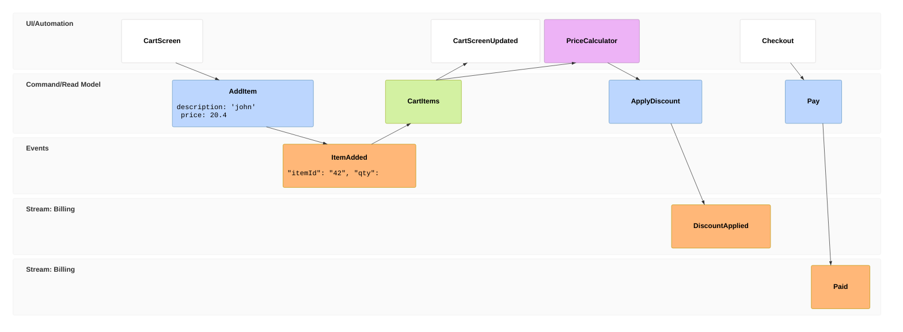

# eventmodeling

```mermaid
eventmodeling
tf 01 ui CartScreen
tf 02 cmd AddItem [[AddItem01]]
tf 03 evt ItemAdded ->> 02 {"itemId": "42", "qty": 1}
tf 04 rmo CartItems ->> 03
tf 05 ui CartScreenUpdated ->> 04
tf 06 pcr PriceCalculator ->> 04
tf 07 cmd ApplyDiscount ->> 06
tf 08 evt Billing.DiscountApplied ->> 07
rf 09 ui Checkout ->> 04
tf 10 cmd Pay ->> 09
tf 11 evt Billing.Paid ->> 10
data AddItem01 {
  description: 'john'
  price: 20.4
}
note 03 {
  stock reserved elsewhere
}
gwt 03 given evt ItemAdded when cmd AddItem then evt ItemAdded
```
