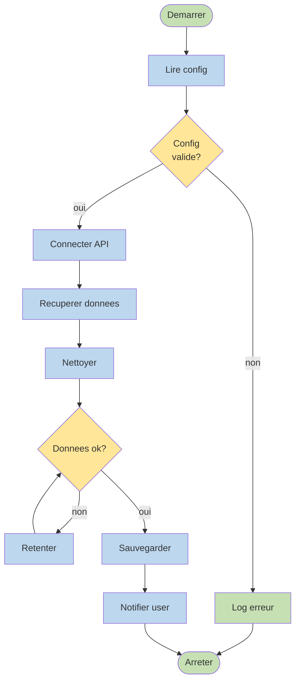

# Word verification — medium-realistic

```mermaid
flowchart TD
    classDef process fill:#BDD7EE
    classDef gate fill:#FFE699
    classDef terminal fill:#C6E0B4
    Start([Demarrer]):::terminal --> Lire[Lire config]:::process
    Lire --> Valider{Config
 valide?}:::gate
    Valider -->|non| Erreur[Log erreur]:::terminal
    Erreur --> Stop([Arreter]):::terminal
    Valider -->|oui| Connect[Connecter API]:::process
    Connect --> Fetch[Recuperer donnees]:::process
    Fetch --> Clean[Nettoyer]:::process
    Clean --> Check{Donnees ok?}:::gate
    Check -->|non| Retry[Retenter]:::process
    Retry --> Check
    Check -->|oui| Save[Sauvegarder]:::process
    Save --> Notify[Notifier user]:::process
    Notify --> Stop
```
