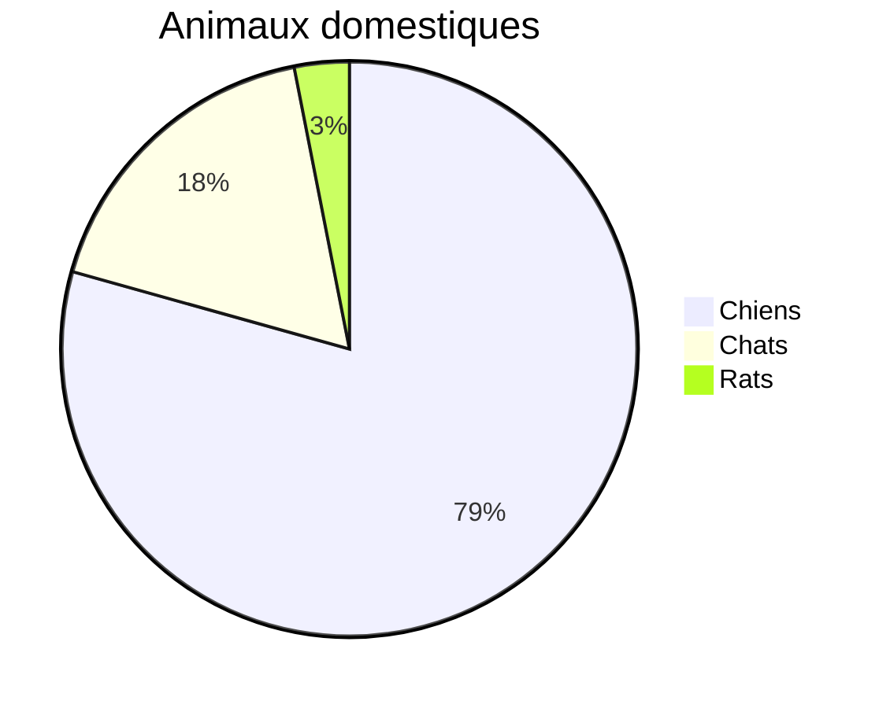
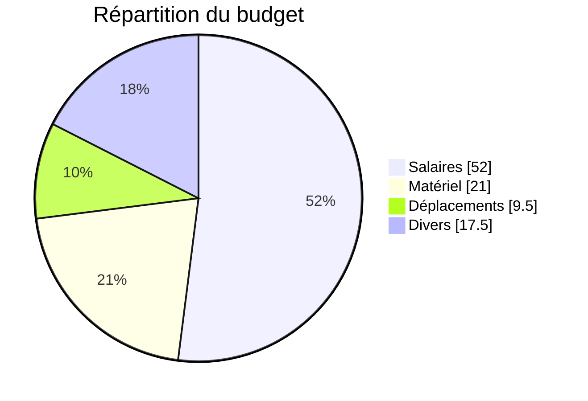
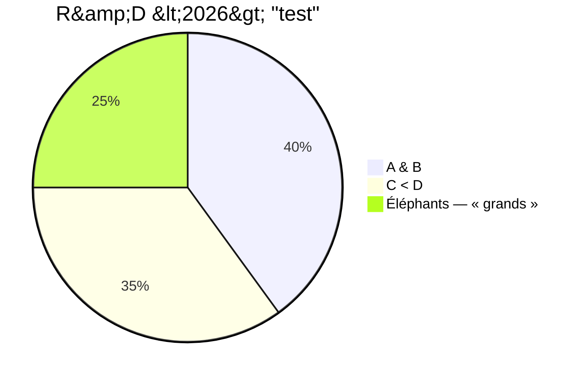

# Graphiques natifs — pie

Trois diagrammes `pie` exportés en **graphique Word natif** (objet graphique, pas des formes).

## 1. Simple

## 2. Avec valeurs (showData)

## 3. Caractères spéciaux dans les libellés

