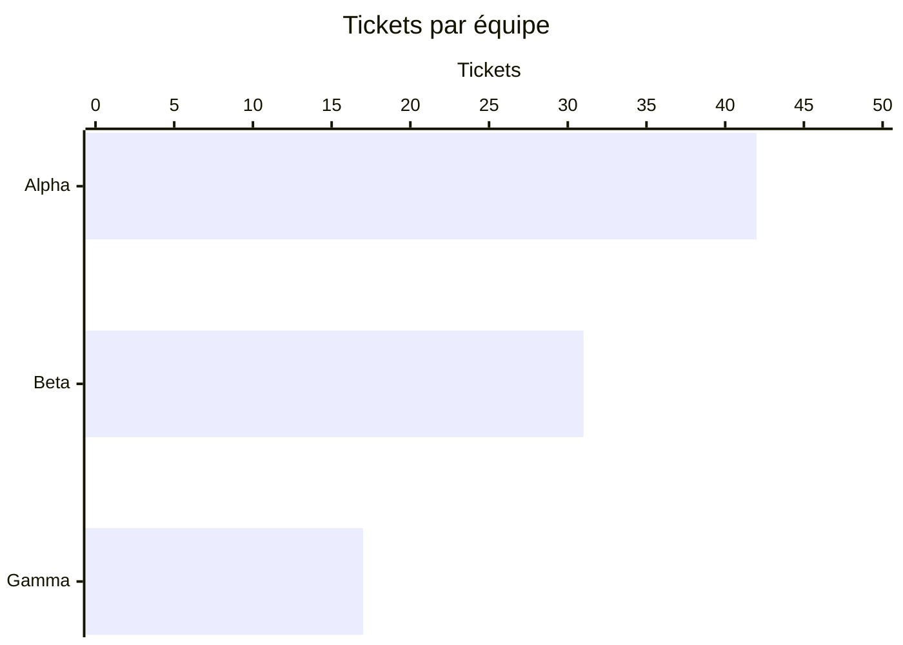
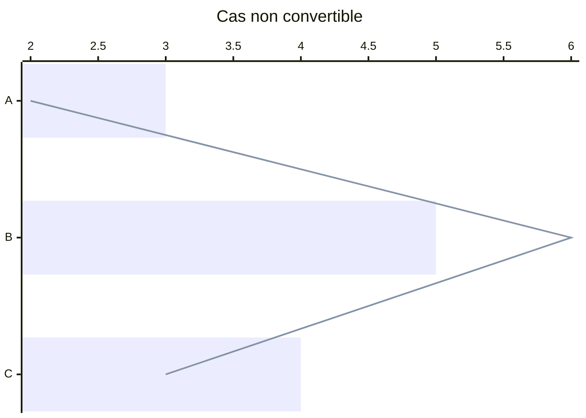
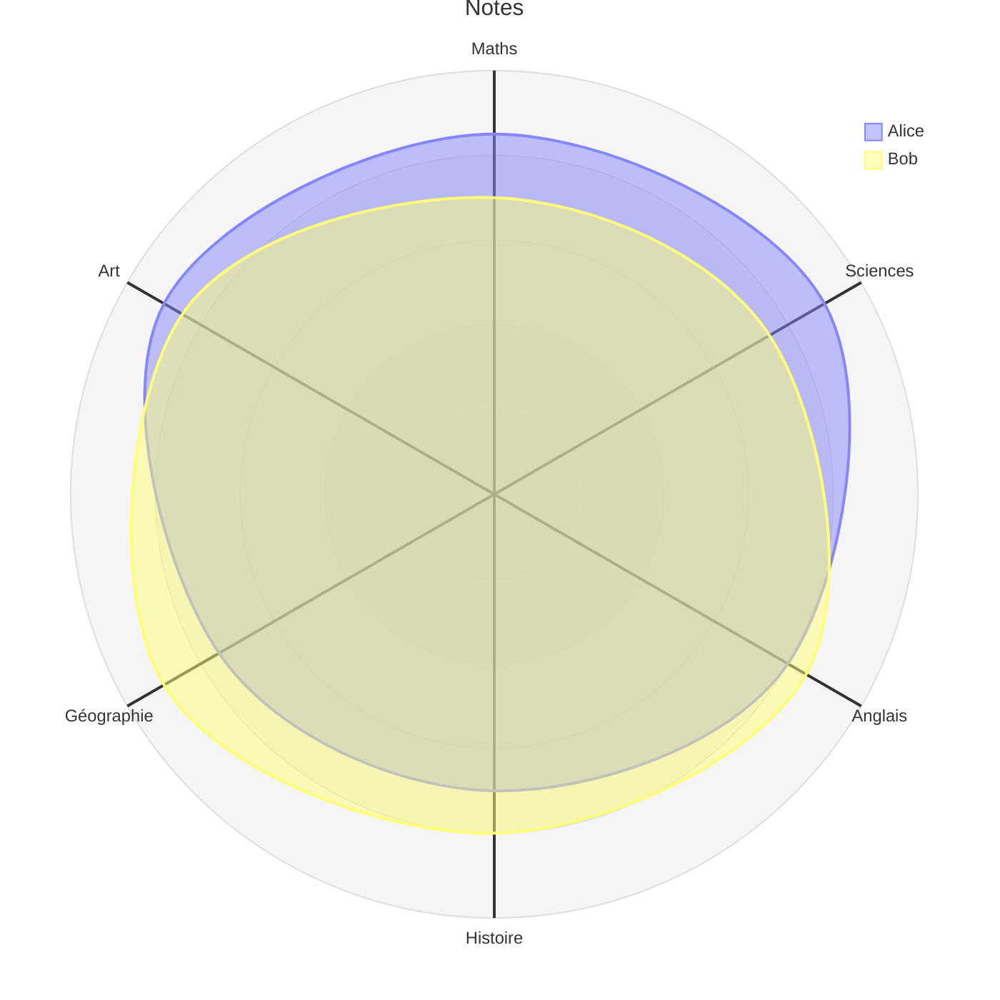

# Graphiques natifs — xychart et radar

## 1. xychart : barres + ligne (axe Y borné)

```mermaid
xychart-beta
    title "Chiffre d'affaires"
    x-axis [jan, fév, mar, avr, mai, juin]
    y-axis "Revenu (k€)" 4 --> 12
    bar [5, 6, 7.5, 8.2, 9.5, 10.5]
    line [5, 6, 7.5, 8.2, 9.5, 10.5]
```

## 2. xychart : plusieurs séries de barres, nommées

```mermaid
xychart-beta
    title "Vélocité d'équipe"
    x-axis "Sprint" ["S1", "S2", "S3", "S4"]
    y-axis "Points" 0 --> 40
    bar "Prévu" [30, 32, 28, 35]
    bar "Réalisé" [25, 31, 27, 36]
```



## 3. xychart horizontal (barres seulement)



## 4. xychart horizontal avec ligne (non convertible : reste en formes, avec avertissement)



## 5. xychart : axe X numérique

```mermaid
xychart-beta
    title "Courbe"
    x-axis "t" 0 --> 10
    line [1, 4, 9, 16, 25, 36]
```

## 6. radar


