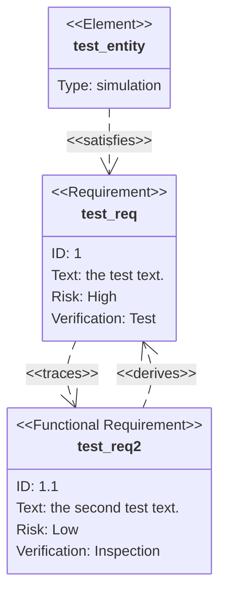

# requirement-diagram

```mermaid
requirementDiagram
  requirement test_req {
    id: 1
    text: the test text.
    risk: high
    verifymethod: test
  }
  functionalRequirement test_req2 {
    id: 1.1
    text: the second test text.
    risk: low
    verifymethod: inspection
  }
  element test_entity {
    type: simulation
  }
  test_entity - satisfies -> test_req
  test_req - traces -> test_req2
  test_req <- derives - test_req2
```
