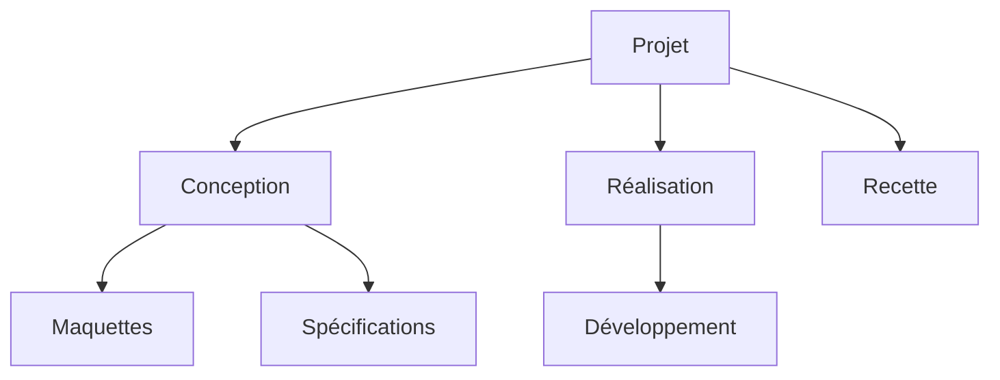
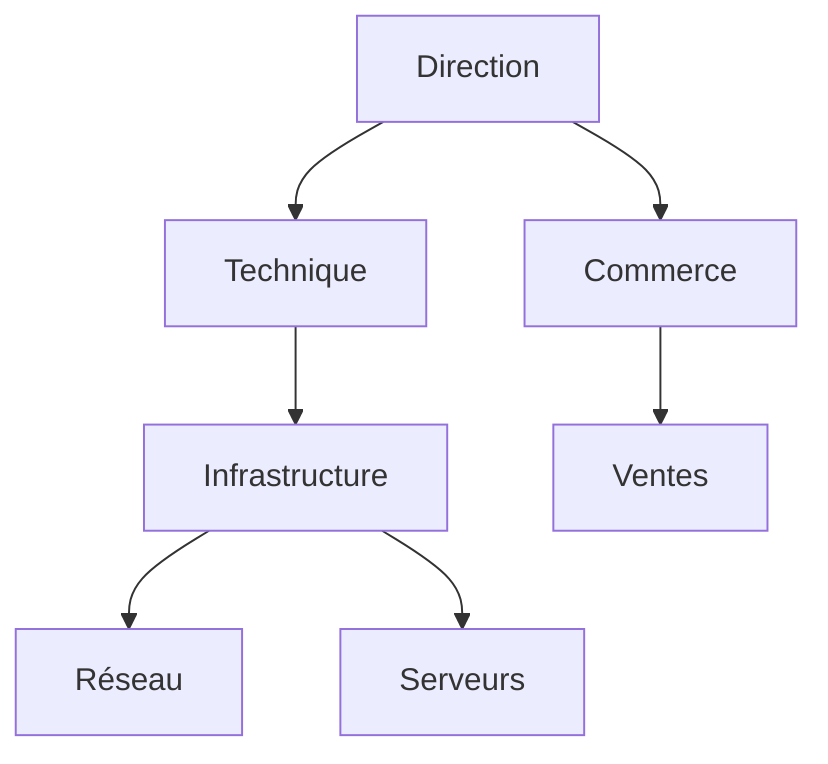
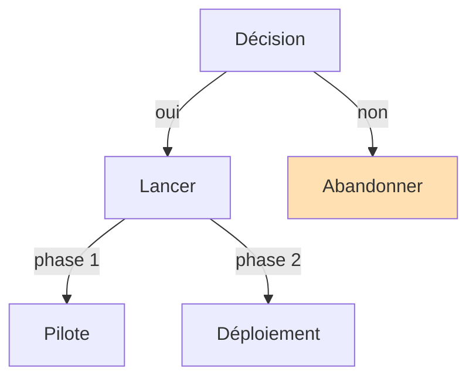
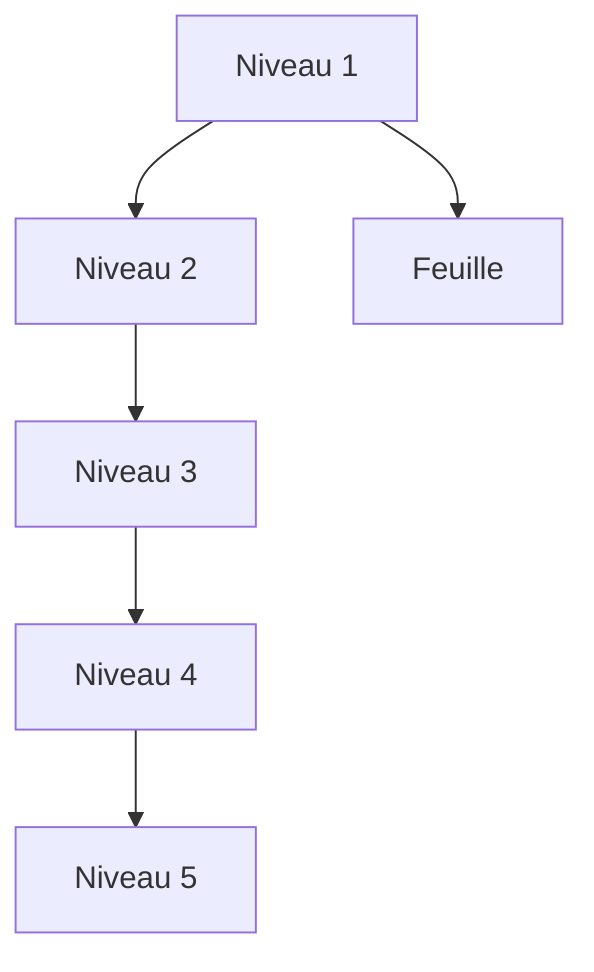
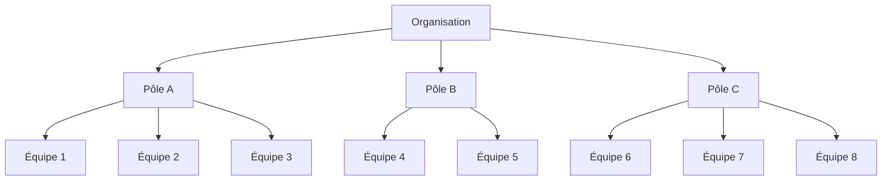
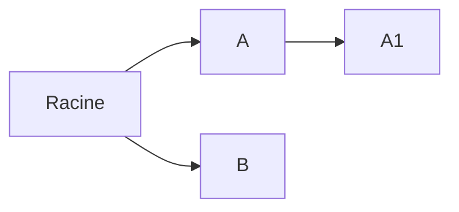

# SmartArt — arbres à plusieurs niveaux (v11)

Cinq arbres descendants (`TD`) avec petits-enfants, exportés avec **SmartArt activé**.

## 1. Trois niveaux, branches inégales

## 2. Quatre niveaux, une seule branche profonde

## 3. Libellés d'arêtes et couleur imposée

## 4. Cinq niveaux (profondeur maximale)

## 5. Huit feuilles (largeur maximale)

## 6. Retombée sur les formes natives (gauche à droite, petits-enfants)

