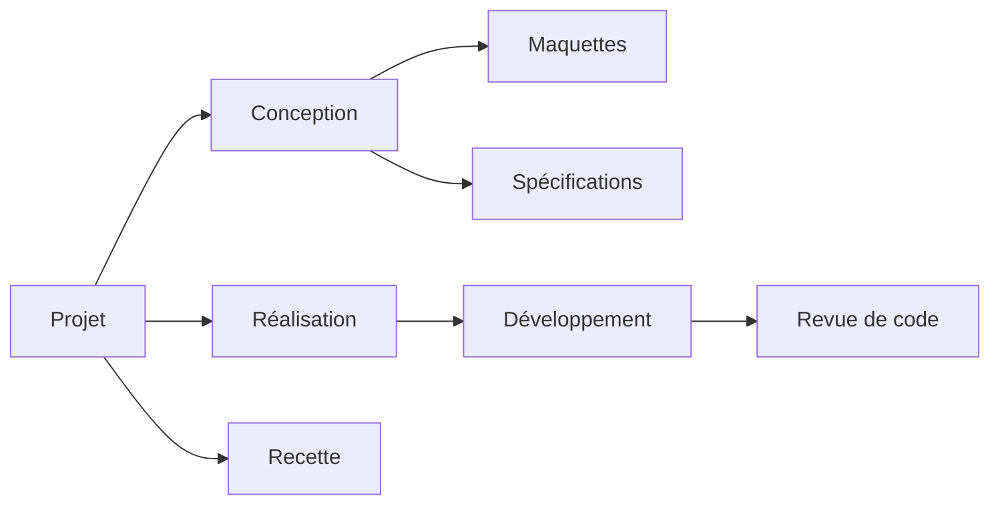
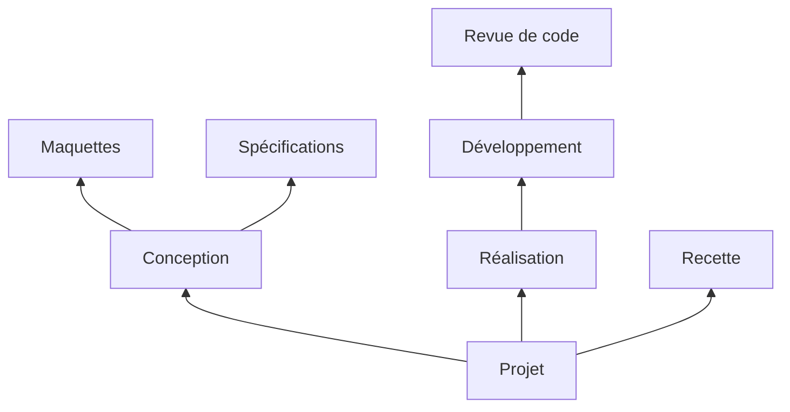
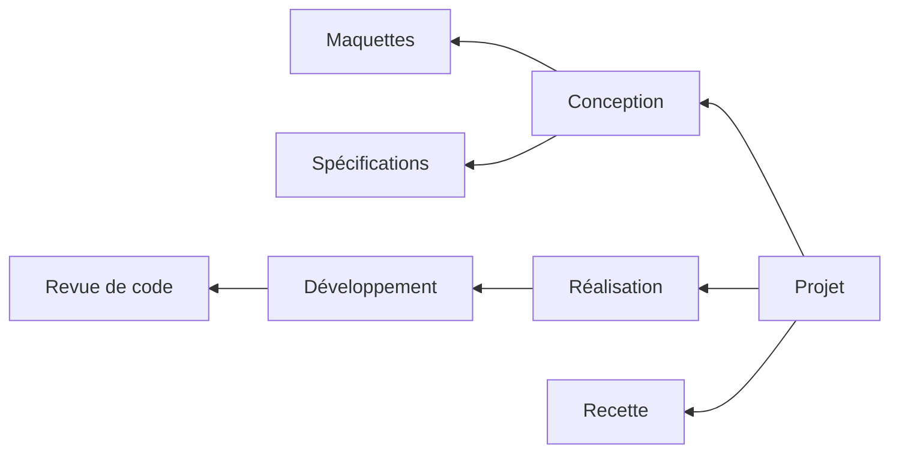
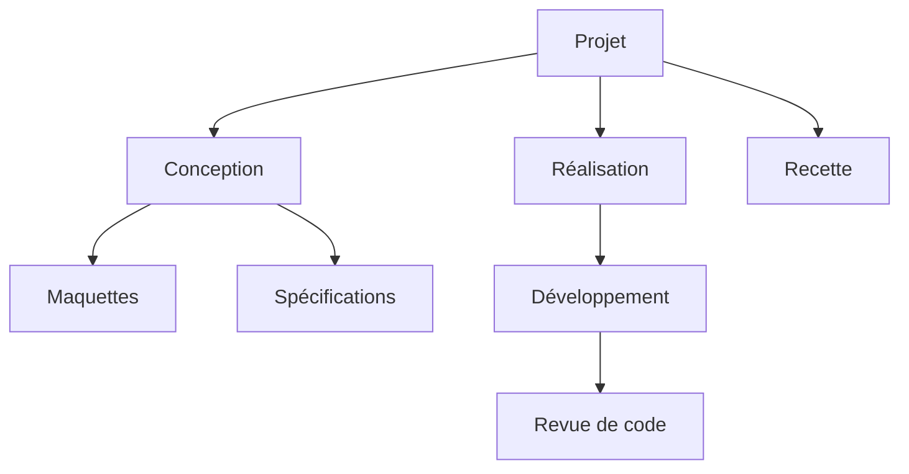
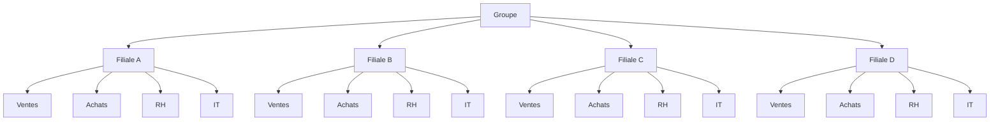
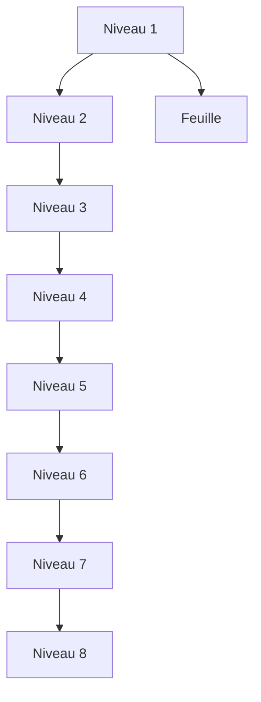

# SmartArt — arbres à plusieurs niveaux, quatre directions (v12)

Même arbre dans les quatre directions, puis un arbre large et un arbre profond. Tous en **SmartArt**.

## 1. De gauche à droite (`LR`)

## 2. De bas en haut (`BT`)

## 3. De droite à gauche (`RL`)

## 4. Référence : de haut en bas (`TD`)

## 5. Arbre large : 16 feuilles (plus de plafond de largeur)

## 6. Arbre profond : 8 niveaux

