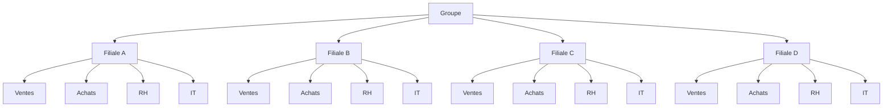
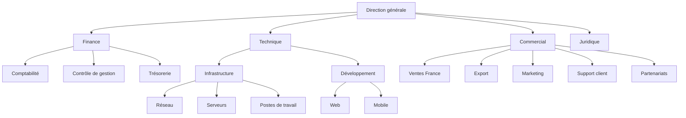
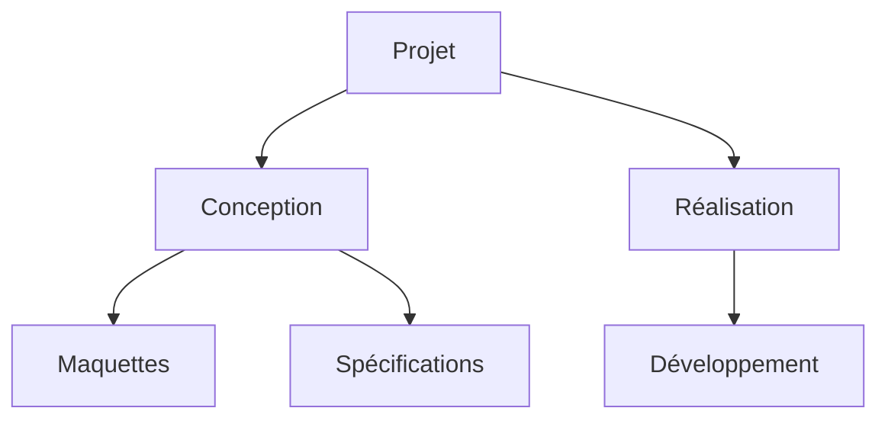

# SmartArt — arbres larges en disposition compacte (v13)

Quand un arbre descendant serait trop large, les feuilles d'un même parent s'empilent en colonne sous lui
(comme l'organigramme de Word). Les petits arbres gardent la disposition en rangée.

## 1. Seize feuilles (même arbre qu'en v12)

## 2. Irrégulier : colonnes de tailles différentes, une branche plus profonde, une feuille isolée

## 3. Témoin : petit arbre, disposition en rangée inchangée

