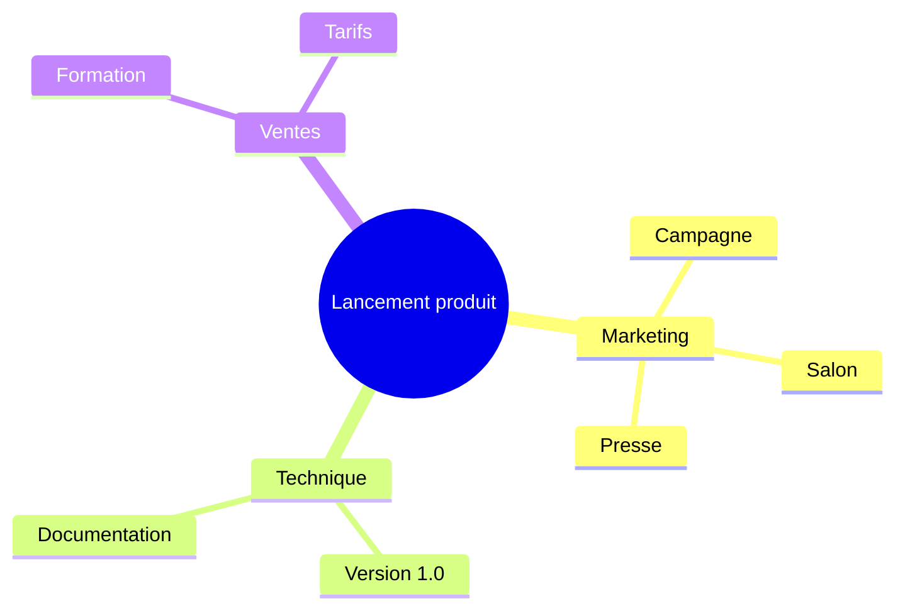
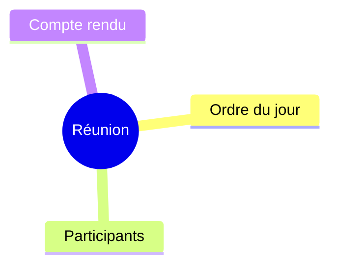

# SmartArt — mindmap et treeView (v14)

Avec SmartArt activé, un `mindmap` devient une hiérarchie SmartArt de gauche à droite, et un `treeView-beta`
à une seule racine une hiérarchie descendante. Sans SmartArt, rien ne change.

## 1. Mindmap à trois niveaux

## 2. Mindmap à deux niveaux

## 3. Arborescence de fichiers (une racine)

## 4. Retombée sur les formes : arborescence à deux racines

