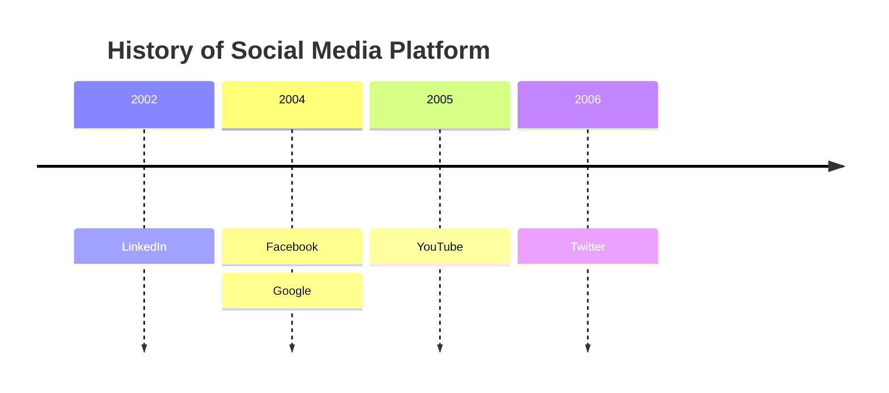
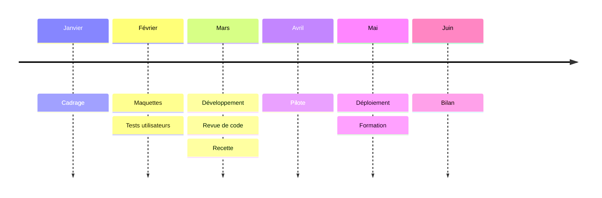
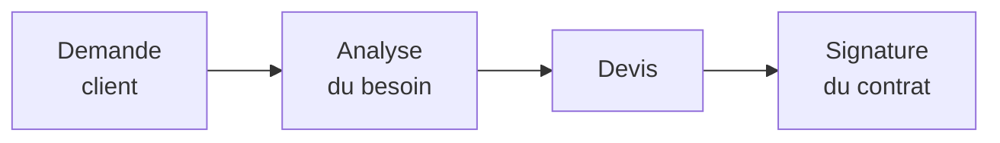
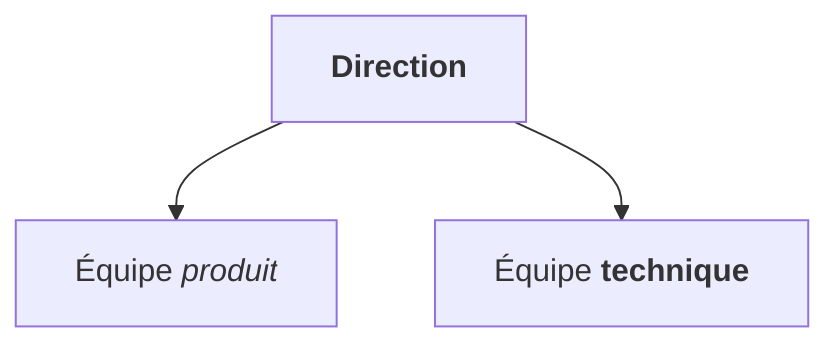
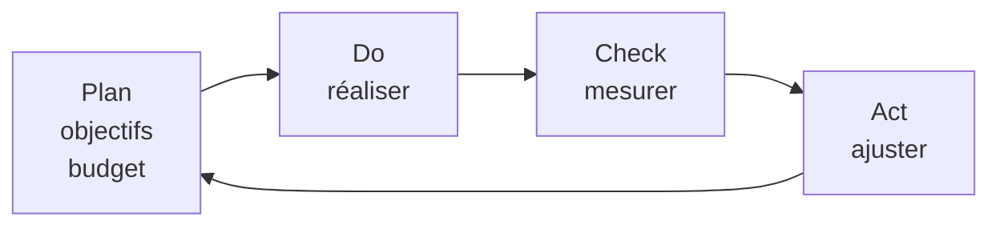
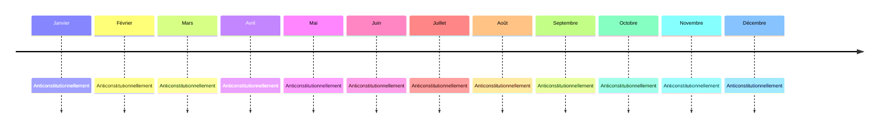
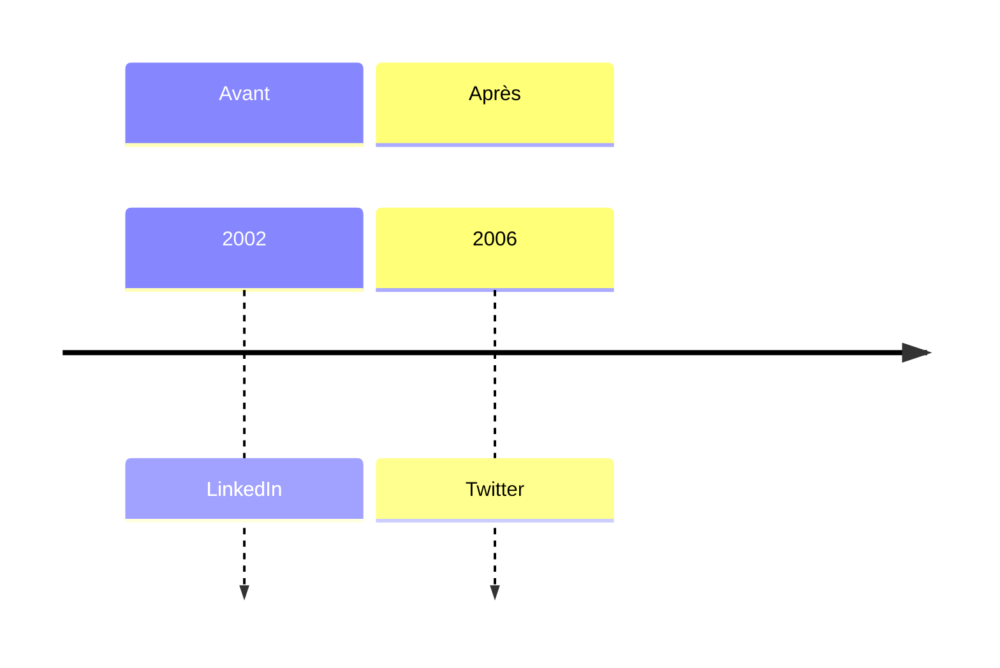

# SmartArt v16 — timeline as a SmartArt time line, line breaks and bold/italic in SmartArt boxes

## 1. Timeline with a title (SmartArt time line; title as a bold paragraph above)

## 2. Timeline, six periods, up to three events each (boxes alternate above/below the axis)

## 3. Flowchart chain with line breaks (` `)

## 4. Flowchart tree with bold and italic (Markdown strings)

## 5. Cycle with three-line boxes

## 6. Timeline, twelve periods with long words (must stay plain Word shapes: too crowded for SmartArt)

## 7. Timeline with sections (must stay plain Word shapes)

