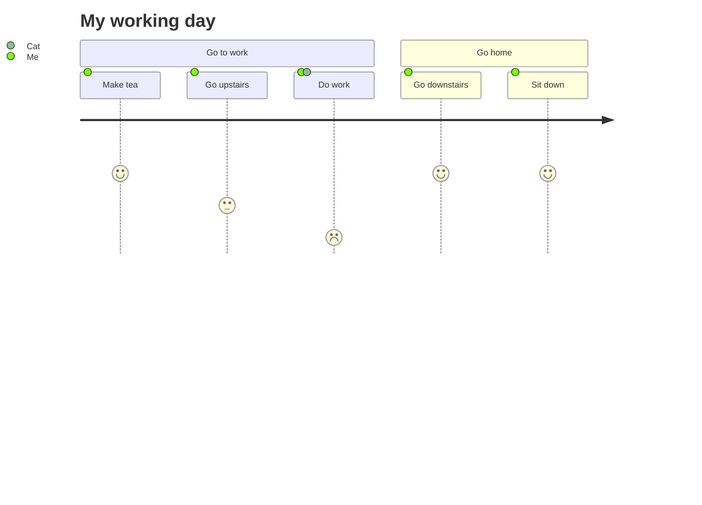
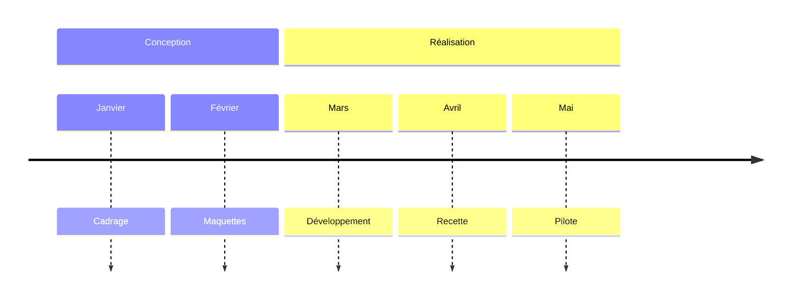
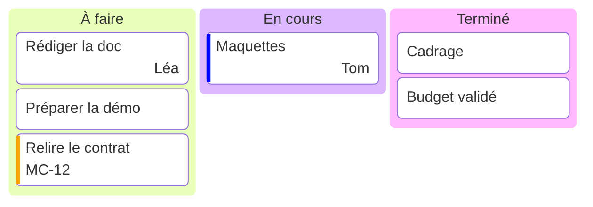
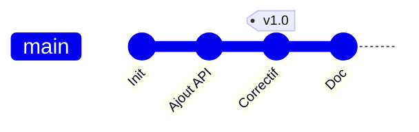
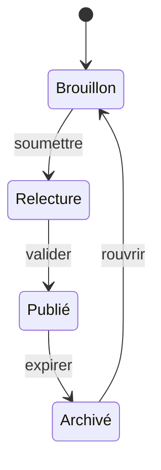
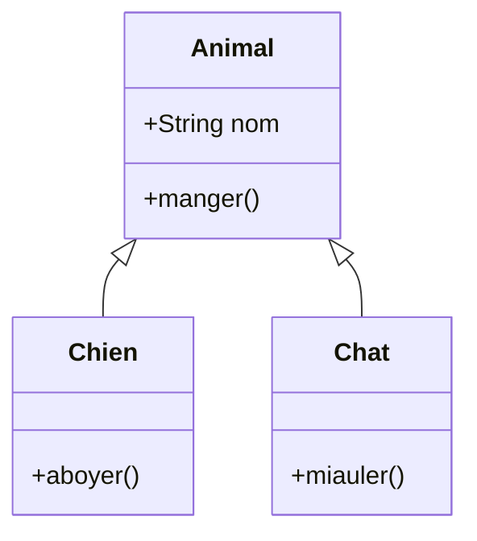
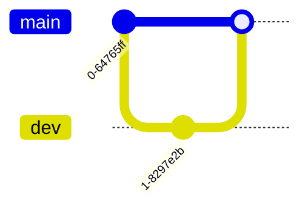
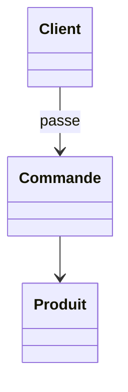

# SmartArt v17 — journey, timeline with sections, kanban, gitGraph, state machine, class inheritance

## 1. Journey (grouped time line: a bar per section, cards alternating above/below)

## 2. Timeline with sections (grouped time line; sections as wide as their periods)

## 3. Kanban (grouped list: column headers, cards stacked)

## 4. gitGraph, main branch only (process)

## 5. State machine, loop (cycle)

## 6. Class inheritance (hierarchy, members in the boxes)

## 7. gitGraph with a branch (must stay plain Word shapes)

## 8. Class diagram with an association (must stay plain Word shapes)

