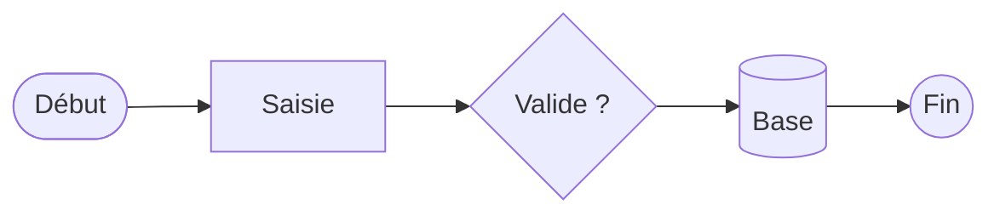
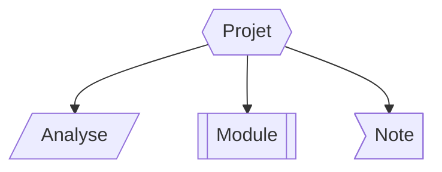
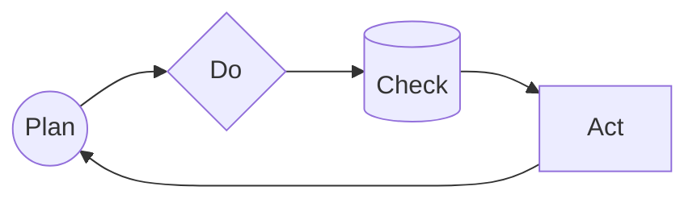

# SmartArt v18 — each node keeps its Mermaid shape (diamond, circle, cylinder…)

```mermaid
flowchart LR
  A([Début]) --> B[Saisie] --> C{Valide ?} --> D[(Base)] --> E((Fin))
```

## Tree with shapes

```mermaid
flowchart TD
  R{{Projet}} --> A[/Analyse/]
  R --> B[[Module]]
  R --> C>Note]
```

## Cycle with shapes

```mermaid
flowchart LR
  P((Plan)) --> D{Do} --> C[(Check)] --> A[Act] --> P
```
