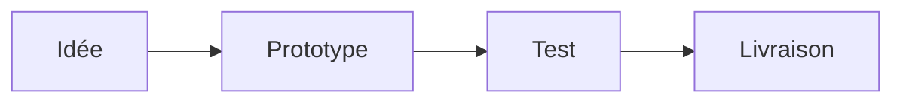
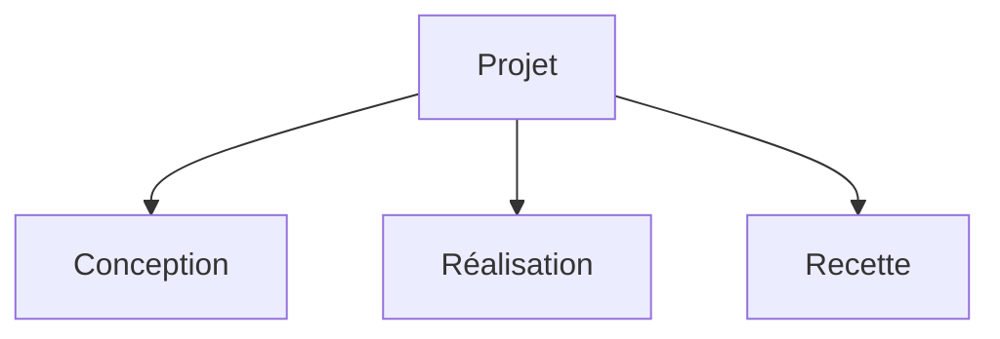
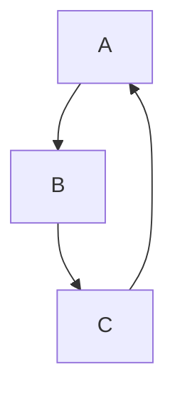
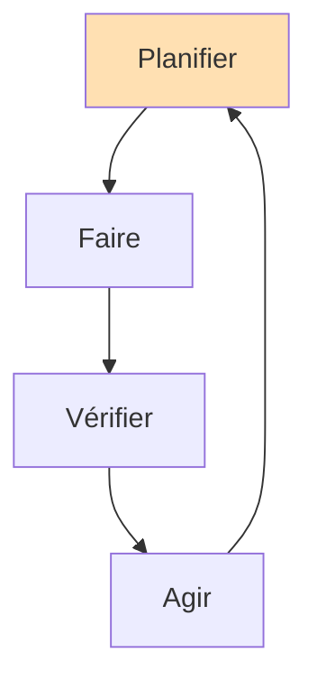

# SmartArt — vérification v3

Trois diagrammes éligibles, exportés avec **SmartArt activé** (`MD2NATIVEDOCX_ENABLE_SMARTART=1`).

## 1. Chaîne (chain)

## 2. Arbre (tree)

## 3. Cycle simple (3 étapes) — le cas qui rendait des formes vides

## 4. Cycle à 4 étapes, avec libellés et une couleur

