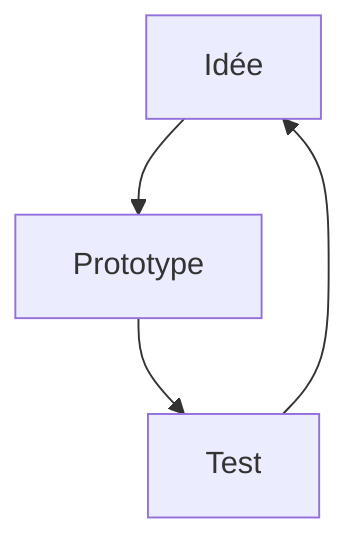
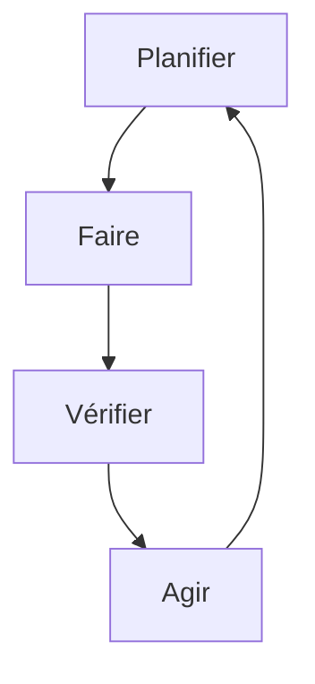
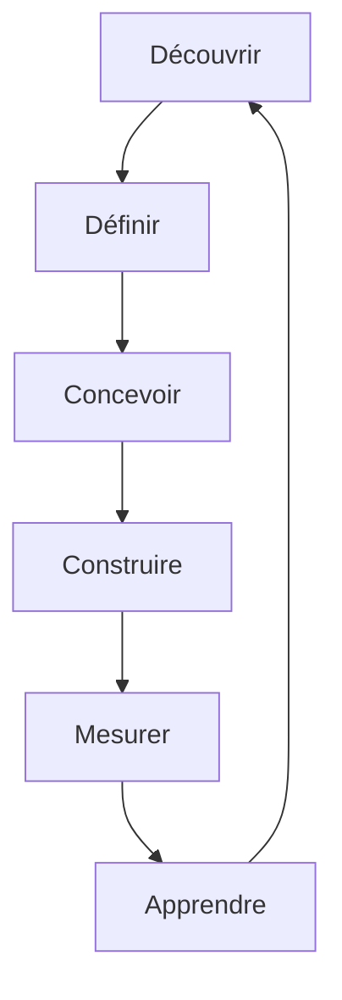

# SmartArt — cycles avec flèches (v6)

## 1. Cycle à 3 étapes

```mermaid
flowchart TD
  A[Idée] --> B[Prototype]
  B --> C[Test]
  C --> A
```

## 2. Cycle à 4 étapes (roue de Deming)

```mermaid
flowchart TD
  A[Planifier] --> B[Faire]
  B --> C[Vérifier]
  C --> D[Agir]
  D --> A
```

## 3. Cycle à 6 étapes

```mermaid
flowchart TD
  A[Découvrir] --> B[Définir]
  B --> C[Concevoir]
  C --> D[Construire]
  D --> E[Mesurer]
  E --> F[Apprendre]
  F --> A
```
