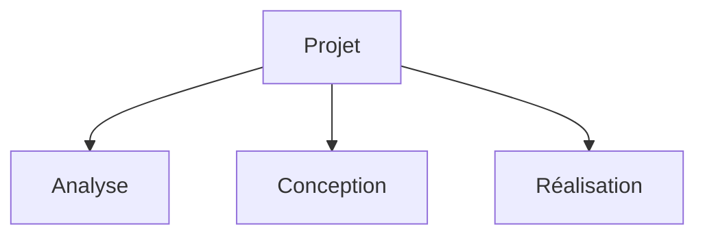
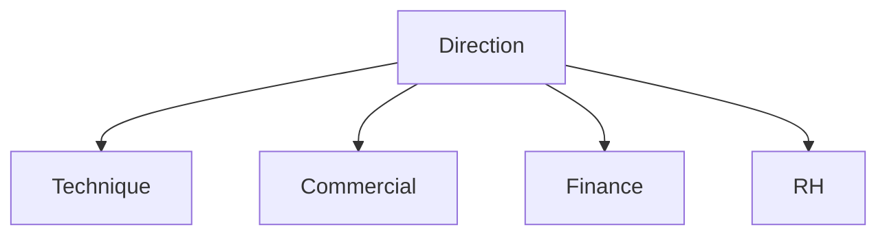
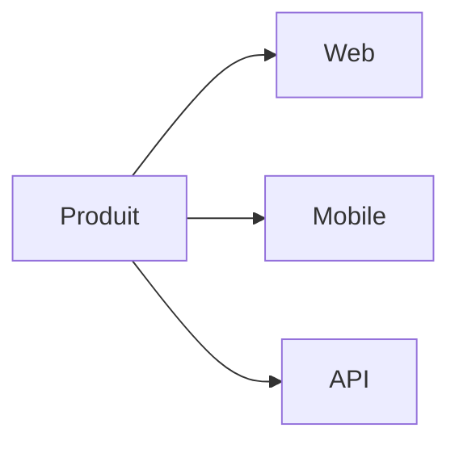
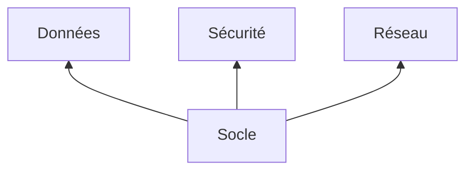
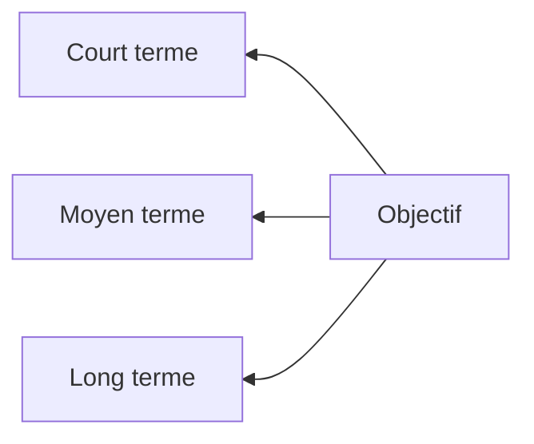

# SmartArt — arbres avec traits de connexion (v9)

## 1. Arbre vertical (racine en haut), 3 enfants

## 2. Arbre vertical, 4 enfants

## 3. Arbre horizontal (racine à gauche)

## 4. Arbre racine en bas

## 5. Arbre racine à droite

