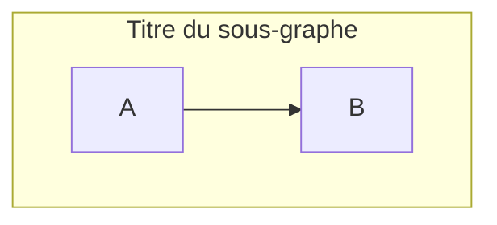
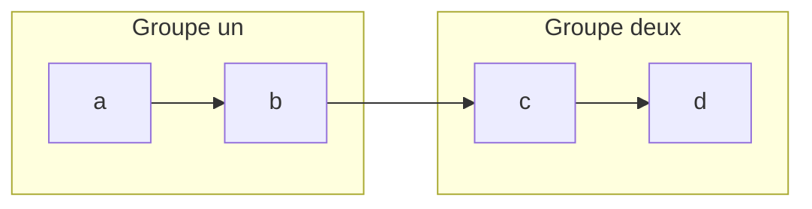
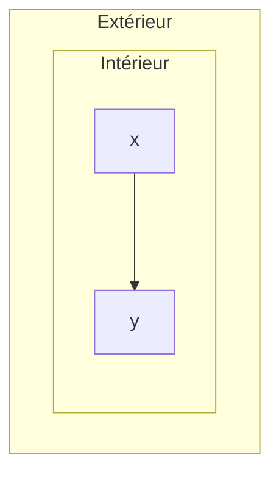

# R4.4 — titre de sous-graphe à l'échelle 1

## Petit sous-graphe

```mermaid
graph TD
  subgraph S[Titre du sous-graphe]
    A --> B
  end
```

## Deux sous-graphes côte à côte

```mermaid
graph LR
  subgraph G1[Groupe un]
    a --> b
  end
  subgraph G2[Groupe deux]
    c --> d
  end
  b --> c
```

## Imbriqués

```mermaid
graph TD
  subgraph Ext[Extérieur]
    subgraph Int[Intérieur]
      x --> y
    end
  end
```
