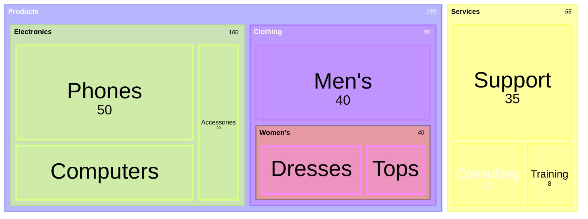

# treemap

```mermaid
treemap-beta
"Products"
    "Electronics"
        "Phones": 50
        "Computers": 30
        "Accessories": 20
    "Clothing"
        "Men's": 40
        "Women's":::important
            "Dresses": 25
            "Tops": 15
"Services"
    "Support": 35
    "Consulting": 12
    "Training": 8

classDef important fill:#f96,stroke:#333,color:#000;
```
