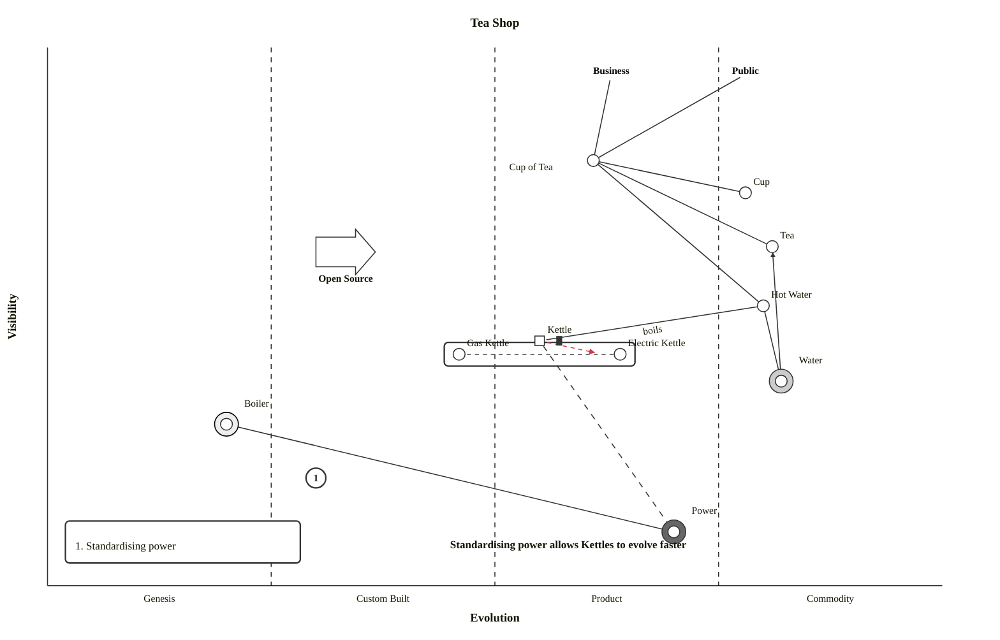

# wardley

```mermaid
wardley-beta
title Tea Shop
size [1000, 640]
anchor Business [0.95, 0.63]
anchor Public [0.95, 0.78]
component Cup of Tea [0.79, 0.61] label [-85, 10]
component Cup [0.73, 0.78]
component Tea [0.63, 0.81]
component Hot Water [0.52, 0.80]
component Water [0.38, 0.82] (buy)
component Kettle [0.43, 0.35] (inertia)
component Boiler [0.30, 0.20] (build)
component Power [0.1, 0.7] (outsource)
pipeline Kettle {
  component "Electric Kettle" [0.64]
  component "Gas Kettle" [0.46]
}
Business->Cup of Tea
Public->Cup of Tea
Cup of Tea->Cup
Cup of Tea->Tea
Cup of Tea->Hot Water
Hot Water->Water
Hot Water->Kettle; boils
Kettle -.-> Power
Boiler -> Power
Tea +<> Water
evolve Kettle 0.62
note "Standardising power allows Kettles to evolve faster" [0.07, 0.45]
annotations [0.12, 0.02]
annotation 1,[0.20,0.30] "Standardising power"
accelerator "Open Source" [0.62, 0.30]
```
