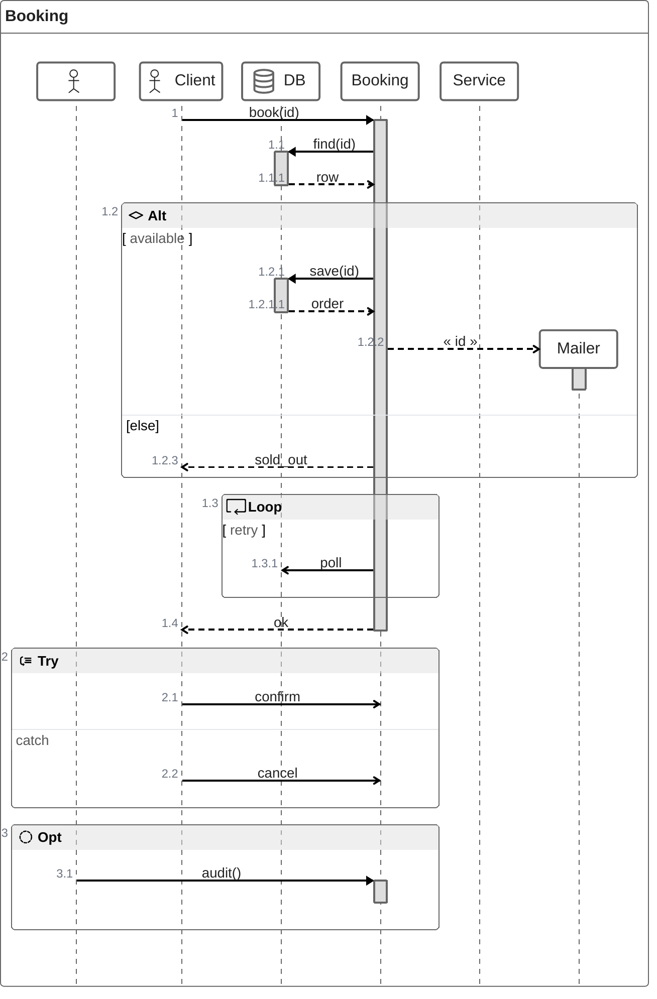

# zenuml

```mermaid
zenuml
    title Booking
    @Actor Client
    @Database DB
    Booking as Booking Service
    Client->Booking.book(id) {
      DB.find(id) {
        return row
      }
      if(available) {
        order = DB.save(id)
        new Mailer(id)
      } else {
        return sold_out
      }
      while(retry) {
        Booking->DB: poll
      }
      return ok
    }
    try {
      Client->Booking: confirm
    } catch {
      Client->Booking: cancel
    }
    opt {
      Booking.audit()
    }
```
